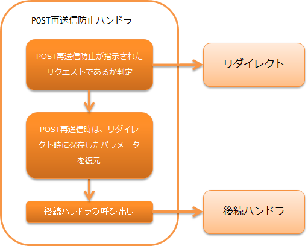

.. _post_resubmit_prevent_handler:

POST重复提交防止handler
==================================================

.. contents:: 目录
  :depth: 3
  :local:

对通过POST接收的请求，使用重定向重新接收请求处理的handler。
该处理用于防止因浏览器上的重新加载等误操作导致意外的POST请求重发。

.. important::

  不推荐在新项目中使用本handler。

.. important::

  本handler在指示POST重复提交防止的请求被发送时，将POST信息保存到会话中，并在下次重定向处理时从会话中删除POST信息。
  此方法在大量请求被发送时，POST信息不会被释放而积累在会话中，导致内存压力。
  也就是说，对于连续发送POST请求的DoS攻击是脆弱的。

  如果不使用本handler而防止浏览器POST信息重发，请考虑在业务action中返回重定向响应来实现。

本handler执行以下处理。

* 如果请求是POST重复提交防止对象，将请求参数保存到会话并重定向到重定向目标。
  （是否为POST重复提交防止对象的条件如下2点。）

    * 请求为POST。
    * 请求参数包含 "POST_RESUBMIT_PREVENT_PARAM"。（form标签的preventPostResubmit设置为true时，会自动设置此参数。）

* 如果请求是POST重复提交防止引起的GET请求，从会话恢复保存的请求参数并从会话中删除。
  如果会话中不存在参数，则作为重发处理显示预定的错误画面。

处理流程如下。

handler类名
--------------------------------------------------
* :java:extdoc:`nablarch.fw.web.post.PostResubmitPreventHandler`

模块列表
--------------------------------------------------
.. code-block:: xml

  <dependency>
    <groupId>com.nablarch.framework</groupId>
    <artifactId>nablarch-fw-web</artifactId>
  </dependency>

约束
------------------------------

配置在 :ref:`nablarch_tag_handler` 之前
  本handler将请求内容保存到会话并重定向处理。
  需要在自定义标签控制handler返回加密参数之前进行重定向，因此本handler必须配置在 :ref:`nablarch_tag_handler` 之前。

POST重复提交防止的使用方法
------------------------------------------------------------

POST重复提交防止可通过在handler队列上设置本handler，并在JSP文件中将n:form标签的preventPostResubmit属性设置为true来使用。

映射请求目标和跳转目标路径
------------------------------------------------------------

请求目标和跳转目标可以通过请求ID的前缀匹配设置。
设置示例如下。

.. code-block:: xml

  <!-- POST重复提交防止handler -->
  <component name="postResubmitPreventHandler"
      class="nablarch.fw.web.post.PostResubmitPreventHandler">

    <!--
    设置重定向后GET请求多次发送时的跳转目标路径映射。

    当请求ID匹配key指定时，跳转到value设置的页面。
    多个key匹配时，跳转到与最长字符key对应的value页面。
    -->
    <property name="forwardPathMapping">
      <map>
        <entry key="/"  value="redirect:///action/error/index" />
        <entry key="/action/func1/" value="redirect:///action/error/index2" />
        <entry key="/action/func2/" value="/error.jsp" />
      </map>
    </property>
  </component>

在此设置示例中，对于如请求ID「/action/func1/index」这样多个请求ID前缀匹配多个匹配的情况，
将选择匹配最长键的重定向目标（上述情况为"redirect:///action/error/index2"）。
