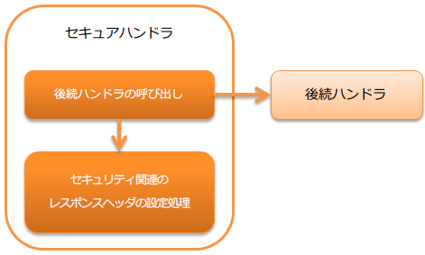

.. _secure_handler:

安全handler
==================================================
.. contents:: 目录
  :depth: 3
  :local:

本handler执行Web应用安全相关处理和header设置。

默认情况下，向响应对象(:java:extdoc:`HttpResponse <nablarch.fw.web.HttpResponse>`)设置以下响应header。

* X-Frame-Options: SAMEORIGIN
* X-XSS-Protection: 1; mode=block
* X-Content-Type-Options: nosniff
* Referrer-Policy: strict-origin-when-cross-origin
* Cache-Control: no-store

本handler执行以下处理。

* Content-Security-Policy的nonce生成
* 安全相关响应header的设置处理

处理流程如下。

  
handler类名
--------------------------------------------------
* :java:extdoc:`nablarch.fw.web.handler.SecureHandler`

模块列表
--------------------------------------------------
.. code-block:: xml

  <dependency>
    <groupId>com.nablarch.framework</groupId>
    <artifactId>nablarch-fw-web</artifactId>
  </dependency>

约束
------------------------------
配置在 :ref:`http_response_handler` 之后
  :ref:`http_response_handler` 将本handler设置的响应header设置到Servlet API的响应对象。

要更改默认应用的header值
--------------------------------------------------
根据需求，可能需要更改默认应用的安全相关header值。

例如，如果不允许在任何框架内显示，需要将 ``X-Frame-Options`` header的值更改为 ``DENY`` 。
这种情况下，需要在组件配置文件中明确设置来对应。

以下显示示例。

.. code-block:: xml

  <component class="nablarch.fw.web.handler.SecureHandler">
    <property name="secureResponseHeaderList">
      <list>
        <!-- 明确指定X-Frame-Options的值 -->
        <component class="nablarch.fw.web.handler.secure.FrameOptionsHeader">
          <property name="option" value="DENY" />
        </component>

        <!-- 上述以外的header保持默认 -->
        <component class="nablarch.fw.web.handler.secure.XssProtectionHeader" />
        <component class="nablarch.fw.web.handler.secure.ContentTypeOptionsHeader" />
        <component class="nablarch.fw.web.handler.secure.ReferrerPolicyHeader" />
        <component class="nablarch.fw.web.handler.secure.CacheControlHeader" />
      </list>
    </property>
  </component>

.. tip::

  更改值的属性详情请参考以下类。

  * :java:extdoc:`FrameOptionsHeader <nablarch.fw.web.handler.secure.FrameOptionsHeader>`
  * :java:extdoc:`ContentTypeOptionsHeader <nablarch.fw.web.handler.secure.ContentTypeOptionsHeader>`
  * :java:extdoc:`XssProtectionHeader <nablarch.fw.web.handler.secure.XssProtectionHeader>`
  * :java:extdoc:`ReferrerPolicyHeader <nablarch.fw.web.handler.secure.ReferrerPolicyHeader>`
  * :java:extdoc:`CacheControlHeader <nablarch.fw.web.handler.secure.CacheControlHeader>`

设置默认以外的响应header
-------------------------------------------------------
设置默认以外的安全相关响应header的步骤如下。

1. 在 :java:extdoc:`SecureResponseHeader <nablarch.fw.web.handler.secure.SecureResponseHeader>` 接口的实现类中
   指定要设置到响应header的字段名和值。

  .. tip::
    如果创建不包含逻辑的单纯响应header，
    可以继承 :java:extdoc:`SecureResponseHeaderSupport <nablarch.fw.web.handler.secure.SecureResponseHeaderSupport>`
    来创建。

2. 在本handler(:java:extdoc:`SecureHandler <nablarch.fw.web.handler.SecureHandler>`)中，设置 ``No1`` 创建的类。

.. important::

  设置 :java:extdoc:`SecureResponseHeader <nablarch.fw.web.handler.secure.SecureResponseHeader>` 实现类时，
  也需要设置默认应用的组件。

  以下显示设置文件示例。

  .. code-block:: xml

    <component class="nablarch.fw.web.handler.SecureHandler">
      <property name="secureResponseHeaderList">
        <list>
          <component class="nablarch.fw.web.handler.secure.FrameOptionsHeader" />
          <component class="nablarch.fw.web.handler.secure.XssProtectionHeader" />
          <component class="nablarch.fw.web.handler.secure.ContentTypeOptionsHeader" />
          <component class="nablarch.fw.web.handler.secure.ReferrerPolicyHeader" />
          <component class="nablarch.fw.web.handler.secure.CacheControlHeader" />

          <!-- 额外创建的组件 -->
          <component class="nablarch.fw.web.handler.secure.SampleSecurityHeader" />
        </list>
      </property>
    </component>

.. _content_security_policy:

对应Content Security Policy(CSP)
-------------------------------------------------------
通过组合本handler的设置和 ``ContentSecurityPolicyHeader`` ，以及 :ref:`Jakarta Server Pages自定义标签的CSP支持 <tag-content_security_policy>` ，可以启用CSP相关功能。

  .. tip::
    Content Security Policy(CSP)是一种可以添加的机制，用于检测和减轻跨站脚本等内容注入攻击的影响。CSP本身的详情请参考 `Content Security Policy Level 3(外部网站、英语) <https://www.w3.org/TR/CSP3/>`_ 或
    `Content Security Policy Level 2(外部网站、英语) <https://www.w3.org/TR/CSP2/>`_ 。

如果使用 :ref:`tag` ，由于部分自定义标签会输出JavaScript，需要使用本handler的功能生成nonce并嵌入到响应header和script元素等中来对应。

要输出Content-Security-Policy header，可以使用 ``ContentSecurityPolicyHeader`` 将本handler生成的nonce嵌入。

设置固定的Content-Security-Policy header
^^^^^^^^^^^^^^^^^^^^^^^^^^^^^^^^^^^^^^^^^^^^^^^^^^^^^^^^^

设置固定的Content-Security-Policy header的步骤如下。

1. 在本handler(:java:extdoc:`SecureHandler <nablarch.fw.web.handler.SecureHandler>`)中，设置 ``ContentSecurityPolicyHeader`` 。

2. 在 ``ContentSecurityPolicyHeader`` 中设置 ``policy`` 。

以下显示示例。

.. code-block:: xml

  <component class="nablarch.fw.web.handler.SecureHandler">
    <property name="secureResponseHeaderList">
      <list>
        <component class="nablarch.fw.web.handler.secure.FrameOptionsHeader" />
        <component class="nablarch.fw.web.handler.secure.XssProtectionHeader" />
        <component class="nablarch.fw.web.handler.secure.ContentTypeOptionsHeader" />
        <component class="nablarch.fw.web.handler.secure.ReferrerPolicyHeader" />
        <component class="nablarch.fw.web.handler.secure.CacheControlHeader" />

        <!-- 赋予Content-Security-Policy的组件 -->
        <component class="nablarch.fw.web.handler.secure.ContentSecurityPolicyHeader">
          <!-- 设置策略 -->
          <property name="policy" value="default-src 'self'" />
        </component>
      </list>
    </property>
  </component>

此时， ``Content-Security-Policy: default-src 'self'`` 这样的响应header将被输出。
   
生成nonce并设置到Content-Security-Policy header
^^^^^^^^^^^^^^^^^^^^^^^^^^^^^^^^^^^^^^^^^^^^^^^^^^^^^^^^^^^^^^^^^

生成nonce并设置到Content-Security-Policy header的步骤如下。

1. 将本handler(:java:extdoc:`SecureHandler <nablarch.fw.web.handler.SecureHandler>`)的 ``generateCspNonce`` 属性设置为 ``true`` 。

2. 在本handler中，设置 ``ContentSecurityPolicyHeader`` 。

3. 在 ``ContentSecurityPolicyHeader`` 中设置 ``policy`` ，并包含占位符 ``$cspNonceSource$`` 。

以下显示示例。

.. code-block:: xml

  <component class="nablarch.fw.web.handler.SecureHandler">
    <!-- 设置为生成nonce -->
    <property name="generateCspNonce" value="true" />
    <property name="secureResponseHeaderList">
      <list>
        <component class="nablarch.fw.web.handler.secure.FrameOptionsHeader" />
        <component class="nablarch.fw.web.handler.secure.XssProtectionHeader" />
        <component class="nablarch.fw.web.handler.secure.ContentTypeOptionsHeader" />
        <component class="nablarch.fw.web.handler.secure.ReferrerPolicyHeader" />
        <component class="nablarch.fw.web.handler.secure.CacheControlHeader" />

        <!-- 赋予Content-Security-Policy的组件 -->
        <component class="nablarch.fw.web.handler.secure.ContentSecurityPolicyHeader">
          <!-- 设置包含nonce的策略 -->
          <property name="policy" value="default-src 'self' '$cspNonceSource$'" />
        </component>
      </list>
    </property>
  </component>

此时占位符 ``$cspNonceSource$`` 将被替换为 ``nonce-[本handler生成的nonce]`` ，例如输出 ``Content-Security-Policy: default-src 'self' 'nonce-DhcnhD3khTMePgXwdayK9BsMqXjhguVV'`` 这样的响应header。

本handler对每个请求生成nonce。
生成的nonce保存在请求作用域中，并按以下方式更改 :ref:`tag` 的动作。

* 对于生成script元素的自定义标签，自动将生成的nonce设置到nonce属性。
* 对于在onclick属性中设置提交函数调用的自定义标签，将其内容更改为输出到script元素。

另外，也可用于在任意元素中设置nonce的自定义标签也会生效。

详情请参考 :ref:`Jakarta Server Pages自定义标签的CSP支持 <tag-content_security_policy>` 。

以report-only模式运行
^^^^^^^^^^^^^^^^^^^^^^^^^^^^^^^^^^^^^^^^^^^^^^^^^^^^^^^^^

要以report-only模式运行时，将 ``reportOnly`` 设置为 ``true`` 。

以下显示示例。

.. code-block:: xml

  <component class="nablarch.fw.web.handler.SecureHandler">
    <property name="secureResponseHeaderList">
      <list>
        <component class="nablarch.fw.web.handler.secure.FrameOptionsHeader" />
        <component class="nablarch.fw.web.handler.secure.XssProtectionHeader" />
        <component class="nablarch.fw.web.handler.secure.ContentTypeOptionsHeader" />
        <component class="nablarch.fw.web.handler.secure.ReferrerPolicyHeader" />
        <component class="nablarch.fw.web.handler.secure.CacheControlHeader" />

        <component class="nablarch.fw.web.handler.secure.ContentSecurityPolicyHeader">
          <property name="policy" value="default-src 'self'; report-uri http://example.com/report" />
          <!-- 以report-only模式运行 -->
          <property name="reportOnly" value="true" />
        </component>
      </list>
    </property>
  </component>

此时， ``Content-Security-Policy-Report-Only: default-src 'src'; report-uri http://example.com/report`` 这样的响应header将被输出。
