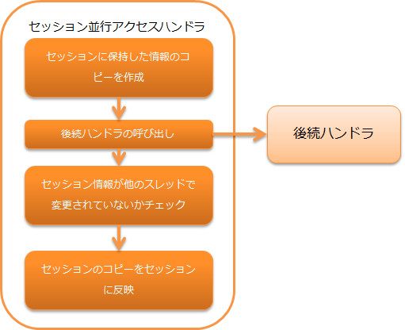

.. _session_concurrent_access_handler:

会话并发访问handler
==================================================
.. contents:: 目录
  :depth: 3
  :local:

.. important::
  不推荐在新项目中使用本handler。请使用会话变量保存handler。

本handler提供针对每个会话的请求处理并发同时访问，防止因同时执行而发生的线程间处理不一致的功能。

本handler执行以下处理。

* 创建会话中保存信息的副本
* 处理结束后，检查会话是否已被其他线程更新，如果已更新则报错
* 处理结束后，将会话信息副本反映到会话

handler类名
--------------------------------------------------
* :java:extdoc:`nablarch.fw.web.handler.SessionConcurrentAccessHandler`

模块列表
--------------------------------------------------
.. code-block:: xml

  <dependency>
    <groupId>com.nablarch.framework</groupId>
    <artifactId>nablarch-fw-web</artifactId>
  </dependency>

约束
------------------------------

无。

