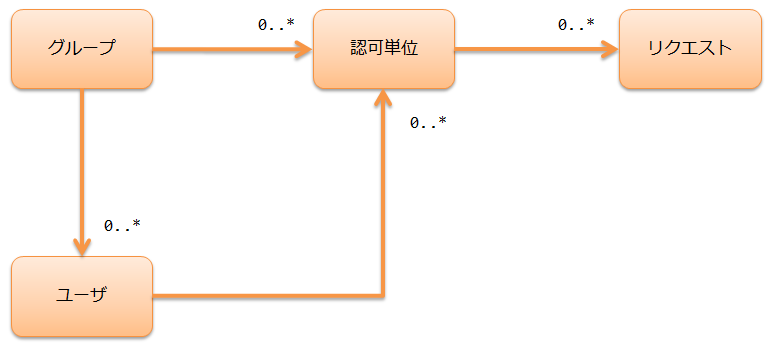

.. _`permission_check`:

使用handler进行授权检查
=====================================================================

.. contents:: 目录
  :depth: 3
  :local:

本功能对应用提供的功能进行授权检查。
通过使用本功能，可以在Web中限制每个用户可用的功能，
实现访问控制。

.. important::
 本功能仅在应用的需求匹配时使用。

 本功能使用数据库来管理授权检查所需的权限数据，
 以请求为单位设置权限(参考 :ref:`permission_check-authority_model` 中所示的概念模型)。
 例如，对于Web的注册功能，通常由初始显示/确认/返回/注册等多个请求构成。

 因此，本功能虽然可以实现细粒度的权限设置，但需要非常细致的数据设计，
 可能导致开发时生产效率降低以及发布后的运维负担增加。

 此外， :doc:`role_check` 提供了比本功能更简单的数据结构来管理权限。
 如果本功能的运维较为困难，可以将 :doc:`role_check` 作为备选方案。

功能概述
---------------------------------------------------------------------

可以按请求单位进行授权检查
~~~~~~~~~~~~~~~~~~~~~~~~~~~~~~~~~~~~~~~~~~~~~~~~~~~~~~~~~~~~~~~~~~~~~
通过在handler队列中设置 :ref:`permission_check_handler` ，
可以按请求单位进行授权检查。

详细请参考以下内容。

* :ref:`permission_check-settings`
* :ref:`permission_check-server_side_check`
* :ref:`permission_check-view_control`

.. _`permission_check-authority_model`:

可以同时使用组单位和用户单位的权限设置
~~~~~~~~~~~~~~~~~~~~~~~~~~~~~~~~~~~~~~~~~~~~~~~~~~~~~~~~~~~~~~~~~~~~~
授权检查使用的权限设置概念模型如下。

组用于部门等组织单位的权限分配。

授权检查单位是将多个请求汇总后，表示授权检查的最小单位。
授权检查单位关联实现授权检查所需的请求，即在Web中关联多个画面事件。
例如，对于用户注册功能，数据如下所示。

授权检查单位
 | 用户注册

授权检查单位"用户注册"关联的请求
 | 输入画面的初始显示
 | 输入画面的确认按钮
 | 确认画面的注册按钮
 | 确认画面的返回按钮

通过设置组和用户的关联、组和授权检查单位的关联，可以实现组单位的权限设置。
此外，由于可以直接对用户设置授权检查单位，因此可以应对针对特定用户的异常权限授予。

模块列表
--------------------------------------------------
.. code-block:: xml

  <dependency>
    <groupId>com.nablarch.framework</groupId>
    <artifactId>nablarch-common-auth</artifactId>
  </dependency>
  <dependency>
    <groupId>com.nablarch.framework</groupId>
    <artifactId>nablarch-common-auth-jdbc</artifactId>
  </dependency>

使用方法
---------------------------------------------------------------------

.. _`permission_check-settings`:

使用授权检查的所需设置
~~~~~~~~~~~~~~~~~~~~~~~~~~~~~~~~~~~~~~~~~~~~~~~~~~~~~~~~~~~~~~~~~~~~~
本功能使用数据库来管理授权检查所需的权限数据。
表结构如下。

组
 ====================== ===================================================
 组ID(PK)               用于识别组的值。字符串型
 ====================== ===================================================

系统账户
 ====================== ===================================================
 用户ID(PK)             用于识别用户的值。字符串型
 用户ID锁定状态         用户ID的锁定状态。字符串型。
 有效日期(From)         用户的有效日期(From)。字符串型。
 有效日期(To)           用户的有效日期(To)。字符串型。
 ====================== ===================================================

 :用户ID锁定状态: 未锁定时为"0"，锁定时为"0"以外的值
 :有效日期(From): yyyyMMdd格式，不指定时为"19000101"
 :有效日期(To): yyyyMMdd格式，不指定时为"99991231"

组系统账户
 ====================== ===================================================
 组ID(PK)               用于识别组的值。字符串型
 用户ID(PK)             用于识别用户的值。字符串型
 有效日期(From)(PK)     用户的有效日期(From)。字符串型
 有效日期(To)           用户的有效日期(To)。字符串型
 ====================== ===================================================

 :有效日期(From): yyyyMMdd格式，不指定时为"19000101"
 :有效日期(To): yyyyMMdd格式，不指定时为"99991231"

授权检查单位
 ====================== ===================================================
 授权检查单位ID(PK)     用于识别授权检查单位的值。字符串型
 ====================== ===================================================

授权检查单位请求
 ====================== ===================================================
 授权检查单位ID(PK)     用于识别授权检查单位的值。字符串型
 请求ID(PK)             用于识别请求的值。字符串型
 ====================== ===================================================

组权限
 ====================== ===================================================
 组ID(PK)               用于识别组的值。字符串型
 授权检查单位ID(PK)     用于识别授权检查单位的值。字符串型
 ====================== ===================================================

系统账户权限
 ====================== ===================================================
 用户ID(PK)             用于识别用户的值。字符串型
 授权检查单位ID(PK)     用于识别授权检查单位的值。字符串型
 ====================== ===================================================

使用授权检查需要按以下方式进行设置。

* 将 :java:extdoc:`BasicPermissionFactory <nablarch.common.permission.BasicPermissionFactory>`
  的设置添加到组件定义中。
* :java:extdoc:`BasicPermissionFactory <nablarch.common.permission.BasicPermissionFactory>` 用于
  :ref:`permission_check_handler` 的设置，因此组件名可以指定任意名称。

.. code-block:: xml

 <component name="permissionFactory" class="nablarch.common.permission.BasicPermissionFactory">

   <!-- 组schema -->
   <property name="groupTableSchema">
     <component class="nablarch.common.permission.schema.GroupTableSchema">
       <!-- 省略对属性的设置 -->
     </component>
   </property>

   <!-- 系统账户schema -->
   <property name="systemAccountTableSchema">
     <component class="nablarch.common.permission.schema.SystemAccountTableSchema">
       <!-- 省略对属性的设置 -->
     </component>
   </property>

   <!-- 组系统账户schema -->
   <property name="groupSystemAccountTableSchema">
     <component class="nablarch.common.permission.schema.GroupSystemAccountTableSchema">
       <!-- 省略对属性的设置 -->
     </component>
   </property>

   <!-- 授权检查单位schema -->
   <property name="permissionUnitTableSchema">
     <component class="nablarch.common.permission.schema.PermissionUnitTableSchema">
       <!-- 省略对属性的设置 -->
     </component>
   </property>

   <!-- 授权检查单位请求schema -->
   <property name="permissionUnitRequestTableSchema">
     <component class="nablarch.common.permission.schema.PermissionUnitRequestTableSchema">
       <!-- 省略对属性的设置 -->
     </component>
   </property>

   <!-- 组权限schema -->
   <property name="groupAuthorityTableSchema">
     <component class="nablarch.common.permission.schema.GroupAuthorityTableSchema">
       <!-- 省略对属性的设置 -->
     </component>
   </property>

   <!-- 系统账户权限schema -->
   <property name="systemAccountAuthorityTableSchema">
     <component class="nablarch.common.permission.schema.SystemAccountAuthorityTableSchema">
       <!-- 省略对属性的设置 -->
     </component>
   </property>

   <!-- 数据库访问使用的transaction manager -->
   <property name="dbManager" ref="permissionCheckDbManager"/>

   <!-- 有效日期(FROM/TO)判定使用的业务日期提供provider -->
   <property name="businessDateProvider" ref="businessDateProvider" />
 </component>

:java:extdoc:`BasicPermissionFactory <nablarch.common.permission.BasicPermissionFactory>` 需要
初始化，因此还需要添加以下组件定义。

.. code-block:: xml

 <component name="initializer"
            class="nablarch.core.repository.initialization.BasicApplicationInitializer">
   <property name="initializeList">
     <list>
       <!-- 初始化BasicPermissionFactory -->
       <component-ref name="permissionFactory" />
     </list>
   </property>
 </component>

.. _`permission_check-server_side_check`:

在服务器端进行授权检查
~~~~~~~~~~~~~~~~~~~~~~~~~~~~~~~~~~~~~~~~~~~~~~~~~~~~~~~~~~~~~~~~~~~~~
授权检查使用 :java:extdoc:`Permission <nablarch.common.permission.Permission>` 。
通过 :ref:`permission_check_handler` ，
:java:extdoc:`Permission <nablarch.common.permission.Permission>` 被设置到线程上下文中，
因此可以使用
:java:extdoc:`PermissionUtil.getPermission <nablarch.common.permission.PermissionUtil.getPermission()>`
来获取。

.. code-block:: java

 Permission permission = PermissionUtil.getPermission();
 if (permission.permit("/action/user/unlock")) {
     // 授权检查通过时的处理写在这里
 }

.. _`permission_check-view_control`:

根据权限控制画面显示
~~~~~~~~~~~~~~~~~~~~~~~~~~~~~~~~~~~~~~~~~~~~~~~~~~~~~~~~~~~~~~~~~~~~~
如果希望根据权限有无来控制按钮或链接的隐藏(禁用)，请使用自定义标签。
参考 :ref:`tag-submit_display_control` 。

访问权限数据
~~~~~~~~~~~~~~~~~~~~~~~~~~~~~~~~~~~~~~~~~~~~~~~~~~~~~~~~~~~~~~~~~~~~~
根据应用的需求，有时需要获取属于特定组的用户列表等权限数据。
但是，本功能仅提供进行授权检查的功能。

因此，如果需要访问权限数据，请使用 :ref:`universal_dao` ，
通过创建SQL来应对。

扩展示例
---------------------------------------------------------------------
无。
