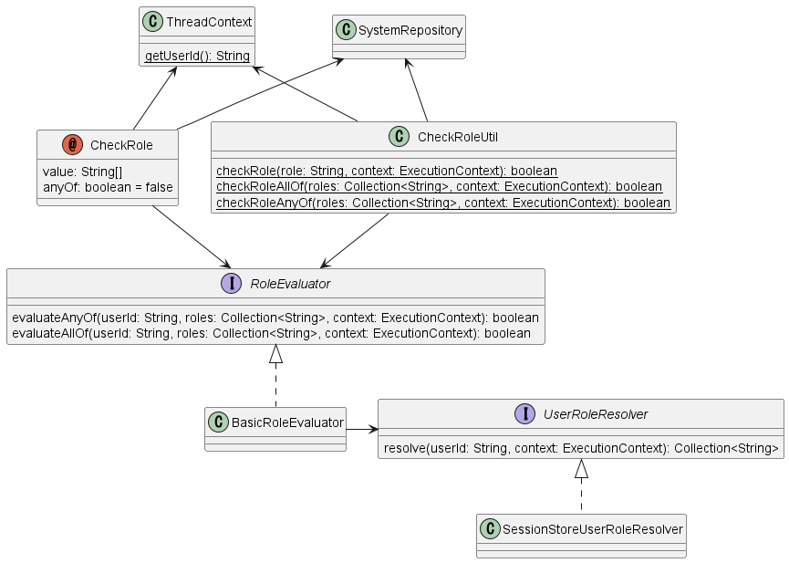

.. _`role_check`:

使用注解进行授权检查
=====================================================================

.. contents:: 目录
  :depth: 3
  :local:

本功能与 :doc:`permission_check` 类似，对应用提供的功能进行授权检查。

功能概述
---------------------------------------------------------------------

无需繁琐的数据管理即可进行授权检查
~~~~~~~~~~~~~~~~~~~~~~~~~~~~~~~~~~~~~~~~~~~~~~~~~~~~~~~~~~~~~~~~~~~~~

使用注解进行授权检查时，为用户分配角色(角色)。
此外，对于要进行授权检查的功能，也分配执行该功能所需的角色。
然后，根据当前用户是否拥有执行目标功能所分配的角色，来进行授权判定。

功能与角色的分配基本上使用注解在Java程序上进行。
此外，用户与角色的分配方法框架不做特别规定，可以自由选择。

这样，使用注解进行授权检查比 :doc:`permission_check` 可以用更简单的数据结构来管理权限。

可以使用注解进行授权检查
~~~~~~~~~~~~~~~~~~~~~~~~~~~~~~~~~~~~~~~~~~~~~~~~~~~~~~~~~~~~~~~~~~~~~

.. code-block:: java

  @CheckRole("ADMIN")
  public HttpResponse index(HttpRequest request, ExecutionContext context) {

在使用注解进行授权检查时，可以使用注解为Action类的method分配角色。
上述示例中，定义了执行 ``index`` method需要 ``ADMIN`` 角色。

与使用handler进行授权检查的区分使用
~~~~~~~~~~~~~~~~~~~~~~~~~~~~~~~~~~~~~~~~~~~~~~~~~~~~~~~~~~~~~~~~~~~~~

说明本授权检查与 :doc:`permission_check` 的区分使用标准。

使用注解进行授权检查时，如前述以角色为单位管理权限。
此外，角色与功能的分配是通过Java注解实现的。
因此，本授权检查适合使用的情况是，角色本身的增减或分配给角色的功能变更不频繁发生的情况。

例如，如果需要权限管理的角色种类和功能的组合已经确定，且今后不会有大的变化，则可以使用本授权检查简单地实现授权检查。

另一方面，在需要根据用户所属部门控制权限的系统中，可以预见到组织变更会导致部门构成和可用功能的组合发生较大变化。在这样的系统中使用本授权检查，每次变更都需要修改注解，需要大量的修正工时。
对于这类系统，建议使用 :doc:`permission_check` 通过数据来管理权限的组合。

模块列表
---------------------------------------------------------------------

.. code-block:: xml

  <dependency>
    <groupId>com.nablarch.framework</groupId>
    <artifactId>nablarch-common-auth</artifactId>
  </dependency>
  <dependency>
    <groupId>com.nablarch.framework</groupId>
    <artifactId>nablarch-common-auth-session</artifactId>
  </dependency>
  <!-- 使用默认配置时 -->
  <dependency>
    <groupId>com.nablarch.configuration</groupId>
    <artifactId>nablarch-main-default-configuration</artifactId>
  </dependency>

使用方法
---------------------------------------------------------------------

事前准备
~~~~~~~~~~~~~~~~~~~~~~~~~~~~~~~~~~~~~~~~~~~~~~~~~~~~~~~~~~~~~~~~~~~~~

定义组件
*********************************************************************

.. code-block:: xml

  <component name="roleEvaluator"
             class="nablarch.common.authorization.role.BasicRoleEvaluator">
      <property name="userRoleResolver" ref="userRoleResolver" />
  </component>

  <component name="userRoleResolver"
             class="nablarch.common.authorization.role.session.SessionStoreUserRoleResolver" />

要使用注解进行授权检查，首先需要定义 :java:extdoc:`BasicRoleEvaluator <nablarch.common.authorization.role.BasicRoleEvaluator>` 的组件。
此外，此时 ``userRoleResolver`` 属性需要设置为 :java:extdoc:`SessionStoreUserRoleResolver <nablarch.common.authorization.role.session.SessionStoreUserRoleResolver>` 。

此外，此设置也作为默认配置提供。
如果使用默认配置，通过如下导入文件可以实现相同的设置。

.. code-block:: xml

  <import file="nablarch/common/authorization/role/session/authorization-session.xml" />

添加到interceptorsOrder
*********************************************************************

使用注解进行的检查是利用Nablarch的 :java:extdoc:`拦截器 <nablarch.fw.Interceptor>` 机制实现的。
因此，如果已在组件定义中定义了 ``interceptorsOrder`` ，则需要添加 :java:extdoc:`CheckRole <nablarch.common.authorization.role.CheckRole>` 。

.. code-block:: xml

  <!-- 拦截器执行顺序定义 -->
  <list name="interceptorsOrder">
    <!-- 添加 CheckRole -->
    <value>nablarch.common.authorization.role.CheckRole</value>
    <!-- 其他拦截器的描述省略 -->
  </list>

如果未定义 ``interceptorsOrder`` ，则不需要此处理。

此外，如果加载了默认配置的 ``nablarch/webui/interceptors.xml`` ，也不需要特别处理。

定义角色
*********************************************************************

.. code-block:: java

  public class Roles {
      /** 系统管理员的角色。 */
      public static final String ROLE_ADMIN = "ADMIN";
      /** 项目管理员的角色的。 */
      public static final String ROLE_PROJECT_MANAGER = "PROJECT_MANAGER";
  }

定义在注解等中指定的角色。

角色定义为任意字符串。
只要系统可以处理，对字符种类和格式没有限制，但建议使用易于理解表示什么角色的值以便于管理。

此外，虽然在注解中指定时也可以直接使用字符串字面量而不使用常量，但建议使用常量管理以便于修改。
另外，上述示例中准备了专用的常量类，但如果有更合适的类，可以根据项目情况变更。

保存用户的角色
*********************************************************************

使用注解进行授权检查时，默认提供了将分配给用户的角色保存到会话存储的实现。
登录时解析分配给用户的角色并保存到会话存储，之后的授权检查将使用会话存储中保存的角色信息进行。

以下记载登录时将角色保存到会话存储的实现示例。

.. code-block:: java

  List<String> userRoles = resolveUserRoles(loginId);
  SessionStoreUserRoleUtil.save(userRoles, executionContext);

这里，根据登录ID解析分配给用户的角色列表，并使用 :java:extdoc:`SessionStoreUserRoleUtil <nablarch.common.authorization.role.session.SessionStoreUserRoleUtil>` 的 ``save`` method保存到会话存储。

.. tip::
  ``resolveUserRoles`` method进行的从用户解析角色的方法，框架不做特别规定。
  因此，需要根据项目情况实现解析角色的代码。
  
  大多数情况下预计会从数据库解析。
  例如，在角色只有"管理员"的系统中，可以考虑查看管理用户信息的表的"管理员标志"值来解析。
  此外，在为用户分配多个角色的系统中，可以考虑通过搜索关联用户和角色的表来解析。

使用注解为Action的method分配角色
~~~~~~~~~~~~~~~~~~~~~~~~~~~~~~~~~~~~~~~~~~~~~~~~~~~~~~~~~~~~~~~~~~~~~

.. code-block:: java

  @CheckRole(Roles.ROLE_ADMIN)
  public HttpResponse index(HttpRequest request, ExecutionContext context) {

在Action method上设置 :java:extdoc:`CheckRole <nablarch.common.authorization.role.CheckRole>` 注解，
在 ``value`` 中指定角色，可以为Action method分配角色。
上述示例中，为 ``index`` method分配了 ``ADMIN`` 角色。
这样， ``index`` method只有拥有 ``ADMIN`` 角色的用户才能执行。
如果用户没有 ``ADMIN`` 角色而尝试执行method，将抛出 :java:extdoc:`Forbidden <nablarch.fw.results.Forbidden>` 。

如果要分配多个角色，可以用数组指定。
以下显示实现示例。

.. code-block:: java

  @CheckRole({Roles.ROLE_ADMIN, Roles.ROLE_PROJECT_MANAGER})
  public HttpResponse index(HttpRequest request, ExecutionContext context) {

这种情况下，执行 ``index`` method需要同时拥有 ``ADMIN`` 和 ``PROJECT_MANAGER`` 两个角色(AND条件)。

如果要改为OR条件，将 ``anyOf`` 设置为 ``true`` 。
以下显示实现示例。

.. code-block:: java

  @CheckRole(
      value = {Roles.ROLE_ADMIN, Roles.ROLE_PROJECT_MANAGER},
      anyOf = true
  )
  public HttpResponse index(HttpRequest request, ExecutionContext context) {

上述示例中，执行 ``index`` method只需拥有 ``ADMIN`` 或 ``PROJECT_MANAGER`` 中的任一角色即可。

一览确认注解中分配的CheckRole设置
~~~~~~~~~~~~~~~~~~~~~~~~~~~~~~~~~~~~~~~~~~~~~~~~~~~~~~~~~~~~~~~~~~~~~

为了检查Action method中设置的 :java:extdoc:`CheckRole <nablarch.common.authorization.role.CheckRole>` 注解是否有误，
提供了显示注解设置状况一览的功能。
通过使用本功能，可以检查注解设置是否有遗漏，设置内容是否恰当。

本功能通过在系统启动时收集注解设置信息，并以debug级别输出到日志来实现。
以下说明设置方法。

首先，如下定义 :java:extdoc:`CheckRoleLogger <nablarch.common.authorization.role.CheckRoleLogger>` 的组件。

.. code-block:: xml

  <!-- 需要初始化的组件 -->
  <component name="initializer"
             class="nablarch.core.repository.initialization.BasicApplicationInitializer">
    <property name="initializeList">
      <list>
        <!-- 其他需要初始化的组件描述省略 -->

        <component class="nablarch.common.authorization.role.CheckRoleLogger">
          <property name="targetPackage" value="com.nablarch.example.app.web.action" />
        </component>
      </list>
    </property>
  </component>

:java:extdoc:`CheckRoleLogger <nablarch.common.authorization.role.CheckRoleLogger>` 作为需要初始化的组件，
设置在 :java:extdoc:`BasicApplicationInitializer <nablarch.core.repository.initialization.BasicApplicationInitializer>` 的 ``initializeList`` 中。
此外，此时在 ``targetPackage`` 属性中指定Action类存在的包(子包也成为对象)。

另外，默认以名称末尾为 ``Action`` 的类为处理对象。
此设置可以通过在 ``targetClassPattern`` 属性中指定任意正则表达式来变更。
详细请参考 :java:extdoc:`CheckRoleLogger <nablarch.common.authorization.role.CheckRoleLogger>` 的Javadoc。

完成上述设置后，将日志级别设为debug级别并启动系统。
这样，系统启动时将输出如下日志。

.. code-block:: text

  2023-01-11 14:29:31.643 -DEBUG- nablarch.common.authorization.role.CheckRoleLogger [null] boot_proc = [] proc_sys = [nablarch-example-web] req_id = [null] usr_id = [null] CheckRole Annotation Settings
  class	signature	role	anyOf
  com.nablarch.example.app.web.action.AuthenticationAction	index(nablarch.fw.web.HttpRequest, nablarch.fw.ExecutionContext)	
  (中略)
  com.nablarch.example.app.web.action.ProjectBulkAction	update(nablarch.fw.web.HttpRequest, nablarch.fw.ExecutionContext)	
  com.nablarch.example.app.web.action.ProjectUploadAction	index(nablarch.fw.web.HttpRequest, nablarch.fw.ExecutionContext)	ADMIN	true
  com.nablarch.example.app.web.action.ProjectUploadAction	index(nablarch.fw.web.HttpRequest, nablarch.fw.ExecutionContext)	PROJECT_MANAGER	true

日志中，以下要素以制表符分隔输出。

.. list-table:: 日志输出要素
   :widths: 1, 5, 10
   :header-rows: 1
   :stub-columns: 0

   * - 要素
     - 说明
     - 输出示例
   * - ``class``
     - 类的完全限定名
     - ``com.nablarch.example.app.web.action.ProjectUploadAction``
   * - ``signature``
     - method的签名
     - ``upload(nablarch.fw.web.HttpRequest, nablarch.fw.ExecutionContext)``
   * - ``role``
     - 分配的角色(未设置注解时为空)
     - ``ADMIN``
   * - ``anyOf``
     - ``@CheckRole`` 的 ``anyOf`` 中设置的值(未设置注解时为空)
     - ``false``

分配了多个角色时，每个角色将分别输出在不同行。
例如在上述输出示例中，可以看出 ``ProjectUploadAction`` 的 ``index`` method分配了 ``ADMIN`` 和 ``PROJECT_MANAGER`` 两个角色。
转换为实现，则是如下设置。

.. code-block:: java

  @CheckRole(
      value = {Roles.ROLE_ADMIN, Roles.ROLE_PROJECT_MANAGER},
      anyOf = true
  )
  public HttpResponse index(HttpRequest request, ExecutionContext context) {

在程序中判定
~~~~~~~~~~~~~~~~~~~~~~~~~~~~~~~~~~~~~~~~~~~~~~~~~~~~~~~~~~~~~~~~~~~~~

可以在程序上的任意位置判定角色的有无。

.. code-block:: java

  if (CheckRoleUtil.checkRole(Roles.ROLE_ADMIN, executionContext)) {
      // 拥有 ADMIN 角色时的处理
  }

在程序中判定角色的有无时，使用 :java:extdoc:`CheckRoleUtil <nablarch.common.authorization.role.CheckRoleUtil>` 。
上述示例中，使用 ``checkRole`` method判定当前用户是否拥有 ``ADMIN`` 角色。

指定多个角色时，可以使用 ``checkRoleAllOf`` method或 ``checkRoleAnyOf`` method进行判定。

在JSP中判定
~~~~~~~~~~~~~~~~~~~~~~~~~~~~~~~~~~~~~~~~~~~~~~~~~~~~~~~~~~~~~~~~~~~~~

:doc:`permission_check` 中提供了在JSP中使用自定义标签进行授权检查并自动切换按钮显示/隐藏的功能。
但本授权检查不提供这样的功能。

因此，这里说明在采用本授权检查的基础上，根据角色的有无控制JSP显示/隐藏的方法。

根据角色控制显示，通过在服务器端判定结果并保存到会话存储等来实现。
以下显示实现示例。

.. code-block:: java

  UserContext userContext = new UserContext();
  userContext.setAdmin(CheckRoleUtil.checkRole(Roles.ROLE_ADMIN, executionContext));
  userContext.setProjectManager(CheckRoleUtil.checkRole(Roles.ROLE_PROJECT_MANAGER, executionContext));

  SessionUtil.put(executionContext, "userContext", userContext);

此示例中，登录时判定用户角色的结果保存到 ``UserContext`` 类并存储在会话存储中(``UserContext`` 只是普通的Java Beans，根据项目需要创建)。
这样，在JSP中可以使用EL表达式或JSTL进行如下显示控制。

.. code-block:: jsp

  <c:if test="${userContext.admin}">
    <%-- 拥有 ADMIN 角色时显示 --%>
  </c:if>
  <c:if test="${userContext.projectManager}">
    <%-- 拥有 PROJECT_MANAGER 角色时显示  --%>
  </c:if>

机制
---------------------------------------------------------------------

这里说明使用注解进行授权检查的机制。

使用注解的检查处理执行是利用Nablarch的 :java:extdoc:`拦截器 <nablarch.fw.Interceptor>` 机制实现的。
:java:extdoc:`CheckRole <nablarch.common.authorization.role.CheckRole>` 注解是实现此拦截器的。

:java:extdoc:`CheckRole <nablarch.common.authorization.role.CheckRole>` 和 :java:extdoc:`CheckRoleUtil <nablarch.common.authorization.role.CheckRoleUtil>` 本身不直接进行授权检查，而是将处理委托给 :java:extdoc:`RoleEvaluator <nablarch.common.authorization.role.RoleEvaluator>` 。
此时， :java:extdoc:`RoleEvaluator <nablarch.common.authorization.role.RoleEvaluator>` 的实例是从 :java:extdoc:`SystemRepository <nablarch.core.repository.SystemRepository>` 中以 ``roleEvaluator`` 名称获取的。
此外，传递给检查处理的用户ID是使用 :java:extdoc:`ThreadContext <nablarch.core.ThreadContext>` 的 ``getUserId`` method获取的。

:java:extdoc:`RoleEvaluator <nablarch.common.authorization.role.RoleEvaluator>` 的默认实现类，本授权检查提供了 :java:extdoc:`BasicRoleEvaluator <nablarch.common.authorization.role.BasicRoleEvaluator>` 。
此类是比较用户关联的角色和传入参数的角色，判定是否满足条件的简单结构。
另外，解析用户关联的角色委托给 :java:extdoc:`UserRoleResolver <nablarch.common.authorization.role.UserRoleResolver>` 。

:java:extdoc:`UserRoleResolver <nablarch.common.authorization.role.UserRoleResolver>` 的默认实现，提供了 :java:extdoc:`SessionStoreUserRoleResolver <nablarch.common.authorization.role.session.SessionStoreUserRoleResolver>` 。
此类是通过会话存储中保存的信息来解析用户角色的机制。

扩展方法
---------------------------------------------------------------------

从前述的机制说明可以看出，通过替换 :java:extdoc:`RoleEvaluator <nablarch.common.authorization.role.RoleEvaluator>` 或 :java:extdoc:`UserRoleResolver <nablarch.common.authorization.role.UserRoleResolver>` 的实现，可以扩展为任意处理。

替换 :java:extdoc:`RoleEvaluator <nablarch.common.authorization.role.RoleEvaluator>` 的实现，可以通过创建实现 :java:extdoc:`RoleEvaluator <nablarch.common.authorization.role.RoleEvaluator>` 的自定义类，
并以 ``roleEvaluator`` 名称注册该组件来实现。

.. code-block:: xml

  <component name="roleEvaluator" class="com.example.CustomRoleEvaluator" />

在 :java:extdoc:`RoleEvaluator <nablarch.common.authorization.role.RoleEvaluator>` 的实现中使用 :java:extdoc:`BasicRoleEvaluator <nablarch.common.authorization.role.BasicRoleEvaluator>` ，
而只想替换 :java:extdoc:`UserRoleResolver <nablarch.common.authorization.role.UserRoleResolver>` 的实现时，
只需替换设置在 :java:extdoc:`BasicRoleEvaluator <nablarch.common.authorization.role.BasicRoleEvaluator>` 的 ``userRoleResolver`` 属性中的组件即可。
如果使用默认配置，由于定义了设置 ``userRoleResolver`` 名称的组件，因此可以通过以相同名称定义自定义类的组件来替换。

.. code-block:: xml

  <component name="userRoleResolver" class="com.example.CustomUserRoleResolver" />
