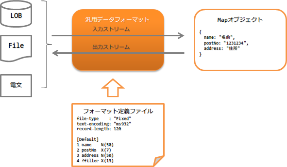

.. _data_format:

通用数据格式
==================================================

.. contents:: 目录
  :depth: 3
  :local:

提供对应系统处理的多种数据形式的通用输入输出库功能。

本功能的大致构成如下。

功能概述
--------------------------------------------------

.. _data_format-support_type:

标准支持丰富的格式
~~~~~~~~~~~~~~~~~~~~~~~~~~~~~~~~~~~~~~~~~~~~~~~~~~
标准支持以下形式的格式。

固定长度和可变长度的数据形式中，也支持每条记录布局不同的多布局数据。
(XML和JSON中不存在记录的概念。)

* 固定长度
* 可变长度(csv、tsv等)
* JSON
* XML

.. important::

  本功能有以下缺点。

  * 需要创建复杂的 :ref:`格式定义文件 <data_format-format_definition_file>` 。
  * 输入输出限定为 :java:extdoc:`Map <java.util.Map>` ，容易发生实现错误。

    * 字段名需要以字符串指定，无法使用IDE的补全等功能，实现时容易出错。
    * 应用侧需要将Map中取出的值向下转型。(如果出错会在运行时抛出异常。)

  * 数据与Java对象的映射没有使用 :java:extdoc:`BeanUtil <nablarch.core.beans.BeanUtil>` ，因此与其他功能的映射方法不同。
  * 输出目标 :java:extdoc:`Map <java.util.Map>` 的处理方式因格式而异。因此，在使用同一数据对应多种格式的功能时，可能会因格式不同而发生异常等无法正常动作的情况。
    
    例如，在以下情况下会有问题。
    
    在XML和JSON的必填项中指定null时：
      * XML：将值作为空字符串输出
      * JSON：抛出必填异常
  
  * 根据输出目标数据，可能无法满足JSON的规范。
  
    例如，使用 :java:extdoc:`数值型 <nablarch.core.dataformat.convertor.datatype.JsonNumber>` 或 :java:extdoc:`布尔型 <nablarch.core.dataformat.convertor.datatype.JsonBoolean>` ，
    而输出目标的数据类型与这些类型不对应时，会输出非法的JSON。
    
    例：指定为数值型，输出目标为"data"等字符串时，会输出{"number":data}这样的非法JSON。
  
  * 根据数据形式，可用的 :java:extdoc:`数据类型 <nablarch.core.dataformat.convertor.datatype.DataType>` 实现类不同，因此难以扩展。而且此设置错误在运行前无法检测。
  
  因此，原则上本功能除不得已的情况外不推荐使用。
  另外， :ref:`messaging` 由于内部使用本功能，无法使用替代功能。

  本功能的替代功能
    :固定长度: 使用 :ref:`data_bind` 。
    :可变长度: 使用 :ref:`data_bind` 。
    :XML: 推荐使用 `Jakarta XML Binding <https://jakarta.ee/specifications/xml-binding/>`_ 。
    :JSON: 推荐使用OSS。例如， `Jackson(外部站点、英语) <https://github.com/FasterXML/jackson>`_ 被广泛使用。

对应多种字符集、字符种类、数据形式
~~~~~~~~~~~~~~~~~~~~~~~~~~~~~~~~~~~~~~~~~~~~~~~~~~
不仅支持字符串和十进制数值，还支持主机中常用的压缩数值和区域十进制数形式等。
此外，不仅支持UTF-8和Shift_JIS，还支持EBCDIC等字符集。

.. tip::
  
  关于字符集，可以使用执行环境的JVM支持的字符编码。

.. _data_format-value_convertor:

支持填充和修剪等转换处理
~~~~~~~~~~~~~~~~~~~~~~~~~~~~~~~~~~~~~~~~~~~~~~~~~~
支持固定长度文件中常用的空格和零(0)填充及修剪。
因此，应用侧无需进行填充处理或修剪处理。

填充和修剪的详细内容请参考 :ref:`data_format-field_convertor_list` 。

模块列表
---------------------------------------------------------------------
* 使用 :ref:`上传助手 <data_format-upload_helper>` 时，需要添加 ``nablarch-fw-web-extension`` 。
* 使用 :ref:`文件下载 <data_format-file_download>` 时，需要添加 ``nablarch-fw-web-extension`` 。

.. code-block:: xml

  <!-- 通用数据格式 -->
  <dependency>
    <groupId>com.nablarch.framework</groupId>
    <artifactId>nablarch-core-dataformat</artifactId>
  </dependency>

  <!--
  使用上传助手时、使用下载时需要添加以下内容
   -->
  <dependency>
    <groupId>com.nablarch.framework</groupId>
    <artifactId>nablarch-fw-web-extension</artifactId>
  </dependency>

使用方法
--------------------------------------------------

.. _data_format-format_definition_file:

定义输入输出数据的格式
~~~~~~~~~~~~~~~~~~~~~~~~~~~~~~~~~~~~~~~~~~~~~~~~~~
输入输出目标数据的格式定义在格式定义文件中进行。

格式定义文件以如下文本文件形式创建。
详细规格请参考 :doc:`data_format/format_definition` 。

.. code-block:: bash

  file-type:        "Variable" # 可变长度
  text-encoding:    "MS932"    # 字符串型字段的字符编码
  record-separator: "\r\n"     # 换行代码(crlf)
  field-separator:  ","        # csv

  # 记录识别字段的定义
  [Classifier]
  1 dataKbn X     # 第1个字段
  3 type    X     # 第3个字段

  [parentData]
  dataKbn = "1"
  type    = "01"
  1 dataKbn X
  2 ?filler X
  3 type    X
  4 data    X

  [childData]
  dataKbn = "1"
  type    = "02"
  1 dataKbn X
  2 ?filler X
  3 type    X
  4 data    X
  

.. toctree::
  :hidden:

  data_format/format_definition

将数据输出到文件
~~~~~~~~~~~~~~~~~~~~~~~~~~~~~~~~~~~~~~~~~~~~~~~~~~
说明将数据记录的内容输出到文件的方法。

向文件输出数据可以使用 :java:extdoc:`FileRecordWriterHolder <nablarch.common.io.FileRecordWriterHolder>` 实现。

以下显示实现示例。

要点
  * 要写入文件的数据以 :java:extdoc:`Map <java.util.Map>` 形式准备。
  * :java:extdoc:`Map <java.util.Map>` 的键值设置为 :ref:`data_format-format_definition_file` 中定义的字段名。(不区分大小写)
  * 调用 :java:extdoc:`FileRecordWriterHolder <nablarch.common.io.FileRecordWriterHolder>` 的 `open` 方法，将文件资源置为可写入状态。
  * 调用 :java:extdoc:`FileRecordWriterHolder <nablarch.common.io.FileRecordWriterHolder>` 的 `write` 方法，将数据写入文件。

.. code-block:: java

  // 写入目标数据
  Map<String, Object> user = new HashMap<>();
  user.put("name", "名字");
  user.put("age", 20);

  // 打开写入目标文件
  FileRecordWriterHolder.open("users.csv", "user_csv_format");

  // 写入数据
  FileRecordWriterHolder.write(user, "user.csv");

.. tip::

  要使用 :java:extdoc:`FileRecordWriterHolder <nablarch.common.io.FileRecordWriterHolder>` ，
  需要在 :ref:`file_path_management` 中设置 :ref:`格式定义文件 <data_format-format_definition_file>` 的配置目录和输出目标目录。

  所需目录的设置值请参考 :java:extdoc:`FileRecordWriterHolder <nablarch.common.io.FileRecordWriterHolder>` 。

.. important::

  :java:extdoc:`FileRecordWriterHolder <nablarch.common.io.FileRecordWriterHolder>` 打开的文件资源，
  由 :ref:`file_record_writer_dispose_handler` 自动释放。
  因此，使用 :java:extdoc:`FileRecordWriterHolder <nablarch.common.io.FileRecordWriterHolder>` 时，
  必须在handler队列上设置 :ref:`file_record_writer_dispose_handler` 。

.. important::
  如果输出的数据中设置了异常值，可能无法正确处理，因此需要事先在应用侧检查是否为异常值。

.. important::

  默认动作是每条记录都写入文件。
  输出大量数据时如果每条记录都写入文件可能无法满足性能要求。
  这种情况下，应将默认动作更改为不是每条记录而是按指定缓冲区大小写入。

  添加以下组件定义，可以按指定缓冲区大小而不是每条记录写入。

  .. code-block:: xml

    <!-- 组件名设为dataFormatConfig -->
    <component name="dataFormatConfig" class="nablarch.core.dataformat.DataFormatConfig">
      <property name="flushEachRecordInWriting" value="false" />
    </component>

  输出使用的缓冲区大小可以在 :java:extdoc:`FileRecordWriterHolder <nablarch.common.io.FileRecordWriterHolder>`
  的 `open` 方法中指定。

.. _data_format-file_download:
  
在文件下载中使用
~~~~~~~~~~~~~~~~~~~~~~~~~~~~~~~~~~~~~~~~~~~~~~~~~~
说明以文件下载形式将数据记录的内容响应给客户端的方法。

文件下载形式的响应可以使用 :java:extdoc:`DataRecordResponse <nablarch.common.web.download.DataRecordResponse>` 实现。

以下显示实现示例。

要点
  * 生成 :java:extdoc:`DataRecordResponse <nablarch.common.web.download.DataRecordResponse>` 时，
    指定格式定义文件存储的逻辑路径名和格式定义文件名。
  * 使用 :java:extdoc:`DataRecordResponse#write <nablarch.common.web.download.DataRecordResponse.write(java.util.Map)>` 输出数据。
    (下载多条记录时需要重复输出)
  * 设置 `Content-Type` 及 `Content-Disposition` 。
  * 从业务Action返回 :java:extdoc:`DataRecordResponse <nablarch.common.web.download.DataRecordResponse>` 。

.. code-block:: java

  public HttpResponse download(HttpRequest request, ExecutionContext context) {

    // 业务处理

    // 创建存储下载数据的Map。
    Map<String, Object> user = new hashMap<>()
    user.put("name", "名字");
    user.put("age", 30);

    // 指定格式定义文件存储的逻辑路径名和
    // 格式定义文件名生成DataRecordResponse。
    DataRecordResponse response = new DataRecordResponse("format", "users_csv");

    // 输出下载数据。
    response.write(user);

    // 设置Content-Type头部、Content-Disposition头部
    response.setContentType("text/csv; charset=Shift_JIS");
    response.setContentDisposition("消息列表.csv");

    return response;
  }
  

.. tip::
  格式定义文件的存储路径需要在 :ref:`file_path_management` 中设置。

.. _data_format-load_upload_file:

读取上传的文件
~~~~~~~~~~~~~~~~~~~~~~~~~~~~~~~~~~~~~~~~~~~~~~~~~~
说明读取上传文件的方法。

本功能中，可以使用以下两种方法读取上传的文件。
如 :ref:`使用上传助手读取 <data_format-upload_helper>` 中所述，
推荐使用 :ref:`仅使用通用数据格式(本功能)读取 <data_format-native_upload_file_load>` 。

* :ref:`仅使用通用数据格式(本功能)读取上传文件 <data_format-native_upload_file_load>`
* :ref:`使用上传助手读取 <data_format-upload_helper>`

.. _data_format-native_upload_file_load:

仅使用通用数据格式(本功能)读取上传文件
  说明不使用后述的上传助手而使用本功能API读取上传文件的加载处理。

  以下显示实现示例。

  要点
    * 调用 :java:extdoc:`HttpRequest#getPart <nablarch.fw.web.HttpRequest.getPart(java.lang.String)>` 获取上传的文件。
    * :java:extdoc:`HttpRequest#getPart <nablarch.fw.web.HttpRequest.getPart(java.lang.String)>` 的参数中指定参数名。
    * 从 :java:extdoc:`FilePathSetting <nablarch.core.util.FilePathSetting>` 获取格式定义文件的 :java:extdoc:`File <java.io.File>` 对象。
    * 指定格式定义文件，从 :java:extdoc:`FormatterFactory <nablarch.core.dataformat.FormatterFactory>`
      生成 :java:extdoc:`DataRecordFormatter <nablarch.core.dataformat.DataRecordFormatter>` 。
    * 向 :java:extdoc:`DataRecordFormatter <nablarch.core.dataformat.DataRecordFormatter>` 设置读取上传文件的 :java:extdoc:`InputStream <java.io.InputStream>` 。
      设置的 :java:extdoc:`InputStream <java.io.InputStream>` 实现类需要支持 :java:extdoc:`mark <java.io.InputStream.mark(int)>`/:java:extdoc:`reset <java.io.InputStream.reset()>` 。
    * 调用 :java:extdoc:`DataRecordFormatter <nablarch.core.dataformat.DataRecordFormatter>` 的API读取上传文件的记录。

  .. code-block:: java

    public HttpResponse upload(HttpRequest req, ExecutionContext ctx) {

      // 获取上传文件的信息
      final List<PartInfo> partInfoList = request.getPart("users");

      // 获取格式定义文件的File对象
      final File format = FilePathSetting.getInstance()
                                         .getFile("format", "users-layout");

      // 获取格式定义文件，生成读取上传文件的格式化器。
      try (final DataRecordFormatter formatter = FormatterFactory.getInstance()
                                                                 .createFormatter(format)) {

        // 向格式化器设置读取上传文件的InputStream并初始化。
        // 需要支持mark/reset，因此用BufferedInputStream包装。
        formatter.setInputStream(new BufferedInputStream(partInfoList.get(0).getInputStream()))
                 .initialize();

        // 重复处理直到记录结束。
        while (formatter.hasNext()) {
          // 读取记录。
          final DataRecord record = formatter.readRecord();

          // 执行对记录的处理
          final Users users = BeanUtil.createAndCopy(Users.class, record);

          // 以下省略
        }
      } catch (IOException e) {
        throw new RuntimeException(e);
      }
    }

.. _data_format-upload_helper:

使用上传助手读取上传文件
  使用上传助手( :java:extdoc:`UploadHelper <nablarch.fw.web.upload.util.UploadHelper>` )，
  可以简易地执行文件读取、验证、保存到数据库。

  但是，此功能有以下限制(缺点)，因此推荐使用 :ref:`仅使用通用数据格式(本功能)读取上传文件 <data_format-native_upload_file_load>` 。

  * 输入值校验限定为 :ref:`nablarch_validation` 。(无法使用推荐的 :ref:`bean_validation` 。)
  * 虽然可以扩展，但难度较高，不容易实现满足需求的代码。

  以下显示对单布局上传文件进行输入校验并保存到数据库的示例。

  要点
    * 调用 :java:extdoc:`HttpRequest#getPart <nablarch.fw.web.HttpRequest.getPart(java.lang.String)>` 获取上传的文件。
    * :java:extdoc:`HttpRequest#getPart <nablarch.fw.web.HttpRequest.getPart(java.lang.String)>` 的参数中指定参数名。
    * 基于获取的上传文件生成 :java:extdoc:`UploadHelper <nablarch.fw.web.upload.util.UploadHelper>` 。
    * 使用 :java:extdoc:`UploadHelper#applyFormat <nablarch.fw.web.upload.util.UploadHelper.applyFormat(java.lang.String)>` 设置格式定义文件。

    * 使用 :java:extdoc:`setUpMessageIdOnError <nablarch.fw.web.upload.util.BulkValidator.setUpMessageIdOnError(java.lang.String,java.lang.String,java.lang.String)>` 设置验证错误用的消息ID。
    * 使用 :java:extdoc:`validateWith <nablarch.fw.web.upload.util.BulkValidator.ErrorHandlingBulkValidator.validateWith(java.lang.Class,java.lang.String)>` 设置执行验证的Java Beans类和验证方法。
    * 使用 :java:extdoc:`importWith <nablarch.fw.web.upload.util.BulkValidationResult.importWith(nablarch.core.db.support.DbAccessSupport,java.lang.String)>` 将验证执行后的Java Beans对象内容保存到数据库。

  .. code-block:: java

    public HttpResponse upload(HttpRequest req, ExecutionContext ctx) {

      PartInfo partInfo = req.getPart("fileToSave").get(0);

      // 全件批量注册
      UploadHelper helper = new UploadHelper(partInfo);
      int cnt = helper
          .applyFormat("N11AC002")                     // 应用格式
          .setUpMessageIdOnError("format.error",       // 指定格式错误时的消息ID
                                 "validation.error",   // 指定验证错误时的消息ID
                                 "file.empty.error")   // 指定文件为空时的消息ID
          .validateWith(UserInfoTempEntity.class,      // 指定验证方法
                        "validateRegister")
          .importWith(this, "INSERT_SQL");             // 指定INSERT语句的SQLID

    }

  .. tip::

    请同时参考 :java:extdoc:`nablarch.fw.web.upload.util` 包内类的文档。

.. _data_format-structured_data:

读写JSON和XML的层次结构数据
~~~~~~~~~~~~~~~~~~~~~~~~~~~~~~~~~~~~~~~~~~~~~~~~~~
说明读写JSON和XML的层次结构数据时Map的结构。

读取JSON和XML这样的层次结构数据时，Map的键值为各层次的元素名用点号( ``.`` )连接的值。

以下显示示例。

格式定义文件
  JSON的情况下，将 `file-type` 替换为 ``JSON`` 。
  表示层次结构的格式定义文件的定义方法请参考 :ref:`层次结构的定义 <data_format-nest_object>` 。

  .. code-block:: bash

    file-type:        "XML"
    text-encoding:    "UTF-8"

    [users]              # 根元素
    1 user    [0..*] OB

    [user]               # 嵌套元素
    1 name    [0..1] N   # 最下层元素
    2 age     [0..1] X9
    3 address [0..1] N

  .. important::

    不支持父元素为可选且仅在父元素存在时子元素为必填这样的设置。
    因此，在格式定义文件中定义层次结构数据时，建议全部作为可选项定义。

Map的结构
  使用上述格式定义文件向XML及JSON输出数据时，Map的结构如下。

  要点
    * 层次结构时，以"父元素名 + "." + 子元素名"形式向Map设置值。
    * 层次结构更深时，元素名用更多的 ``.`` 连接。
    * 最上层元素名不需要包含在键中
    * 数组元素时设置下标(从0开始)。

  .. code-block:: java

    Map<String, Object> data = new HashMap<String, Object>();

    // user数组元素的第1个元素
    data.put("user[0].name", "名字1");
    data.put("user[0].address", "地址1");
    data.put("user[0].age", 30);

    // user数组元素的第2个元素
    data.put("user[1].name", "名字2");
    data.put("user[1].address", "地址2");
    data.put("user[1].age", 31);

XML及JSON的结构
  上述格式定义文件对应的XML及JSON结构如下。

  XML
    .. code-block:: xml

      <?xml version="1.0" encoding="UTF-8"?>
      <users>
        <user>
          <name>名字1</name>
          <address>地址1</address>
          <age>30</age>
        </user>
        <user>
          <name>名字2</name>
          <address>地址2</address>
          <age>31</age>
        </user>
      </users>    

  JSON
    .. code-block:: json

      {
        "user": [
          {
            "name": "名字1",
            "address": "地址1",
            "age": 30
          },
          {
            "name": "名字2",
            "address": "地址2",
            "age": 31
          }
        ]
      }

~~~~~~~~~~~~~~~~~~~~~~~~~~~~~~~~~~~~~~~~~~~~~~~~~~
在XML中使用DTD
~~~~~~~~~~~~~~~~~~~~~~~~~~~~~~~~~~~~~~~~~~~~~~~~~~
.. important::

  本功能输入XML时，默认不能使用DTD。尝试读取使用DTD的XML时会发生异常。
  这是为了防止 `XML外部实体引用(XXE) <https://owasp.org/www-community/vulnerabilities/XML_External_Entity_(XXE)_Processing>`_ 的措施。

如果读取目标XML可信，可以使用 :java:extdoc:`XmlDataParser<nablarch.core.dataformat.XmlDataParser>` 的 ``allowDTD`` 属性允许使用DTD。
使用方法如下。

在组件配置文件中显式设置名为 ``XmlDataParser`` 的组件，允许使用DTD。

.. code-block:: xml

  <?xml version="1.0" encoding="UTF-8"?>
    <component-configuration
        xmlns="http://tis.co.jp/nablarch/component-configuration"
        xmlns:xsi="http://www.w3.org/2001/XMLSchema-instance"
        xsi:schemaLocation="http://tis.co.jp/nablarch/component-configuration component-configuration.xsd">

      <component name="XmlDataParser" class="nablarch.core.dataformat.XmlDataParser">
        <!--
            允许使用DTD。
            由于存在XXE攻击风险，不可用于可信XML以外的数据。
         -->
        <property name="allowDTD" value="true" />
      </component>
    </component-configuration>

在XML中使用命名空间
~~~~~~~~~~~~~~~~~~~~~~~~~~~~~~~~~~~~~~~~~~~~~~~~~~
在与连接目标系统的连接需求中，有时必须使用命名空间。
这种情况下，可以在格式定义文件中定义命名空间来对应。

以下显示示例。

要点
  * 命名空间在使用命名空间的元素上以""?\@xmlns:" + 命名空间"形式定义。
    类型设为 ``X`` ，在字段转换器部分指定URI。
  * 命名空间以"命名空间 + ":" + 元素名"形式表示。
  * 输入输出目标数据的Map键值为"命名空间＋元素名(首字母大写)"。

格式定义文件
  .. code-block:: bash

    file-type:        "XML"
    text-encoding:    "UTF-8"

    [testns:data]
    # 命名空间的定义
    1 ?@xmlns:testns X "http://testns.hoge.jp/apply"
    2 testns:key1 X

XML数据
  上述格式定义文件对应的XML如下。

  .. code-block:: xml

    <?xml version="1.0" encoding="UTF-8"?>
    <testns:data xmlns:testns="http://testns.hoge.jp/apply">
      <testns:key1>value1</testns:key1>
    </testns:data>

Map数据
  输入输出目标Map的结构如下。

  .. code-block:: java

    Map<String, Object> data = new HashMap<String, Object>();
    data.put("testnsKey1", "value1");

在XML中为带属性的元素定义内容
~~~~~~~~~~~~~~~~~~~~~~~~~~~~~~~~~~~~~~~~~~~~~~~~~~
想在XML中为带属性的元素定义内容时，
在格式定义文件中定义表示内容的字段。

设置示例如下。

要点
  * 表示内容的字段名指定为 ``body`` 。
    想从默认值更改表示内容的字段名时，请参考 :ref:`data_format-xml_content_name_change` 。

格式定义文件
  .. code-block:: bash

    file-type:        "XML"
    text-encoding:    "UTF-8"

    [parent]
    1 child   OB

    [child]
    1 @attr   X
    2 body    X

XML数据
  上述格式定义文件对应的XML如下。

  .. code-block:: xml

    <?xml version="1.0" encoding="UTF-8"?>
    <parent>
      <child attr="value1">value2</child>
    </parent>

Map数据
  输入输出目标Map的结构如下。

  .. code-block:: java

    Map<String, Object> data = new HashMap<String, Object>();
    data.put("child.attr", "value1");
    data.put("child.body", "value2");

.. _data_format-replacement:

进行字符替换(替代字)
~~~~~~~~~~~~~~~~~~~~~~~~~~~~~~~~~~~~~~~~~~~~~~~~~~
使用替代字功能，可以在从外部读取数据时将其替换为系统可用的字符。

以下显示使用方法。

创建定义替换规则的属性
  properties文件中以"替换前字符=替换后字符"形式定义替换规则。

  替换前、替换后字符可定义的值都仅限1个字符。
  此外，不支持代理对。

  注释等的记述规则请参考 :java:extdoc:`java.util.Properties` 。

  .. code-block:: properties

    髙=高
    崎=崎
    唖=■

  .. tip::
    按连接目标定义替换规则时，创建多个properties文件。

在组件配置文件中添加替换规则的设置
  要点
    * 以组件名 ``characterReplacementManager`` 设置 :java:extdoc:`CharacterReplacementManager <nablarch.core.dataformat.CharacterReplacementManager>` 。
    * 以列表形式向 :java:extdoc:`configList <nablarch.core.dataformat.CharacterReplacementManager.setConfigList(java.util.List)>` 属性设置 :java:extdoc:`CharacterReplacementConfig <nablarch.core.dataformat.CharacterReplacementConfig>` 。
    * 定义多个properties文件时，在 :java:extdoc:`typeName <nablarch.core.dataformat.CharacterReplacementConfig.setTypeName(java.lang.String)>` 属性中设置不同的名称。

  .. code-block:: xml

    <component name="characterReplacementManager"
        class="nablarch.core.dataformat.CharacterReplacementManager">
      <property name="configList">
        <list>
          <!-- 与A系统的替代字规则 -->
          <component class="nablarch.core.dataformat.CharacterReplacementConfig">
            <property name="typeName" value="a_system"/>
            <property name="filePath" value="classpath:a-system.properties"/>
            <property name="encoding" value="UTF-8"/>
          </component>
          <!-- 与B系统的替代字规则 -->
          <component class="nablarch.core.dataformat.CharacterReplacementConfig">
            <property name="typeName" value="b_system"/>
            <property name="filePath" value="classpath:b-system.properties"/>
            <property name="encoding" value="UTF-8"/>
          </component>
        </list>
      </property>
    </component>

初始化组件的设置
  将上述设置的 :java:extdoc:`CharacterReplacementManager <nablarch.core.dataformat.CharacterReplacementManager>` 设置到初始化目标列表中。

    .. code-block:: xml

      <component name="initializer"
          class="nablarch.core.repository.initialization.BasicApplicationInitializer">

        <property name="initializeList">
          <list>
            <!-- 省略 -->
            <component-ref name="characterReplacementManager" />
          </list>
        </property>
      </component>

在格式定义文件中定义使用哪种替换规则
  输入输出时进行字符替换时，使用 :ref:`replacement <data_format-replacement_convertor>` 。

  `replacement` 的参数中设置上述设置的替换规则的 `typeName` 。

  .. code-block:: bash
    
    # 应用与A系统的替换规则
    1 name N(100) replacement("a_system")

    # 应用与B系统的替换规则
    1 name N(100) replacement("b_system")

.. _data_format-formatter:

格式化输出数据的显示形式
~~~~~~~~~~~~~~~~~~~~~~~~~~~~~~~~~~~~~~~~~~~~~~~~~~
输出数据时，可以使用 :ref:`format` 来格式化日期和数值等数据的显示形式。

详情请参考 :ref:`format` 。

扩展示例
--------------------------------------------------

.. _data_format-field_type_add:

添加字段类型
~~~~~~~~~~~~~~~~~~~~~~~~~~~~~~~~~~~~~~~~~~~~~~~~~~
:ref:`Nablarch提供的标准数据类型 <data_format-field_type_list>` 可能无法满足需求。
例如，字符串类型的填充字符为二进制时就是这种情况。

这种情况下，通过定义项目固有的字段类型来对应。

以下显示步骤。

#. 创建处理字段类型的 :java:extdoc:`DataType<nablarch.core.dataformat.convertor.datatype.DataType>` 实现类。
#. 为启用添加的字段类型，创建对应格式的工厂继承类。
#. 将创建的工厂类设置到对应格式的设置类的属性中。

详细步骤如下。

添加对应字段类型的数据类型实现
  创建实现 :java:extdoc:`DataType<nablarch.core.dataformat.convertor.datatype.DataType>` 的类。

  .. tip::
    
    标准字段类型实现位于 :java:extdoc:`nablarch.core.dataformat.convertor.datatype` 包下。
    添加实现时可以参考这些类。

创建对应格式的工厂继承类
  为启用添加的字段类型，
  需要创建对应格式的工厂继承类。

  以下显示各格式的工厂类。

  .. list-table::
    :class: white-space-normal
    :header-rows: 1

    * - 格式
      - 工厂类名

    * - Fixed(固定长度)
      - :java:extdoc:`FixedLengthConvertorFactory <nablarch.core.dataformat.convertor.FixedLengthConvertorFactory>`
    * - Variable(可变长度)
      - :java:extdoc:`VariableLengthConvertorFactory <nablarch.core.dataformat.convertor.VariableLengthConvertorFactory>`
    * - JSON
      - :java:extdoc:`JsonDataConvertorFactory <nablarch.core.dataformat.convertor.JsonDataConvertorFactory>`
    * - XML
      - :java:extdoc:`XmlDataConvertorFactory <nablarch.core.dataformat.convertor.XmlDataConvertorFactory>`

  以下显示Fixed(固定长度)时的实现示例。

  .. code-block:: java

    public class CustomFixedLengthConvertorFactory extends FixedLengthConvertorFactory {
        @Override
        protected Map<String, Class<?>> getDefaultConvertorTable() {
            final Map<String, Class<?>> defaultConvertorTable = new CaseInsensitiveMap<Class<?>>(
                    new ConcurrentHashMap<String, Class<?>>(super.getDefaultConvertorTable()));
            defaultConvertorTable.put("custom", CustomType.class);
            return Collections.unmodifiableMap(defaultConvertorTable);
        }
    }

设置到对应格式的设置类的属性中
  将刚才创建的工厂类设置到对应格式的设置类的属性中。

  以下显示各格式的设置类和属性。

  .. list-table::
    :class: white-space-normal
    :header-rows: 1

    * - 格式
      - 设置类名(组件名)
      - 属性名

    * - Fixed(固定长度)
      - :java:extdoc:`FixedLengthConvertorSetting <nablarch.core.dataformat.convertor.FixedLengthConvertorSetting>`
        (fixedLengthConvertorSetting)
      - :java:extdoc:`fixedLengthConvertorFactory <nablarch.core.dataformat.convertor.FixedLengthConvertorSetting.setFixedLengthConvertorFactory(nablarch.core.dataformat.convertor.FixedLengthConvertorFactory)>`
    * - Variable(可变长度)
      - :java:extdoc:`VariableLengthConvertorSetting <nablarch.core.dataformat.convertor.VariableLengthConvertorSetting>`
        (variableLengthConvertorSetting)
      - :java:extdoc:`variableLengthConvertorFactory <nablarch.core.dataformat.convertor.VariableLengthConvertorSetting.setVariableLengthConvertorFactory(nablarch.core.dataformat.convertor.VariableLengthConvertorFactory)>`
    * - JSON
      - :java:extdoc:`JsonDataConvertorSetting <nablarch.core.dataformat.convertor.JsonDataConvertorSetting>`
        (jsonDataConvertorSetting)
      - :java:extdoc:`jsonDataConvertorFactory <nablarch.core.dataformat.convertor.JsonDataConvertorSetting.setJsonDataConvertorFactory(nablarch.core.dataformat.convertor.JsonDataConvertorFactory)>`
    * - XML
      - :java:extdoc:`XmlDataConvertorSetting <nablarch.core.dataformat.convertor.XmlDataConvertorSetting>`
        (xmlDataConvertorSetting)
      - :java:extdoc:`xmlDataConvertorFactory <nablarch.core.dataformat.convertor.XmlDataConvertorSetting.setXmlDataConvertorFactory(nablarch.core.dataformat.convertor.XmlDataConvertorFactory)>`

  以下显示Fixed(固定长度)时的设置示例。

  .. code-block:: xml

    <component name="fixedLengthConvertorSetting"
        class="nablarch.core.dataformat.convertor.FixedLengthConvertorSetting">
      <property name="fixedLengthConvertorFactory">
        <component class="com.sample.CustomFixedLengthConvertorFactory" />
      </property>
    </component>

.. important::

  虽然可以使用对应格式的设置类的 `convertorTable` 属性添加字段类型，
  但由于以下原因不推荐使用。

  * 不仅需要设置要添加的字段类型，还需要设置原本默认定义的所有字段类型。
    因此，如果版本升级导致默认字段类型变更，
    变更不会自动应用而需要手动修改设置，比较麻烦。
  * 默认定义在工厂类中实现，需要基于源代码向组件配置文件添加定义，
    容易出错。

.. _data_format-xml_content_name_change:

更改XML中带属性元素的内容名
~~~~~~~~~~~~~~~~~~~~~~~~~~~~~~~~~~~~~~~~~~~~~~~~~~
要更改带属性元素的内容名，
在组件配置文件中设置以下类，``contentName`` 属性中分别设置更改后的内容名。

* :java:extdoc:`XmlDataParser<nablarch.core.dataformat.XmlDataParser>`
* :java:extdoc:`XmlDataBuilder<nablarch.core.dataformat.XmlDataBuilder>`

以下显示组件配置文件的设置示例。

要点
 * :java:extdoc:`XmlDataParser<nablarch.core.dataformat.XmlDataParser>` 的组件名设为 ``XmlDataParser`` 
 * :java:extdoc:`XmlDataBuilder<nablarch.core.dataformat.XmlDataBuilder>` 的组件名设为 ``XmlDataBuilder`` 

.. code-block:: xml

  <component name="XmlDataParser" class="nablarch.core.dataformat.XmlDataParser">
    <property name="contentName" value="change" />
  </component>

  <component name="XmlDataBuilder" class="nablarch.core.dataformat.XmlDataBuilder">
    <property name="contentName" value="change" />
  </component>
