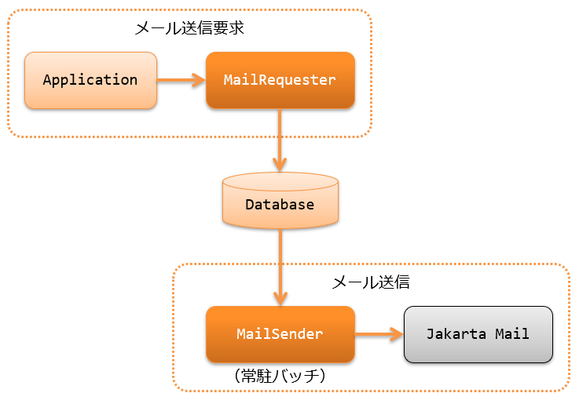

.. _mail:

邮件发送
==================================================

.. contents:: 目录
  :depth: 3
  :local:

.. |JavaMail| raw:: html

  <a href="https://jakarta.ee/specifications/platform/10/apidocs/jakarta/mail/package-summary.html" target="_blank">Jakarta Mail (外部站点、英语)</a>

提供发送邮件的功能。

本功能采用称为延迟在线处理的方式，
不是立即发送邮件，而是先将邮件发送请求存储到数据库中，
使用 :ref:`常驻Batch<nablarch_batch-resident_batch>` 异步发送邮件。

采用这种方式的理由如下。

* 发出邮件发送请求的应用程序可以将邮件发送包含在业务事务中。
* 即使由于邮件服务器或网络故障导致邮件发送失败，也不会影响应用程序的处理。

本功能为了实现上述方式，提供了两个功能。

* :ref:`将邮件发送请求注册到数据库的功能<mail-request>`
* :ref:`根据邮件发送请求发送邮件的Batch功能<mail-send>`

应用程序每次发出邮件发送请求时创建1个邮件发送请求，
每个邮件发送请求发送1封邮件。

.. tip::
  本功能不提供立即发送邮件的API。
  这种情况下，请直接使用 |JavaMail| 。

功能概述
--------------------------------------------------

.. _`mail-template`:

可以使用模板发送定型邮件
~~~~~~~~~~~~~~~~~~~~~~~~~~~~~~~~~~~~~~~~~~~~~~~~~~
系统的邮件发送中，像注册完成通知邮件这样，使用相同内容、只有部分项目不同的邮件发送很常见。
因此，本功能提供了预先准备模板，转换占位符来创建主题和正文的功能。
功能详情请参考 :ref:`mail-request` 。

.. important::

 Nablarch 5u13开始支持使用模板引擎的定型邮件。
 
 5u12之前的定型邮件功能也作为模板引擎之一保留，
 通过设置 ``TinyTemplateEngineMailProcessor`` 即可使用，但功能有以下限制。

 * 可替换占位符的值只能是简单字符串，不支持结构化对象
 * 不支持条件分支、循环等控制语法

 建议替代现有的定型邮件功能，使用功能更强大的以下模板引擎的定型邮件功能。

 * :ref:`mail_sender_freemarker_adaptor`
 * :ref:`mail_sender_thymeleaf_adaptor`
 * :ref:`mail_sender_velocity_adaptor`

.. _`do-not-use-for-campaign-mail`:

不支持像活动通知那样的大量邮件群发
~~~~~~~~~~~~~~~~~~~~~~~~~~~~~~~~~~~~~~~~~~~~~~~~~~~~~~~~~~~~~~~~~~~~~~~~
本功能不支持像活动通知那样的群发功能。
符合以下情况时建议使用产品。

* 活动通知、邮件杂志等批量发送大量邮件。
* 测量已发送邮件的开封率、点击数效果。
* 从邮件地址判断客户端（例如，是否为功能手机），切换发送的邮件。

模块列表
--------------------------------------------------
.. code-block:: xml

  <dependency>
    <groupId>com.nablarch.framework</groupId>
    <artifactId>nablarch-mail-sender</artifactId>
  </dependency>

  <!-- 邮件发送请求ID的编号所使用 -->
  <dependency>
    <groupId>com.nablarch.framework</groupId>
    <artifactId>nablarch-common-idgenerator</artifactId>
  </dependency>
  <dependency>
    <groupId>com.nablarch.framework</groupId>
    <artifactId>nablarch-common-idgenerator-jdbc</artifactId>
  </dependency>

使用方法
--------------------------------------------------

.. _`mail-settings`:

使用邮件发送的设置
~~~~~~~~~~~~~~~~~~~~~~~~~~~~~~~~~~~~~~~~~~~~~~~~~~~~~~~~~~~~~~~~~~~~~
本功能使用数据库管理邮件发送所需的数据。
表结构如下。

.. |br| raw:: html

    

.. list-table:: 邮件发送请求
  :header-rows: 0
  :class: white-space-normal
  :widths: 24,18,58

  * - 邮件发送请求ID ``PK``
    - 字符串型
    - 唯一标识邮件发送请求的ID
  * - 邮件发送模式ID（可选项目）
    - 字符串型
    - 用于标识邮件发送方法模式的ID。 |br| 在使用模式提取未发送数据时定义。（参照 :ref:`提取未发送数据时的条件<mail-mail_send_pattern>` ）
  * - 邮件发送Batch的进程ID（可选项目）
    - 字符串型
    - 多进程执行时各进程对记录进行悲观锁所使用的列。 |br| 多进程执行时定义。（参照 :ref:`mail-mail_multi_process` ）
  * - 主题
    - 字符串型
    -
  * - 发件人邮件地址
    - 字符串型
    - 指定邮件From头部的邮件地址
  * - 回复邮件地址
    - 字符串型
    - 指定邮件Reply-To头部的邮件地址
  * - 退信邮件地址
    - 字符串型
    - 指定邮件Return-Path头部的邮件地址
  * - 字符集
    - 字符串型
    - 指定邮件Content-Type头部的字符集
  * - 状态
    - 字符串型
    - 表示邮件发送状态(未发送／已发送／发送失败)的代码值
  * - 请求日期时间
    - 时间戳型
    -
  * - 发送日期时间
    - 时间戳型
    -
  * - 正文
    - 字符串型
    -

.. list-table:: 邮件接收方
  :header-rows: 0
  :class: white-space-normal
  :widths: 24,18,58

  * - 邮件发送请求ID ``PK``
    - 字符串型
    -
  * - 序号 ``PK``
    - 数值型
    - 1个邮件发送请求内的序号
  * - 接收方区分
    - 字符串型
    - 表示邮件接收方区分(TO／CC／BCC)的代码值
  * - 邮件地址
    - 字符串型
    -

.. list-table:: 邮件附件
  :header-rows: 0
  :class: white-space-normal
  :widths: 24,18,58

  * - 邮件发送请求ID ``PK``
    - 字符串型
    -
  * - 序号 ``PK``
    - 数值型
    - 1个邮件发送请求内的序号
  * - 附件文件名
    - 字符串型
    -
  * - Content-Type
    - 字符串型
    -
  * - 附件
    - 字节数组型
    -

.. list-table:: 邮件模板
  :header-rows: 0
  :class: white-space-normal
  :widths: 24,18,58

  * - 邮件模板ID ``PK``
    - 字符串型
    -
  * - 语言 ``PK``
    - 字符串型
    -
  * - 主题
    - 字符串型
    -
  * - 正文
    - 字符串型
    -
  * - 字符集
    - 字符串型
    - 邮件发送时指定的字符集

要使用邮件发送，请按以下方式设置。

* :ref:`邮件发送请求与邮件发送Batch的共通设置<mail-common_settings>`
* :ref:`邮件发送请求的设置<mail-mail_requester_settings>`
* :ref:`邮件发送Batch的设置<mail-mail_sender_settings>`

.. _mail-common_settings:

邮件发送请求与邮件发送Batch的共通设置
 共通设置中，按以下方式设置。

 * :ref:`表结构<mail-common_settings_table_schema>`
 * :ref:`代码值与消息<mail-common_settings_mail_config>`

 .. _mail-common_settings_table_schema:

 表结构
  将以下类的设置添加到组件定义中。
  设置项详情请参考链接处的Javadoc。

  * :java:extdoc:`MailRequestTable<nablarch.common.mail.MailRequestTable>` (邮件发送请求表)
  * :java:extdoc:`MailRecipientTable<nablarch.common.mail.MailRecipientTable>` (邮件接收方表)
  * :java:extdoc:`MailAttachedFileTable<nablarch.common.mail.MailAttachedFileTable>` (附件表)
  * :java:extdoc:`MailTemplateTable<nablarch.common.mail.MailTemplateTable>` (邮件模板表)

  设置示例如下。

  .. code-block:: xml

   <!-- 邮件发送请求表的Schema -->
   <component name="mailRequestTable" class="nablarch.common.mail.MailRequestTable">
     <!-- 指定表名和列名。此处省略。 -->
   </component>

   <!-- 邮件接收方表的Schema -->
   <component name="mailRecipientTable" class="nablarch.common.mail.MailRecipientTable">
     <!-- 指定表名和列名。此处省略。 -->
   </component>

   <!-- 附件表的Schema -->
   <component name="mailAttachedFileTable" class="nablarch.common.mail.MailAttachedFileTable">
     <!-- 指定表名和列名。此处省略。 -->
   </component>

   <!-- 邮件模板表的Schema -->
   <component name="mailTemplateTable" class="nablarch.common.mail.MailTemplateTable">
     <!-- 指定表名和列名。此处省略。 -->
   </component>

   <!-- 初始化设置 -->
   <component name="initializer"
              class="nablarch.core.repository.initialization.BasicApplicationInitializer">
     <property name="initializeList">
       <list>
         <!-- 其他组件省略 -->
         <component-ref name="mailRequestTable" />
         <component-ref name="mailRecipientTable" />
         <component-ref name="mailAttachedFileTable" />
         <component-ref name="mailTemplateTable" />
       </list>
     </property>
   </component>

 .. tip::

   MailRequestTable的mailSendPatternIdColumnName属性、sendProcessIdColumnName属性是可选项目，想使用功能时才设置。
   mailSendPatternIdColumnName属性请参考 :ref:`提取未发送数据时的条件<mail-mail_send_pattern>` ，
   sendProcessIdColumnName属性请参考 :ref:`mail-mail_multi_process` 。

 .. _mail-common_settings_mail_config:

 代码值与消息
  设置邮件发送所使用的代码值、消息ID、故障代码。
  将 :java:extdoc:`MailConfig<nablarch.common.mail.MailConfig>` 的设置添加到组件定义中。
  设置项详情请参考 :java:extdoc:`MailConfig的Javadoc<nablarch.common.mail.MailConfig>` 。

  设置示例如下。

  .. code-block:: xml

   <component name="mailConfig" class="nablarch.common.mail.MailConfig">

     <!-- 邮件发送请求ID的编号对象识别ID -->
     <property name="mailRequestSbnId" value="MAIL_REQUEST_ID" />

     <!-- 表示邮件接收方区分(TO／CC／BCC)的代码值 -->
     <property name="recipientTypeTO" value="0" />
     <property name="recipientTypeCC" value="1" />
     <property name="recipientTypeBCC" value="2" />

     <!-- 表示邮件发送状态(未发送／已发送／发送失败)的代码值 -->
     <property name="statusUnsent" value="0" />
     <property name="statusSent" value="1" />
     <property name="statusFailure" value="2" />

     <!-- 邮件发送请求件数输出时的消息ID -->
     <property name="mailRequestCountMessageId" value="mail.request.count" />

     <!-- 邮件发送成功时的消息ID -->
     <property name="sendSuccessMessageId" value="mail.send.success" />

     <!-- 发送失败时的故障代码 -->
     <property name="sendFailureCode" value="mail.send.failure" />

     <!-- 发送失败时的结束代码 -->
     <property name="abnormalEndExitCode" value="199" />

   </component>

.. _mail-mail_requester_settings:

邮件发送请求的设置
 将以下类添加到组件定义中。
 设置项详情请参考链接处的Javadoc。

 * :java:extdoc:`MailRequester<nablarch.common.mail.MailRequester>` (将邮件发送请求注册到数据库的组件)
 * :java:extdoc:`MailRequestConfig<nablarch.common.mail.MailRequestConfig>` (保存邮件发送请求时设置值的类)

 :java:extdoc:`MailRequester<nablarch.common.mail.MailRequester>` 在
 将邮件发送请求注册到数据库时，
 使用 :ref:`编号<generator>` 生成邮件发送请求ID。
 因此，还需要另行设置 :ref:`编号<generator>` 。

 设置示例如下。

 要点
  * :java:extdoc:`MailRequester<nablarch.common.mail.MailRequester>` 通过名称查找，
    因此组件名指定为 ``mailRequester`` 。

 .. code-block:: xml

  <!-- 邮件发送请求组件。 -->
  <component name="mailRequester" class="nablarch.common.mail.MailRequester">

    <!-- 邮件发送请求时的设置值(参照以下组件定义) -->
    <property name="mailRequestConfig" ref="mailRequestConfig" />

    <!-- 邮件发送请求ID编号所使用的IdGenerator -->
    <property name="mailRequestIdGenerator" ref="idGenerator" />

    <!-- 表的Schema -->
    <property name="mailRequestTable" ref="mailRequestTable" />
    <property name="mailRecipientTable" ref="mailRecipientTable" />
    <property name="mailAttachedFileTable" ref="mailAttachedFileTable" />
    <property name="templateEngineMailProcessor">
      <component class="nablarch.common.mail.TinyTemplateEngineMailProcessor">
        <property name="mailTemplateTable" ref="mailTemplateTable" />
      </component>
    </property>

  </component>

  <!-- 邮件发送请求时的设置值 -->
  <component name="mailRequestConfig" class="nablarch.common.mail.MailRequestConfig">

    <!-- 默认的回复邮件地址 -->
    <property name="defaultReplyTo" value="default.reply.to@nablarch.sample" />

    <!-- 默认的退信邮件地址 -->
    <property name="defaultReturnPath" value="default.return.path@nablarch.sample" />

    <!-- 默认的字符集 -->
    <property name="defaultCharset" value="ISO-2022-JP" />

    <!-- 最大接收方数 -->
    <property name="maxRecipientCount" value="100" />

    <!-- 最大附件大小(以字节数记述) -->
    <property name="maxAttachedFileSize" value="2097152" />

  </component>

※为说明起见设置了 ``TinyTemplateEngineMailProcessor`` ，但由于功能有限，建议使用FreeMarker等模板引擎。
详情请参照 :ref:`mail-template` 。

.. _mail-mail_sender_settings:

邮件发送Batch的设置
 设置邮件发送Batch所使用的SMTP服务器连接信息。
 将 :java:extdoc:`MailSessionConfig<nablarch.common.mail.MailSessionConfig>` 添加到组件定义中。
 设置项详情请参考链接处的Javadoc。

 设置示例如下。

 .. code-block:: xml

  <component name="mailSessionConfig" class="nablarch.common.mail.MailSessionConfig">
    <property name="mailSmtpHost" value="localhost" />
    <property name="mailHost" value="localhost" />
    <property name="mailSmtpPort" value="25" />
    <property name="mailSmtpConnectionTimeout" value="100000" />
    <property name="mailSmtpTimeout" value="100000" />
  </component>

.. _`mail-request`:

注册邮件发送请求
~~~~~~~~~~~~~~~~~~~~~~~~~~~~~~~~~~~~~~~~~~~~~~~~~~~~~~~~~~~~~~~~~~~~~
注册邮件发送请求使用以下类。

* :java:extdoc:`MailRequester<nablarch.common.mail.MailRequester>` (将邮件发送请求注册到数据库)
* :java:extdoc:`MailUtil<nablarch.common.mail.MailUtil>` (获取 :java:extdoc:`MailRequester<nablarch.common.mail.MailRequester>` )
* :java:extdoc:`FreeTextMailContext<nablarch.common.mail.FreeTextMailContext>` (非定型邮件的发送请求)
* :java:extdoc:`TemplateMailContext<nablarch.common.mail.TemplateMailContext>` (定型邮件的发送请求)
* :java:extdoc:`AttachedFile<nablarch.common.mail.AttachedFile>` (附件)

本功能支持自由格式的非定型邮件和
使用预先注册的模板的定型邮件，
使用各自对应的类创建邮件发送请求。

这里展示定型邮件的实现示例。

.. code-block:: java

 // 创建邮件发送请求。
 TemplateMailContext mailRequest = new TemplateMailContext();
 mailRequest.setFrom("from@tis.co.jp");
 mailRequest.addTo("to@tis.co.jp");
 mailRequest.addCc("cc@tis.co.jp");
 mailRequest.addBcc("bcc@tis.co.jp");
 mailRequest.setSubject("主题");
 mailRequest.setTemplateId("模板ID");
 mailRequest.setLang("ja");

 // 设置模板占位符对应的值。
 mailRequest.setVariable("name", "姓名");
 mailRequest.setVariable("address", "地址");
 mailRequest.setVariable("tel", "电话号码");
 // 如下在值中设置null时，将用空字符串替换。
 mailRequest.setVariable("opeion", null);

 // 设置附件。
 AttachedFile attachedFile = new AttachedFile("text/plain", new File("path/to/file"));
 mailRequest.addAttachedFile(attachedFile);

 // 注册邮件发送请求。
 MailRequester requester = MailUtil.getMailRequester();
 String mailRequestId = requester.requestToSend(mailRequest);

.. important::
 定型邮件设置模板占位符对应的值时，请注意以下事项。

 - 键指定 ``null`` 时，会抛出异常。
 - 值指定 ``null`` 时，会用空字符串替换。
 - 不检查模板中的占位符与设置的键/值的一致性。
   因此，如果模板中有占位符但未设置值，占位符将不会被转换而直接发送邮件。
   相反，没有对应占位符的值将被忽略，邮件照常发送。

.. _`mail-send`:

发送邮件(执行邮件发送Batch)
~~~~~~~~~~~~~~~~~~~~~~~~~~~~~~~~~~~~~~~~~~~~~~~~~~~~~~~~~~~~~~~~~~~~~
邮件发送Batch使用 :java:extdoc:`MailSender<nablarch.common.mail.MailSender>` 。
:java:extdoc:`MailSender<nablarch.common.mail.MailSender>` 是作为使用 :ref:`常驻Batch<nablarch_batch-resident_batch>`
运行的Batch动作创建的。

邮件发送处理中，为防止故障发生时同一封邮件被多次发送，采用如下处理流程。
这样，邮件发送成功时状态必定变为已发送，可以防止重复发送。

邮件发送的处理流程
  .. image:: images/mail/mail_sender_flow.png
    :scale: 75

.. important::
  邮件发送失败时进行的状态更新(更改为发送失败)中发生异常(例如数据库或网络故障时发生)时，状态将保持已发送。
  这种情况下，需要对该数据应用补丁(将状态更改为发送失败)。
  另外，异常中会附加提示应用补丁的消息。

.. tip::
  如上图所示，状态的更新处理在单独的事务中执行。
  因此，需要使用这些处理的事务设置。
  该事务的组件名需要以 ``statusUpdateTransaction`` 注册到组件设置文件中。
  详情请参照 :ref:`database-new_transaction` 。

以下展示执行示例。
执行方法的详情请参照 :ref:`main-run_application` 。

要点
 * requestPath选项指定 :java:extdoc:`MailSender<nablarch.common.mail.MailSender>` 。

.. code-block:: bash

 java nablarch.fw.launcher.Main \
   -diConfig file:./mail-batch-config.xml \
   -requestPath nablarch.common.mail.MailSender/SENDMAIL00 \
   -userId mailBatchUser

.. _`mail-mail_send_pattern`:

提取未发送数据时的条件
 :java:extdoc:`MailSender<nablarch.common.mail.MailSender>` 从
 邮件发送请求表中提取未发送的数据并发送邮件。
 提取未发送数据时的条件可从以下2种中选择。

  * 从整个表中提取未发送的数据
  * 按邮件发送模式ID提取未发送的数据

  使用邮件发送模式ID的用例例如，
  处理希望尽量缩短发送时间的高优先级邮件和
  每小时发送一次即可的低优先级邮件的系统。

  按邮件发送模式ID提取未发送的数据时，
  需要对每个监控的邮件发送模式ID启动邮件发送Batch的进程。
  因此，进程启动时需要在启动参数中指定处理对象的邮件发送模式ID(mailSendPatternId)。

  以下展示执行示例。

  要点
   * 以 ``mailSendPatternId`` 名称的选项指定邮件发送模式ID。

  .. code-block:: bash

   java nablarch.fw.launcher.Main \
     -diConfig file:./mail-batch-config.xml \
     -requestPath nablarch.common.mail.MailSender/SENDMAIL00 \
     -userId mailBatchUser
     -mailSendPatternId 02

.. _`mail-mail_error_process`:

邮件发送时的错误处理
~~~~~~~~~~~~~~~~~~~~~~~~~~~~~~~~~~~~~~~~~~~~~~~~~~~~~~~~~~~~~~~~~~~~~
:java:extdoc:`MailSender<nablarch.common.mail.MailSender>` 在发生由外部输入数据(地址或头部)引起的异常或邮件发送失败的异常时，
将目标邮件发送请求的状态设为发送失败，然后继续下一个邮件发送处理。
另外，发生上述以外的异常时，将邮件发送请求的状态设为发送失败并进行重试。

下表展示异常的种类及其错误处理。

 .. list-table:: 邮件发送时的异常与处理
  :class: white-space-normal
  :header-rows: 1

  * - 异常
    - 处理
  * - 发送请求的邮件地址转换时的 :java:extdoc:`Jakarta Mail的AddressException <jakarta.mail.internet.AddressException>`
    - 将转换失败的地址输出到日志(日志级别: ERROR)。
  * - :ref:`mail-mail_header_injection` 中的 :java:extdoc:`InvalidCharacterException<nablarch.common.mail.InvalidCharacterException>`
    - 将头部字符串输出到日志(日志级别: ERROR)。
  * - 邮件发送失败时的 :java:extdoc:`Jakarta Mail的SendFailureException <jakarta.mail.SendFailedException>`
    - 将已发送的地址、未发送的地址、无效的地址输出到日志(日志级别: ERROR)。
  * - 上述以外的邮件发送时的 :java:extdoc:`Exception <java.lang.Exception>`
    - 包装异常并抛出重试异常。

另外，状态更新为发送失败失败时，或者达到重试上限时，邮件发送Batch将异常结束。

 .. important::
  发送失败的检测需要通过在别的进程中检查日志文件等方式来应对。

想更改日志输出的处理或重试的处理时，请参考 :ref:`mail-mail_extension_sample` 。

.. _`mail-mail_multi_process`:

将邮件发送多进程化
~~~~~~~~~~~~~~~~~~~~~~~~~~~~~~~~~~~~~~~~~~~~~~~~~~~~~~~~~~~~~~~~~~~~~
将邮件发送多进程化时（例如在冗余构成的服务器上执行时），
使用邮件发送请求表的进程ID列进行悲观锁，防止多个进程处理同一发送请求。
使用本功能需要以下设置。

 1. 在邮件发送请求表中定义邮件发送Batch的进程ID列
 2. 设置 :java:extdoc:`MailRequestTable<nablarch.common.mail.MailRequestTable>` 的sendProcessIdColumnName属性值为邮件发送Batch的进程ID列名，并添加到组件定义中
 3. 将邮件发送Batch的进程ID更新用的事务以 ``mailMultiProcessTransaction`` 名称添加到组件定义中(事务设置方法请参考 :ref:`database-new_transaction` )

 .. important::

   如果未进行2.的设置，则不会进行排他控制，1件邮件发送请求可能被多个进程处理。
   但是，表面上邮件发送Batch会正常运行，因此难以检测设置遗漏。
   将邮件发送多进程化时请务必完整进行上述设置。

 .. important::

  Nablarch的邮件发送功能 :ref:`do-not-use-for-campaign-mail` 。关于多进程化，目的也不是分散发送大量邮件，
  而是即使在冗余构成的服务器中部分服务器发生故障也能继续邮件发送功能。
  因此，各进程发送的对象邮件为进程启动时未发送的所有邮件(※)，进程间不进行均等分散。
  
  ※指定了邮件发送模式ID时，对应该邮件发送模式ID的未发送邮件全部成为对象

.. _`mail-mail_header_injection`:

对邮件头部注入攻击的对策
~~~~~~~~~~~~~~~~~~~~~~~~~~~~~~~~~~~~~~~~~~~~~~~~~~~~~~~~~~~~~~~~~~~~~
作为对邮件头部注入攻击的根本对策，需要实施以下对策。

* 邮件头部使用固定值。不使用外部输入值。
* 使用编程语言的标准API发送邮件。Java的情况下使用 |JavaMail| 。

邮件头部使用固定值。不使用外部输入值。
 这由项目在项目中应对。
 无法使用固定值时，需要由项目将换行代码转换或删除。

使用编程语言的标准API发送邮件。Java的情况下使用 |JavaMail| 。
 本功能使用 |JavaMail| 。
 但是，即使使用 |JavaMail| ，部分邮件头部项目即使包含换行代码也能发送邮件。
 因此，作为保险对策，对这些项目设置了包含换行代码时不发送邮件的检查功能。
 如果包含换行代码，
 抛出 :java:extdoc:`InvalidCharacterException<nablarch.common.mail.InvalidCharacterException>`
 并输出日志(日志级别: ERROR)，将该邮件作为发送处理失败处理。

 该保险对策针对以下可能成为漏洞的项目。

 * 主题
 * 退信邮件地址

.. _`mail-mail_extension_sample`:

扩展示例
---------------------------------------------------------------------

添加电子签名或加密邮件正文等更改邮件发送处理
~~~~~~~~~~~~~~~~~~~~~~~~~~~~~~~~~~~~~~~~~~~~~~~~~~~~~~~~~~~~~~~~~~~~~~~~~~~~~~~~~~~
:java:extdoc:`MailSender<nablarch.common.mail.MailSender>` 将
邮件发送请求或模板指定的内容原样发送。
根据应用程序需求，可能需要添加电子签名或加密邮件正文。

这种情况下，请在项目中创建继承 :java:extdoc:`MailSender<nablarch.common.mail.MailSender>`
的类来应对。
详情请参照 :java:extdoc:`MailSender的Javadoc<nablarch.common.mail.MailSender>` 。

更改邮件发送失败时的处理
~~~~~~~~~~~~~~~~~~~~~~~~~~~~~~~~~~~~~~~~~~~~~~~~~~~~~~~~~~~~~~~~~~~~~~~~~~~~~~~~~~~
邮件发送失败时的错误处理(详情请参照 :ref:`mail-mail_error_process` )，例如想更改日志级别或
更改重试对象异常等根据应用程序需求更改时，

这种情况下，与上面的示例同样，请创建继承 :java:extdoc:`MailSender<nablarch.common.mail.MailSender>` 的类来应对。

指定邮件发送请求时使用的事务
~~~~~~~~~~~~~~~~~~~~~~~~~~~~~~~~~~~~~~~~~~~~~~~~~~~~~~~~~~~~~~~~~~~~~~~~~~~~~~~~~~~
业务应用程序失败也想确保进行邮件发送请求等情况下，
可能想将邮件发送请求 :java:extdoc:`MailRequester<nablarch.common.mail.MailRequester>` 和邮件发送请求ID的 :ref:`编号<generator>`
中执行的事务与业务应用程序的事务独立指定。

这种情况下的设置示例如下。

 要点
  * 将事务管理器和邮件发送请求ID的编号中指定的事务名设为相同。

 .. code-block:: xml

  <!-- 邮件发送请求组件 -->
  <component name="mailRequester" class="nablarch.common.mail.MailRequester">
    <!-- 指定邮件发送所使用的事务 -->
    <property name="mailTransactionManager" ref="txManager" />
  </component>

  <!-- 事务管理器  -->
  <component name="txManager" class="nablarch.core.db.transaction.SimpleDbTransactionManager">
    <property name="dbTransactionName" value="mail-transaction" />
  </component>

  <!-- 邮件发送请求ID生成器 -->
  <component name="mailRequestIdGenerator"
      class="nablarch.common.idgenerator.TableIdGenerator">
      <!-- 指定事务管理器中指定的事务名 -->
      <property name="dbTransactionName" value="mail-transaction" />
  </component>

  <component name="initializer"
      class="nablarch.core.repository.initialization.BasicApplicationInitializer">
    <property name="initializeList">
      <list>
        <!-- TableIdGenerator需要初始化 -->
        <component-ref name="mailRequestIdGenerator" />
      </list>
    </property>
  </component>
