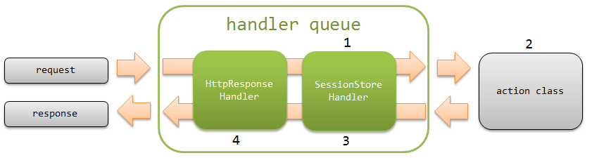

.. _`session_store`:

会话存储
=====================================================================

.. contents:: 目录
  :depth: 3
  :local:

提供抽象化HTTP会话的功能。

本功能中，为识别会话发行会话ID，
使用Cookie( ``NABLARCH_SID`` (可更改))追踪会话。
然后，提供按会话ID向称为会话存储的保存目标读写数据的功能。

本功能中，按会话ID在会话存储中读写的值称为会话变量。

简单处理流程如下图所示。

1. :ref:`session_store_handler` 的往路处理中，基于从Cookie获取的会话ID，从会话存储加载会话变量。
2. 从业务动作通过 :java:extdoc:`SessionUtil <nablarch.common.web.session.SessionUtil>` ，对会话变量进行读写。
3. :ref:`session_store_handler` 的返路处理中，将会话变量保存到会话存储。
4. 为能在JSP中引用，将会话变量设置到请求作用域。（请求作用域中已存在同名值时不设置。）

.. important::
  使用本功能时，以下功能因用途重复而不推荐。

  * :ref:`hidden加密<tag-hidden_encryption>`
  * :ref:`session_concurrent_access_handler`
  * 访问 :java:extdoc:`ExecutionContext<nablarch.fw.ExecutionContext>` 的会话作用域的API

.. tip::
 本功能使用的Cookie( ``NABLARCH_SID`` )与用于追踪HTTP会话的JSESSIONID是完全不同的东西。

.. tip::
 从Nablarch 5u16开始，会话存储的有效期保存目标除HTTP会话外也可以选择其他。

.. tip::
 Cookie中使用的会话ID使用 :java:extdoc:`UUID<java.util.UUID>` 。

功能概述
---------------------------------------------------------------------

可以选择会话变量的保存目标
~~~~~~~~~~~~~~~~~~~~~~~~~~~~~~~~~~~~~~~~~~~~~~~~~~~~~~~~~~~~~~~~~~~~~
可以根据用途选择会话变量的保存目标。

标准提供以下3种存储。

* :ref:`数据库存储 <session_store-db_store>`
* :ref:`HIDDEN存储 <session_store-hidden_store>`
* :ref:`HTTP会话存储 <session_store-http_session_store>`

会话存储的特征和选择标准参见 :ref:`session_store-future_of_store` 。

另外，使用 :ref:`redisstore_lettuce_adaptor` 可以将Redis作为保存目标使用。

.. _session_store-serialize:

可以选择会话变量的序列化机制
~~~~~~~~~~~~~~~~~~~~~~~~~~~~~~~~~~~~~~~~~~~~~~~~~~~~~~~~~~~~~~~~~~~~~
将会话变量保存到会话存储时的序列化机制可从以下选择。
各功能详情参见链接的Javadoc。

* :java:extdoc:`Java标准序列化的序列化(默认) <nablarch.common.web.session.encoder.JavaSerializeStateEncoder>`
* :java:extdoc:`Java标准序列化的序列化及加密 <nablarch.common.web.session.encoder.JavaSerializeEncryptStateEncoder>`
* :java:extdoc:`Jakarta XML Binding的XML基础序列化 <nablarch.common.web.session.encoder.JaxbStateEncoder>`

模块列表
---------------------------------------------------------------------
.. code-block:: xml

  <dependency>
    <groupId>com.nablarch.framework</groupId>
    <artifactId>nablarch-fw-web</artifactId>
  </dependency>

  <!-- 仅使用数据库存储时 -->
  <dependency>
    <groupId>com.nablarch.framework</groupId>
    <artifactId>nablarch-fw-web-dbstore</artifactId>
  </dependency>

.. _session_store-constraint:

约束
---------------------------------------------------------------------
保存目标必须是可序列化的Java Beans对象
~~~~~~~~~~~~~~~~~~~~~~~~~~~~~~~~~~~~~~~~~~~~~~~~~~~~~~~~~~~~~~~~~~~~~
保存到会话存储的对象必须是可序列化的Java Beans对象。

对象持有的属性类型必须是Java的基本类型或可序列化的Java Beans对象。
另外，属性可以使用数组或集合。

使用方法
---------------------------------------------------------------------

.. _session_store-use_config:

使用会话存储的设置
~~~~~~~~~~~~~~~~~~~~~~~~~~~~~~~~~~~~~~~~~~~~~~~~~~~~~~~~~~~~~~~~~~~~~
使用会话存储，除 :ref:`session_store_handler` 的设置外，
还需要将 :java:extdoc:`SessionManager <nablarch.common.web.session.SessionManager>` 设置到组件定义中。

以下展示使用标准提供的所有保存目标时的设置示例。

.. code-block:: xml

  <!-- 以"sessionManager"组件名设置 -->
  <component name="sessionManager" class="nablarch.common.web.session.SessionManager">

    <!--
      未显式指定保存目标时默认使用的存储名称
    -->
    <property name="defaultStoreName" value="db"/>

    <!-- 根据应用程序使用的保存目标添加组件 -->
    <property name="availableStores">
      <list>
        <!-- HIDDEN存储 -->
        <component class="nablarch.common.web.session.store.HiddenStore">
          <!-- 设置值详情参见Javadoc -->
        </component>

        <!-- 数据库存储 -->
        <component-ref name="dbStore" />

        <!-- HTTP会话存储 -->
        <component class="nablarch.common.web.session.store.HttpSessionStore">
          <!-- 设置值详情参见Javadoc -->
        </component>
      </list>
    </property>
  </component>

  <component name="dbStore" class="nablarch.common.web.session.store.DbStore">
    <!-- 设置值详情参见Javadoc -->
  </component>

  <!-- 数据库存储的初始化设置 -->
  <component name="initializer"
      class="nablarch.core.repository.initialization.BasicApplicationInitializer">
    <property name="initializeList">
      <list>
        <!-- 其他组件省略 -->
        <component-ref name="dbStore" />
      </list>
    </property>
  </component>

另外，使用数据库存储时，需要在数据库上创建用于保存会话变量的表。

创建的表定义如下。

`USER_SESSION` 表
  ==================== ====================
  列名                 数据类型
  ==================== ====================
  SESSION_ID(PK)       `java.lang.String`
  SESSION_OBJECT       `byte[]`
  EXPIRATION_DATETIME  `java.sql.Timestamp`
  ==================== ====================

由于Oracle可能无法正常工作的案例， `SESSION_ID` 请用VARCHAR而非CHAR定义。

表名及列名可以更改。
更改时，在 :java:extdoc:`DbStore.userSessionSchema <nablarch.common.web.session.store.DbStore.setUserSessionSchema(nablarch.common.web.session.store.UserSessionSchema)>` 中
定义 :java:extdoc:`UserSessionSchema <nablarch.common.web.session.store.UserSessionSchema>` 的组件。

.. code-block:: xml

  <property name="userSessionSchema">
    <component class="nablarch.common.web.session.store.UserSessionSchema">
      <!-- 设置值详情参见Javadoc -->
    </component>
  </property>

.. tip::
  使用数据库存储时，浏览器关闭等情况可能导致表上残留会话信息。
  因此，需要定期删除过期的会话信息。

.. _`session_store-input_data`:

在输入～确认～完成画面间保持输入信息
~~~~~~~~~~~~~~~~~~~~~~~~~~~~~~~~~~~~~~~~~~~~~~~~~~~~~~~~~~~~~~~~~~~~~
在输入～确认～完成画面间保持输入信息时，
根据是否允许多标签页的画面操作来区分使用会话存储。

不允许多标签页的画面操作时
  使用数据库存储在数据库的表上保持会话变量。

允许多标签页的画面操作时
  使用HIDDEN存储在客户端保持会话变量。

  使用HIDDEN存储时，在输入·确认画面的JSP中如下使用 :ref:`tag-hidden_store_tag` 。

  .. code-block:: jsp

    <n:form>
      <!--
        name属性中设置组件设置文件中定义的、
        HiddenStore的parameterName属性值
      -->
      <n:hiddenStore name="nablarch_hiddenStore" />
      <!-- 其他标签省略 -->
    </n:form>

输入～确认～完成画面间会话存储的实现示例如下。

.. toctree::
  :maxdepth: 2

  session_store/create_example

.. toctree::
  :maxdepth: 2

  session_store/update_example

.. _`session_store-form`:

.. tip::
  会话存储中不要存放Form，而要存放执行业务逻辑的对象(Entity)。

  存放Entity后，可以使用从会话存储取出的对象立即执行业务逻辑。
  这样可以防止多余处理混入业务逻辑，期待提高源码的内聚性。
  相反，如果存放Form，会诱发通过Form进行数据传递，业务逻辑中混入不必要的数据转换处理等，
  可能产生高耦合的源码。

  另外，Form接收外部输入值，如果已验证则没问题，但验证前则保持不可信值状态。
  因此，从安全角度，会话存储中保持的数据生存期较长，
  尽量保持安全的数据，以减少嵌入脆弱性风险。

.. _`session_store-authentication_data`:

保持认证信息
~~~~~~~~~~~~~~~~~~~~~~~~~~~~~~~~~~~~~~~~~~~~~~~~~~~~~~~~~~~~~~~~~~~~~

保持认证信息时使用数据库存储。

登录、注销时会话存储的实现示例如下。

登录应用程序
  .. code-block:: java

    // 登录前更改会话ID
    SessionUtil.changeId(ctx);

    // 重新生成CSRF令牌（使用CSRF令牌验证handler时）
    CsrfTokenUtil.regenerateCsrfToken(ctx);

    // 将登录用户信息保存到会话存储
    SessionUtil.put(ctx, "user", user, "db");

.. important::
  以下条件全部满足时，登录时需要重新生成CSRF令牌。

  * 使用 :ref:`csrf_token_verification_handler`
  * 登录时仅更改会话ID（维持会话信息）

  详细参见 :ref:`csrf_token_verification_handler-regeneration` 。

从应用程序注销
  .. code-block:: java

    // 废弃整个会话存储
    SessionUtil.invalidate(ctx);

从JSP引用会话变量的值
~~~~~~~~~~~~~~~~~~~~~~~~~~~~~~~~~~~~~~~~~~~~~~~~~~~~~~~~~~~~~~~~~~~~~
与普通的请求作用域或会话作用域相同，
可以从JSP引用会话存储保持的会话变量的值。

.. important::
  但是，请求作用域上已存在同名值时，无法从JSP引用会话变量的值，
  因此会话变量请设置与请求作用域不重复的名称。

自定义HIDDEN存储的加密设置
~~~~~~~~~~~~~~~~~~~~~~~~~~~~~~~~~~~~~~~~~~~~~~~~~~~~~~~~~~~~~~~~~~~~~

:ref:`HIDDEN存储 <session_store-hidden_store>` 的加密/解密设置默认如下。

======================= ============================================================
设置项目                设置内容
======================= ============================================================
加密算法                `AES`
加密密钥                使用应用服务器内通用的自动生成密钥
======================= ============================================================

应用服务器冗余化时，每个应用服务器生成不同密钥，可能导致解密失败。
这种情况下，显式设置加密/解密的密钥。

以下展示使用 `AES` 作为加密算法，显式设置加密/解密密钥的设置示例。

.. code-block:: xml

  <component class="nablarch.common.web.session.store.HiddenStore">
    <!-- 其他设置值省略 -->
    <property name="encryptor">
      <component class="nablarch.common.encryption.AesEncryptor">
        <property name="base64Key">
          <component class="nablarch.common.encryption.Base64Key">
            <property name="key" value="OwYMOWbnLyYy93P8oIayeg==" />
            <property name="iv" value="NOj5OUN+GlyGYTc6FM0+nw==" />
          </component>
        </property>
      </component>
    </property>
  </component>
  
要点
  加密的密钥及IV设置base64编码的值。
  为提高密钥强度，使用以下功能生成比较好。
  
  * 使用 :java:extdoc:`KeyGenerator <javax.crypto.KeyGenerator>` 生成密钥。
  * 使用 :java:extdoc:`SecureRandom <java.security.SecureRandom>` 生成IV。
  
  另外，base64编码使用 :java:extdoc:`java.util.Base64.getEncoder()` 获取的 :java:extdoc:`java.util.Base64.Encoder` 执行比较好。

指定会话变量值不存在时的跳转目标画面
~~~~~~~~~~~~~~~~~~~~~~~~~~~~~~~~~~~~~~~~~~~~~~~~~~~~~~~~~~~~~~~~~~~~~~~~~~~~~~~~~~~~~~~~~~~~~~~~~~~~
正常画面跳转时会话变量必定存在，但使用浏览器返回按钮等进行非法画面跳转时，
可能无法访问本应存在的会话变量。
这种情况下，会抛出表示会话变量不存在的异常( :java:extdoc:`SessionKeyNotFoundException <nablarch.common.web.session.SessionKeyNotFoundException>` )，
捕获此异常可以跳转到任意错误页面。

以下展示实现方法。

跳转到系统通用错误页面
  跳转到系统通用错误页面时，在handler中捕获异常并指定跳转目标。
  
  实现示例
    .. code-block:: java

      public class SampleErrorHandler implements Handler<Object, Object> {

        @Override
        public Object handle(Object data, ExecutionContext context) {

          try {
            return context.handleNext(data);
          } catch (SessionKeyNotFoundException e) {
            // 捕获表示会话变量不存在的异常，
            // 返回表示非法画面跳转的错误页面
            throw new HttpErrorResponse(HttpResponse.Status.BAD_REQUEST.getStatusCode(),
                    "/WEB-INF/view/errors/BadTransition.jsp", e);
          }
        }
      }

按请求指定跳转目标
  按请求切换跳转目标时，使用 :ref:`on_error_interceptor` 指定跳转目标。
  另外，与上述跳转到系统通用错误页面并用，可以仅更改部分请求的跳转目标。

  实现示例
    .. code-block:: java

      // 对目标异常指定表示会话变量不存在的异常，按请求指定跳转目标
      @OnError(type = SessionKeyNotFoundException.class, path = "redirect://error")
      public HttpResponse backToNew(HttpRequest request, ExecutionContext context) {
        Project project = SessionUtil.get(context, "project");
        // 处理省略
      }

扩展示例
---------------------------------------------------------------------

添加会话变量的保存目标
~~~~~~~~~~~~~~~~~~~~~~~~~~~~~~~~~~~~~~~~~~~~~~~~~~~~~~~~~~~~~~~~~~~~~
添加会话变量的保存目标需要以下步骤。

#. 继承 :java:extdoc:`SessionStore <nablarch.common.web.session.SessionStore>` ，创建对应要添加的保存目标的类。
#. 在 :java:extdoc:`SessionManager.availableStores <nablarch.common.web.session.SessionManager.setAvailableStores(java.util.List)>` 中，添加创建的类的组件定义。

.. _session_store-future_of_store:

会话存储的特征和选择标准
---------------------------------------------------------------------
默认可用的会话变量保存目标如下。

.. _`session_store-db_store`:

数据库存储
  :保存目标: | 数据库上的表

  :特征: * 滚动维护等应用服务器停止时也可以恢复会话变量。
          * 不会压迫应用服务器的堆区域。
          * 同一会话的处理在多个线程执行时后执行者获胜。（先保存的会话数据会丢失）

.. _`session_store-hidden_store`:

HIDDEN存储
  :保存目标: | 客户端
            | (使用 `hidden` 标签在画面间传递会话变量实现)

  :特征: * 可以允许多标签页的画面操作。
          * 不会压迫应用服务器的堆区域。
          * 同一会话的处理在多个线程执行时，会话数据分别与各线程关联保存。

.. _`session_store-http_session_store`:

HTTP会话存储
  :保存目标: | 应用服务器的堆区域
            | (根据应用服务器的设置，可能保存到数据库或文件等。)

  :特征: * 适合保持认证信息等应用全体频繁使用的信息。
          * 因每个AP服务器保持信息，进行横向扩展时需要下功夫。
          * 保存画面输入内容等大量数据时，可能压迫堆区域。
          * 同一会话的处理在多个线程执行时后执行者获胜。（先保存的会话数据会丢失）

            

基于上述，各会话存储的选择标准如下。

======================================================================== ===============================================================
用途                                                                     会话存储
======================================================================== ===============================================================
输入～确认～完成画面间输入信息的保持（不允许多标签页的画面操作）         :ref:`数据库存储 <session_store-db_store>`
输入～确认～完成画面间输入信息的保持（允许多标签页的画面操作）           :ref:`HIDDEN存储 <session_store-hidden_store>`
认证信息的保持                                                           :ref:`数据库存储 <session_store-db_store>` 或 :ref:`HTTP会话存储 <session_store-http_session_store>`
搜索条件的保持                                                           不使用 [1]_
搜索结果列表的保持                                                       不使用 [2]_
选择框等画面显示项目的保持                                               不使用 [3]_
错误消息的保持                                                           不使用 [3]_
======================================================================== ===============================================================

.. [1] 除认证信息外，会话存储不设想保持跨多个功能的数据。
       搜索时的URL保存在浏览器本地存储等，根据应用程序需求设计·实现。
.. [2] 列表信息等大量数据可能压迫保存区域，因此不保存到会话存储。
.. [3] 画面显示使用的值使用请求作用域传递即可。

.. tip::
  关于 :ref:`redisstore_lettuce_adaptor` ，保存目标不同但特征与数据库存储相同。

.. _`session_store_expiration`:
       
有效期的管理方法
------------------

会话的有效期默认保存在HTTP会话中。
可以更改设置将有效期的保存目标更改为数据库。

详细参见 :ref:`db_managed_expiration` 。

另外，使用 :ref:`redisstore_lettuce_adaptor` 时可以将有效期保存到Redis。

.. tip::
  关于将有效期保存到数据库的意义参见 :ref:`stateless_web_app` 。

