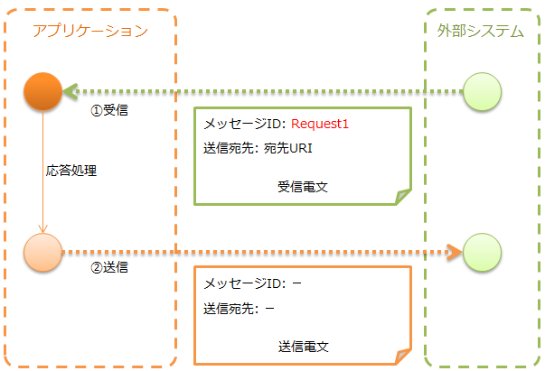
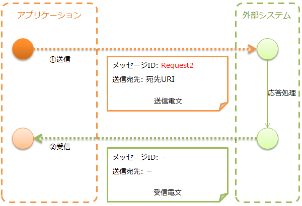

.. _http_system_messaging:

HTTP消息传递
==================================================

.. contents:: 目录
  :depth: 3
  :local:

提供使用HTTP进行消息收发的功能。

HTTP消息传递以 :ref:`http_system_messaging-data_model` 中所示的数据模型为前提。
此外，消息的格式使用 :ref:`data_format` 。

.. important::
 在 :ref:`http_system_messaging-data_model` 中，
 :ref:`框架控制头<mom_system_messaging-fw_header>` 是
 Nablarch独自规定的项目，假设包含在 :ref:`消息体<http_system_messaging-message_body>` 中。

 如果项目侧可以设计电文格式则没有问题，但如果外部系统已经规定了电文格式，则此假设可能不适用。

 因此，建议不使用本功能，而使用以下功能。

 * 对于服务器端(消息接收)，建议使用 :ref:`RESTful Web服务 <restful_web_service>` 。
 * 对于客户端(消息发送)，建议使用Jakarta RESTful Web Services提供的Client功能。

 如果因不得已的情况必须使用本功能，请参考 :ref:`http_system_messaging-change_fw_header` ，在项目侧添加实现来应对。

HTTP消息传递根据收发类型不同，所假设的执行控制基盘也不同。

.. list-table::
   :header-rows: 1
   :class: white-space-normal
   :widths: 50, 50

   * - 收发类型
     - 执行控制基盘
   * - :ref:`HTTP消息接收<http_system_messaging-message_receive>`
     - :ref:`HTTP消息传递<http_messaging>`
   * - :ref:`HTTP消息发送<http_system_messaging-message_send>`
     - 不依赖于执行控制基盘

功能概述
--------------------------

可以与 :ref:`mom_system_messaging` 采用相同的构建方式
~~~~~~~~~~~~~~~~~~~~~~~~~~~~~~~~~~~~~~~~~~~~~~~~~~~~~~~~~~~~
在HTTP消息传递中，消息收发的实现使用与 :ref:`mom_system_messaging` 相同的以下API进行。
因此，如果有 :ref:`mom_system_messaging` 的经验，可以用较少的学>时间实现。

* :java:extdoc:`MessagingAction<nablarch.fw.messaging.action.MessagingAction>`
* :java:extdoc:`MessageSender<nablarch.fw.messaging.MessageSender>`

模块列表
--------------------------------------------------
.. code-block:: xml

  <dependency>
    <groupId>com.nablarch.framework</groupId>
    <artifactId>nablarch-fw-messaging</artifactId>
  </dependency>
  <dependency>
    <groupId>com.nablarch.framework</groupId>
    <artifactId>nablarch-fw-messaging-http</artifactId>
  </dependency>

使用方法
---------------------------

.. _http_system_messaging-settings:

使用HTTP消息传递的设置
~~~~~~~~~~~~~~~~~~~~~~~~~~~~~~~~~~~~~~~~~~~~~~~~~~
对于消息接收，除了执行控制基盘的处理器构成外，不需要特别的设置。

对于消息发送，需要在组件定义中添加以下类。

* :java:extdoc:`MessageSenderClient<nablarch.fw.messaging.MessageSenderClient>` 的实现类 (HTTP收发)

下面显示设置示例。

要点
  * :java:extdoc:`MessageSenderClient<nablarch.fw.messaging.MessageSenderClient>` 的默认实现
    提供了 :java:extdoc:`HttpMessagingClient<nablarch.fw.messaging.realtime.http.client.HttpMessagingClient>` 。
  * 由于是通过查找使用的，组件名称请指定为 ``messageSenderClient`` 。

.. code-block:: xml

 <component name="messageSenderClient"
            class="nablarch.fw.messaging.realtime.http.client.HttpMessagingClient" />

.. _http_system_messaging-message_receive:

接收消息(HTTP消息接收)
~~~~~~~~~~~~~~~~~~~~~~~~~~~~~~~~~~~~~~~~~~~~~~~~~~~~~~~~~~~~~~
从外部系统接收消息，并发送响应。

实现示例
 要点
   * HTTP消息接收使用 :java:extdoc:`MessagingAction<nablarch.fw.messaging.action.MessagingAction>` 创建。
   * 响应电文使用 :java:extdoc:`RequestMessage.reply<nablarch.fw.messaging.RequestMessage.reply()>` 创建。

 .. code-block:: java

  public class SampleAction extends MessagingAction {
      protected ResponseMessage onReceive(RequestMessage request,
                                          ExecutionContext context) {
          // 接收数据处理
          Map<String, Object> reqData = request.getParamMap();

          // (省略)

          // 响应数据返回
          return request.reply()
                  .setStatusCodeHeader("200")
                  .addRecord(new HashMap() {{     // 消息体内容
                       put("FIcode",     "9999");
                       put("FIname",     "Nablarch银行");
                       put("officeCode", "111");
                       /*
                        * (后略)
                        */
                    }});
      }
  }

.. _http_system_messaging-message_send:

发送消息(HTTP消息发送)
~~~~~~~~~~~~~~~~~~~~~~~~~~~~~~~~~~~~~~~~~~~~~~~~~~~~~~~~~~~~~~
向外部系统发送消息，并接收其响应。
等待直到接收到响应消息或等待超时时间经过。

如果在规定时间内无法接收到响应而超时，则需要进行某种补偿处理。

实现示例
 要点
   * 请求电文使用 :java:extdoc:`SyncMessage<nablarch.fw.messaging.SyncMessage>` 创建。
   * 消息发送使用 :java:extdoc:`MessageSender#sendSync<nablarch.fw.messaging.MessageSender.sendSync(nablarch.fw.messaging.SyncMessage)>` 。
     详细使用方法请参考链接的Javadoc。

 .. code-block:: java

  // 创建请求电文
  SyncMessage requestMessage = new SyncMessage("RM11AC0202")        // 设置消息ID
                                 .addDataRecord(new HashMap() {{    // 消息体内容
                                      put("FIcode",     "9999");
                                      put("FIname",     "Nablarch银行");
                                      put("officeCode", "111");
                                      /*
                                       * (后略)
                                       */
                                  }})
  // 发送请求电文
  SyncMessage responseMessage = MessageSender.sendSync(requestMessage);

 此外，如果想将自定义项目作为HTTP头发送，请按如下方式在创建的消息的头记录中设置。

 .. code-block:: java

  // 消息头内容
  requestMessage.getHeaderRecord().put("Accept-Charset", "UTF-8");

扩展示例
--------------------------------------------------

.. _http_system_messaging-change_fw_header:

更改框架控制头的读写
~~~~~~~~~~~~~~~~~~~~~~~~~~~~~~~~~~~~~~~~~~~~~~~~~~
当外部系统已经规定了电文格式等情况时，
可能希望更改框架控制头的读写。
此时，通过在项目侧添加实现来应对。
下面显示按收发类型的应对方法。

HTTP消息发送的情况
 框架控制头的读写由消息体的格式定义执行。
 因此，只需根据更改内容更改消息体的格式定义即可。

HTTP消息接收的情况
 框架控制头的读写由实现了
 :java:extdoc:`FwHeaderDefinition<nablarch.fw.messaging.FwHeaderDefinition>` 接口的类执行。
 默认情况下，使用 :java:extdoc:`StandardFwHeaderDefinition<nablarch.fw.messaging.StandardFwHeaderDefinition>` 。

 因此，参考 :java:extdoc:`StandardFwHeaderDefinition<nablarch.fw.messaging.StandardFwHeaderDefinition>` ，
 在项目侧创建实现 :java:extdoc:`FwHeaderDefinition<nablarch.fw.messaging.FwHeaderDefinition>` 接口的类，
 并在 :ref:`http_messaging_request_parsing_handler` 和 :ref:`http_messaging_response_building_handler` 中设置即可。

.. tip::

  是否使用框架控制头可以任意选择。
  因此，除非有特殊需求，否则不需要使用框架控制头。

.. _http_system_messaging-change_http_client_process:

更改HTTP消息发送的HTTP客户端处理
~~~~~~~~~~~~~~~~~~~~~~~~~~~~~~~~~~~~~~~~~~~~~~~~~~
对于HTTP消息发送，如 :ref:`http_system_messaging-settings` 中所述，
使用 :java:extdoc:`HttpMessagingClient<nablarch.fw.messaging.realtime.http.client.HttpMessagingClient>` 。

:java:extdoc:`HttpMessagingClient<nablarch.fw.messaging.realtime.http.client.HttpMessagingClient>`
作为HTTP客户端执行各种处理。
例如，在要发送的消息的HTTP头中，固定设置 ``Accept: text/json,text/xml`` 。

如果 :java:extdoc:`HttpMessagingClient<nablarch.fw.messaging.realtime.http.client.HttpMessagingClient>`
的默认行为不符合项目需求，
请创建继承 :java:extdoc:`HttpMessagingClient<nablarch.fw.messaging.realtime.http.client.HttpMessagingClient>`
的类，并按 :ref:`http_system_messaging-settings` 中所示的方法添加到组件定义中进行自定义。

.. _http_system_messaging-data_model:

收发信电文的数据模型
--------------------------------------------------
HTTP消息传递使用以下数据模型表示收发信电文的内容。

.. _http_system_messaging-protocol_header:

协议头
 主要存储Web容器进行消息收发处理时使用信息的头区域。
 协议头可以通过Map接口访问。

.. _http_system_messaging-common_protocol_header:

共同协议头
 在协议头中，对于框架使用的以下头，可以使用特定的键名访问。
 键名用括号表示。

 消息ID(X-Message-Id)
  为每个电文唯一编号的字符串

  :发送时: 发送处理时分配的值
  :接收时: 发送侧分配的值

 关联消息ID(X-Correlation-Id)
  与该电文相关联的电文的消息ID

  :响应电文: 请求电文的消息ID
  :再送请求: 要求响应再送的请求电文的消息ID

.. _http_system_messaging-message_body:

消息体
 将HTTP请求的数据区域称为消息体。
 框架功能原则上仅使用协议头区域。
 其他数据区域应作为未解析的原始二进制数据处理。

 消息体的解析由 :ref:`data_format` 执行。
 由此，可以以字段名为键的Map形式读写电文内容。

.. _http_system_messaging-fw_header:

框架控制头
 本框架提供的许多功能都是基于电文中定义了特定控制项目的前提设计的。
 这样的控制项目称为 ``框架控制头`` 。

 框架控制头与其使用处理器的对应关系如下。

 请求ID
  用于识别接收该电文的应用程序应执行的业务处理的ID。

  使用该头的主要处理器：

  | :ref:`request_path_java_package_mapping`
  | :ref:`message_resend_handler`
  | :ref:`permission_check_handler`
  | :ref:`ServiceAvailabilityCheckHandler`

 用户ID
  表示该电文执行权限的字符串

  使用该头的主要处理器：

  | :ref:`permission_check_handler`

 再送请求标志
  发送再送请求电文时设置的标志

  使用该头的主要处理器：

  | :ref:`message_resend_handler`

 状态码
  表示对请求电文处理结果的代码值

  使用该头的主要处理器：

  | :ref:`message_reply_handler`

 框架控制头在默认设置下，
 需要在消息体的第一个数据记录中分别用以下字段名定义。

  :请求ID: requestId
  :用户ID: userId
  :再送请求标志: resendFlag
  :状态码: statusCode

 以下是标准框架控制头的定义示例。

 .. code-block:: bash

  #===================================================================
  # 框架控制头部 (50字节)
  #===================================================================
  [NablarchHeader]
  1   requestId   X(10)       # 请求ID
  11  userId      X(10)       # 用户ID
  21  resendFlag  X(1)  "0"   # 再送请求标志 (0: 初次发送 1: 再送请求)
  22  statusCode  X(4)  "200" # 状态码
  26 ?filler      X(25)       # 预留区域
  #====================================================================

 如果在格式定义中包含框架控制头以外的项目，
 可以作为框架控制头的任意头项目访问，
 可用于为每个项目简单扩展框架控制头的目的。

 此外，为了应对将来任意项目的添加以及框架功能添加伴随的头添加，
 强烈建议设置预留区域。
