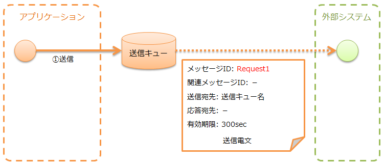
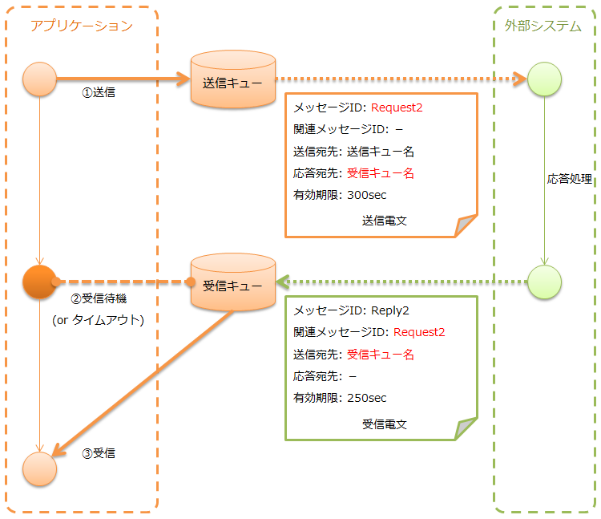
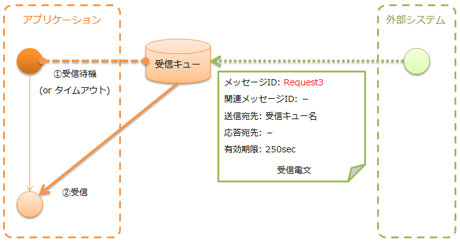
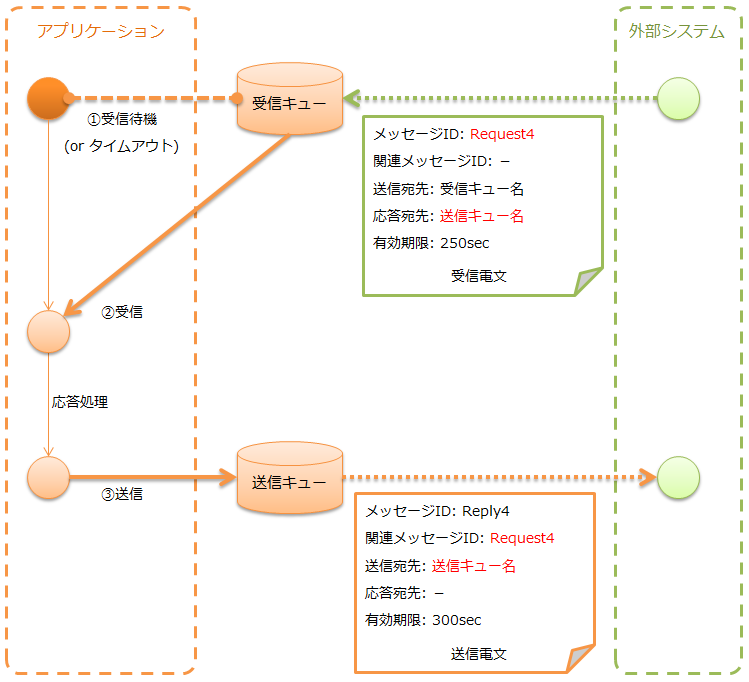

.. _mom_system_messaging:

MOM消息传递
==================================================

.. contents:: 目录
  :depth: 3
  :local:

提供使用MOM进行消息收发的功能。
另请注意，本文档中将MOM消息传递使用的消息队列称为MQ。

MOM消息传递以 :ref:`mom_system_messaging-data_model` 中所示的数据模型为前提。
此外，消息的格式使用 :ref:`data_format` 。

.. important::
 在 :ref:`mom_system_messaging-data_model` 中，
 :ref:`框架控制头<mom_system_messaging-fw_header>` 是
 Nablarch独自规定的项目，假设包含在 :ref:`消息体<mom_system_messaging-message_body>` 中。

 如果项目侧可以设计电文格式则没有问题，
 但如果外部系统已经规定了电文格式，
 则此假设可能不适用。

 在这种情况下，请参考 :ref:`mom_system_messaging-change_fw_header` ，
 在项目侧添加实现来应对。

MOM消息传递根据收发类型不同，所假设的执行控制基盘也不同。

.. list-table::
   :header-rows: 1
   :class: white-space-normal
   :widths: 50, 50

   * - 收发类型
     - 执行控制基盘
   * - :ref:`无需响应消息发送<mom_system_messaging-async_message_send>`
     - :ref:`nablarch_batch`
   * - :ref:`同步响应消息发送<mom_system_messaging-sync_message_send>`
     - 不依赖于执行控制基盘
   * - :ref:`无需响应消息接收<mom_system_messaging-async_message_receive>`
     - :ref:`mom_messaging`
   * - :ref:`同步响应消息接收<mom_system_messaging-sync_message_receive>`
     - :ref:`mom_messaging`

功能概述
--------------------------

支持多种MOM
~~~~~~~~~~~~~~~~~~~~~~~~~~~~~~~~~~~~~~~~~~~~~~~~~~~~~~~~~~~~~~~~~~~~
为了支持多种MOM，MOM消息传递提供了
:java:extdoc:`MessagingProvider<nablarch.fw.messaging.MessagingProvider>` 接口。
依赖于MOM的MQ连接和消息收发由实现该接口的类执行。
因此，通过创建实现 :java:extdoc:`MessagingProvider<nablarch.fw.messaging.MessagingProvider>` 接口的类，
本功能可以在各种MOM中使用。

MOM消息传递支持Jakarta Messaging，并提供了
:java:extdoc:`JmsMessagingProvider<nablarch.fw.messaging.provider.JmsMessagingProvider>` 。
详情请参考链接的Javadoc。

此外，还支持作为MOM使用实绩较多的IBM MQ。
详情请参考 :ref:`webspheremq_adaptor` 。

模块列表
--------------------------------------------------
.. code-block:: xml

  <dependency>
    <groupId>com.nablarch.framework</groupId>
    <artifactId>nablarch-fw-messaging</artifactId>
  </dependency>
  <dependency>
    <groupId>com.nablarch.framework</groupId>
    <artifactId>nablarch-fw-messaging-mom</artifactId>
  </dependency>

使用方法
---------------------------

.. _mom_system_messaging-settings:

使用MOM消息传递的设置
~~~~~~~~~~~~~~~~~~~~~~~~~~~~~~~~~~~~~~~~~~~~~~~~~~
在MOM消息传递中，需要在组件定义中添加以下类。

* :java:extdoc:`MessagingProvider<nablarch.fw.messaging.MessagingProvider>` 的实现类 (MQ连接、对MQ的收发)
* :ref:`messaging_context_handler` (MQ连接的管理)

下面显示设置示例。

.. code-block:: xml

 <!-- MessagingProvider的实现类 -->
 <component name="messagingProvider"
            class="nablarch.fw.messaging.provider.JmsMessagingProvider">
   <!-- 设置项目请参考Javadoc -->
 </component>

 <!-- 消息传递上下文管理处理器 -->
 <component name="messagingContextHandler"
            class="nablarch.fw.messaging.handler.MessagingContextHandler">
   <property name="messagingProvider" ref="messagingProvider" />
 </component>

此外，对于消息接收，需要数据读取器的设置。
需要在组件定义中添加以下类。

* :java:extdoc:`MessageReader<nablarch.fw.messaging.reader.MessageReader>` (从MQ读取电文)
* :java:extdoc:`FwHeaderReader<nablarch.fw.messaging.reader.FwHeaderReader>` (从电文读取框架控制头)

下面显示设置示例。

要点
  * 数据读取器的组件名称请指定 ``dataReader`` 。
  * :java:extdoc:`MessageReader<nablarch.fw.messaging.reader.MessageReader>` 在
    :java:extdoc:`messageReader<nablarch.fw.messaging.reader.FwHeaderReader.setMessageReader(nablarch.fw.DataReader)>`
    属性中指定
    :java:extdoc:`FwHeaderReader<nablarch.fw.messaging.reader.FwHeaderReader>` 。

.. code-block:: xml

 <!-- FwHeaderReader -->
 <component name="dataReader"
            class="nablarch.fw.messaging.reader.FwHeaderReader">
   <!-- MessageReader -->
   <property name="messageReader">
     <component class = "nablarch.fw.messaging.reader.MessageReader">
       <!-- 设置项目请参考Javadoc -->
     </component>
   </property>
 </component>

.. _mom_system_messaging-async_message_send:

无需响应地发送消息(无需响应消息发送)
~~~~~~~~~~~~~~~~~~~~~~~~~~~~~~~~~~~~~~~~~~~~~~~~~~~~~~~~~~~~~~
向外部系统发送消息。

:ref:`共同协议头<mom_system_messaging-common_protocol_header>` 内容
 基本上只需要设置发送目的地头。

  :消息ID: 无需设置(发送后分配)
  :关联消息ID: 无需设置
  :发送目的地: 发送目的地的逻辑名称
  :响应目的地: 无需设置
  :有效期限: 任意

无需响应消息发送中，作为从保存发送电文数据的表(称为临时表)获取发送目标数据，
创建电文及发送的共通动作，提供了
:java:extdoc:`AsyncMessageSendAction<nablarch.fw.messaging.action.AsyncMessageSendAction>` 。
:java:extdoc:`AsyncMessageSendAction<nablarch.fw.messaging.action.AsyncMessageSendAction>` 是
在 :ref:`nablarch_batch` 中运行的动作类。

.. tip::
 向临时表注册发送电文，预计在 :ref:`web_application` 或 :ref:`batch_application` 中
 使用 :ref:`database_management` 进行。

通过使用 :java:extdoc:`AsyncMessageSendAction<nablarch.fw.messaging.action.AsyncMessageSendAction>` ，
只需创建以下成果物，
就可以非常简单地实现电文发送处理。

* 保存发送电文数据的临时表
* 表示电文布局的格式定义文件
* SQL文件(定义3种SQL语句)

 * 获取状态为未发送的数据的SELECT语句
 * 电文发送成功时，将相应数据状态更新为处理完毕的UPDATE语句
 * 电文发送失败时，将相应数据状态更新为发送失败的UPDATE语句

* 状态更新用的表单类

.. tip::
 表单类所需的属性只需对应状态更新所需的表项目即可。
 由此，通过将临时表的表布局定义为项目共通，
 可以在所有无需响应消息发送处理中使用单一的表单类。

基于 :ref:`示例应用程序<example_application-mom_system_messaging>` ，
下面显示发送项目信息时的实现示例。

实现示例
 \

 保存发送电文数据的临时表
  要点
   * 主键应为存储用于唯一识别电文的ID的列。
   * 在表的属性信息中定义与要发送的电文各项目对应的列。
   * 根据各项目的方式定义共通项目(更新用户ID、更新日期时间等)。

  INS_PROJECT_SEND_MESSAGE
   ====================== ======================
   发送电文序号(PK)       SEND_MESSAGE_SEQUENCE
   项目名称               PROJECT_NAME
   项目类型               PROJECT_TYPE
   项目分类               PROJECT_CLASS
       ：(省略)
   状态                   STATUS
   更新用户ID             UPDATED_USER_ID
   更新日期时间           UPDATED_DATE
   ====================== ======================

 格式定义文件
  要点
   * 文件名应为 ``<发送电文的请求ID>_SEND.fmt`` 。

  ProjectInsertMessage_SEND.fmt
   .. code-block:: bash

    file-type:        "Fixed" # 固定长度
    text-encoding:    "MS932" # 字符串型字段的字符编码
    record-length:    2120    # 各记录的长度

    [userData]
    项目定义省略

 SQL文件
  要点
   * 文件名应为 ``<发送电文的请求ID>.sql`` 。
   * SQL_ID如下：

    * ``SELECT_SEND_DATA``: 获取状态为未发送的数据的SELECT语句
    * ``UPDATE_NORMAL_END``: 将状态更新为处理完毕的UPDATE语句
    * ``UPDATE_ABNORMAL_END``: 将状态更新为发送失败的UPDATE语句

  ProjectInsertMessage.sql
   .. code-block:: bash

    SELECT_SEND_DATA =
    SELECT
        省略
    FROM
        INS_PROJECT_SEND_MESSAGE
    WHERE
        STATUS = '0'
    ORDER BY
        SEND_MESSAGE_SEQUENCE

    UPDATE_NORMAL_END =
    UPDATE
        INS_PROJECT_SEND_MESSAGE
    SET
        STATUS = '1',
        UPDATED_USER_ID = :updatedUserId,
        UPDATED_DATE = :updatedDate
    WHERE
        SEND_MESSAGE_SEQUENCE = :sendMessageSequence

    UPDATE_ABNORMAL_END =
    UPDATE
        INS_PROJECT_SEND_MESSAGE
    SET
        STATUS = '9',
        UPDATED_USER_ID = :updatedUserId,
        UPDATED_DATE = :updatedDate
    WHERE
        SEND_MESSAGE_SEQUENCE = :sendMessageSequence

 状态更新用的表单类
  要点
   * 由于该表单类是状态更新专用的类，
     因此不需要将临时表的属性全部作为属性保持。

  SendMessagingForm.java
   .. code-block:: java

    public class SendMessagingForm {

        /** 发送电文序号 */
        private String sendMessageSequence;

        /** 更新用户ID */
        @UserId
        private String updatedUserId;

        /** 更新日期时间 */
        @CurrentDateTime
        private java.sql.Timestamp updatedDate;

        // 构造函数和访问器省略
    }

 AsyncMessageSendAction的设置
  要点
   * 使用 :java:extdoc:`AsyncMessageSendAction<nablarch.fw.messaging.action.AsyncMessageSendAction>`
     时，需要发送目标队列名、格式定义文件存储目录等设置。
     设置通过将
     :java:extdoc:`AsyncMessageSendActionSettings<nablarch.fw.messaging.action.AsyncMessageSendActionSettings>`
     添加到组件定义来进行。
     关于设置项目，请参考链接的Javadoc。

  messaging-async-send-component-configuration.xml
   .. code-block:: xml

    <component name="asyncMessageSendActionSettings"
               class="nablarch.fw.messaging.action.AsyncMessageSendActionSettings">
      <property name="formatDir" value="format" />
      <property name="headerFormatName" value="header" />
      <property name="queueName" value="TEST.REQUEST" />
      <property name="sqlFilePackage" value="com.nablarch.example.sql" />
      <property name="formClassName"
                value="com.nablarch.example.form.SendMessagingForm" />
      <property name="headerItemList">
        <list>
          <value>sendMessageSequence</value>
        </list>
      </property>
    </component>

 AsyncMessageSendAction的应用
  要点
   * 要在 :ref:`nablarch_batch` 中运行
     :java:extdoc:`AsyncMessageSendAction<nablarch.fw.messaging.action.AsyncMessageSendAction>` ，
     需要在 :ref:`request_path_java_package_mapping` 的组件定义中
     指定 :java:extdoc:`AsyncMessageSendAction<nablarch.fw.messaging.action.AsyncMessageSendAction>` 。

  messaging-async-send-component-configuration.xml
   .. code-block:: xml

    <component class="nablarch.fw.handler.RequestPathJavaPackageMapping">
      <property name="basePackage"
                value="com.nablarch.example.action.ExampleAsyncMessageSendAction" />
      <property name="immediate" value="false" />
    </component>

.. _mom_system_messaging-sync_message_send:

同步响应地发送消息(同步响应消息发送)
~~~~~~~~~~~~~~~~~~~~~~~~~~~~~~~~~~~~~~~~~~~~~~~~~~~~~~~~~~~~~~
向外部系统发送消息，并等待其响应。阻塞直到接收到响应消息或等待超时时间经过。

与 :ref:`mom_system_messaging-async_message_send` 不同，由于会接收响应电文，
可以在一定程度上保证通信目标正确执行了处理。
但是，如果由于某种问题在规定时间内无法接收到响应而超时，则需要进行某种错误处理(例如，电文重试或故障通知等)。

:ref:`共同协议头<mom_system_messaging-common_protocol_header>` 内容
 除了发送目的地头外，还需要设置作为响应时发送目的地的响应目的地头。

  :消息ID: 无需设置(发送后分配)
  :关联消息ID: 无需设置
  :发送目的地: 发送目的地的逻辑名称
  :响应目的地: 响应目的地的逻辑名称
  :有效期限: 任意

外部系统创建的响应电文的 :ref:`共同协议头<mom_system_messaging-common_protocol_header>` 内容
 发送处理完成后，应用程序会等待在响应目的地上接收到具有与发送电文的消息ID相同的关联消息ID的电文。
 因此，外部系统需要在响应电文中设置关联消息ID。

  :消息ID: 无需设置(发送后分配)
  :关联消息ID: 发送电文的消息ID头的值
  :发送目的地: 发送电文的响应目的地头的值
  :响应目的地: 无需设置
  :有效期限: 任意

同步响应消息发送中，作为包装定型处理的工具类，
提供了 :java:extdoc:`MessageSender<nablarch.fw.messaging.MessageSender>` 。
通过使用
:java:extdoc:`MessageSender<nablarch.fw.messaging.MessageSender>` ，
只需创建以下成果物，
就可以方便地创建同步响应消息的发送处理。

* 收发使用的格式定义文件
* 使用 :java:extdoc:`MessageSender<nablarch.fw.messaging.MessageSender>` 的收发处理

基于 :ref:`示例应用程序<example_application-mom_system_messaging>` ，
下面显示从表中存储的发送数据，
在批处理动作中发送项目信息时的实现示例。
从表中读取数据的部分与消息发送无关，故省略实现示例。

实现示例
 \

 收发使用的格式定义文件
  要点
   * 文件名如下：

    * 发送用： ``<电文的请求ID>_SEND.fmt``
    * 接收用： ``<电文的请求ID>_RECEIVE.fmt``

   * 记录类型名固定为 ``data`` 。

  ProjectInsertMessage_SEND.fmt
   .. code-block:: bash

    file-type:        "Fixed" # 固定长度
    text-encoding:    "MS932" # 字符串型字段的字符编码
    record-length:    2120    # 各记录的长度
    record-separator: "\r\n"  # 换行代码

    [data]
    项目定义省略

  ProjectInsertMessage_RECEIVE.fmt
   .. code-block:: bash

    file-type:        "Fixed" # 固定长度
    text-encoding:    "MS932" # 字符串型字段的字符编码
    record-length:    130     # 各记录的长度
    record-separator: "\r\n"  # 换行代码

    [data]
    项目定义省略

 使用MessageSender的收发处理
  要点
   * 请求电文使用 :java:extdoc:`SyncMessage<nablarch.fw.messaging.SyncMessage>` 创建。
   * 消息发送使用
     :java:extdoc:`MessageSender#sendSync<nablarch.fw.messaging.MessageSender.sendSync(nablarch.fw.messaging.SyncMessage)>`
     。
     使用方法请参考链接的Javadoc。

  SendProjectInsertMessageAction.java
   .. code-block:: java

        public Result handle(SqlRow inputData, ExecutionContext ctx) {

            // 使用输入数据的业务处理省略

            SyncMessage responseMessage = null;
            try {
                responseMessage = MessageSender.sendSync(
                    new SyncMessage("ProjectInsertMessage").addDataRecord(inputData));
            } catch (MessagingException e) {
                // 发送错误
                throw new TransactionAbnormalEnd(100, e, "error.sendServer.fail");
            }

            Map<String, Object> responseDataRecord = responseMessage.getDataRecord();

            // 使用响应数据的业务处理省略

            return new Success();
        }

 MessageSender的设置
  要点
     * 使用 :java:extdoc:`MessageSender<nablarch.fw.messaging.MessageSender>` 时，
       需要收发目标的队列名、格式定义文件存储目录等设置。
       设置通过 :ref:`repository-environment_configuration` 进行。
       关于设置项目，请参考
       :java:extdoc:`MessageSenderSettings<nablarch.fw.messaging.MessageSenderSettings.<init>(java.lang.String)>`
       。
     * 要更改收发信电文的转换处理时，可以通过在组件配置文件中定义继承 :java:extdoc:`SyncMessageConvertor<nablarch.fw.messaging.SyncMessageConvertor>`
       的类，并将组件名称指定为 ``messageSender.DEFAULT.messageConvertorName`` 来更改。
       详情请参考 :ref:`更改框架控制头的读写（同步响应消息发送的情况）<mom_system_messaging-change_fw_header_sync_ex>` 。

  messaging.properties
   .. code-block:: properties

    messageSender.DEFAULT.messagingProviderName=defaultMessagingProvider
    messageSender.DEFAULT.destination=TEST.REQUEST
    messageSender.DEFAULT.replyTo=TEST.RESPONSE
    messageSender.DEFAULT.retryCount=10
    messageSender.DEFAULT.formatDir=format
    messageSender.DEFAULT.headerFormatName=HEADER

  组件配置文件
   .. code-block:: xml

    <!-- 加载MessageSender设置 -->
    <config-file file="messaging/messaging.properties"/>

.. _mom_system_messaging-async_message_receive:

无需响应地接收消息(无需响应消息接收)
~~~~~~~~~~~~~~~~~~~~~~~~~~~~~~~~~~~~~~~~~~~~~~~~~~~~~~~~~~~~~~
接收发送到特定目的地的消息。阻塞直到接收到消息或等待超时时间经过。

外部系统创建的接收电文的 :ref:`共同协议头<mom_system_messaging-common_protocol_header>` 内容
  :消息ID: 无需设置(发送后分配)
  :关联消息ID: 无需设置
  :发送目的地: 目的地的逻辑名称
  :响应目的地: 无需设置
  :有效期限: 任意

无需响应消息接收中，作为将接收的电文保存到临时表(电文接收表)的共通动作，
提供了 :java:extdoc:`AsyncMessageReceiveAction<nablarch.fw.messaging.action.AsyncMessageReceiveAction>` 。
:java:extdoc:`AsyncMessageReceiveAction<nablarch.fw.messaging.action.AsyncMessageReceiveAction>`
是在 :ref:`mom_messaging` 中运行的动作类。

.. tip::
 保存在临时表中的数据，预计使用 :ref:`batch_application` 
 导入系统的本表中。

通过使用
:java:extdoc:`AsyncMessageReceiveAction<nablarch.fw.messaging.action.AsyncMessageReceiveAction>` ，
只需创建以下成果物，就可以非常简单地将电文保存到表中。

* 用于注册电文的临时表
* 表示电文布局的格式定义文件
* 用于注册电文的INSERT语句(SQL文件)
* 注册电文时使用的表单类

基于 :ref:`示例应用程序<example_application-mom_system_messaging>` ，
下面显示接收项目信息时的实现示例。

实现示例
 \

 用于注册电文的临时表
  要点
   * 接收的电文按电文类型保存在专用的临时表中。
   * 主键应为存储用于唯一识别电文的ID的列。
     该列中存储的值由框架使用 :ref:`generator` 进行编号。
   * 在表的属性信息中定义与接收电文各项目对应的列。
   * 根据各项目的方式定义共通项目(注册用户ID、注册日期时间等)。

  INS_PROJECT_RECEIVE_MESSAGE
   ====================== ======================
   接收消息序号(PK)       RECEIVED_MESSAGE_SEQUENCE
   项目名称               PROJECT_NAME
   项目类型               PROJECT_TYPE
   项目分类               PROJECT_CLASS
       ：(省略)
   状态                   STATUS
   注册用户ID             INSERT_USER_ID
   注册日期时间           INSERT_DATE
   ====================== ======================

 格式定义文件
  要点
   * 文件名应为 ``<接收电文的请求ID>_RECEIVE.fmt`` 。

  ProjectInsertMessage_RECEIVE.fmt
   .. code-block:: bash

    file-type:        "Fixed" # 固定长度
    text-encoding:    "MS932" # 字符串型字段的字符编码
    record-length:    2120    # 各记录的长度

    [userData]
    项目定义省略

 SQL文件
  要点
   * 文件名应为 ``<接收电文的请求ID>.sql`` 。
   * SQL_ID应为 ``INSERT_MESSAGE`` 。

  ProjectInsertMessage.sql
   .. code-block:: bash

    INSERT_MESSAGE =
    INSERT INTO INS_PROJECT_RECEIVE_MESSAGE (
        RECEIVED_MESSAGE_SEQUENCE,
        PROJECT_NAME,
        PROJECT_TYPE,
        PROJECT_CLASS,
        以下省略

 注册电文时使用的表单类
  要点
   * 类名应为 ``<接收电文的请求ID>Form`` 。
   * 定义具有 :java:extdoc:`String<java.lang.String>` 、:java:extdoc:`RequestMessage<nablarch.fw.messaging.RequestMessage>`
     两个参数的构造函数。各参数的含义如下：

     * :java:extdoc:`String<java.lang.String>` -> 接收电文序号
     * :java:extdoc:`RequestMessage<nablarch.fw.messaging.RequestMessage>` -> 接收电文

  ProjectInsertMessageForm.java
   .. code-block:: java

    public class ProjectInsertMessageForm {

        /** 接收电文序号 */
        private String receivedMessageSequence;

        /** 项目名称 */
        private String projectName;

        // 其他字段省略

        public ProjectInsertMessageForm(
                String receivedMessageSequence, RequestMessage message) {
            this.receivedMessageSequence = receivedMessageSequence;

            DataRecord data = message.getRecordOf("userData");

            projectName = data.getString("projectName");

            // 后续处理省略
        }

        // 访问器省略
    }

 AsyncMessageReceiveAction的设置
  要点
   * 使用 :java:extdoc:`AsyncMessageReceiveAction<nablarch.fw.messaging.action.AsyncMessageReceiveAction>`
     时，需要格式定义文件和SQL文件的存放位置等设置。
     设置通过将
     :java:extdoc:`AsyncMessageReceiveActionSettings<nablarch.fw.messaging.action.AsyncMessageReceiveActionSettings>`
     添加到组件定义来进行。
     关于设置项目，请参考链接的Javadoc。

  messaging-async-receive-component-configuration.xml
   .. code-block:: xml

    <component name="asyncMessageReceiveActionSettings"
               class="nablarch.fw.messaging.action.AsyncMessageReceiveActionSettings">
      <property name="formClassPackage" value="com.nablarch.example.form" />
      <property name="receivedSequenceFormatter">
        <component class="nablarch.common.idgenerator.formatter.LpadFormatter">
          <property name="length" value="10" />
          <property name="paddingChar" value="0" />
        </component>
      </property>
      <property name="receivedSequenceGenerator" ref="idGenerator" />
      <property name="targetGenerateId" value="9991" />
      <property name="sqlFilePackage" value="com.nablarch.example.sql" />
    </component>

 AsyncMessageReceiveAction的应用
  要点
   * 要在 :ref:`mom_messaging` 中运行
     :java:extdoc:`AsyncMessageReceiveAction<nablarch.fw.messaging.action.AsyncMessageReceiveAction>` ，
     需要在 :ref:`request_path_java_package_mapping` 的组件定义中
     指定 :java:extdoc:`AsyncMessageReceiveAction<nablarch.fw.messaging.action.AsyncMessageReceiveAction>` 。

  messaging-async-receive-component-configuration.xml
   .. code-block:: xml

    <component class="nablarch.fw.handler.RequestPathJavaPackageMapping">
      <property name="basePackage"
                value="nablarch.fw.messaging.action.AsyncMessageReceiveAction" />
      <property name="immediate" value="false" />
    </component>

.. _mom_system_messaging-sync_message_receive:

同步响应地接收消息(同步响应消息接收)
~~~~~~~~~~~~~~~~~~~~~~~~~~~~~~~~~~~~~~~~~~~~~~~~~~~~~~~~~~~~~~
从通信目标接收发送到特定目的地的消息，并向设置在那里的响应目的地发送响应电文。
此时，将接收电文的消息ID头的值设置到响应电文的关联消息ID头中。

:ref:`共同协议头<mom_system_messaging-common_protocol_header>` 内容

  :消息ID: 无需设置(发送后分配)
  :关联消息ID: 接收电文的消息ID头的值
  :发送目的地: 接收电文的响应目的地头的值
  :响应目的地: 无需设置
  :有效期限: 任意

同步响应消息接收中，作为执行定型处理的模板类，
提供了 :java:extdoc:`MessagingAction<nablarch.fw.messaging.action.MessagingAction>` 。
:java:extdoc:`MessagingAction<nablarch.fw.messaging.action.MessagingAction>` 是
在 :ref:`mom_messaging` 中运行的动作类。

通过使用
:java:extdoc:`MessagingAction<nablarch.fw.messaging.action.MessagingAction>` ，
只需创建以下成果物即可。

* 表示电文布局的格式定义文件
* 电文接收时和发生错误时的处理(动作类)

基于 :ref:`示例应用程序<example_application-mom_system_messaging>` ，
下面显示接收项目信息时的实现示例。

实现示例
 \

 格式定义文件
  要点
   * 文件名如下：

    * 接收用： ``<电文的请求ID>_RECEIVE.fmt``
    * 发送用： ``<电文的请求ID>_SEND.fmt``

  ProjectInsertMessage_RECEIVE.fmt
   .. code-block:: bash

    file-type:        "Fixed" # 固定长度
    text-encoding:    "MS932" # 字符串型字段的字符编码
    record-length:    2120    # 各记录的长度
    record-separator: "\r\n"  # 换行代码

    [data]
    项目定义省略

  ProjectInsertMessage_SEND.fmt
   .. code-block:: bash

    file-type:        "Fixed" # 固定长度
    text-encoding:    "MS932" # 字符串型字段的字符编码
    record-length:    130     # 各记录的长度
    record-separator: "\r\n"  # 换行代码

    [data]
    项目定义省略

 电文接收时和发生错误时的处理(动作类)
  要点
   * 继承 :java:extdoc:`MessagingAction<nablarch.fw.messaging.action.MessagingAction>` 并
     覆盖以下方法：

      * :java:extdoc:`MessagingAction#onReceive<nablarch.fw.messaging.action.MessagingAction.onReceive(nablarch.fw.messaging.RequestMessage,nablarch.fw.ExecutionContext)>`
      * :java:extdoc:`MessagingAction#onError<nablarch.fw.messaging.action.MessagingAction.onError(java.lang.Throwable,nablarch.fw.messaging.RequestMessage,nablarch.fw.ExecutionContext)>`

   * 响应电文使用 :java:extdoc:`RequestMessage#reply<nablarch.fw.messaging.RequestMessage.reply()>` 创建。
   * 为了保存请求电文和响应电文的内容，分别创建对应的表单类。

  ProjectInsertMessageAction.java
   .. code-block:: java

    public class ProjectInsertMessageAction extends MessagingAction {

        @Override
        protected ResponseMessage onReceive(
                RequestMessage request, ExecutionContext context) {
             ProjectInsertMessageForm projectInsertMessageForm
                = BeanUtil.createAndCopy(
                    ProjectInsertMessageForm.class, request.getParamMap());

            // 执行验证处理。错误检测时抛出ApplicationException。
            ValidatorUtil.validate(projectInsertMessageForm);

            ProjectTemp projectTemp
                = BeanUtil.createAndCopy(
                    ProjectTemp.class, projectInsertMessageForm);

            // 数据设置省略

            UniversalDao.insert(projectTemp);

            // 响应数据返回
            ProjectInsertMessageResponseForm resForm = new ProjectInsertMessageResponseForm("success", "");
            return request.reply().addRecord(resForm);
        }

        @Override
        protected ResponseMessage onError(
                Throwable e, RequestMessage request, ExecutionContext context) {
                
            if (e instanceof InvalidDataFormatException) {
                //请求电文数据记录部布局不正确
                resForm = new ProjectInsertMessageResponseForm("fatal", "invalid layout.");
            } else if (e instanceof ApplicationException) {
                //请求电文数据记录部项目验证错误
                resForm = new ProjectInsertMessageResponseForm("error.validation", "");
            } else {
                resForm = new ProjectInsertMessageResponseForm("fatal", "unexpected exception.");
            }
            return request.reply().addRecord(resForm);
        }
    }

扩展示例
--------------------------------------------------

.. _mom_system_messaging-change_fw_header:

更改框架控制头的读写
~~~~~~~~~~~~~~~~~~~~~~~~~~~~~~~~~~~~~~~~~~~~~~~~~~
当外部系统已经规定了电文格式等情况时，
可能希望更改框架控制头的读写。
此时，通过在项目侧添加实现来应对。
下面显示按收发类型的应对方法。

无需响应消息发送的情况
 框架控制头的写入由以下方法执行，
 因此只需覆盖以下方法即可应对。

 * :java:extdoc:`AsyncMessageSendAction#createHeaderRecordFormatter<nablarch.fw.messaging.action.AsyncMessageSendAction.createHeaderRecordFormatter()>`
 * :java:extdoc:`AsyncMessageSendAction#createHeaderRecord<nablarch.fw.messaging.action.AsyncMessageSendAction.createHeaderRecord(nablarch.core.db.statement.SqlRow)>`

.. _mom_system_messaging-change_fw_header_sync_ex:

同步响应消息发送的情况
 :java:extdoc:`MessageSender<nablarch.fw.messaging.MessageSender>` 中，为了可以更改收发信电文的转换处理，
 将转换处理委托给 :java:extdoc:`SyncMessageConvertor<nablarch.fw.messaging.SyncMessageConvertor>` ，
 该类读写框架控制头。

 因此，创建继承 :java:extdoc:`SyncMessageConvertor<nablarch.fw.messaging.SyncMessageConvertor>` 的类，
 并在 :java:extdoc:`MessageSender<nablarch.fw.messaging.MessageSender>` 的设置中指定即可。
 关于 :java:extdoc:`MessageSender<nablarch.fw.messaging.MessageSender>` 的设置，请参考
 :java:extdoc:`MessageSenderSettings<nablarch.fw.messaging.MessageSenderSettings>` 。

.. _mom_system_messaging-change_fw_header_async_receive:

无需响应消息接收的情况
 框架控制头的读取由实现了设置在
 :java:extdoc:`FwHeaderReader<nablarch.fw.messaging.reader.FwHeaderReader>` 中的
 :java:extdoc:`FwHeaderDefinition<nablarch.fw.messaging.FwHeaderDefinition>` 接口的类执行。
 默认情况下，使用 :java:extdoc:`StandardFwHeaderDefinition<nablarch.fw.messaging.StandardFwHeaderDefinition>` 。

 因此，参考 :java:extdoc:`StandardFwHeaderDefinition<nablarch.fw.messaging.StandardFwHeaderDefinition>` ，
 在项目侧创建实现 :java:extdoc:`FwHeaderDefinition<nablarch.fw.messaging.FwHeaderDefinition>` 接口的类，
 并在组件定义中指定到
 :java:extdoc:`FwHeaderReader#fwHeaderDefinition<nablarch.fw.messaging.reader.FwHeaderReader.setFwHeaderDefinition(nablarch.fw.messaging.FwHeaderDefinition)>`
 属性即可。

同步响应消息接收的情况
 框架控制头的读取与 :ref:`无需响应消息接收的情况<mom_system_messaging-change_fw_header_async_receive>` 相同。

 关于框架控制头的写入，虽然同样是创建实现
 :java:extdoc:`FwHeaderDefinition<nablarch.fw.messaging.FwHeaderDefinition>` 接口的类，
 但在组件定义中将创建的类指定到 :ref:`message_reply_handler` 的
 :java:extdoc:`fwHeaderDefinition<nablarch.fw.messaging.handler.MessageReplyHandler.setFwHeaderDefinition(nablarch.fw.messaging.FwHeaderDefinition)>`
 属性中即可。

.. _mom_system_messaging-data_model:

收发信电文的数据模型
--------------------------------------------------
MOM消息传递使用以下数据模型表示收发信电文的内容。

.. _mom_system_messaging-protocol_header:

协议头
 主要存储MOM进行消息收发处理时使用信息的头区域。
 协议头可以通过Map接口访问。

.. _mom_system_messaging-common_protocol_header:

共同协议头
 在协议头中，对于框架使用的以下头，可以使用特定的键名访问。
 键名用括号表示。

 消息ID(MessageId)
  MOM为每个电文分配的字符串

  :发送时: MOM分配的值
  :接收时: 发送侧MOM分配的值

 关联消息ID(CorrelationId)
  与该电文相关联的电文的消息ID

  :响应电文: 请求电文的消息ID
  :再送请求: 要求响应再送的请求电文的消息ID

 发送目的地(Destination)
  表示电文发送目的地的逻辑名称

  :发送时: 发送队列的逻辑名称
  :接收时: 接收队列的逻辑名称

 响应目的地(ReplyTo)
  表示对该电文发送响应时使用的目的地的逻辑名称

  :发送时: 同步响应时为响应接收队列的逻辑名称。
           无需响应时无需设置
  :接收时: 同步响应时为响应目的地队列的逻辑名称。
           无需响应时通常不设置

 有效期限(TimeToLive)
  以发送处理开始时刻为起点的电文有效期限(毫秒)

  :发送时: 发送电文的有效期限
  :接收时: 不设置

 .. tip::
  共同协议头以外的头可以由各消息传递提供程序任意定义。
  这样的头称为 **个别协议头** 。
  例如，在JMS消息传递提供程序的情况下，所有的JMS头、JMS扩展头和任意属性都作为个别协议头处理。

.. _mom_system_messaging-message_body:

消息体
 协议头以外的电文数据区域称为消息体。
 依赖于MOM的 :java:extdoc:`MessagingProvider<nablarch.fw.messaging.MessagingProvider>`
 原则上仅使用协议头区域。
 其他数据区域应作为未解析的原始二进制数据处理。

 消息体的解析由 :ref:`data_format` 执行。
 由此，可以以字段名为键的Map形式读写电文内容。

.. _mom_system_messaging-fw_header:

框架控制头
 本框架提供的许多功能都是基于电文中定义了特定控制项目的前提设计的。
 这样的控制项目称为 ``框架控制头`` 。

 框架控制头与其使用处理器的对应关系如下。

 请求ID
  用于识别接收该电文的应用程序应执行的业务处理的ID。

  使用该头的主要处理器：

  | :ref:`request_path_java_package_mapping`
  | :ref:`message_resend_handler`
  | :ref:`permission_check_handler`
  | :ref:`ServiceAvailabilityCheckHandler`

 用户ID
  表示该电文执行权限的字符串

  使用该头的主要处理器：

  | :ref:`permission_check_handler`

 再送请求标志
  发送再送请求电文时设置的标志

  使用该头的主要处理器：

  | :ref:`message_resend_handler`

 状态码
  表示对请求电文处理结果的代码值

  使用该头的主要处理器：

  | :ref:`message_reply_handler`

 框架控制头在默认设置下，
 需要在消息体的第一个数据记录中分别用以下字段名定义。

  :请求ID: requestId
  :用户ID: userId
  :再送请求标志: resendFlag
  :状态码: statusCode

 以下是标准框架控制头的定义示例。

 .. code-block:: bash

  #===================================================================
  # 框架控制头部 (50字节)
  #===================================================================
  [NablarchHeader]
  1   requestId   X(10)       # 请求ID
  11  userId      X(10)       # 用户ID
  21  resendFlag  X(1)  "0"   # 再送请求标志 (0: 初次发送 1: 再送请求)
  22  statusCode  X(4)  "200" # 状态码
  26 ?filler      X(25)       # 预留区域
  #====================================================================

 如果在格式定义中包含框架控制头以外的项目，
 可以作为框架控制头的任意头项目访问，
 可用于为每个项目简单扩展框架控制头的目的。

 此外，为了应对将来任意项目的添加以及框架功能添加伴随的头添加，
 强烈建议设置预留区域。
