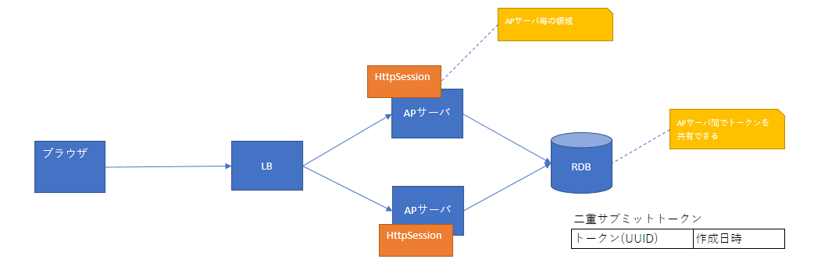

.. _`tag`:

Jakarta Server Pages自定义标签
==================================================

.. contents:: 目录
  :depth: 3
  :local:

.. toctree::
  :maxdepth: 1
  :hidden:

  tag/tag_reference

.. tip::
  本功能在Nablarch5之前的版本中名为"JSP自定义标签"。
  但是，随着Java EE移管至Eclipse Foundation并更改了规范名称，现更名为"Jakarta Server Pages自定义标签"。

  更改的仅是名称，功能上没有差异。

  关于Nablarch6中其他更名功能的详细信息，请参阅 :ref:`renamed_features_in_nablarch_6`。

本功能提供用于支持Web应用程序画面创建的自定义标签。

自定义标签有以下限制。

* 在支持Jakarta Server Pages 3.1或更高版本的Web容器中运行。
* 条件分支和循环等控制使用Jakarta Standard Tag Library。
* 支持对应XHTML 1.0 Transitional的属性。
* 客户端JavaScript是必需的。(请参阅 :ref:`tag-onclick_override`)
* 在GET请求中无法使用部分自定义标签。(请参阅 :ref:`tag-using_get`)

.. important::
 HTML5中添加的属性可以通过 :ref:`动态属性 <dynamic_attribute>` 来描述。
 但是，对于以下可能频繁使用的属性，已预先定义为自定义标签的属性。
 此外，对于HTML5中添加的input元素，分别基于 :ref:`tag-text_tag` 添加了以下标签。
 各input元素固有的属性未在自定义标签中单独定义，因此需要通过动态属性指定。

 * 添加的属性（括号内记载添加了属性的HTML标签名。）

  * autocomplete(input、password、form)
  * autofocus(input、textarea、select、button)
  * placeholder(text、password、textarea)
  * maxlength(textarea)
  * multiple(input)

 * 添加的input元素

  * :ref:`tag-search_tag` (搜索文本)
  * :ref:`tag-tel_tag` (电话号码)
  * :ref:`tag-url_tag` (URL)
  * :ref:`tag-email_tag` (邮件地址)
  * :ref:`tag-date_tag` (日期)
  * :ref:`tag-month_tag` (月)
  * :ref:`tag-week_tag` (周)
  * :ref:`tag-time_tag` (时间)
  * :ref:`tag-datetimeLocal_tag` (本地日期时间)
  * :ref:`tag-number_tag` (数值)
  * :ref:`tag-range_tag` (范围)
  * :ref:`tag-color_tag` (颜色)

.. important::
 自定义标签针对具有以下简单画面过渡的Web应用程序。
 因此，不支持注重操作性的丰富画面创建或SPA(单页应用程序)。

 * 搜索画面→详情画面的搜索/详细显示
 * 输入画面→确认画面→完成画面的登记/更新/删除
 * 弹出窗口(其他窗口、其他标签)的输入辅助

 如果在项目中大量使用JavaScript，请注意项目创建的JavaScript与自定义标签输出的JavaScript之间不要产生副作用。
 关于自定义标签输出的JavaScript，请参阅 :ref:`tag-onclick_override`。

功能概述
---------------------------------------------------------------------

防止HTML转义遗漏
~~~~~~~~~~~~~~~~~~~~~~~~~~~~~~~~~~~~~~~~~~~~~~~~~~~~~~~~~~~~~~~~~~~~~
在HTML中，"<"">""""等字符具有特殊含义，
如果直接将包含这些字符的值原样输出到JSP中，恶意用户就可以轻易嵌入脚本，
导致被称为跨站脚本(XSS)的漏洞。
因此，输出输入值时需要进行HTML转义。

然而，在JSP中使用EL表达式输出值时，不会进行HTML转义。
因此，输出值时始终需要考虑HTML转义的实现，导致生产效率降低。

自定义标签默认会进行HTML转义，
只要使用自定义标签进行实现，就可以防止HTML转义遗漏。

.. important::
  不提供针对JavaScript的转义处理，
  因此请勿在script标签主体或onclick属性等编写JavaScript的部分中嵌入动态值(输入数据等)。
  如果在编写JavaScript的部分中嵌入动态值(输入数据等)，请由项目负责实施转义处理。

HTML转义的详细信息请参阅以下内容。

* :ref:`tag-html_escape`
* :ref:`tag-html_unescape`

通用化输入画面和确认画面以减少实现
~~~~~~~~~~~~~~~~~~~~~~~~~~~~~~~~~~~~~~~~~~~~~~~~~~~~~~~~~~~~~~~~~~~~~
在许多系统中，输入画面和确认画面的布局相同，
需要创建类似的JSP。

自定义标签提供了通用化输入画面和确认画面的功能，
只需为输入画面创建的JSP添加与确认画面的差异(例如按钮等)，
就可以创建确认画面，有望提高生产效率。

关于输入画面和确认画面的通用化，请参阅以下内容。

* :ref:`tag-make_common`

模块列表
---------------------------------------------------------------------
.. code-block:: xml

  <dependency>
    <groupId>com.nablarch.framework</groupId>
    <artifactId>nablarch-fw-web-tag</artifactId>
  </dependency>

  <!-- 仅在使用hidden加密时需要 -->
  <dependency>
    <groupId>com.nablarch.framework</groupId>
    <artifactId>nablarch-common-encryption</artifactId>
  </dependency>

  <!-- 仅在使用文件下载时需要 -->
  <dependency>
    <groupId>com.nablarch.framework</groupId>
    <artifactId>nablarch-fw-web-extension</artifactId>
  </dependency>

使用方法
---------------------------------------------------------------------

.. tip::
 自定义标签的说明中未说明所有属性，
 关于各自定义标签可指定的属性，请参阅 :ref:`tag_reference`。

.. _`tag-setting`:

自定义标签的设置
~~~~~~~~~~~~~~~~~~~~~~~~~~~~~~~~~~~~~~~~~~~~~~~~~~~~~~~~~~~~~~~~~~~~~
自定义标签的设置通过 :ref:`nablarch_tag_handler` 和
:java:extdoc:`CustomTagConfig<nablarch.common.web.tag.CustomTagConfig>`
进行。

:ref:`nablarch_tag_handler`
 处理使用自定义标签的请求时，执行以下功能所需预处理的处理器。
 使用自定义标签时，必须设置此处理器。

 * :ref:`tag-checkbox_off_value`
 * :ref:`tag-hidden_encryption`
 * :ref:`tag-submit_change_parameter`
 * :ref:`tag-composite_key`

 关于此处理器的设置值，请参阅 :ref:`nablarch_tag_handler`。

:java:extdoc:`CustomTagConfig<nablarch.common.web.tag.CustomTagConfig>`
 设置自定义标签默认值的类。
 选择项目的标签模式等自定义标签属性，与其在每个画面中设置，
 不如在应用程序整体中使用统一的默认值。
 因此，在此类中进行自定义标签默认值的设置。

 默认值的设置是将此类以 ``customTagConfig`` 名称添加到组件定义中。
 关于设置项，请参阅 :java:extdoc:`CustomTagConfig<nablarch.common.web.tag.CustomTagConfig>`。

.. _`tag-specify_taglib`:

使用自定义标签(taglib指令的指定方法)
~~~~~~~~~~~~~~~~~~~~~~~~~~~~~~~~~~~~~~~~~~~~~~~~~~~~~~~~~~~~~~~~~~~~~
由于设想使用自定义标签和JSTL，因此分别指定taglib指令。

.. code-block:: jsp

 <%@ taglib prefix="c" uri="jakarta.tags.core" %>
 <%@ taglib prefix="n" uri="http://tis.co.jp/nablarch" %>

.. _`tag-input_form`:

创建输入表单
~~~~~~~~~~~~~~~~~~~~~~~~~~~~~~~~~~~~~~~~~~~~~~~~~~~~~~~~~~~~~~~~~~~~~
输入表单使用以下自定义标签创建。
以下列举的自定义标签的详细信息，请参阅 :ref:`tag_reference`。

* :ref:`tag-form_tag`
* :ref:`tag-text_tag` 等输入相关的自定义标签
* :ref:`tag-submit_tag`  等执行提交的自定义标签
* :ref:`tag-error_tag` 等显示错误的自定义标签

创建输入表单的要点
 \

 输入值的恢复
  当出现验证错误等需要重新显示输入表单时，自定义标签会从请求参数中恢复输入值。

 初始值的输出
  如果想在输入项中输出初始值，请在Action侧将设置了初始值的对象设置到请求作用域中。
  然后，使自定义标签的name属性与请求作用域上的变量名对应，指定name属性。
  指定方法的详细信息和实现示例，请参阅 :ref:`tag-access_rule`。

 提交目标URI的指定
  在自定义标签中，可以从表单中配置的多个按钮/链接分别提交到不同的URI。
  作为按钮/链接提交目标的URI，指定给uri属性。
  指定方法的详细信息和实现示例，请参阅 :ref:`tag-specify_uri`。

实现示例
 \

 .. code-block:: jsp

  <n:form>
    

      <label>用户ID</label>
      <n:text name="form.userId" />
      <n:error name="form.userId" messageFormat="span" errorCss="alert alert-danger" />
    

    

      <label>密码</label>
      <n:password name="form.password" />
      <n:error name="form.password" messageFormat="span" errorCss="alert alert-danger" />
    

    

      <n:submit type="submit" uri="/action/login" value="登录" />
    

  </n:form>

输出结果
 \

 .. image:: images/tag/login_form.png

\

.. tip::

 .. _`tag-input_form_name_constraint`:

 :ref:`tag-form_tag` 的name属性有以下限制。

 * 在画面内指定唯一的名称给name属性
 * 指定符合JavaScript变量名语法的值

 在画面内指定唯一的名称给name属性
  自定义标签使用JavaScript进行提交控制。
  关于JavaScript，请参阅 :ref:`tag-onclick_override`。

  此JavaScript中，为识别提交目标的表单，
  使用 :ref:`tag-form_tag` 的name属性。
  因此，如果在应用程序中指定 :ref:`tag-form_tag` 的name属性，
  需要在画面内指定唯一的名称给name属性。

  如果在应用程序中未指定 :ref:`tag-form_tag` 的name属性，
  自定义标签会将唯一值设置给name属性。

 指定符合JavaScript变量名语法的值
  :ref:`tag-form_tag` 的name属性在JavaScript中使用，
  因此需要指定符合JavaScript变量名语法的值。

  变量名语法
   * 值的起始为英文字母
   * 起始之后的值为英文字母、数字或下划线

.. _`tag-selection`:

显示选择项(下拉框/单选按钮/复选框)
~~~~~~~~~~~~~~~~~~~~~~~~~~~~~~~~~~~~~~~~~~~~~~~~~~~~~~~~~~~~~~~~~~~~~
选择项使用以下自定义标签。

* :ref:`tag-select_tag` (下拉框)
* :ref:`tag-radio_buttons_tag` (多个单选按钮)
* :ref:`tag-checkboxes_tag` (多个复选框)

在Action侧将选项列表(持有选项标签和值的对象列表)设置到请求作用域中，
在自定义标签中使用选项列表进行显示。

.. tip::
 选择状态的判定，是将选中的值和选项的值都
 :java:extdoc:`Object#toString <java.lang.Object.toString()>` 后进行的。

实现示例
 \

 选项类
  \

  .. code-block:: java

   public class Plan {

       // 选项的值
       private String planId;

       // 选项的标签
       private String planName;

       public Plan(String planId, String planName) {
           this.planId = planId;
           this.planName = planName;
       }

       // 自定义标签从此属性获取选项的值。
       public String getPlanId() {
           return planId;
       }

       // 自定义标签从此属性获取选项的标签。
       public String getPlanName() {
           return planName;
       }
   }

 Action
  \

  .. code-block:: java

   // 将选项列表设置到请求作用域中。
   List<Plan> plans = Arrays.asList(new Plan("A", "免费"),
                                    new Plan("B", "基础"),
                                    new Plan("C", "高级"));

   // 自定义标签使用此处指定的名称从请求作用域获取选项列表。
   context.setRequestScopedVar("plans", plans);

 下拉框
  JSP
   .. code-block:: jsp

    <!--
      通过以下属性指定来访问选项的内容。
      listName属性: 选项列表的名称
      elementLabelProperty属性: 表示标签的属性名
      elementValueProperty属性: 表示值的属性名
    -->
    <n:select name="form.plan1"
              listName="plans"
              elementLabelProperty="planName"
              elementValueProperty="planId" />

  输出的HTML
   .. code-block:: html

    <!--
      当"form.plan1"的值为"A"时。
    -->
    <select name="form.plan1">
      <option value="A" selected="selected">免费</option>
      <option value="B">基础</option>
      <option value="C">高级</option>
    </select>

 单选按钮
  JSP
   .. code-block:: jsp

    <!-- 属性指定与select标签相同。 -->
    <n:radioButtons name="form.plan2"
                    listName="plans"
                    elementLabelProperty="planName"
                    elementValueProperty="planId" />

  输出的HTML
   .. code-block:: html

    <!--
     当"form.plan2"的值为"B"时。
     默认使用br标签输出。
     可以指定listFormat属性，更改为div标签、span标签、ul标签、ol标签、空格分隔。
    -->
    <input id="nablarch_radio1" type="radio" name="form.plan2" value="A" />
    <label for="nablarch_radio1">免费</label> 
    <input id="nablarch_radio2" type="radio" name="form.plan2" value="B" checked="checked" />
    <label for="nablarch_radio2">基础</label> 
    <input id="nablarch_radio3" type="radio" name="form.plan2" value="C" />
    <label for="nablarch_radio3">高级</label> 

 复选框
  JSP
   .. code-block:: jsp

    <!-- 属性指定与select标签相同。 -->
    <n:checkboxes name="form.plan4"
                  listName="plans"
                  elementLabelProperty="planName"
                  elementValueProperty="planId" />

  输出的HTML
   .. code-block:: html

    <!--
     当"form.plan4"的值为"C"时。
     默认使用br标签输出。
     可以指定listFormat属性，更改为div标签、span标签、ul标签、ol标签、空格分隔。
    -->
    <input id="nablarch_checkbox1" type="checkbox" name="form.plan4" value="A"
           checked="checked" />
    <label for="nablarch_checkbox1">免费</label> 
    <input id="nablarch_checkbox2" type="checkbox" name="form.plan4" value="B" />
    <label for="nablarch_checkbox2">基础</label> 
    <input id="nablarch_checkbox3" type="checkbox" name="form.plan4" value="C" />
    <label for="nablarch_checkbox3">高级</label> 

.. important::
 :ref:`tag-radio_buttons_tag` 和 :ref:`tag-checkboxes_tag` 
 虽然可以轻松输出选择项，但另一方面由于自定义标签输出所有选项，
 输出的HTML不可避免地会受到限制。
 因此，在以设计公司创建的HTML为基础进行开发的情况下，或项目中无法控制设计的情况下，
 可能会出现 :ref:`tag-radio_buttons_tag` 和 :ref:`tag-checkboxes_tag` 输出的HTML与设计不符的情况。

 在这种情况下，如果使用JSTL的c:forEach标签和 :ref:`tag-radio_tag` 或 :ref:`tag-checkbox_tag` 进行实现，
 就可以自由实现显示选项的HTML。

 .. code-block:: jsp

  <c:forEach items="${plans}" var="plan">
    <!-- 前后可以添加任意的HTML。 -->
    <n:radioButton name="form.plan3" label="${plan.planName}" value="${plan.planId}" />
  </c:forEach>

.. _`tag-checkbox_off_value`:

为复选框指定未选中时的值
~~~~~~~~~~~~~~~~~~~~~~~~~~~~~~~~~~~~~~~~~~~~~~~~~~~~~~~~~~~~~~~~~~~~~
HTML的checkbox标签在未选中时不会发送请求参数。
作为单一输入项使用checkbox标签时，通常对应数据库上以标志表示的数据项，
一般即使在未选中时也需要设置某种值。
因此， :ref:`tag-checkbox_tag` 提供了可以指定未选中时对应值的功能。

实现示例
 .. code-block:: jsp

  <!--
   通过以下属性指定控制未选中时的动作。
   useOffValue属性: 是否使用未选中时的值设置。默认为true
                    在批量删除等需要多选的情况下指定false。
   offLabel属性: 未选中时使用的标签。
                 输入画面和确认画面通用化时在确认画面中显示的标签。
   offValue属性: 未选中时使用的值。默认为0。
  -->
  <n:checkbox name="form.useMail" value="true" label="使用"
              offLabel="不使用" offValue="false" />

.. tip::
 此功能通过使用 :ref:`nablarch_tag_handler` 和 :ref:`hidden加密 <tag-hidden_encryption>` 实现。
 在checkbox标签输出时将未选中时对应的值输出到hidden标签中，
 :ref:`nablarch_tag_handler` 在接收请求时，仅在checkbox标签未被选中的情况下，
 将未选中时对应的值设置到请求参数中。

.. _`tag-window_scope`:

在画面间传递输入数据(窗口作用域)
~~~~~~~~~~~~~~~~~~~~~~~~~~~~~~~~~~~~~~~~~~~~~~~~~~~~~~~~~~~~~~~~~~~~~
.. important::
 输入数据保持有此处说明的窗口作用域方法，
 和库的 :ref:`session_store` 方法的两种。
 由于以下原因，在画面间保持输入数据时，请使用 :ref:`session_store`。

 * 窗口作用域以键/值对的形式保持数据，无法直接存储Bean。
   如果想存储Bean持有的数据，需要拆分数据，实现会变得非常复杂。

   .. code-block:: java

    // 假设有这样的Bean。
    Person person = new Person();
    person.setName("姓名");
    person.setAge("年龄");

    // 设置到窗口作用域(在Action中进行时)
    request.setParam("person.name", person.getName());
    request.setParam("person.age", person.getAge());

    // 设置到窗口作用域(在JSP中进行时)
    <n:hidden name="person.name" />
    <n:hidden name="person.age" />

 * 向窗口作用域设置输入数据需要通过自定义标签的属性指定进行，因此难以把握动作。(实现难度高)

输入数据作为hidden标签保持在客户端。
通过保持在客户端，与保持在服务器端(会话)相比，
可以减少浏览器使用的限制，实现更灵活的画面设计，如使用多窗口或使用浏览器的后退按钮。

此处将保持在客户端的数据存储位置称为窗口作用域。
窗口作用域的数据通过 :ref:`hidden加密<tag-hidden_encryption>` 进行加密。

.. important::
 窗口作用域的数据通过 :ref:`hidden加密<tag-hidden_encryption>` 加密后输出到hidden标签中。
 因此，不能使用Ajax获取的数据进行替换等方式，在客户端改写窗口作用域的内容。

要向窗口作用域设置数据，请指定 :ref:`tag-form_tag` 的windowScopePrefixes属性。

.. important::
 指定windowScopePrefixes属性后，请求参数中
 参数名与此属性指定值 **前缀匹配** 的参数，
 将被设置到窗口作用域。

 例如，指定 ``windowScopePrefixes="user"`` 时，
 以 ``users`` 开头的参数也会被设置到窗口作用域。

实现示例
 在画面间传递搜索功能的搜索条件、更新功能的输入数据。
 画面过渡和hidden中存储的数据的动作如下。

 .. image:: images/tag/window_scope.png

 \ 搜索条件的请求参数为 ``searchCondition.*`` 、
 输入数据的请求参数为 ``user.*`` 。

 搜索画面
  .. code-block:: jsp

   <!-- 不发送窗口作用域的数据。 -->
   <n:form>

 更新画面
  .. code-block:: jsp

   <!-- 只发送搜索条件。 -->
   <n:form windowScopePrefixes="searchCondition">

 更新确认画面
  .. code-block:: jsp

   <!--
     发送搜索条件和输入数据。
     指定多个时用逗号分隔。
   -->
   <n:form windowScopePrefixes="searchCondition,user">

 更新完成画面
  .. code-block:: jsp

   <!-- 只发送搜索条件。 -->
   <n:form windowScopePrefixes="searchCondition">

.. important::
 对于数据库的数据，请仅限于更新目标数据识别所需的主键和乐观锁定用数据等最低限度。
 特别是输入画面和确认画面中显示的数据(非输入项，仅用于显示的项)等，
 请不要用hidden传递，而是在需要数据时从数据库获取。
 因为hidden数据量增加会导致通信速度下降和内存压力。

.. important::
 存储在窗口作用域中的数据作为hidden标签输出，作为请求参数在画面间传递。
 因此，如果在Action侧使用存储在窗口作用域中的数据，
 需要进行 :ref:`验证<validation>` 。

.. tip::
 :ref:`tag-form_tag` 不会将所有请求参数一律输出到hidden标签，
 而是将已作为输入项输出的请求参数从hidden标签的输出中排除。

.. tip::
 登录信息等所有业务都需要的信息，请保存在服务器端(会话)中。

.. _`tag-hidden_encryption`:

加密保持在客户端的数据(hidden加密)
~~~~~~~~~~~~~~~~~~~~~~~~~~~~~~~~~~~~~~~~~~~~~~~~~~~~~~~~~~~~~~~~~~~~~
:ref:`窗口作用域<tag-window_scope>` 和 :ref:`tag-hidden_tag` 的值，
可能在客户端被篡改，或从HTML源代码中轻易查看值。
因此，为防止hidden标签的篡改和查看，自定义标签提供了hidden加密功能。

默认对所有 :ref:`tag-form_tag` 进行加密，对所有请求进行解密和篡改检查。
因此，应用程序程序员无需针对hidden加密功能进行实现。

.. important::
 
 由于规格复杂且不易使用，另外如 :ref:`窗口作用域 <tag-window_scope>` 所述
 加密目标数据的使用已被不推荐，因此本功能也不推荐使用。
 因此，如无特别理由，请在 :ref:`useHiddenEncryption <tag-use_hidden_encryption>` 中设置 ``false`` 。

hidden加密
 hidden加密通过 :ref:`tag-form_tag` 和 :ref:`nablarch_tag_handler` 实现。
 下面显示hidden加密的处理图像。
 :ref:`tag-form_tag` 进行加密， :ref:`nablarch_tag_handler` 进行解密和篡改检查。

 .. image:: images/tag/hidden_encryption.png

 \

加密处理
 加密由实现了 :java:extdoc:`Encryptor <nablarch.common.encryption.Encryptor>` 接口的类执行。
 框架中，默认使用 ``AES(128bit)`` 作为默认加密算法。
 如果想更改加密算法，
 请将实现了 :java:extdoc:`Encryptor <nablarch.common.encryption.Encryptor>` 的类
 以 ``hiddenEncryptor`` 名称添加到组件定义中。

 加密时，对每个 :ref:`tag-form_tag` ，将 :ref:`tag-form_tag` 中包含的以下数据一起加密，
 以1个hidden标签输出。

 * 自定义标签的 :ref:`tag-hidden_tag` 中显式指定的hidden参数
 * :ref:`窗口作用域<tag-window_scope>` 的值
 * :ref:`执行提交的自定义标签 <tag_reference_submit>` 中指定的请求ID
 * :ref:`执行提交的自定义标签 <tag_reference_submit>` 中添加的 :ref:`参数<tag-submit_change_parameter>`

 此外，为检测篡改，加密中包含从上述数据生成的哈希值。
 请求ID用于检测在不同输入表单间替换加密值时的篡改，
 哈希值用于检测值被改写时的篡改。
 加密结果以BASE64编码后输出到hidden标签。

 .. tip::
  自定义标签的 :ref:`tag-hidden_tag` 中显式指定的hidden参数，
  由于包含在加密中，无法在客户端使用JavaScript操作值。
  如果想在客户端的JavaScript中操作hidden参数，
  请使用 :ref:`tag-plain_hidden_tag` 输出不加密的hidden标签。

.. _`tag-hidden_encryption_decryption`:

解密处理
 解密处理由 :ref:`nablarch_tag_handler` 执行。
 :ref:`nablarch_tag_handler` 在以下情况下判定为篡改，并跳转到设置中指定的画面。

 * 加密的hidden参数(nablarch_hidden)不存在。
 * BASE64解码失败。
 * 解密失败。
 * 加密时生成的哈希值与解密后的值生成的哈希值不一致。
 * 加密时添加的请求ID与接收的请求的请求ID不一致。

加密所用密钥的保存位置
 为尽可能缩短密钥的有效期，加密所用密钥按会话生成。
 因此，即使是同一用户，重新登录后也无法从登录前使用的画面继续处理。

hidden加密的设置
 hidden加密中，通过 :ref:`tag-setting` 可以进行以下设置。

 .. _tag-use_hidden_encryption:
 
 useHiddenEncryption属性
  是否使用hidden加密。
  默认为true。

 noHiddenEncryptionRequestIds属性
  不进行hidden加密的请求ID。

 noHiddenEncryptionRequestIds属性中，请指定以下无法使用hidden加密的请求。

 * 登录画面等作为应用程序入口的请求
 * 从书签跳转过来的请求
 * 从外部网站跳转过来的请求

 这些请求由于不存在加密的hidden参数(nablarch_hidden)，
 或不存在按会话生成的密钥，如果不设置noHiddenEncryptionRequestIds属性将导致篡改错误。

 noHiddenEncryptionRequestIds属性的设置值，
 :ref:`tag-form_tag` 和 :ref:`nablarch_tag_handler` 分别在
 加密和解密时参考并进行处理。

 :ref:`tag-form_tag`
  如果 :ref:`tag-form_tag` 中包含至少1个加密对象的请求ID，则进行加密。
  相反，如果不包含任何加密对象的请求ID， :ref:`tag-form_tag` 不进行加密。

 :ref:`nablarch_tag_handler`
  仅当请求的请求ID为加密对象的请求ID时，才进行解密。

.. _`tag-composite_key`:

创建复合键的单选按钮和复选框
~~~~~~~~~~~~~~~~~~~~~~~~~~~~~~~~~~~~~~~~~~~~~~~~~~~~~~~~~~~~~~~~~~~~~
在列表画面中选择数据等情况下，使用单选按钮或复选框。
如果标识数据的值是单一的，使用 :ref:`tag-radio_tag` 或 :ref:`tag-checkbox_tag` 即可，
但如果是复合键则无法简单实现。

自定义标签提供了对应复合键的单选按钮和复选框。

* :ref:`tag-composite_key_radio_button_tag` (对应复合键的单选按钮)
* :ref:`tag-composite_key_checkbox_tag` (对应复合键的复选框)

.. important::
 使用此功能需要
 :java:extdoc:`CompositeKeyConvertor <nablarch.common.web.compositekey.CompositeKeyConvertor>` 和
 :java:extdoc:`CompositeKeyArrayConvertor <nablarch.common.web.compositekey.CompositeKeyArrayConvertor>`
 添加到组件定义中。
 关于设置方法，请参阅 :ref:`nablarch_validation-definition_validator_convertor` 。

.. important::
 此功能由于使用
 :java:extdoc:`CompositeKeyConvertor <nablarch.common.web.compositekey.CompositeKeyConvertor>` 和
 :java:extdoc:`CompositeKeyArrayConvertor <nablarch.common.web.compositekey.CompositeKeyArrayConvertor>` ，
 因此只能在 :ref:`nablarch_validation` 中使用。
 :ref:`bean_validation` 不支持。

实现示例
 以在列表显示中使用具有复合键的复选框为例，说明实现方法。

 表单
  在表单中，将保持复合键的属性定义为
  :java:extdoc:`CompositeKey<nablarch.common.web.compositekey.CompositeKey>` 。

  .. code-block:: java

   public class OrderItemsForm {

       // 本次由于在列表显示中接收多个数据的复合键，
       // 因此定义为数组。
       public CompositeKey[] orderItems;

       // getter、构造函数等省略。

       // 在CompositeKeyType注解中指定复合键的大小。
       @CompositeKeyType(keySize = 2)
       public void setOrderItems(CompositeKey[] orderItems) {
           this.orderItems = orderItems;
       }
   }

 JSP
  .. code-block:: jsp

   <table>
     <thead>
       <tr>
         <!-- 表头输出省略。 -->
       </tr>
     </thead>
     <tbody>
       <c:forEach var="orderItem" items="${orderItems}">
       <tr>
         <td>
           <!--
             指定以下属性。
             name属性: 与表单的属性名一致指定。
             valueObject属性: 指定持有复合键值的对象。
             keyNames属性: 从valueObject属性指定的对象中
                           获取复合键值时使用的属性名。
                           按此处指定的顺序设置到CompositeKey中。
             namePrefix属性: 将复合键值展开到请求参数时使用的
                             前缀。
                             需要指定与name属性不同的值。
           -->
           <n:compositeKeyCheckbox
             name="form.orderItems"
             label=""
             valueObject="${orderItem}"
             keyNames="orderId,productId"
             namePrefix="orderItems" />
         </td>
         <!-- 以下省略 -->
       </tr>
       </c:forEach>
     </tbody>
   </table>

.. _`tag-submit`:

从多个按钮/链接提交表单
~~~~~~~~~~~~~~~~~~~~~~~~~~~~~~~~~~~~~~~~~~~~~~~~~~~~~~~~~~~~~~~~~~~~~
表单提交支持按钮和链接，使用以下自定义标签进行。
可以在1个表单中配置多个按钮和链接。

表单提交
 | :ref:`tag-submit_tag` (input标签按钮)
 | :ref:`tag-button_tag` (button标签按钮)
 | :ref:`tag-submit_link_tag` (链接)

打开其他窗口提交(弹出窗口)
 | :ref:`tag-popup_submit_tag` (input标签按钮)
 | :ref:`tag-popup_button_tag` (button标签按钮)
 | :ref:`tag-popup_link_tag` (链接)

下载用提交
 | :ref:`tag-download_submit_tag` (input标签按钮)
 | :ref:`tag-download_button_tag` (button标签按钮)
 | :ref:`tag-download_link_tag` (链接)

以 ``popup`` 开头的标签名，会打开新窗口，
并对打开的窗口执行提交。
以 ``download`` 开头的标签名，执行下载用提交。
详细信息分别请参阅以下内容。

* :ref:`tag-submit_popup`
* :ref:`tag-submit_download`

这些自定义标签中，为将按钮/链接与URI关联，指定name属性和uri属性。
name属性在表单内指定唯一的名称。如果未指定name属性，自定义标签会自动输出唯一的名称。
关于uri属性的指定方法，请参阅 :ref:`tag-specify_uri` 。

实现示例
 .. code-block:: jsp

  <!-- name属性会自动输出，因此无需指定。 -->
  <n:submit type="submit" uri="login" value="登录" />

.. _`tag-onclick_override`:

在提交前添加处理
~~~~~~~~~~~~~~~~~~~~~~~~~~~~~~~~~~~~~~~~~~~~~~~~~~~~~~~~~~~~~~~~~~~~~
表单提交通过使用JavaScript为每个按钮/链接组装URI来实现。
自定义标签在全局区域输出此JavaScript函数，
并在按钮/链接的onclick属性中设置该函数调用的状态下输出HTML。

.. _`tag-submit_function`:

自定义标签输出的JavaScript函数签名
 .. code-block:: javascript

  /**
   * @param event 事件对象
   * @param element 事件源元素(按钮或链接)。未指定时，从第1参数的event中按currentTarget、target属性的优先级获取事件源元素。
   * @return 为阻止事件传播，始终返回false
   */
  function nablarch_submit(event, element)

输出示例如下。

JSP
 .. code-block:: jsp

  <n:form>
    <!-- 省略 -->
    <n:submit type="submit" uri="login" value="登录" />
  </n:form>

HTML
 .. code-block:: html

  
  <form name="nablarch_form1" method="post">
    <!-- onclick属性中设置执行提交控制的JavaScript函数。 -->
    <input type="submit" name="nablarch_form1_1" value="登录"
           onclick="return window.nablarch_submit(event, this);" />
  </form>

如果想在提交前添加处理，请在onclick属性中指定应用程序创建的JavaScript函数。
如果指定了onclick属性，自定义标签不会调用提交用的JavaScript函数。
这种情况下，需要在应用程序创建的JavaScript中调用自定义标签设置的 :ref:`JavaScript函数 <tag-submit_function>` 。

 .. important::
  如果要对应Content Security Policy(CSP)，在onclick属性中内联编写JavaScript会导致即使试图对应CSP
  也不得不使用 ``unsafe-inline`` 降低安全级别，  或者不得不使用 ``unsafe-hashes`` 。
  因此，建议按照 :ref:`tag-content_security_policy` 的步骤，在外部脚本或指定nonce属性的script元素中实现
  额外处理。
 

实现示例
 在提交前显示确认对话框。

 JavaScript
  .. code-block:: javascript

   function popUpConfirmation(event, element) {
     if (window.confirm("确定要登记吗？")) {
       // 显式调用自定义标签输出的JavaScript函数。
       return nablarch_submit(event, element);
     } else {
       // 取消
       return false;
     }
   }

 JSP
  .. code-block:: jsp

   <n:submit type="submit" uri="register" value="登记"
             onclick="return popUpConfirmation(event, this);" />

.. _`tag-onchange_submit`:

在下拉框变更等画面操作中提交
~~~~~~~~~~~~~~~~~~~~~~~~~~~~~~~~~~~~~~~~~~~~~~~~~~~~~~~~~~~~~~~~~~~~~
自定义标签使用JavaScript进行提交控制，
提交控制的JavaScript函数在按钮和链接的事件处理程序(onclick属性)中指定的前提下动作。
关于JavaScript的详细信息，请参阅 :ref:`tag-onclick_override` 。

因此，如果想在下拉框变更等画面操作中执行提交，请触发要提交的按钮的点击事件。

 .. important::
  如果要对应Content Security Policy(CSP)，在onclick属性中内联编写JavaScript会导致即使试图对应CSP
  也不得不使用 ``unsafe-inline`` 降低安全级别，  或者不得不使用 ``unsafe-hashes`` 。
  因此，建议按照 :ref:`tag-content_security_policy` 的步骤，在外部脚本或指定nonce属性的script元素中实现
  额外处理。

下拉框变更时执行提交的实现示例如下。

实现示例
 .. code-block:: jsp

  <!-- 在onchange属性中，调用要提交的按钮元素的click函数。 -->
  <n:select name="form.plan"
            listName="plans"
            elementLabelProperty="planName"
            elementValueProperty="planId"
            onchange="window.document.getElementById('register').click(); return false;" />

  <n:submit id="register" type="submit" uri="register" value="登记" />

 .. important::
  在上述实现示例中，为了便于说明，直接在onchange事件处理程序中编写了JavaScript，
  但在实际项目中，建议使用开源JavaScript库等方式动态绑定处理。

.. _`tag-submit_change_parameter`:

为每个按钮/链接添加参数
~~~~~~~~~~~~~~~~~~~~~~~~~~~~~~~~~~~~~~~~~~~~~~~~~~~~~~~~~~~~~~~~~~~~~
在更新功能等中，从列表画面跳转到详情画面的情况下，
可能需要显示相同URL但参数不同的链接。

自定义标签提供了为表单的按钮和链接添加参数的自定义标签。

* :ref:`tag-param_tag` (提交时添加的参数指定)

实现示例
 从搜索结果中在每个链接上添加参数显示列表画面。

 .. code-block:: jsp

  <n:form>
    <table>
      <!-- 表格表头行省略 -->
      <c:forEach var="person" items="${persons}">
        <tr>
          <td>
            <n:submitLink uri="/action/person/show">
              <n:write name="person.personName" />
              <!-- 参数名指定为"personId"。 -->
              <n:param paramName="personId" name="person.personId" />
            </n:submitLink>
          </td>
        </tr>
      </c:forEach>
    </table>
  </n:form>

.. important::
 添加参数时，请求的数据量会相应增加。
 因此，在列表画面中为每个详情画面链接添加参数时，
 请将参数仅限于主键等最小限度的参数。

.. _`tag-submit_display_control`:

根据授权检查/服务提供可用性切换按钮/链接的显示/隐藏
~~~~~~~~~~~~~~~~~~~~~~~~~~~~~~~~~~~~~~~~~~~~~~~~~~~~~~~~~~~~~~~~~~~~~~~~~~~
根据 :ref:`permission_check` 和 :ref:`service_availability` 的结果，
提供切换 :ref:`执行表单提交的按钮/链接<tag_reference_submit>` 显示的功能。
这样，用户在实际选择按钮/链接前就能知道该功能是否可用，有助于提升用户体验。

对 :ref:`执行表单提交的按钮/链接<tag_reference_submit>`
中指定的请求ID执行 :ref:`permission_check` 和 :ref:`service_availability` ，
在 ``无权限`` 或 ``服务不可用`` 时进行显示切换。

切换时的显示方法有以下3种模式。

隐藏
 不输出标签。

非激活
 将标签设为非激活状态。
 按钮的情况下，启用disabled属性。
 链接的情况下，仅显示标签，或包含非激活链接绘制用JSP。
 要包含JSP，请在 :ref:`tag-setting` 中指定
 :java:extdoc:`submitLinkDisabledJsp属性<nablarch.common.web.tag.CustomTagConfig.setSubmitLinkDisabledJsp(java.lang.String)>`
 。

通常显示
 正常输出标签。
 不进行显示方法的切换。

默认为 ``通常显示`` 。
在 :ref:`tag-setting` 中指定
:java:extdoc:`displayMethod属性<nablarch.common.web.tag.CustomTagConfig.setDisplayMethod(java.lang.String)>`
可以更改默认值。

如果要单独更改显示方法，请指定给displayMethod属性。

实现示例
 .. code-block:: jsp

  <!--
    指定NODISPLAY(隐藏)、DISABLED(非激活)、NORMAL(通常显示)中的任意一个。
    此标签始终显示。
  -->
  <n:submit type="button" uri="login" value="登录" displayMethod="NORMAL" />

.. tip::
 如果要更改应用程序中用于显示控制的判断处理，
 请参阅 :ref:`tag-submit_display_control_change` 。

.. _`tag-submit_popup`:

创建打开其他窗口/标签的按钮/链接(弹出窗口)
~~~~~~~~~~~~~~~~~~~~~~~~~~~~~~~~~~~~~~~~~~~~~~~~~~~~~~~~~~~~~~~~~~~~~
为提升用户操作性，可能需要打开多个窗口。
例如，在邮政编码输入栏中打开地址搜索等其他窗口进行输入辅助的情况。

自定义标签提供了支持打开多个窗口的自定义标签(以下称为弹出窗口标签)。

* :ref:`tag-popup_submit_tag` (input标签按钮)
* :ref:`tag-popup_button_tag` (button标签按钮)
* :ref:`tag-popup_link_tag` (链接)

.. important::

  这些标签由于存在以下问题，因此不推荐使用。
  
  * 如果创建了指向外部站点的链接或按钮，在某些浏览器中无法在新窗口中打开页面。(例如，在IE的保护模式启用时发生)
  
    可以使用 :ref:`tag-a_tag` 或html标签来避免此问题。
    
  * 使用子窗口的画面过渡便利性低。
  
    页面内显示弹出窗口的方式是主流，使用子窗口的搜索等如今已经过时。
    页面内显示弹出窗口的处理可以通过使用开源库来对应。

弹出窗口标签与针对画面内表单的提交自定义标签在以下方面不同。

* 打开新窗口，并对打开的窗口执行提交。
* 可以更改输入项的参数名。

弹出窗口通过JavaScript的window.open函数实现。

实现示例
 创建以指定样式打开窗口的搜索按钮。

 .. code-block:: jsp

  <!--
    通过以下属性指定控制打开窗口的动作。
    popupWindowName属性: 弹出窗口的窗口名。
                         打开新窗口时作为window.open函数的第2参数指定。
    popupOption属性: 弹出窗口的选项信息。
                     打开新窗口时作为window.open函数的第3参数指定。
  -->
  <n:popupButton uri="/action/person/list"
                 popupWindowName="postalCodeSupport"
                 popupOption="width=400, height=300, menubar=no, toolbar=no, scrollbars=yes">
    搜索
  </n:popupButton>

如果未指定popupWindowName属性， :ref:`tag-setting` 中
:java:extdoc:`popupWindowName属性<nablarch.common.web.tag.CustomTagConfig.setPopupWindowName(java.lang.String)>`
指定的默认值将被使用。
如果未设置默认值，自定义标签将使用JavaScript的Date函数获取的当前时间(毫秒)作为新窗口的名称。
根据默认值的有无，弹出窗口的默认动作如下决定。

 指定默认值时
  始终使用相同的窗口名，因此打开的窗口为1个。

 未指定默认值时
  始终使用不同的窗口名，因此始终打开新窗口。

.. _`tag-submit_change_param_name`:

参数名更改
 弹出窗口标签会动态添加原画面表单中包含的所有input元素并提交。
 弹出窗口标签打开的窗口对应的Action和原画面的Action的参数名不一定一致。
 因此，自定义标签提供了为更改原画面输入项的参数名的以下自定义标签。

 * :ref:`tag-change_param_name_tag` (弹出窗口用提交时参数名的更改)

 实现示例
  画面图像如下所示。

  .. image:: images/tag/popup_postal_code.png

  \

  选择搜索按钮后，将打开搜索与邮政编码栏中输入的号码对应的地址的其他窗口。

  .. code-block:: jsp

   <n:form>
     

       <label>邮政编码</label>
       <n:text name="form.postalCode" />
       <n:popupButton uri="/action/postalCode/show">
         搜索
         <!--
           将邮政编码的参数名"form.postalCode"更改为"condition.postalCode"。
         -->
         <n:changeParamName inputName="form.postalCode" paramName="condition.postalCode" />
         <!--
           也可以添加参数。
         -->
         <n:param paramName="condition.max" value="10" />
       </n:popupButton>
     

   </n:form>

.. _`tag-submit_access_open_window`:

访问已打开窗口的方法
 在原画面跳转时已打开其他窗口的情况下，可能需要在原画面跳转的时机关闭已不需要的其他窗口等，
 应用程序需要访问已打开的窗口。
 因此，自定义标签将对已打开窗口的引用保持在JavaScript的全局变量中。
 保持已打开窗口的变量名如下所示。

 .. code-block:: javascript

  // key是窗口名
  var nablarch_opened_windows = {};

 在原画面跳转时关闭已不需要的其他窗口的实现示例如下。

 .. code-block:: javascript

  // 绑定到onunload事件处理程序。
  // 调用nablarch_opened_windows变量中保持的Window的close函数。
  onunload = function() {
    for (var key in nablarch_opened_windows) {
      var openedWindow = nablarch_opened_windows[key];
      if (openedWindow && !openedWindow.closed) {
        openedWindow.close();
      }
    }
    return true;
  };

.. _`tag-submit_download`:

创建下载文件的按钮/链接
~~~~~~~~~~~~~~~~~~~~~~~~~~~~~~~~~~~~~~~~~~~~~~~~~~~~~~~~~~~~~~~~~~~~~
为创建下载文件的按钮/链接，
提供执行下载专用提交的自定义标签(以下称为下载标签)和
便于实现Action的 :java:extdoc:`HttpResponse <nablarch.fw.web.HttpResponse>`
的子类(以下称为下载工具)。

下载标签
 * :ref:`tag-download_submit_tag` (input标签按钮)
 * :ref:`tag-download_button_tag` (button标签按钮)
 * :ref:`tag-download_link_tag` (链接)

下载工具
 :java:extdoc:`StreamResponse <nablarch.common.web.download.StreamResponse>`
  从流生成HTTP响应消息的类。
  下载文件系统上的文件或数据库BLOB型列中存储的二进制数据时使用。
  支持 :java:extdoc:`File <java.io.File>` 或 :java:extdoc:`Blob <java.sql.Blob>` 的下载。

 :java:extdoc:`DataRecordResponse <nablarch.common.web.download.DataRecordResponse>`
  从数据记录生成HTTP响应消息的类。
  下载搜索结果等应用程序中使用的数据时使用。
  下载的数据使用 :ref:`data_format` 进行格式化。
  支持Map<String, ?>型数据( :java:extdoc:`SqlRow <nablarch.core.db.statement.SqlRow>` 等)的下载。

.. important::
 由于自定义标签使用JavaScript进行表单提交控制，
 在画面内表单提交( :ref:`tag-submit_tag` 等)中下载时，
 同一表单内的其他提交将无法正常工作。
 因此，自定义标签提供了不影响画面内表单提交的下载标签。
 下载按钮和链接务必使用下载标签。

下载标签与针对画面内表单的提交自定义标签在以下方面不同。

* 创建新表单，并对新创建的表单执行提交。
* 可以更改输入项的参数名。

参数名的更改使用 :ref:`tag-change_param_name_tag` 进行。
:ref:`tag-change_param_name_tag` 的用法与弹出窗口标签相同，
请参阅 :ref:`弹出窗口时的参数名更改 <tag-submit_change_param_name>` 。

文件下载的实现示例
 按下按钮后下载服务器上的文件。

 JSP
  .. code-block:: jsp

   <!-- 使用downloadButton标签创建下载按钮。 -->
   <n:downloadButton uri="/action/download/tempFile">下载</n:downloadButton>

 Action
  .. code-block:: java

   public HttpResponse doTempFile(HttpRequest request, ExecutionContext context) {

       // 获取文件的处理请遵循项目的实现方式。
       File file = getTempFile();

       // 下载File时使用StreamResponse。
       // 构造函数参数中指定下载目标文件和
       // 请求处理结束时是否删除文件，删除为true，不删除为false。
       // 文件删除由框架执行。
       // 通常下载用文件在下载后不再需要，因此指定true。
       StreamResponse response = new StreamResponse(file, true);

       // 设置Content-Type头、Content-Disposition头。
       response.setContentType("application/pdf");
       response.setContentDisposition(file.getName());

       return response;
   }

BLOB型列的下载实现示例
 为每行数据显示链接，
 下载所选链接对应的数据。

 表
  ==================== ==================== ==================== ====================
  列(逻辑名)           列(物理名)           数据类型             补充
  ==================== ==================== ==================== ====================
  文件ID               FILE_ID              CHAR(3)              PK
  文件名               FILE_NAME            NVARCHAR2(100)
  文件数据             FILE_DATA            BLOB
  ==================== ==================== ==================== ====================

 JSP
  .. code-block:: jsp

   <!--
     假设行数据的列表以records名称
     设置到请求作用域中。
   -->
   <c:forEach var="record" items="${records}" varStatus="status">
     <n:set var="fileId" name="record.fileId" />
     

       <!-- 使用downloadLink标签创建链接。 -->
       <n:downloadLink uri="/action/download/tempFile">
         <n:write name="record.fileName" />(<n:write name="fileId" />)
         <!-- 为识别所选链接，使用param标签设置fileId参数。 -->
         <n:param paramName="fileId" name="fileId" />
       </n:downloadLink>
     

   </c:forEach>

 Action
  .. code-block:: java

   public HttpResponse tempFile(HttpRequest request, ExecutionContext context) {

       // 使用fileId参数获取所选链接对应的行数据。
       SqlRow record = getRecord(request);

       // 下载Blob时使用StreamResponse类。
       StreamResponse response = new StreamResponse((Blob) record.get("FILE_DATA"));

       // 设置Content-Type头、Content-Disposition头。*/
       response.setContentType("image/jpeg");
       response.setContentDisposition(record.getString("FILE_NAME"));
       return response;
   }

数据记录的下载实现示例
 以CSV格式下载表的所有数据。

 表
  ==================== ==================== ==================== ====================
  列(逻辑名)           列(物理名)           数据类型             补充
  ==================== ==================== ==================== ====================
  消息ID               MESSAGE_ID           CHAR(8)              PK
  语言                 LANG                 CHAR(2)              PK
  消息                 MESSAGE              NVARCHAR2(200)
  ==================== ==================== ==================== ====================

 格式定义
  .. code-block:: bash

   #-------------------------------------------------------------------------------
   # 消息列表的CSV文件格式
   # 以N11AA001.fmt文件名保存在项目规定的场所。
   #-------------------------------------------------------------------------------
   file-type:        "Variable"
   text-encoding:    "Shift_JIS" # 字符串型字段的字符编码
   record-separator: "\n"        # 记录分隔符
   field-separator:  ","         # 字段分隔符

   [header]
   1   messageId    N "消息ID"
   2   lang         N "语言"
   3   message      N "消息"

   [data]
   1   messageId    X # 消息ID
   2   lang         X # 语言
   3   message      N # 消息

 JSP
  .. code-block:: jsp

   <!-- 使用downloadSubmit标签实现下载按钮。 -->
   <n:downloadSubmit type="button" uri="/action/download/tempFile" value="下载" />

 Action
  .. code-block:: java

   public HttpResponse doCsvDataRecord(HttpRequest request, ExecutionContext context) {

       // 获取记录。
       SqlResultSet records = getRecords(request);

       // 下载数据记录时使用DataRecordResponse类。
       // 构造函数参数中指定格式定义的基路径逻辑名和
       // 格式定义的文件名。
       DataRecordResponse response = new DataRecordResponse("format", "N11AA001");

       // 使用DataRecordResponse#write方法写入表头。
       // 由于使用格式定义中指定的默认表头信息，
       // 因此指定空Map。
       response.write("header", Collections.<String, Object>emptyMap());

       // 使用DataRecordResponse#write方法写入记录。
       for (SqlRow record : records) {

           // 如需编辑记录请在此处进行。

           response.write("data", record);
       }

       // 设置Content-Type头、Content-Disposition头。*/
       response.setContentType("text/csv; charset=Shift_JIS");
       response.setContentDisposition("消息列表.csv");

       return response;
   }

.. _`tag-double_submission`:

防止重复提交
~~~~~~~~~~~~~~~~~~~~~~~~~~~~~~~~~~~~~~~~~~~~~~~~~~~~~~~~~~~~~~~~~~~~~
重复提交防止用于请求涉及数据库提交处理的画面。
重复提交防止方法有客户端和服务器端两种，两种防止方法并用。

在客户端，防止用户误双击按钮或
发送请求后由于服务器响应未返回而再次点击按钮时
发送2次以上请求。

另一方面，在服务器端，防止浏览器后退按钮从完成画面跳转到确认画面后再次提交等情况，
应用程序不重复处理已处理过的请求。

.. important::
 在防止重复提交的画面中，如果仅使用其中一种，存在以下隐患。

 * 仅使用客户端时，可能重复处理请求。
 * 仅使用服务器端时，如果双击按钮发送2次请求，
   根据服务器端的处理顺序，可能返回重复提交错误，用户无法获得处理结果。

.. _`tag-double_submission_client_side`:

客户端的重复提交防止
 在客户端，使用JavaScript实现。
 第1次提交时改写目标元素的onclick属性，第2次以后的提交请求不发送到服务器端来防止。
 此外，按钮的情况下设置disabled属性，使按钮在画面上无法点击。

 以下自定义标签支持此功能。

 表单提交
  | :ref:`tag-submit_tag` (input标签按钮)
  | :ref:`tag-button_tag` (button标签按钮)
  | :ref:`tag-submit_link_tag` (链接)
 下载用提交
  | :ref:`tag-download_submit_tag` (input标签按钮)
  | :ref:`tag-download_button_tag` (button标签按钮)
  | :ref:`tag-download_link_tag` (链接)

 在上述自定义标签的allowDoubleSubmission属性中指定 ``false`` ，
 仅对特定按钮及链接防止重复提交。

 实现示例
  登记按钮涉及数据库提交，因此仅对登记按钮防止重复提交。

  .. code-block:: jsp

   <!--
     allowDoubleSubmission属性: 是否允许重复提交。
                                允许时为 true ，不允许时为 false 。
                                默认为 true 。
   -->
   <n:submit type="button" name="back" value="返回" uri="./back" />
   <n:submit type="button" name="register" value="登记" uri="./register"
             allowDoubleSubmission="false" />

  .. tip::
   在使用客户端重复提交防止的画面中，
   提交后由于服务器端响应未返回(服务器端处理较重等)，
   用户按下浏览器中止按钮时，
   按钮会保持无法点击的状态(由disabled属性非激活)，无法再次提交。
   这种情况下，用户可以使用提交用按钮以外的按钮或链接继续处理。

  .. tip::
   如果想在应用程序中添加重复提交发生时的行为，
   请参阅 :ref:`tag-double_submission_client_side_change` 。

.. _`tag-double_submission_server_side`:

服务器端的重复提交防止
 在服务器端，通过在服务器端(会话)和客户端(hidden标签)保持服务器端发行的唯一令牌，
 在服务器端进行核对来实现。此令牌仅1次检查有效。

 服务器端的重复提交防止中，需要在设置令牌的JSP或Action和进行令牌检查的Action中
 分别进行作业。

 .. _`tag-double_submission_token_setting`:

 在JSP中设置令牌
  通过指定 :ref:`tag-form_tag` 的useToken属性进行。

  实现示例
   .. code-block:: jsp

    <!--
      useToken属性: 是否设置令牌。
                    设置令牌时为 true ，不设置时为 false 。
                    默认为 false 。
                    输入画面和确认画面通用化时，确认画面默认为 true 。
                    因此，输入画面和确认画面通用化时无需指定。
    -->
    <n:form useToken="true">

 在Action中设置令牌
  采用JSP以外的模板引擎时使用此设置方法。
  在 :ref:`use_token_interceptor` 中设置。
  详细使用方法请参阅 :ref:`use_token_interceptor` 。

 令牌检查
  令牌检查使用 :ref:`on_double_submission_interceptor` 。
  详细使用方法请参阅 :ref:`on_double_submission_interceptor` 。

 更改保存在会话作用域中的键
  发行的令牌以"/nablarch_session_token"为键保存在会话作用域中。
  此键可以在组件配置文件中更改。

  设置示例
   .. code-block:: xml

    <component name="webConfig" class="nablarch.common.web.WebConfig">
      <!-- 将键更改为"sessionToken" -->
      <property name="doubleSubmissionTokenSessionAttributeName" value="sessionToken" />
    </component>

 更改保存在请求作用域中的键
  发行的令牌为能在Thymeleaf等模板中嵌入，以"nablarch_request_token"为键保存在请求作用域中。
  此键可以在组件配置文件中更改。

  设置示例
   .. code-block:: xml

    <component name="webConfig" class="nablarch.common.web.WebConfig">
      <!-- 将键更改为"requestToken" -->
      <property name="doubleSubmissionTokenRequestAttributeName" value="requestToken" />
    </component>

 更改嵌入hidden时的name属性
  令牌嵌入hidden时，name属性设置为"nablarch_token"。
  此name属性值可以在组件配置文件中更改。

  设置示例
   .. code-block:: xml

    <component name="webConfig" class="nablarch.common.web.WebConfig">
      <!-- 将name属性设置值更改为"hiddenToken" -->
      <property name="doubleSubmissionTokenParameterName" value="hiddenToken" />
    </component>

 .. important::
  服务器端的重复提交防止中，由于令牌保存在服务器端的会话中，
  无法对同一用户的多个请求分别检查令牌。

  因此，同一用户无法并行使用服务器端重复提交防止的画面过渡
  (登记确认→登记完成或更新确认→更新完成等)的多个窗口或多个标签。

  如果并行进行这些画面过渡，只有后跳转到确认画面的画面能继续处理，
  先跳转到确认画面的画面由于令牌已过期，将发生重复提交错误。

 .. tip::
  令牌的发行由 :java:extdoc:`UUIDV4TokenGenerator <nablarch.common.web.token.UUIDV4TokenGenerator>` 执行。
  :java:extdoc:`UUIDV4TokenGenerator <nablarch.common.web.token.UUIDV4TokenGenerator>`
  生成36字符的随机字符串。
  如果想更改令牌的发行处理，请参阅 :ref:`tag-double_submission_server_side_change` 。

将服务器端的令牌保存到数据库中
++++++++++++++++++++++++++++++++++++++++++

默认实现中，服务器端的令牌保存在HTTP会话中。
因此，在扩展应用程序服务器时，需要使用粘性会话或会话复制等。

通过使用将服务器端的令牌保管在数据库中的实现，无需特别设置应用程序服务器，
就可以在多个应用程序服务器间共享令牌。

详细信息请参阅 :ref:`db_double_submit` 。

  
.. _`tag-make_common`:

通用化输入画面和确认画面
~~~~~~~~~~~~~~~~~~~~~~~~~~~~~~~~~~~~~~~~~~~~~~~~~~~~~~~~~~~~~~~~~~~~~
:ref:`输入项的自定义标签 <tag_reference_input>` 
可以在与输入画面完全相同的JSP记述状态下，输出确认画面用。

输入画面和确认画面的通用化使用以下自定义标签。

:ref:`tag-confirmation_page_tag`
 在确认画面的JSP中指定输入画面JSP的路径，进行输入画面和确认画面的通用化。

:ref:`tag-for_input_page_tag`
 指定仅在输入画面中显示的部分。

:ref:`tag-for_confirmation_page_tag`
 指定仅在确认画面中显示的部分。

:ref:`tag-ignore_confirmation_tag`
 指定在确认画面中想禁用确认画面向显示的部分。
 例如，在使用复选框的项目中，想在确认画面中也显示复选框等情况下使用。
 
.. tip::

  输入·确认画面的显示控制以输入系标签为对象。
  但是，以下标签的动作不同。
 
  :ref:`tag-plain_hidden_tag`
    设想用于画面间传递画面过渡状态等目的，输入·确认画面都输出。
   
  :ref:`tag-hidden_store_tag`
    用于 :ref:`session_store` 中保存的数据在画面间传递，因此输入·确认画面都输出。
 

实现示例
 以下显示输出以下画面的JSP实现示例。

 .. image:: images/tag/make_common_input_confirm.png

 \

 输入画面的JSP
  .. code-block:: jsp

   <n:form>
     <!--
       输入栏使用与输入画面和确认画面相同的JSP记述。
     -->
     

       <label>姓名</label>
       <n:text name="form.name" />
     

     

       <label>邮件</label>
       <n:checkbox name="form.useMail" label="使用" offLabel="不使用" />
     

     

       <label>套餐</label>
       <n:select name="form.plan"
                 listName="plans"
                 elementLabelProperty="planName"
                 elementValueProperty="planId" />
     

     <!--
      按钮显示在输入画面和确认画面中不同，
      因此使用forInputPage标签和forConfirmationPage标签。
     -->
     

       <n:forInputPage>
         <n:submit type="submit" uri="/action/sample/confirm" value="确认" />
       </n:forInputPage>
       <n:forConfirmationPage>
         <n:submit type="submit" uri="/action/sample/showNew" value="返回" />
         <n:submit type="submit" uri="/action/sample/register" value="登记" />
       </n:forConfirmationPage>
     

   </n:form>

 确认画面的JSP
  .. code-block:: jsp

   <!--
     指定输入画面JSP的路径。
   -->
   <n:confirmationPage path="./input.jsp" />

.. _`tag-set_variable`:

设置值到变量
~~~~~~~~~~~~~~~~~~~~~~~~~~~~~~~~~~~~~~~~~~~~~~~~~~~~~~~~~~~~~~~~~~~~~
画面标题等需要在页面内多个位置以相同内容输出的值，
通过保存在JSP上的变量中并引用，可以提高可维护性。

自定义标签提供设置值到变量的 :ref:`tag-set_tag` 。

实现示例
 设置画面标题到变量并使用。

 .. code-block:: jsp

  <!-- 在var属性中指定变量名。-->
  <n:set var="title" value="用户信息登记" />
  <head>
    <!-- 变量输出使用write标签。 -->
    <title><n:write name="title" /></title>
  </head>
  <body>
    <h1><n:write name="title" /></h1>
  </body>

.. important::
 使用 :ref:`tag-set_tag` 设置的变量进行输出时，
 :ref:`tag-set_tag` 不实施HTML转义处理，因此请像实现示例一样使用 :ref:`tag-write_tag` 进行输出。

指定保存变量的作用域
 保存变量的作用域通过scope属性指定。
 scope属性可以指定请求作用域(request)或页面作用域(page)。

 如果未指定scope属性，变量将设置到请求作用域中。

 页面作用域用于创建在应用程序整体中使用的UI部件时，防止与其他JSP的变量冲突的情况下。

设置数组或集合的值到变量
 :ref:`tag-set_tag` 在指定name属性时，默认作为单一值获取值。
 作为单一值获取时，如果name属性对应的值为数组或集合，则返回首元素。

 大多数情况保持默认即可，但在创建共用的UI部件时，
 可能想直接获取数组或集合。

 在这种情况下，通过在 :ref:`tag-set_tag` 的bySingleValue属性中指定 ``false`` ，
 可以直接获取数组或集合。

.. _`tag-using_get`:

使用GET请求
~~~~~~~~~~~~~~~~~~~~~~~~~~~~~~~~~~~~~~~~~~~~~~~~~~~~~~~~~~~~~~~~~~~~~
针对搜索引擎等爬虫对策，以及使用户可以添加书签的URL，可能需要使用GET请求。

自定义标签为实现 :ref:`hidden加密<tag-hidden_encryption>` 和
:ref:`参数添加<tag-submit_change_parameter>` 等功能，
输出并使用hidden参数。
因此，如果使用 :ref:`tag-form_tag` 尝试进行GET请求，除了业务功能所需的参数外，
此hidden参数也会被附加到URL中。
结果，不仅附加了不必要的参数，还可能因URL长度限制而无法正确请求。

因此，自定义标签在 :ref:`tag-form_tag` 中指定GET时，不输出hidden参数。
这样，即使使用 :ref:`tag-form_tag` 使用GET请求也不会发生上述问题，
但由于不输出hidden参数，导致部分自定义标签使用受限或无法使用。
此处说明这些自定义标签的对应方法。

使用受限的自定义标签
 以下显示使用受限的自定义标签。

 * :ref:`tag-checkbox_tag`
 * :ref:`tag-code_checkbox_tag`

 这些自定义标签具有 :ref:`未选中时设置请求参数的功能 <tag-checkbox_off_value>` ，
 但由于使用 :ref:`hidden加密<tag-hidden_encryption>` 进行处理，因此无法在GET请求中使用。

 对应方法
  在GET请求中使用复选框时，未选中的判定在
  :ref:`验证 <validation>` 后对该项目进行null判定。
  然后根据null判定的结果判断是否有选中，在Action侧设置未选中时对应的值。

无法使用的自定义标签
 以下显示无法使用的自定义标签。

 * :ref:`hidden标签 <tag-using_get_hidden_tag>`
 * :ref:`submit标签 <tag-using_get_submit_tag>`
 * :ref:`button标签 <tag-using_get_button_tag>`
 * :ref:`submitLink标签 <tag-using_get_submit_link_tag>`
 * :ref:`popupSubmit标签 <tag-using_get_popup_submit_tag>`
 * :ref:`popupButton标签 <tag-using_get_popup_button_tag>`
 * :ref:`popupLink标签 <tag-using_get_popup_link_tag>`
 * :ref:`param标签 <tag-using_get_param_tag>`
 * :ref:`changeParamName标签 <tag-using_get_change_param_name_tag>`

 以下显示无法使用标签的对应方法和实现示例。

 .. _`tag-using_get_hidden_tag`:

 hidden标签
  对应方法
   使用 :ref:`tag-plain_hidden_tag` 。

  实现示例
   .. code-block:: jsp

    <%-- POST时 --%>
    <n:hidden name="test" />

    <%-- GET时 --%>
    <n:plainHidden name="test" />

 .. _`tag-using_get_submit_tag`:

 submit标签
  对应方法
   使用HTML的input标签(type="submit")。
   提交目标的URI指定给 :ref:`tag-form_tag` 的action属性。

  实现示例
   .. code-block:: jsp

    <%-- POST时 --%>
    <n:form>
      <n:submit type="button" uri="search" value="搜索" />
    </n:form>

    <%-- GET时 --%>
    <n:form method="GET" action="search">
      <input type="submit" value="搜索" />
    </n:form>

 .. _`tag-using_get_button_tag`:

 button标签
  对应方法
   使用HTML的button标签(type="submit")。
   提交目标的URI指定给 :ref:`tag-form_tag` 的action属性。

  实现示例
   .. code-block:: jsp

    <%-- POST时 --%>
    <n:form>
      <n:button type="submit" uri="search" value="搜索" />
    </n:form>

    <%-- GET时 --%>
    <n:form method="GET" action="search">
      <button type="submit" value="搜索" />
    </n:form>

 .. _`tag-using_get_submit_link_tag`:

 submitLink标签
  对应方法
   使用 :ref:`tag-a_tag` ，在onclick属性中指定跳转画面的JavaScript函数。
   跳转画面的函数记述在 :ref:`tag-script_tag` 内。

  实现示例
   .. code-block:: jsp

    <%-- POST时 --%>
    <n:form>
      <n:text name="test" />
      <n:submitLink type="button" uri="search" value="搜索" />
    </n:form>

    <%-- GET时 --%>
    <input type="text" name="test" id="test" />
    <n:a href="javascript:void(0);" onclick="searchTest();">搜索</n:a>
    <n:script type="text/javascript">
      var searchTest = function() {
        var test = document.getElementById('test').value;
        location.href = 'search?test=' + test;
      }
    </n:script>

 .. _`tag-using_get_popup_submit_tag`:

 popupSubmit标签
  对应方法
   使用HTML的input标签(type="button")，在onclick属性中指定JavaScript的window.open()函数。

  实现示例
   .. code-block:: jsp

    <%-- POST时 --%>
    <n:form>
      <n:popupSubmit type="button" value="搜索" uri="search"
        popupWindowName="popupWindow" popupOption="width=700,height=500" />
    </n:form>

    <%-- GET时 --%>
    <n:form method="GET">
      <input type="button" value="搜索"
        onclick="window.open('search', 'popupWindow', 'width=700,height=500')" />
    </n:form>

 .. _`tag-using_get_popup_button_tag`:

 popupButton标签
  对应方法
   使用HTML的button标签(type="submit")，在onclick属性中指定JavaScript的window.open()函数。

  实现示例
   .. code-block:: jsp

    <%-- POST时 --%>
    <n:form>
      <n:popupButton type="submit" value="搜索" uri="search"
        popupWindowName="popupWindow" popupOption="width=700,height=500" />
    </n:form>

    <%-- GET时 --%>
    <n:form method="GET">
      <button type="button" value="搜索"
        onclick="window.open('search', 'popupWindow', 'width=700,height=500')" />
    </n:form>

 .. _`tag-using_get_popup_link_tag`:

 popupLink标签
  对应方法
   使用 :ref:`tag-a_tag` ，在onclick属性中指定显示弹出窗口的JavaScript函数。
   跳转画面的函数记述在 :ref:`tag-script_tag` 内。

  实现示例
   .. code-block:: jsp

    <%-- POST时 --%>
    <n:form>
      <n:text name="test" />
      <n:popupLink type="button" value="搜索" uri="search"
        popupWindowName="popupWindow" popupOption="width=700,height=500" />
    </n:form>

    <%-- GET时 --%>
    <input type="text" name="test" id="test" />
    <n:a href="javascript:void(0);" onclick="openTest();" >搜索</n:a>
    <n:script type="text/javascript">
      var openTest = function() {
        var test = document.getElementById('test').value;
        window.open('search?test=' + test,
                    'popupWindow', 'width=700,height=500')
      }
    </n:script>

 .. _`tag-using_get_param_tag`:

 param标签
  对应方法
   为每个想添加参数的按钮或链接分别记述 :ref:`tag-form_tag` ，在各表单内分别设置参数。

  实现示例
   .. code-block:: jsp

    <%-- POST时 --%>
    <n:form>
      <n:submit type="button" uri="search" value="搜索">
        <n:param paramName="changeParam" value="测试1"/>
      </n:submit>
      <n:submit type="button" uri="search" value="搜索">
        <n:param paramName="changeParam" value="测试2"/>
      </n:submit>
    </n:form>

    <%-- GET时 --%>
    <n:form method="GET" action="search">
      <n:set var="test" value="测试1" />
      <input type="hidden" name="changeParam" value="<n:write name='test' />" />
      <input type="submit" value="搜索" />
    </n:form>

    <n:form method="GET" action="search">
      <n:set var="test" value="测试2" />
      <input type="hidden" name="changeParam" value="<n:write name='test' />" />
      <input type="submit" value="搜索" />
    </n:form>

 .. _`tag-using_get_change_param_name_tag`:

 changeParamName标签
  对应方法
   基本对应方法与 :ref:`popupLink标签 <tag-using_get_popup_link_tag>` 相同。
   在显示弹出窗口的函数内的window.open()的第1参数中，
   以想更改的查询字符串键参数名指定。

  实现示例
   .. code-block:: jsp

    <%-- POST时 --%>
    <n:form>
      <n:text name="test" />
      <n:popupSubmit type="button" value="搜索" uri="search"
          popupWindowName="popupWindow" popupOption="width=700,height=500">
        <n:changeParamName inputName="test" paramName="changeParam" />
      </n:popupSubmit>
    </n:form>

    <%-- GET时 --%>
    <input type="text" name="test" id="test" />
    <input type="button" value="搜索" onclick="openTest();" />
    <n:script type="text/javascript">
      var openTest = function() {
        var test = document.getElementById('test').value;
        window.open('search?changeParam=' + test,
                    'popupWindow', 'width=700,height=500');
      }
    </n:script>

.. _`tag-write_value`:

输出值
~~~~~~~~~~~~~~~~~~~~~~~~~~~~~~~~~~~~~~~~~~~~~~~~~~~~~~~~~~~~~~~~~~~~~
值的输出使用 :ref:`tag-write_tag` 。

通过在Action侧将设置到请求作用域中的对象指定给name属性来访问。
关于name属性的指定方法，请参阅 :ref:`tag-access_rule` 。

实现示例
 Action
  .. code-block:: java

   // 以"person"名称将对象设置到请求作用域中。
   Person person = new Person();
   person.setPersonName("姓名");
   context.setRequestScopedVar("person", person);

 JSP
  .. code-block:: jsp

   <!-- 指定name属性访问对象的personName属性。 -->
   <n:write name="person.personName" />

.. _`tag-html_unescape`:

不进行HTML转义输出值
~~~~~~~~~~~~~~~~~~~~~~~~~~~~~~~~~~~~~~~~~~~~~~~~~~~~~~~~~~~~~~~~~~~~~
在Action等中设置的值输出到页面上时，使用 :ref:`tag-write_tag` ，
但如果不进行HTML转义而直接输出变量内的HTML标签，请使用以下自定义标签。

* :ref:`prettyPrint标签 <tag-html_unescape_pretty_print_tag>`
* :ref:`rawWrite标签 <tag-html_unescape_raw_write_tag>`

这些自定义标签设想用于系统管理员可以设置维护信息的系统中，
仅在特定画面或显示区域使用。

.. _`tag-html_unescape_pretty_print_tag`:

:ref:`tag-pretty_print_tag`
 不转义 ``<b>`` 或 ``<del>`` 等装饰系HTML标签而输出的自定义标签。
 可用的HTML标签及属性可以在 :ref:`tag-setting` 中通过
 :java:extdoc:`safeTags属性<nablarch.common.web.tag.CustomTagConfig.setSafeTags(java.lang.String[])>` /
 :java:extdoc:`safeAttributes属性<nablarch.common.web.tag.CustomTagConfig.setSafeAttributes(java.lang.String[])>`
 任意设置。
 默认可用的标签、属性请参阅链接。

  .. _`tag-pretty_print_tag-deprecated`:

 .. important::
  此标签由于存在以下问题，因此不推荐使用。

  * 不仅需要设置可用的标签，还需要将该标签使用的属性全部包含在 :java:extdoc:`CustomTagConfig <nablarch.common.web.tag.CustomTagConfig>` 中设置。
    例如，如果想启用 ``a`` 标签，不仅需要在 :java:extdoc:`CustomTagConfig#safeTags <nablarch.common.web.tag.CustomTagConfig.setSafeTags(java.lang.String[])>` 中添加 ``a`` 标签，
    还需要在 :java:extdoc:`CustomTagConfig#safeAttributes <nablarch.common.web.tag.CustomTagConfig.setSafeAttributes(java.lang.String[])>` 中定义 ``a`` 标签使用的 ``href`` 等所有属性。

  * 输入的字符串仅检查是否使用了 :java:extdoc:`CustomTagConfig <nablarch.common.web.tag.CustomTagConfig>`
    中设置的标签、属性，不检查HTML是否正确。

  因此，如果想实现用户可任意添加装饰的字符串输出到画面的功能，
  请参考以下步骤，根据项目需求进行实现。

  1. 使用OSS的HTML解析器解析输入值，验证是否包含无法使用的HTML标签
  2. 使用 :ref:`rawWrite标签 <tag-html_unescape_raw_write_tag>` 输出到画面

  此外，如果是简易装饰，可以让用户使用Markdown输入，
  使用OSS的JavaScript库在客户端将Markdown转换为HTML。

 .. important::
  如果 :ref:`tag-pretty_print_tag` 输出的变量内容可由不特定用户任意设置，
  可能成为脆弱性的原因，因此设置可用的HTML标签及属性时请充分注意选择。
  例如，如果启用<script>标签或onclick属性，将成为跨站脚本(XSS)脆弱性的直接原因，
  因此请勿启用这些标签和属性。

.. _`tag-html_unescape_raw_write_tag`:

:ref:`tag-raw_write_tag`
 不转义变量中字符串的内容而原样输出的自定义标签。

 .. important::
  如果 :ref:`tag-raw_write_tag` 输出的变量内容可由不特定用户任意设置，
  将成为跨站脚本(XSS)脆弱性的直接原因。
  因此，使用 :ref:`tag-raw_write_tag` 需要充分考虑。

.. _`tag-format_value`:

格式化后输出值
~~~~~~~~~~~~~~~~~~~~~~~~~~~~~~~~~~~~~~~~~~~~~~~~~~~~~~~~~~~~~~~~~~~~~
自定义标签提供将日期、金额等值格式化为易读形式输出的功能。

存在使用 :ref:`format` 进行格式化的方法和使用valueFormat属性进行格式化的2种方法。
由于以下原因，推荐使用 :ref:`format` 进行格式化的方法。

 * 使用 :ref:`format` 进行格式化的方法，使用与文件输出和消息等其他输出功能的格式化处理共同的组件，因此设置可以集中在一处。
   此外，可使用的标签没有限制。
 * 使用valueFormat属性进行格式化的方法，由于自定义标签独自实现，且只能在自定义标签中使用，
   因此如果想在其他输出功能中进行格式化，需要另行设置。
   因此，与格式化相关的设置将存在于多个地方，管理变得复杂。
   此外，valueFormat属性仅限于 :ref:`tag-write_tag` 和 :ref:`tag-text_tag` 使用。

:ref:`format`
 使用 :ref:`format` 时，在EL表达式内使用 ``n:formatByDefault`` 或 ``n:format`` ，将格式化的字符串设置给value属性。

 EL表达式是在JSP上可以用简单记述输出运算结果的记述方法。记述 ``${<想要求的式>}`` ，求值结果将直接输出。

 通过在EL表达式内使用 ``n:formatByDefault`` 及 ``n:format`` ，可以调用 :ref:`format` 的 ``FormatterUtil`` 来格式化值。

 实现示例
  .. code-block:: html

   <!-- 使用格式化器的默认模式格式化时
     第1参数指定使用的格式化器名
     第2参数指定格式化对象的值
     在value属性中记述EL表达式调用 n:formatByDefault -->
   <n:write value="${n:formatByDefault('dateTime', project.StartDate)}" />

   <!-- 使用指定模式格式化时
     第1参数指定使用的格式化器名
     第2参数指定格式化对象的值
     第3参数指定格式化的模式
     在value属性中记述EL表达式调用 n:format -->
   <n:text name="project.StartDate" value="${n:format('dateTime', project.StartDate, 'yyyy年MM月dd日')}" />

 .. important::
  EL表达式无法引用请求参数。
  因此，如果使用 :ref:`bean_validation` 进行Web应用程序的用户输入值检查，
  请进行以下设置。

  :ref:`bean_validation_onerror`

  如果无法使用上述设置，请使用 ``n:set`` 从请求参数中取出值设置到页面作用域后再输出。

  实现示例

  .. code-block:: jsp

   <n:set var="projectEndDate" name="form.projectEndDate" scope="page" />
   <n:text name="form.projectEndDate" nameAlias="form.date"
     value="${n:formatByDefault('dateTime', projectEndDate)}"
     cssClass="form-control datepicker" errorCss="input-error" />

valueFormat属性
 指定valueFormat属性来格式化输出值。如果未指定valueFormat属性，则不格式化直接输出值。
 可使用的标签仅限于 :ref:`tag-write_tag` 和 :ref:`tag-text_tag` 。

 格式化以 ``数据类型{模式}`` 形式指定。
 自定义标签默认提供的数据类型如下所示。

 * :ref:`yyyymmdd (年月日)<tag-format_yyyymmdd>`
 * :ref:`yyyymm (年月)<tag-format_yyyymm>`
 * :ref:`dateTime (日期时间)<tag-format_datetime>`
 * :ref:`decimal (10进制数)<tag-format_decimal>`

 .. _`tag-format_yyyymmdd`:

 yyyymmdd
  年月日的格式化。

  值指定yyyyMMdd格式或模式格式的字符串。
  模式可以指定 :java:extdoc:`SimpleDateFormat <java.text.SimpleDateFormat>` 规定的语法。
  模式字符仅可指定y(年)、M(月)、d(月中的日)。
  省略模式字符串时，使用 :ref:`tag-setting` (yyyymmddPattern属性)中设置的默认模式。

  此外，模式后可以使用分隔符 ``|`` 指定格式化的区域设置。
  如果未显式指定区域设置，
  使用 :java:extdoc:`ThreadContext <nablarch.core.ThreadContext>` 的语言。
  如果未设置 :java:extdoc:`ThreadContext <nablarch.core.ThreadContext>` ，
  使用系统默认区域设置值。

  实现示例
   .. code-block:: properties

    # 使用默认模式和线程上下文中设置的区域设置。
    valueFormat="yyyymmdd"

    # 使用显式指定的模式和线程上下文中设置的区域设置。
    valueFormat="yyyymmdd{yyyy/MM/dd}"

    # 仅使用默认模式和区域设置时。
    valueFormat="yyyymmdd{|ja}"

    # 模式和区域设置都显式指定时。
    valueFormat="yyyymmdd{yyyy年MM月dd日|ja}"

  .. important::
   指定 :ref:`tag-text_tag` 的valueFormat属性时，
   输入画面也会输出格式化后的值。
   在Action中获取输入的年月日时，请使用 :ref:`窗口作用域 <tag-window_scope>` 以及
   :java:extdoc:`Nablarch独自验证提供的年月日转换器 <nablarch.common.date.YYYYMMDDConvertor>`
   。
   :ref:`tag-text_tag` 与 :ref:`窗口作用域 <tag-window_scope>` 、
   :java:extdoc:`年月日转换器 <nablarch.common.date.YYYYMMDDConvertor>`
   联动，进行使用valueFormat属性指定模式的值转换和验证。

   此外， :ref:`bean_validation` 不对应 :ref:`tag-text_tag` 的valueFormat属性。

  .. important::
   如果不使用 :ref:`窗口作用域 <tag-window_scope>` ，即使指定 :ref:`tag-text_tag` 的valueFormat属性，
   valueFormat属性的值也不会发送到服务器端，因此会发生验证错误。
   这种情况下，可以通过指定 :java:extdoc:`YYYYMMDD <nablarch.common.date.YYYYMMDD>` 注解的allowFormat属性，
   进行输入值的检查。

 .. _`tag-format_yyyymm`:

 yyyymm
  年月的格式化。

  值指定yyyyMM格式或模式格式的字符串。
  使用方法与 :ref:`yyyymmdd (年月日)<tag-format_yyyymmdd>` 相同。

 .. _`tag-format_dateTime`:

 dateTime
  日期时间的格式化。

  值指定 :java:extdoc:`Date <java.util.Date>` 型。
  模式可以指定
  :java:extdoc:`SimpleDateFormat <java.text.SimpleDateFormat>`
  规定的语法。
  默认情况下，输出 :java:extdoc:`ThreadContext <nablarch.core.ThreadContext>` 中设置的
  语言和时区对应的日期时间。
  此外，模式字符串后可以使用分隔符 ``|`` 显式指定区域设置和时区。

  可以使用 :ref:`tag-setting` (dateTimePattern属性、patternSeparator属性)设置
  模式的默认值和更改分隔符 ``|`` 。

  实现示例
   .. code-block:: properties

    # 使用默认模式、ThreadContext中设置的区域设置和时区时。
    valueFormat="dateTime"

    #使用默认模式，仅指定区域设置和时区时。
    valueFormat="dateTime{|ja|Asia/Tokyo}"

    # 使用默认模式，仅指定时区时。
    valueFormat="dateTime{||Asia/Tokyo}"

    # 模式、区域设置、时区全部指定时。
    valueFormat="dateTime{yyyy年MMM月d日(E) a hh:mm|ja|America/New_York}}"

    # 指定模式和时区时。
    valueFormat="dateTime{yy/MM/dd HH:mm:ss||Asia/Tokyo}"

 .. _`tag-format_decimal`:

 decimal
  10进制数的格式化。

  值指定 :java:extdoc:`Number <java.lang.Number>` 型或数字字符串。
  字符串时，去除3位分隔符(1,000,000的逗号)后格式化。
  模式可以指定 :java:extdoc:`DecimalFormat <java.text.DecimalFormat>` 规定的语法。

  默认情况下，使用 :java:extdoc:`ThreadContext <nablarch.core.ThreadContext>` 中设置的语言，
  以对应语言的形式输出值。
  直接指定语言时，可以按指定语言的形式输出值。
  语言的指定通过在模式末尾使用分隔符 ``|`` 附加语言来进行。

  可以使用 :ref:`tag-setting` (patternSeparator属性)更改分隔符 ``|`` 。

  实现示例
   .. code-block:: properties

    # 使用ThreadContext中设置的语言，仅指定模式时。
    valueFormat="decimal{###,###,###.000}"

    # 指定模式和语言时。
    valueFormat="decimal{###,###,###.000|ja}"
    
  .. important::
    本功能仅进行值的格式化，不进行舍入设置。(使用 :java:extdoc:`DecimalFormat <java.text.DecimalFormat>` 的默认值。)
    
    想进行舍入处理时，请在应用程序侧处理，使用本功能进行格式化。

  .. important::
   指定 :ref:`tag-text_tag` 的valueFormat属性时，输入画面也会输出格式化后的值。
   在Action中获取输入的数值时请使用数值转换器(
   :java:extdoc:`BigDecimalConvertor <nablarch.core.validation.convertor.BigDecimalConvertor>` 、
   :java:extdoc:`IntegerConvertor <nablarch.core.validation.convertor.IntegerConvertor>` 、
   :java:extdoc:`LongConvertor <nablarch.core.validation.convertor.LongConvertor>`
   )。
   :ref:`tag-text_tag` 与数值转换器联动，进行使用valueFormat属性指定语言对应的值转换和验证。

   此外， :ref:`bean_validation` 不对应 :ref:`tag-text_tag` 的valueFormat属性。

  .. tip::
   模式中指定3位分隔符和小数点时，无论语言如何始终使用逗号作为3位分隔符，点作为小数点。

   .. code-block:: properties

    # es(西班牙语)时，3位分隔符格式化为点，小数点格式化为逗号。
    # 模式指定中始终使用逗号作为3位分隔符，点作为小数点。
    valueFormat="decimal{###,###,###.000|es}"

    # 以下为错误的模式指定，将抛出运行时异常。
    valueFormat="decimal{###.###.###,000|es}"

.. _`tag-write_error`:

进行错误显示
~~~~~~~~~~~~~~~~~~~~~~~~~~~~~~~~~~~~~~~~~~~~~~~~~~~~~~~~~~~~~~~~~~~~~
错误显示提供以下功能。

* :ref:`错误消息列表显示 <tag-write_error_errors_tag>`
* :ref:`错误消息个别显示 <tag-write_error_error_tag>`
* :ref:`输入项高亮显示 <tag-write_error_css>`

.. tip::
 错误显示使用的自定义标签中，从请求作用域获取
 :java:extdoc:`ApplicationException<nablarch.core.message.ApplicationException>`
 并输出错误消息。
 :java:extdoc:`ApplicationException<nablarch.core.message.ApplicationException>` 
 使用 :ref:`on_error_interceptor` 设置到请求作用域中。

.. _`tag-write_error_errors_tag`:

错误消息列表显示
 画面上部列表显示错误消息时使用 :ref:`tag-errors_tag` 。

 显示所有错误消息时
  \

  实现示例
   .. code-block:: jsp

    <!-- filter属性中指定"all"。 -->
    <n:errors filter="all" errorCss="alert alert-danger" />

  输出结果
   .. image:: images/tag/errors_all.png

 仅显示与输入项不对应的错误消息时
  \

  实现示例
   Action
    .. code-block:: java

     // 在数据库相关性验证等中，抛出ApplicationException。
     throw new ApplicationException(
       MessageUtil.createMessage(MessageLevel.ERROR, "errors.duplicateName"));

   JSP
    .. code-block:: jsp

     <!-- filter属性中指定"global"。 -->
     <n:errors filter="global" errorCss="alert alert-danger" />

  输出结果
   .. image:: images/tag/errors_global.png

.. _`tag-write_error_error_tag`:

错误消息个别显示
 每个输入项显示错误消息时使用 :ref:`tag-error_tag` 。

 实现示例
  .. code-block:: jsp

   

     <label>姓名</label>
     <n:text name="form.userName" />
     <!-- name属性中指定与输入项相同的名称。 -->
     <n:error name="form.userName" messageFormat="span" errorCss="alert alert-danger" />
   

 输出结果
  .. image:: images/tag/error.png

 :ref:`bean_validation-correlation_validation` 的错误消息想显示在特定项目附近时，
 也使用 :ref:`tag-error_tag` 。

 实现示例
  表单
   .. code-block:: java

    // 进行相关性验证的方法
    // 以此属性名设置错误消息。
    @AssertTrue(message = "密码不一致。")
    public boolean isComparePassword() {
        return Objects.equals(password, confirmPassword);
    }

  JSP
   .. code-block:: jsp

    

      <label>密码</label>
      <n:password name="form.password" nameAlias="form.comparePassword" />
      <n:error name="form.password" messageFormat="span" errorCss="alert alert-danger" />
      <!--
        name属性中指定相关性验证中指定的属性名。
      -->
      <n:error name="form.comparePassword" messageFormat="span" errorCss="alert alert-danger" />
    

    

      <label>密码(确认用)</label>
      <n:password name="form.confirmPassword" nameAlias="form.comparePassword" />
      <n:error name="form.confirmPassword" messageFormat="span" errorCss="alert alert-danger" />
    

 输出结果
  .. image:: images/tag/error_correlation_validation.png

.. _`tag-write_error_css`:

输入项高亮显示
 输入项的自定义标签会对导致错误的输入项的class属性，
 在原值基础上追加CSS类名(默认为"nablarch_error")。

 对此类名指定CSS样式，可以高亮显示有错误的输入项。

 此外，在输入项的自定义标签中指定nameAlias属性，
 可以关联多个输入项，
 在 :ref:`bean_validation-correlation_validation` 发生错误时，
 可以高亮显示多个输入项。

 实现示例
  CSS
   .. code-block:: css

    /* 指定有错误时的输入项背景色。 */
    input.nablarch_error,select.nablarch_error {
      background-color: #FFFFB3;
    }

  JSP
   .. code-block:: jsp

    

      <label>密码</label>
      <!-- nameAlias属性中指定相关性验证的属性名。 -->
      <n:password name="form.password" nameAlias="form.comparePassword" />
      <n:error name="form.password" messageFormat="span" errorCss="alert alert-danger" />
      <n:error name="form.comparePassword" messageFormat="span" errorCss="alert alert-danger" />
    

    

      <label>密码(确认用)</label>
      <!-- nameAlias属性中指定相关性验证的属性名。 -->
      <n:password name="form.confirmPassword" nameAlias="form.comparePassword" />
      <n:error name="form.confirmPassword" messageFormat="span" errorCss="alert alert-danger" />
    

 输出结果
  .. image:: images/tag/error_css.png

.. _`tag-code_input_output`:

显示代码值
~~~~~~~~~~~~~~~~~~~~~~~~~~~~~~~~~~~~~~~~~~~~~~~~~~~~~~~~~~~~~~~~~~~~~
自定义标签提供用于输出从 :ref:`code` 获取的代码值选择项和显示项的
代码值专用自定义标签。

* :ref:`tag-code_tag` (代码值)
* :ref:`tag-code_select_tag` (代码值下拉框)
* :ref:`tag-code_checkbox_tag` (代码值复选框)
* :ref:`tag-code_radio_buttons_tag` (代码值多个单选按钮)
* :ref:`tag-code_checkboxes_tag` (代码值多个复选框)

显示 :ref:`tag-code_tag` 和 :ref:`tag-code_select_tag` 的实现示例。

实现示例
 :ref:`code` 的表如下。

 代码模式表
   ======= =========   ========  ===========
   ID      VALUE       PATTERN1  PATTERN2
   ======= =========   ========  ===========
   GENDER  MALE        1         1
   GENDER  FEMALE      1         1
   GENDER  OTHER       1         0
   ======= =========   ========  ===========

 代码名称表
   ======= ========= ====  ==========  ==========  ===========
   ID      VALUE     LANG  SORT_ORDER  NAME        SHORT_NAME
   ======= ========= ====  ==========  ==========  ===========
   GENDER  MALE      ja    1           男性        男
   GENDER  FEMALE    ja    2           女性        女
   GENDER  OTHER     ja    3           其他        他
   ======= ========= ====  ==========  ==========  ===========

 :ref:`tag-code_tag` (代码值)
  JSP
   .. code-block:: jsp

    <!--
      通过以下属性指定控制代码值的输出。
      codeId属性: 代码ID。
      pattern属性: 使用的模式列名。
                   默认为不指定。
      optionColumnName属性: 获取的选项名称列名。
      labelPattern属性: 格式化标签的模式。
                        可使用的占位符如下。
                        $NAME$: 代码值对应的代码名称
                        $SHORTNAME$: 代码值对应的代码简称
                        $OPTIONALNAME$: 代码值对应的代码选项名称。
                                        使用此占位符时，
                                        必须指定optionColumnName属性。
                        $VALUE$: 代码值
                        默认为$NAME$。
    -->
    <n:code name="user.gender"
            codeId="GENDER" pattern="PATTERN1"
            labelPattern="$VALUE$:$NAME$($SHORTNAME$)"
            listFormat="div" />

  输出的HTML
   .. code-block:: jsp

    <!--
      当"user.gender"为"FEMALE"时
      listFormat属性中指定div，因此以div标签输出。
    -->
    
FEMALE:女性(女)

 :ref:`tag-code_select_tag` (代码值下拉框)
  JSP
   .. code-block:: jsp

    <!--
      属性指定与code标签相同。
    -->
    <n:codeSelect name="form.gender"
                  codeId="GENDER" pattern="PATTERN2"
                  labelPattern="$VALUE$-$SHORTNAME$"
                  listFormat="div" />

  输出的HTML
   .. code-block:: jsp

    <!-- 当"form.gender"为"FEMALE"时 -->

    <!-- 输入画面 -->
    <select name="form.gender">
      <option value="MALE">MALE-男</option>
      <option value="FEMALE" selected="selected">FEMALE-女</option>
    </select>

    <!-- 确认画面 -->
    
FEMALE-女

.. important::
 自定义标签无法通过语言指定获取代码值。
 自定义标签使用 :java:extdoc:`CodeUtil<nablarch.common.code.CodeUtil>` 的不指定区域设置的API。
 如果想通过语言指定获取代码值，请在Action中使用
 :java:extdoc:`CodeUtil<nablarch.common.code.CodeUtil>`
 获取值。

.. _`tag-write_message`:

输出消息
~~~~~~~~~~~~~~~~~~~~~~~~~~~~~~~~~~~~~~~~~~~~~~~~~~~~~~~~~~~~~~~~~~~~~
自定义标签提供使用 :ref:`message` 获取的消息输出的自定义标签。

* :ref:`tag-message_tag` (消息)

在进行国际化的应用程序中，使用1个JSP文件对应多语言时，
使用 :ref:`tag-message_tag` 可以根据用户选择的语言切换画面文字。

实现示例
 .. code-block:: jsp

  <!-- messageId属性中指定消息ID。 -->
  <n:message messageId="page.not.found" />

  <!--
    想指定选项时
  -->

  <!-- 指定var属性获取用于嵌入的文本。-->
  <n:message var="title" messageId="title.user.register" />
  <n:message var="appName" messageId="title.app" />

  <!-- 将用于嵌入的文本设置到option属性。-->
  <n:message messageId="title.template" option0="${title}" option1="${appName}" />

  <!--
    画面内仅部分消息想切换语言时
  -->

  <!-- language属性中指定语言。 -->
  <n:message messageId="page.not.found" language="ja" />

  <!--
    不想进行HTML转义时
  -->

  <!-- htmlEscape属性中指定false。 -->
  <n:message messageId="page.not.found" htmlEscape="false" />

.. _tag_change_resource_path_of_lang:

按语言切换资源路径
~~~~~~~~~~~~~~~~~~~~~~~~~~~~~~~~~~~~~~~~~~~~~~~~~~~~~~~~~~~~~~~~~~~~~
处理资源路径的自定义标签具有基于语言设置动态切换资源路径的功能。
以下自定义标签支持按语言的资源路径切换。

* :ref:`tag-a_tag`
* :ref:`tag-img_tag`
* :ref:`tag-link_tag`
* :ref:`tag-script_tag`
* :ref:`tag-confirmation_page_tag` (输入画面和确认画面通用化)
* :ref:`tag-include_tag` (包含)

这些自定义标签中，
使用 :java:extdoc:`ResourcePathRule<nablarch.fw.web.i18n.ResourcePathRule>`
的子类获取按语言的资源路径来进行切换。
关于默认提供的子类，请参阅 :ref:`http_response_handler-change_content_path` 。

.. tip::
 :ref:`tag-include_tag` 为使动态JSP包含对应按语言的资源路径切换而提供。
 使用 :ref:`tag-include_param_tag` 指定包含时添加的参数。

 .. code-block:: jsp

  <!-- path属性中指定要包含的资源路径。 -->
  <n:include path="/app_header.jsp">
      <!--
        paramName属性中指定参数名，value属性中指定值。
        使用作用域上设置的值时指定name属性。
        name属性和value属性指定其中一方。
      -->
      <n:includeParam paramName="title" value="用户信息详情" />
  </n:include>

防止浏览器缓存
~~~~~~~~~~~~~~~~~~~~~~~~~~~~~~~~~~~~~~~~~~~~~~~~~~~~~~~~~~~~~~~~~~~~~
通过防止浏览器缓存，在按下浏览器后退按钮时，
可以使前画面无法显示。
这样，在多用户共用同一终端的环境中，
可以防止通过浏览器操作泄露个人信息或机密信息。

浏览器缓存防止使用 :ref:`tag-no_cache_tag` 。
浏览器后退按钮是重新显示画面显示时缓存的画面，
因此在想防止缓存的画面的JSP中使用 :ref:`tag-no_cache_tag` 。

实现示例
 .. code-block:: jsp

  <!-- 在head标签内指定noCache标签。 -->
  <head>
    <n:noCache/>
    <!-- 以下省略。 -->
  </head>

指定 :ref:`tag-no_cache_tag` 后，以下响应头和HTML将返回给浏览器。

响应头
 .. code-block:: bash

  Expires Thu, 01 Jan 1970 00:00:00 GMT
  Cache-Control no-store, no-cache, must-revalidate, post-check=0, pre-check=0
  Pragma no-cache

HTML
 .. code-block:: html

  <head>
    <meta http-equiv="pragma" content="no-cache">
    <meta http-equiv="cache-control" content="no-cache">
    <meta http-equiv="expires" content="0">
  </head>

.. important::
 :ref:`tag-no_cache_tag` 无法在 :ref:`tag-include_tag` (<jsp:include>)包含的JSP中指定，
 因此务必在forward的JSP中指定。
 但是，如果系统整体使用浏览器缓存防止，
 为防止各JSP的实现遗漏，
 请在项目中创建 :ref:`处理器 <nablarch_architecture-handler_queue>` 统一设置。
 :ref:`处理器 <nablarch_architecture-handler_queue>` 中，将上述响应头示例的内容设置到响应头。

.. tip::
 HTTP规范上，仅指定响应头即可，
 但为对应不符合此规范的老旧浏览器，也指定了meta标签。

.. tip::
 浏览器缓存防止在以下浏览器中HTTP/1.0且SSL(https)不适用的通信中不生效。
 因此，使用浏览器缓存防止的画面，务必设计为使用SSL通信。

 发生问题的浏览器： IE6, IE7, IE8

静态内容更改时防止引用客户端缓存
~~~~~~~~~~~~~~~~~~~~~~~~~~~~~~~~~~~~~~~~~~~~~~~~~~~~~~~~~~~~~~~~~~~~~~~~~~
如果在客户端(浏览器)中启用缓存，
即使替换服务器上配置的静态内容，
客户端也可能显示缓存的旧内容而非最新内容。

为回避此问题，以下自定义标签的 ``href`` 属性和 ``src`` 属性中指定的静态内容URI提供附加版本参数的功能。

* :ref:`tag-link_tag`
* :ref:`tag-img_tag`
* :ref:`tag-script_tag`
* :ref:`tag-submit_tag`
* :ref:`tag-popup_submit_tag`
* :ref:`tag-download_submit_tag`

这样，静态内容替换时可以引用最新的静态内容而非客户端缓存。

附加参数的静态内容版本在 :ref:`配置文件(properties文件)<repository-environment_configuration>` 中设置。
如果配置文件中未设置静态内容版本，此功能将被禁用。

静态内容版本以 ``static_content_version`` 键名指定。

设置示例
 .. code-block:: properties

  # 静态内容的版本
  static_content_version=1.0

.. important::
  此功能由于以下原因不推荐使用。

  * ``static_content_version`` 的静态内容版本在应用程序内只能定义1个，
    因此一旦更改 ``static_content_version`` 的值，应用程序内的所有静态内容
    (包括未更改的静态内容)都将引用最新的静态内容而非缓存。

  静态内容更改时防止引用缓存，不是使用此功能，
  而是通过更改静态内容的文件名等方式对应。

.. _boolean_attribute:

指定逻辑属性
~~~~~~~~~~~~~~~~~~~~~~~~~~~~~~~~~~~~~~~~~
自定义标签中定义的逻辑属性可以通过值指定 `true` / `false` 来控制是否输出。

以disabled为例，实现示例如下。

  JSP
   .. code-block:: jsp

    <!-- 逻辑属性中指定true -->
    <n:text name="form.userId" disabled="true" />

  输出的HTML
   .. code-block:: html

    <!-- 输出逻辑属性 -->
    <input type="text" name="form.userId" disabled="disabled" />

  JSP
   .. code-block:: jsp

    <!-- 逻辑属性中指定false -->
    <n:text name="form.userId" disabled="false" />

  输出的HTML
   .. code-block:: html

    <!-- 不输出逻辑属性 -->
    <input type="text" name="form.userId" />

.. _dynamic_attribute:

指定任意属性
~~~~~~~~~~~~~~~~~~~~~~~~~~~~~~~~~~~~~~~~~~~~~~~~~~~~~~~~~~~~~~~~~~~~~~~~~~
自定义标签中使用 ``jakarta.servlet.jsp.tagext.DynamicAttributes`` 接口处理动态属性。
这样，可以在自定义标签中输出包括HTML5中添加的属性在内的任意属性。
输出HTML的标签都可以使用动态属性。

逻辑属性的处理
+++++++++++++++++++++++++++++++++++
作为逻辑属性处理的动态属性，与自定义标签中定义的逻辑属性相同，可以通过值指定 `true` / `false` 来控制是否输出。
默认情况下，以下动态属性作为逻辑属性处理。

* async
* autofocus
* checked
* disabled
* formnovalidate
* hidden
* ismap
* itemscope
* multiple
* nomodule
* novalidate
* readonly
* required
* reversed
* selected

作为逻辑属性处理的动态属性可以更改。
更改时，将逻辑属性列表设置到 ``CustomTagConfig`` 的 :java:extdoc:`dynamicBooleanAttributes属性<nablarch.common.web.tag.CustomTagConfig.setDynamicBooleanAttributes(java.util.List)>` 中。

.. _tag-content_security_policy:

对应Content Security Policy(CSP)
~~~~~~~~~~~~~~~~~~~~~~~~~~~~~~~~~~~~~~~~~~~~~~~~~~~~~~~~~~~~~~~~~~~~~~~~~~
进行 :ref:`安全处理器生成nonce的设置<content_security_policy>` 后，自定义标签的动作将如下变化。

* :ref:`tag-form_tag` 生成的JavaScript汇总到script元素中，nonce属性中设置安全处理器生成的nonce

    * 自动包含onclick属性中指定的函数调用

* :ref:`tag-script_tag` 生成的script元素的nonce属性中设置安全处理器生成的nonce

* 安全处理器生成的nonce可以通过 :ref:`tag-csp_nonce_tag` 输出

这些功能可用于对应CSP。

.. important::
  Nablarch中对应CSP通过使用nonce实现。
  nonce经常嵌入HTML中，意味着JSP生成的HTML每次请求都会变化。

将安全处理器生成的nonce嵌入任意元素
++++++++++++++++++++++++++++++++++++++++++++++++++++++++++++++++++++++
对应CSP时，建议将脚本和样式作为外部文件创建而非内联记述。
但是，如果现有内容等中存在内联记述的内容，无法立即迁移到外部文件时，
可以使用 :ref:`tag-csp_nonce_tag` 对目标元素设置nonce属性来对应。

:ref:`tag-csp_nonce_tag` 是输出 :ref:`安全处理器<content_security_policy>` 生成的nonce的自定义标签。

以下显示在style元素中使用的示例。

  JSP
   .. code-block:: jsp

    <%-- 使用cspNonce标签设置nonce属性 --%>
    

  输出的HTML
   .. code-block:: html

    <!-- 输出安全处理器生成的nonce -->
    

  .. tip::
    :ref:`tag-script_tag` 创建的script元素，如果在 :ref:`安全处理器<content_security_policy>` 中
    启用了nonce生成，会自动附加nonce属性。
    因此，如果想对script元素附加nonce属性，不是使用 :ref:`tag-csp_nonce_tag` ，而是推荐使用 :ref:`tag-script_tag` 。

  .. tip::
    如果由于某种原因无法在响应头中设置Content-Security-Policy，则使用meta元素设置。
    这种情况下，将 :ref:`tag-csp_nonce_tag` 的 ``sourceFormat`` 属性设置为 ``true`` ，
    nonce将以 ``nonce-[安全处理器生成的nonce]`` 格式输出，将其嵌入meta元素中。

对自定义标签生成的元素添加JavaScript处理
++++++++++++++++++++++++++++++++++++++++++++++++++++++++++++++++++++++
如 :ref:`tag-onclick_override` 所示，有时想对自定义标签生成的元素添加JavaScript处理。

这种情况下，如果使用onclick属性等在生成的元素上直接指定内联脚本，Content-Security-Policy中指定的策略将被迫放宽
安全级别将降低。

在保持Content-Security-Policy中指定的策略安全的同时，添加JavaScript处理时，请按以下步骤实现。

 * 使用id属性或name属性等，使自定义标签生成的元素可以被特定

 * 使用选择器特定生成的元素，创建实现追加处理的脚本作为外部文件或带nonce的script元素

 * 对于 :ref:`生成JavaScript的<tag-onclick_override>` 自定义标签，将 ``suppressDefaultSubmit`` 属性设置为 ``true`` 以抑制自定义标签生成JavaScript

  JSP
   .. code-block:: jsp

    <n:form>
      <%-- 省略 --%>

      <%-- suppressDefaultSubmit设置为true以抑制自定义标签生成默认JavaScript --%>
      <n:submit id="register_button" type="submit" uri="register" suppressDefaultSubmit="true" value="登记" />
    </n:form>

  JavaScript
   .. code-block:: javascript

    function popUpConfirmation(event) {
      // 取消表单原本的提交处理
      event.preventDefault();

      if (window.confirm('确定要登记吗？')) {
        // 显式调用自定义标签输出的JavaScript函数。
        // 第2参数element在nablarch_submit函数内从event推导
        nablarch_submit(event);
      }
    }

    // 指定id注册处理
    document.querySelector('#register_button').addEventListener('click', popUpConfirmation);

扩展示例
---------------------------------------------------------------------

添加格式化器
~~~~~~~~~~~~~~~~~~~~~~~~~~~~~~~~~~~~~~~~~~~~~~~~~~~~~~~~~~~~~~~~~~~~~
使用 :ref:`format` 时
格式化器的添加方法请参阅 :ref:`format` 的添加格式化器项。

使用valueFormat属性时
格式化由实现了
:java:extdoc:`ValueFormatter <nablarch.common.web.tag.ValueFormatter>`
接口的类执行。
通过将实现类添加到组件定义中可以更改格式化。

添加到组件定义时，以Map型将数据类型名作为键，
:java:extdoc:`ValueFormatter <nablarch.common.web.tag.ValueFormatter>`
实现类作为值指定。

以下显示框架默认支持的格式的设置示例。

格式化器的Map以 ``valueFormatters`` 名称添加到组件定义中。

.. code-block:: xml

 <map name="valueFormatters">
   <entry key="yyyymmdd">
     <value-component class="nablarch.common.web.tag.YYYYMMDDFormatter" />
   </entry>
   <entry key="yyyymm">
     <value-component class="nablarch.common.web.tag.YYYYMMFormatter" />
   </entry>
   <entry key="dateTime">
     <value-component class="nablarch.common.web.tag.DateTimeFormatter" />
   </entry>
   <entry key="decimal">
     <value-component class="nablarch.common.web.tag.DecimalFormatter" />
   </entry>
 </map>

.. _`tag-submit_display_control_change`:

更改按钮/链接显示控制使用的判定处理
~~~~~~~~~~~~~~~~~~~~~~~~~~~~~~~~~~~~~~~~~~~~~~~~~~~~~~~~~~~~~~~~~~~~~
如果想更改 :ref:`tag-submit_display_control` 中使用的判定处理，
可以实现
:java:extdoc:`DisplayControlChecker <nablarch.common.web.tag.DisplayControlChecker>`
接口来更改。
将实现类在 :ref:`tag-setting` 中指定给
:java:extdoc:`displayControlCheckers属性<nablarch.common.web.tag.CustomTagConfig.setDisplayControlCheckers(java.util.List)>`
。

设置示例
 .. code-block:: xml

  <list name="displayControlCheckers" >
    <!-- 服务提供可用性使用默认的DisplayControlChecker -->
    <component class="nablarch.common.web.tag.ServiceAvailabilityDisplayControlChecker" />
    <!-- 授权检查使用项目中定制的DisplayControlChecker -->
    <component class="com.sample.app.CustomPermissionDisplayControlChecker" />
  </list>

  <component name="customTagConfig"
             class="nablarch.common.web.tag.CustomTagConfig">
     <!-- 设置判定条件。 -->
    <property name="displayControlCheckers" ref="displayControlCheckers" />
  </component>

.. _`tag-double_submission_client_side_change`:

客户端重复提交防止中，添加重复提交发生时的行为
~~~~~~~~~~~~~~~~~~~~~~~~~~~~~~~~~~~~~~~~~~~~~~~~~~~~~~~~~~~~~~~~~~~~~~~~~~~~~~~~~~~~~~~
在使用 :ref:`客户端重复提交防止 <tag-double_submission_client_side>` 时，
如果想在应用程序中添加重复提交发生时的行为，请使用JavaScript实现回调函数。

框架的JavaScript函数在第2次以后的提交请求发生时，
如果存在回调函数，则调用回调函数。
回调函数的签名如下所示。

.. code-block:: js

 /**
  * @param element 发生重复提交的目标元素(按钮或链接)
  */
 function nablarch_handleDoubleSubmission(element) {
   // 在此处记述处理。
 }

.. _`tag-double_submission_server_side_change`:

服务器端重复提交防止中，更改令牌的发行处理
~~~~~~~~~~~~~~~~~~~~~~~~~~~~~~~~~~~~~~~~~~~~~~~~~~~~~~~~~~~~~~~~~~~~~
在使用 :ref:`服务器端重复提交防止 <tag-double_submission_server_side>` 时，
如果想更改令牌的发行处理，
可以实现
:java:extdoc:`TokenGenerator <nablarch.common.web.token.TokenGenerator>`
接口来更改。
将实现类以 ``tokenGenerator`` 名称添加到组件定义中。

自定义标签的规则
---------------------------------------------------------------------

.. _`tag-naming_rule`:

命名规则
~~~~~~~~~~~~~~~~~~~~~~~~~~~~~~~~~~~~~~~~~~~~~~~~~~~~~~~~~~~~~~~~~~~~~
自定义标签中，CSS类名和JavaScript函数名等，自定义标签规定的名称使用
前缀 ``nablarch_`` 以防止与个别应用程序重复。
因此，个别应用程序中请勿使用以 ``nablarch_`` 开头的名称。

此命名规则的对象如下所示。

* HTML的属性值
* CSS的类名
* JavaScript的函数名和全局变量名
* 页面作用域、请求作用域、会话作用域的变量名

.. _`tag-access_rule`:

输入/输出数据的访问规则
~~~~~~~~~~~~~~~~~~~~~~~~~~~~~~~~~~~~~~~~~~~~~~~~~~~~~~~~~~~~~~~~~~~~~
输出输入项和输出项的自定义标签( :ref:`tag-text_tag` 或 :ref:`tag-write_tag` 等)中，
基于name属性的值访问输出目标数据。

根据对象类型，name属性指定如下。

* 访问对象/Map的属性时，指定点分隔。
* 访问List/数组的元素时，指定方括号(括号内为索引)。

搜索顺序如下，使用最先找到的值。如果无法获取值，则输出空字符串。

1. Page作用域
2. 请求作用域
3. 请求参数
4. 会话作用域

对象的实现示例
 \

 Action
  .. code-block:: java

   // 将对象设置到请求作用域中。
   PersonForm form = new PersonForm();
   form.setPersonName("姓名");
   context.setRequestScopedVar("form", form);
   return new HttpResponse("/WEB-INF/view/sample/accessRuleObject.jsp");

 JSP
  .. code-block:: jsp

   <!-- 使用点分隔。 -->
   <n:text name="form.personName" />

List的实现示例
 \

 Action
  .. code-block:: java

   // 将持有List的对象设置到请求作用域中。
   PersonsForm form = new PersonsForm();
   List<Person> persons = UniversalDao.findAll(Person.class);
   form.setPersons(persons);
   context.setRequestScopedVar("form", form);

 JSP
  .. code-block:: jsp

   <!-- 为获取索引而循环。 -->
   <c:forEach items="${form.persons}" varStatus="status">
     <!--
       使用方括号访问元素。
       元素的值使用点访问。
     -->
     <n:text name="form.persons[${status.index}].personName" />
   </c:forEach>

.. tip::
 搜索目标中包含请求参数是为了
 在输入项的自定义标签中，验证错误等重新显示输入表单时恢复输入值。

 此动作与Nablarch的自定义标签和JSTL(c:forEach或c:out等)不同，实现时请注意。
 JSTL的标签无法访问请求参数的值，
 因此使用JSTL的标签时，需要在Action侧显式设置值到请求作用域等的实现。

.. tip::
 先于请求参数搜索请求作用域是为了
 在重新显示输入表单时可以更改输入值。

 常见的例子是，由于想系统性地保证用户明确选择了，
 在重新显示输入表单时，想将单选按钮恢复到未选择状态。

 这种情况下，在Action侧设置空字符串到请求作用域，
 就可以将单选按钮恢复到未选择状态。

.. _`tag-specify_uri`:

URI的指定方法
~~~~~~~~~~~~~~~~~~~~~~~~~~~~~~~~~~~~~~~~~~~~~~~~~~~~~~~~~~~~~~~~~~~~~
自定义标签中指定URI的属性，使用以下任一方法指定。

 绝对URL
  以http/https开头的路径

  .. code-block:: jsp

   <n:a href="https://github.com/coastland">coastland</n:a>

  用于应用程序与主机不同的URI等其他系统联动时。
  自定义标签将直接使用指定的路径。

 从上下文的相对路径
  以/(斜杠)开头的路径

  .. code-block:: jsp

   <n:submit type="submit" uri="/action/person/register" value="登记" />

  用于指定应用程序内的路径时。
  自定义标签将在指定路径的开头添加上下文路径后使用。

 从当前路径的相对路径
  不以/(斜杠)开头的路径(绝对URL除外)

  .. code-block:: jsp

   <n:submit type="submit" uri="login" value="登录" />

  用于指定应用程序内的路径时。
  自定义标签将直接使用指定的路径。

\

https和http的切换
 指定从上下文的相对路径时，通过指定自定义标签的secure属性，
 可以切换URI的https和http。

 指定secure属性时，使用自定义标签的设置值(http用端口号、https用端口号、主机)和
 上下文路径组装URI。
 因此，使用secure属性的应用程序中，
 请在 :ref:`tag-setting` 中指定
 :java:extdoc:`port属性<nablarch.common.web.tag.CustomTagConfig.setPort(int)>` /
 :java:extdoc:`securePort属性<nablarch.common.web.tag.CustomTagConfig.setSecurePort(int)>` /
 :java:extdoc:`host属性<nablarch.common.web.tag.CustomTagConfig.setHost(java.lang.String)>`
 。

 .. tip::
  secure属性仅在切换跳转目标协议时使用。
  跳转目标协议相同时(http→http、https→https)，不指定secure属性。

 实现示例
  显示secure属性的使用示例。

  自定义标签的设置值
   :http用端口号: 8080
   :https用端口号: 443
   :主机: sample.co.jp

  http→https切换时
   \

   .. code-block:: jsp

    <!-- secure属性中指定true。 -->
    <n:submit type="button" name="login" value="登录" uri="/action/login" secure="true" />

   .. code-block:: bash

    # 组装的URI
    https://sample.co.jp:443/<上下文路径>/action/login

  https→http切换时
   \

   .. code-block:: jsp

    <!-- secure属性中指定false。 -->
    <n:submitLink name="logout" uri="/action/logout" secure="false">登出</n:submitLink>

   .. code-block:: bash

    # 组装的URI
    https://sample.co.jp:8080/<上下文路径>/action/logout

    # 如果自定义标签的设置中未指定http用端口号
    # 则不输出端口号。
    https://sample.co.jp/<上下文路径>/action/logout

.. _`tag-html_escape`:

HTML转义和换行、半角空格转换
~~~~~~~~~~~~~~~~~~~~~~~~~~~~~~~~~~~~~~~~~~~~~~~~~~~~~~~~~~~~~~~~~~~~~
HTML转义
 自定义标签中，原则上在输出时对所有HTML属性进行HTML转义。
 以下显示转换内容。

 HTML转义的转换内容
  | ``&`` → ``&amp;``
  | ``<`` → ``&lt;``
  | ``>`` → ``&gt;``
  | ``"`` → ``&#034;``
  | ``'`` → ``&#039;``

 .. important::
  EL式不实施HTML转义处理，因此请勿使用EL式输出值。
  输出值时，请使用 :ref:`tag-write_tag` 等自定义标签。

  但是，在JSTL的forEach标签或自定义标签的属性中设置对象等，
  不直接输出的位置可以使用EL式。

换行、半角空格转换
 在确认画面等中输出输入数据时，除HTML转义外，还转换换行和半角空格。
 以下显示转换内容。

 换行、半角空格的转换内容
  | ``换行符(\n、\r、\r\n)`` → `` ``
  | ``半角空格`` → ``&nbsp;``

:ref:`tag_reference`
---------------------------------------------------------------------
请参阅 :ref:`tag_reference` 。
