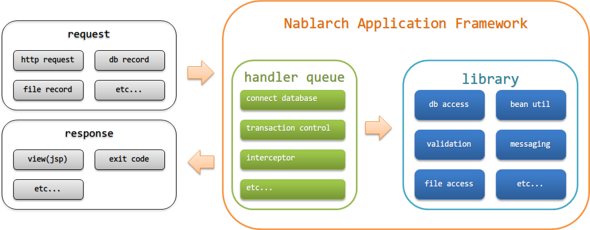
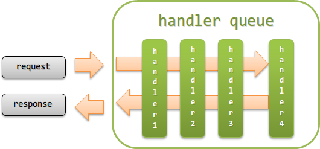

.. _nablarch_architecture:

架构
============================

.. contents:: 目录
  :depth: 3
  :local:

对Nablarch应用框架的架构进行说明。

.. warning::
  本章节说明的架构中不包含\ :ref:`jsr352_batch`\ （详情请参考\ :ref:`jsr352_batch`\ 的\ :ref:`jsr352_architecture`\ ）。

构成Nablarch应用框架的要素
------------------------------------------------------------
以下是Nablarch应用框架的主要构成要素。

.. _nablarch_architecture-handler_queue:

handler队列(handler queue)
------------------------------------------------------------
handler队列是指按照预先定义的顺序，对请求和响应执行切面处理的一组handler所构成的队列。

handler队列的执行方式与下图所示的Servlet过滤器链的执行方式相同。

.. _nablarch_architecture-handler_responsibility:

handler主要进行以下的各种处理。

 * 请求过滤（例如：仅允许具有访问权限的请求）
 * 请求与响应的转换
 * 资源的获取与释放（例如：数据库连接的获取与释放）

.. tip::

  对请求和响应的处理，以及通用处理，需由项目侧通过实现handler来应对。

  虽然常见将通用处理实现在业务逻辑类的父类中，
  但建议将其作为独立的handler来实现。
  （若需在独立handler前后追加处理，建议使用:ref:`nablarch_architecture-interceptor`)

  作为独立handler实现时
    由于各个handler的职责更加明确，因此易于测试，可维护性更高。
    此外，由于每个handler的处理相互独立，因此通用处理的插入与移除更加容易。

  若将通用处理实现在父类中时
    当通用处理增加时，父类会变得庞大并承担多个职责。
    这不仅会增加维护成本，还会使测试变得复杂，容易成为缺陷滋生的温床。
    此外，即使未正确继承本应继承的类，也可能因通用处理的内容而不会导致异常终止，程序仍会继续执行，
    从而产生难以检测缺陷的问题。

Nablarch会对收到的请求按照handler队列中定义的handler顺序，从头开始依次执行处理。
当在处理请求的过程中返回了响应时，则会按照已执行handler的逆序，对响应依次执行相应的处理。

某些handler必须在配置到 handler 队列时注意其前后顺序，否则将无法正常工作。
有关handler的约束条件（例如前后关系等）将在各handler的相关章节中进行说明，因此在构建handler队列时，请务必参考各handler的文档。

.. _nablarch_architecture-interceptor:

拦截器(interceptor)
~~~~~~~~~~~~~~~~~~~~~~~~~~~~~~~~~~~~~~~~~~~~~~~~~~~~~~~~~~~~
拦截器是指在程序运行时动态添加到handler队列中的handler。

例如：在仅针对特定请求需要添加处理(handler)时，
或者需要根据不同请求切换配置参数来执行处理(handler)的情况下，使用拦截器就比使用处理器更为合适。

.. tip::
  拦截器的执行方式与 Jakarta EE 中由 Jakarta Contexts and Dependency Injection（Jakarta 上下文和依赖注入）定义的拦截器相同。

.. important::
  拦截器的执行顺序需要在配置文件中进行配置。
  如果没有进行配置，拦截器的执行顺序将依赖于JVM的实现，因此需特别注意。

  Nablarch 框架默认提供的拦截器，其执行顺序必须按照以下方式设置。

  #. :java:extdoc:`nablarch.common.web.token.OnDoubleSubmission`
  #. :java:extdoc:`nablarch.common.web.token.UseToken`
  #. :java:extdoc:`nablarch.fw.web.interceptor.OnErrors`
  #. :java:extdoc:`nablarch.fw.web.interceptor.OnError`
  #. :java:extdoc:`nablarch.common.web.interceptor.InjectForm`

  关于拦截器执行顺序配置的详细内容请参考\ :java:extdoc:`nablarch.fw.Interceptor.Factory`\。

库(library)
--------------------------------------------------
库，指的是被handler调用的一组组件，例如用于数据库访问、文件访问、日志输出等功能的组件。

Nablarch应用框架提供的库请参考 :ref:`library`。

