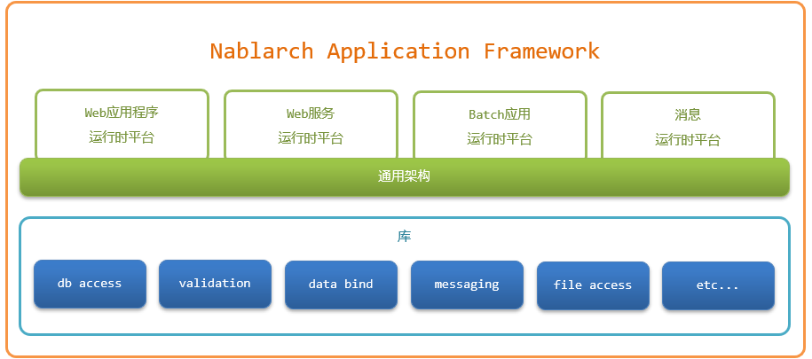

.. _nablarch_big_picture:

整体结构
============================
Nablarch应用的整体结构如下所示。

Nablarch应用框架由与Web处理和Batch等不同处理方式相匹配的运行时平台，
以及提供数据库访问、验证等各项功能的库组成。

Nablarch应用框架擅长应对以下的任务。

可以对应各种各样的处理方式
 在Nablarch应用框架中，
 通过组合运行时平台和 :ref:`库<library>` ，
 能够应对多种处理方式。

 .. _runtime_platform:

 运行时平台
  * :ref:`web_application`
  * :ref:`web_service`
  * :ref:`batch_application`
  * :ref:`messaging`

Nablarch应用框架在所有运行时平台上均采用通用的架构。
 :ref:`通用架构<nablarch_architecture>`
 采用管道（Pipeline）型处理模型，对所有数据处理进行统一管理。
 尤其对于需要组合多种处理方式构建的系统，通过
 :ref:`通用架构<nablarch_architecture>` 可获得以下优势：

 灵活的功能扩展与修改
  在管道型处理模型中，可轻松替换构成管道的处理器（handler），
  从而对功能新增或变更需求实现高度灵活的响应。
  此外，handler可在不同处理方式间共享，
  因此无需像传统开发那样，为每种处理方式重复实现相同的功能。

 开发方法的标准化
  在各运行时平台上运行的应用程序，均可采用几乎相同的方式进行开发与测试。
  因此，已在某种处理方式中掌握开发技能的开发人员，
  仅需极少的学习成本即可在其他处理方式中开展开发工作。
  这不仅实现了开发效率的提升与学习成本的降低，也使得开发人员的招募与调配更加便捷。
