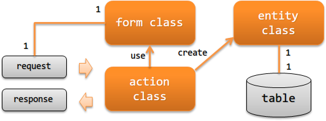

.. _`application_design`:

应用的职责配置
================================

.. contents:: 目录
  :depth: 3
  :local:

说明在开发Web应用时应实现的类及其职责。

**类及其职责**

Action类(action class)
  Action类根据请求执行业务逻辑，并返回响应。

  例如：从Form类生成Entity类，并将其内容持久化到数据库中。

Form类(表单类)
  用于映射来自页面输入值（HTTP请求）的类。

  具备用于数据记录验证的注解配置以及相关性验证的逻辑。
  根据来自外部的输入数据，有时可能会形成层次结构（即Form包含其他Form）。

  .. _`application_design-form_html`:

  应以HTML的form为单位创建Form类。
    Form类用于定义与页面的接口，因此当接口（HTML 的 form）不同时，应创建不同的Form类。
    例如：即使注册页面和更新页面通常具有类似的输入项，
    但由于接口（HTML的form）不同，仍需使用不同的Form类。

    通过以接口（HTML的form）为单位创建Form类，可将服务器端接收的请求参数限定为HTML form中定义的参数。
    由此，即使客户端发送了意外的参数（非法参数），
    在转换为Form类时这些参数也会被排除，从而提高安全性。
    此外，由于每个Form类仅包含对应单一接口的验证逻辑，职责更明确，可读性和可维护性也更高。

    另外，关联验证逻辑可能在多个Form类中是共通的。
    在这种情况下，建议将关联验证逻辑提取到单独的类中以实现复用。

  Form类的属性应全部定义为 `String` 类型。
    将属性定义为 `String` 的理由请参考 :ref:`Bean Validation <bean_validation-form_property>`。

  不应将Form类的对象保存在会话中。
    关于不应保存在会话中的原因，请参考 :ref:`会话存储 <session_store-form>`。

Entity类(实体类)
  用于映射来自与数据表中的记录的类。属性定义与表字段类型一致。

