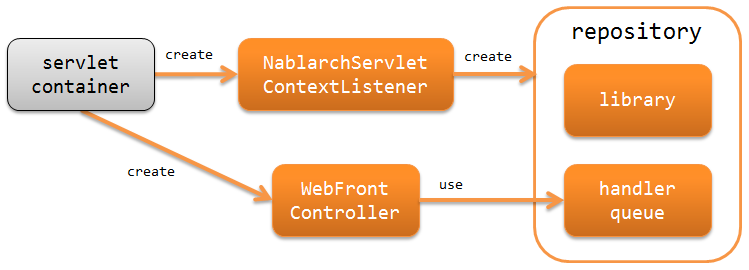
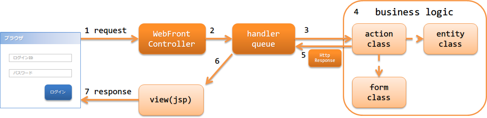

架构概要
==============================

.. contents:: 目录
  :depth: 3
  :local:

Nablarch提供了用于构建具有基于HTML的页面UI的Web应用的功能。

.. _web_application-structure:

Web应用的构成
----------------------------------------
在Nablarch中，构建Web应用时以使用Servlet API为前提。
以下是Nablarch中Web应用的构成。

:ref:`nablarch_servlet_context_listener` (NablarchServletContextListener)
  负责执行System Repository和日志的初始化处理的Servlet上下文监听器。

:ref:`web_front_controller` (WebFrontController)
  对接收到的请求处理委派给handler队列的Servlet过滤器。

Web应用的处理流程
----------------------------------------
Web应用从请求开始处理到返回响应之间的所有流程如下图所示。

1. :ref:`web_front_controller` ( `jakarta.servlet.Filter` 的实现类)接收到了请求。
2. :ref:`web_front_controller` 将针对请求的处理委托给handler队列。
3. 由配置在handler队列中的 :java:extdoc:`分发handler(DispatchHandler) <nablarch.fw.handler.DispatchHandler>`
   根据URI确定应该执行的Action类(action class)，
   并追加到队列末尾。
4. Action类(action class)使用Form类(表单类)或Entity类(实体类)，对请求执行相应的业务逻辑(business logic)。
   各个类的详细信息请参考 :doc:`application_design`

5. Action类会创建并返回表示处理结果的 `HttpResponse`。
6. 处理器队列中的HTTP响应处理器（`HttpResponseHandler`）将 `HttpResponse` 转换为返回给客户端的响应。例如，通过JSP进行Servlet转发等操作。
7. 返回响应。

Nablarch Batch应用使用的handler
--------------------------------------------------
Nablarch提供了若干构建Web应用所需的handler。
根据项目需求构建handler队列。(根据需求，可能需要创建项目需要的自定义handler)

各个handler的详细信息请参考下面的链接。

执行请求和响应转换的handler
  * :ref:`http_character_encoding_handler`
  * :ref:`http_response_handler`
  * :ref:`forwarding_handler`
  * :ref:`multipart_handler`
  * :ref:`session_store_handler`
  * :ref:`normalize_handler`
  * :ref:`secure_handler`

过滤请求的handler
  * :ref:`service_availability`
  * :ref:`permission_check_handler`

数据库相关的handler
  * :ref:`database_connection_management_handler`
  * :ref:`transaction_management_handler`

验证请求的handler
  * :ref:`csrf_token_verification_handler`

异常处理相关的handler
  * :ref:`http_error_handler`
  * :ref:`global_error_handler`

其他
  * :ref:`http_request_java_package_mapping`
  * :ref:`nablarch_tag_handler`
  * :ref:`thread_context_handler`
  * :ref:`thread_context_clear_handler`
  * :ref:`http_access_log_handler`
  * :ref:`file_record_writer_dispose_handler`
  * :ref:`health_check_endpoint_handler`

最低限度handler配置
~~~~~~~~~~~~~~~~~~~~~~~~~~~~~~~~~~~~~~~~~~~~~~~~~~
构建Web应用时最低限度的handler队列如下所示，
在这基础之上，根据项目需求追加Nablarch标准handler或自定义的handler。

.. list-table:: 最低限度handler配置
   :header-rows: 1
   :class: white-space-normal
   :widths: 4,24,24,24,24

   * - No.
     - handler
     - 前处理
     - 后处理
     - 异常处理

   * - 1
     - :ref:`http_character_encoding_handler`
     - 设定请求与响应的文字编码。
     -
     -

   * - 2
     - :ref:`global_error_handler`
     -
     -
     - 输出执行时发生的异常或错误的日志。

   * - 3
     - :ref:`http_response_handler`
     -
     - Servlet转发、重定向或执行响应写入。
     - 当运行时发生了异常或者错误时，显示指定的错误画面。

   * - 4
     - :ref:`secure_handler`
     -
     - 向响应对象(:java:extdoc:`HttpResponse <nablarch.fw.web.HttpResponse>`)中设定与安全相关的响应头。
     - 

   * - 5
     - :ref:`multipart_handler`
     - 请求是``multipart``格式时，将该内容保存到临时文件。
     - 删除保存的临时文件。
     -

   * - 6
     - :ref:`session_store_handler`
     - 从session存储中读取内容。
     - 向session存储中写入内容。
     -

   * - 7
     - :ref:`normalize_handler`
     - 请求参数规范化处理。
     - 
     -

   * - 8
     - :ref:`forwarding_handler`
     -
     - 如果目标页面为内部转发，则重新执行后续的handler。
     -

   * - 9
     - :ref:`http_error_handler`
     -
     -
     - 根据异常种类输出日志，并生成响应。

   * - 10
     - :ref:`nablarch_tag_handler`
     - 保证Nablarch自定义tag正常运行的前置处理。
     -
     -

   * - 11
     - :ref:`database_connection_management_handler`
     - 获取数据库连接。
     - 释放数据库连接。
     -

   * - 12
     - :ref:`transaction_management_handler`
     - 开启事务。
     - 提交事务。
     - 回滚事务。

   * - 13
     - :ref:`router_adaptor`
     - 根据请求路径确定要调用的Action。
     -
     -

