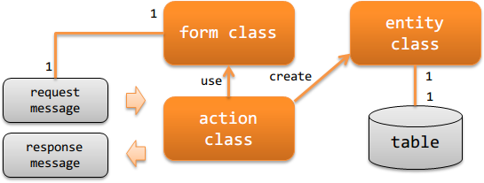

.. _`http_messaging-design`:

应用程序的职责配置
================================
说明创建HTTP消息处理时应实现的类及其职责。

**类及其职责**

Action类(action class)
  Action类基于请求消息(:java:extdoc:`RequestMessage<nablarch.fw.messaging.RequestMessage>`)
  执行业务逻辑，创建并返回响应消息(:java:extdoc:`ResponseMessage<nablarch.fw.messaging.ResponseMessage>`)。

  例如，请求消息的导入处理中，作为业务逻辑执行以下处理。

  - 从请求消息创建Form类，进行验证。
  - 从Form类创建Entity类，向数据库添加数据。
  - 创建响应消息并返回。

Form类(form class)
  映射请求消息(:java:extdoc:`RequestMessage<nablarch.fw.messaging.RequestMessage>`)的类。

  拥有用于验证的注解设置和相关验证逻辑。

  Form类的属性全部定义为 `String`
    属性应为 `String` 的理由请参考 :ref:`Bean Validation <bean_validation-form_property>` 。
    但是，二进制项目使用字节数组定义。

Entity类(entity class)
  与表1对1对应的类。拥有与列对应的属性。
