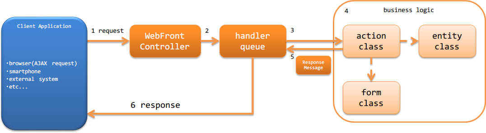

架构概述
==============================
HTTP消息处理提供处理从外部(浏览器或外部系统等)发送的HTTP消息
的Web服务构建功能。

.. important::

  推荐使用 :ref:`RESTful Web服务 <restful_web_service>` 而非本功能。
  详细信息请参考 :ref:`推荐使用RESTful Web服务的理由 <web_service-recommended_jaxrs>` 。

HTTP消息处理的构成
--------------------------------------------------
与Nablarch Web应用程序构成相同。
详细信息请参考 :ref:`web_application-structure` 。

HTTP消息处理的处理流程
--------------------------------------------------
以下显示HTTP消息处理功能处理请求并返回响应的处理流程。

1. :ref:`WebFrontController <web_front_controller>` ( `jakarta.servlet.Filter` 的实现类)接收request。
2. :ref:`WebFrontController <web_front_controller>` 将request的处理委托给handler队列(handler queue)。
3. handler队列中设置的调度handler(`DispatchHandler`) 基于URI确定要处理的Action类(action class)并添加到handler队列末尾。
4. Action类(action class)使用Form类(form class)和Entity类(entity class)执行业务逻辑(business logic)。 |br|
   各类的详细信息请参考 :ref:`http_messaging-design` 。

5. Action类(action class)创建表示处理结果的 `ResponseMessage` 并返回。
6. handler队列内的 :ref:`http_messaging_response_building_handler` 将 `ResponseMessage` 转换为返回给客户端的响应(json或xml等)，向客户端返回响应。 |br|

HTTP消息处理使用的handler
--------------------------------------------------
Nablarch提供了构建使用HTTP消息处理的Web服务所需的多个标准handler。
请根据项目需求构建handler队列。(根据需求可能需要创建项目自定义handler)

各handler的详细信息请参考链接。

进行请求和响应转换的handler
  * :ref:`http_response_handler`
  * :ref:`http_messaging_request_parsing_handler`
  * :ref:`http_messaging_response_building_handler`
  * :ref:`message_resend_handler`

进行请求过滤的handler
  * :ref:`service_availability`
  * :ref:`permission_check_handler`

与数据库相关的handler
  * :ref:`database_connection_management_handler`
  * :ref:`transaction_management_handler`

与错误处理相关的handler
  * :ref:`global_error_handler`
  * :ref:`http_messaging_error_handler`

其他handler
  * :ref:`http_request_java_package_mapping`
  * :ref:`thread_context_handler`
  * :ref:`thread_context_clear_handler`
  * :ref:`http_access_log_handler`

HTTP消息处理的最小handler构成
--------------------------------------------------
以下显示构建使用HTTP消息处理的Web服务时的最小handler队列。
以此为基础，根据项目需求添加Nablarch的标准handler或项目创建的自定义handler。

.. list-table:: 最小handler构成
  :header-rows: 1
  :class: white-space-normal
  :widths: 4,24,24,24,24

  * - No.
    - handler
    - 去路处理
    - 回路处理
    - 异常处理
 
  * - 1
    - :ref:`thread_context_clear_handler`
    -
    - 删除 :ref:`thread_context_handler` 在线程本地设置的所有值。
    -
    
  * - 2
    - :ref:`global_error_handler`
    -
    -
    - 运行时异常或错误时进行日志输出。

  * - 3
    - :ref:`http_response_handler`
    -
    - 进行servlet forward、redirect、响应写入之一。
    - 运行时异常或错误时显示默认错误页面。

  * - 4
    - :ref:`thread_context_handler`
    - 从请求信息初始化请求ID等线程上下文变量。
    - 
    -

  * - 5
    - :ref:`http_messaging_error_handler`
    - 
    - 后续handler生成的响应主体为空时，设置与状态码对应的默认主体。
    - 进行日志输出及根据异常生成响应。

  * - 6
    - :ref:`request_path_java_package_mapping`
    - 从请求路径确定处理对象的业务Action，添加到handler队列末尾。
    - 
    - 

  * - 7
    - :ref:`http_messaging_request_parsing_handler`
    - 解析http请求主体生成 :java:extdoc:`RequestMessage <nablarch.fw.messaging.RequestMessage>` ，
      作为请求对象传递给后续handler。
    - 
    - 

  * - 8
    - :ref:`database_connection_management_handler`
    - 获取DB连接。
    - 释放DB连接。
    -

  * - 9
    - :ref:`http_messaging_response_building_handler`
    - 
    - 
    - 基于业务Action生成的错误用消息，生成错误用http响应。

  * - 10
    - :ref:`transaction_management_handler`
    - 开始事务。
    - 提交事务。
    - 回滚事务。

  * - 11
    - :ref:`http_messaging_response_building_handler`
    - 
    - 基于业务Action生成的消息，生成http用响应。
    - 基于后续handler发生的异常生成错误用http响应。

HTTP消息处理使用的Action
---------------------------------------------------------------------------------
Nablarch提供了构建HTTP消息处理所需的标准Action类。
详细信息请参考链接。

* :java:extdoc:`MessagingAction (同步响应消息处理用Action的模板类)<nablarch.fw.messaging.action.MessagingAction>`

.. |br| raw:: html

   
