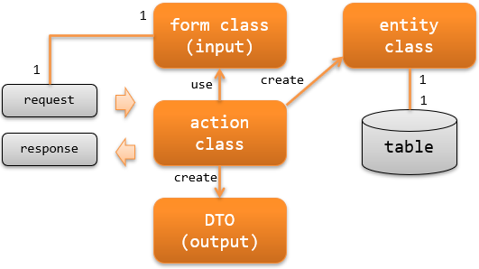

.. _rest-application_design:

RESTful Web服务的职责配置
====================================

.. contents:: 目录
  :depth: 3
  :local:

说明创建RESTful Web服务时应实现的类及其职责。

**类及其职责**

Action类(action class)
  Action类基于请求执行业务逻辑，生成响应并返回。

  例如，从Form类创建Entity类，将其内容持久化到数据库等处理。

Form类(form class)
  映射客户端(浏览器、外部系统、智能手机应用等)发送的值(http body)的类。

  客户端发送的值所保持的Form类拥有用于验证值的注解设置和相关验证逻辑。

  根据API的规格，Form类可能是层级结构(Form类拥有Form类)。

  .. _`rest-application_design-form_html`:

  Form类按API单位创建
    Form类定义与客户端的接口，接口(API)不同时应作为不同的Form类创建。
    例如，即使注册用API和更新用API拥有相似的项目，由于API不同需要作为不同的Form类。

    按API单位创建Form类可以限制接口变更的影响范围。
    此外，由于只拥有对应一个接口的验证逻辑，职责明确，可读性和可维护性较高。

    注意，相关验证逻辑可能在多个Form类间共用。
    这种情况下，将相关验证逻辑抽取到单独的类中实现逻辑共用比较好。

  Form类的属性全部定义为 `String`
    属性应为 `String` 的理由请参考 :ref:`Bean Validation <bean_validation-form_property>` 。

DTO(data transfer object)
  保持映射到客户端响应值(response body)的值的类。

Entity类(entity class)
  与表1对1对应的类。拥有与列对应的属性。
