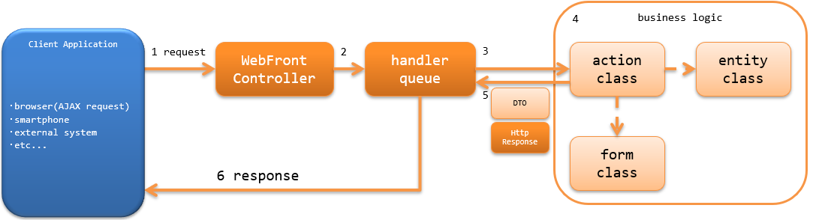

.. _`restful_web_service_architecture`:

架构概述
==============================

.. contents:: 目录
  :depth: 3
  :local:

Nablarch提供了使用Web应用程序的业务Action，以与创建Jakarta RESTful Web Services资源类相同的方式
创建RESTful Web服务的功能（Jakarta RESTful Web Services支持）。

.. tip::
  本功能在Nablarch5之前称为「JAX-RS支持」。
  但是，随着Java EE移管到Eclipse Foundation且规格名改变，名称变更为「Jakarta RESTful Web Services支持」。

  变更的只有名称，功能上没有差异。

  关于Nablarch6中名称变更的其他功能请参考 :ref:`renamed_features_in_nablarch_6` 。

Jakarta RESTful Web Services支持基于Nablarch的Web应用程序。
因此，无法使用Jakarta RESTful Web Services中可用的@Context注解进行Servlet资源注入或Jakarta Contexts and Dependency Injection等。
以下显示Jakarta RESTful Web Services支持中可使用的注解。

 - Produces(指定响应的媒体类型)
 - Consumes(指定请求的媒体类型)
 - Valid(对请求执行BeanValidation)

Jakarta RESTful Web Services与Jakarta RESTful Web Services支持的功能比较请参考 :ref:`restful_web_service_functional_comparison` 。

.. important::

  Jakarta RESTful Web Services支持不提供客户端功能。
  需要使用Jakarta RESTful Web Services客户端时，请使用Jakarta RESTful Web Services的实现(Jersey或RESTEasy等)。

RESTful Web服务的构成
----------------------------------------
与Nablarch Web应用程序构成相同。
详细信息请参考 :ref:`web_application-structure` 。

RESTful Web服务的处理流程
----------------------------------------
以下显示RESTful Web服务处理请求并返回响应的处理流程。

1. :ref:`web_front_controller` ( `jakarta.servlet.Filter` 的实现类)接收request。
2. :ref:`web_front_controller` 将request的处理委托给handler队列(handler queue)。
3. handler队列中设置的调度handler(`DispatchHandler`) 基于URI确定要处理的Action类(action class)并添加到handler队列末尾。
4. Action类(action class)使用Form类(form class)和Entity类(entity class)执行业务逻辑(business logic)。 |br|
   各类的详细信息请参考 :ref:`rest-application_design` 。

5. action类创建表示处理结果的DTO或 `HttpResponse` 并返回。
6. handler队列内的HTTP响应handler(`JaxRsResponseHandler`)将 `HttpResponse` 转换为返回给客户端的响应，向客户端返回响应。 |br|
   注意，Action类(action class)的处理结果为Form类(form class)时，通过 `BodyConvertHandler` 转换为 `HttpResponse`。 |br|
   转换后的 `HttpResponse` 的主体格式为Action类(action class)中设置的媒体类型。

RESTful Web服务使用的handler
--------------------------------------------------
Nablarch提供了构建RESTful Web服务所需的多个标准handler。
请根据项目需求构建handler队列。(根据需求可能需要创建项目自定义handler)

各handler的详细信息请参考链接。

进行请求和响应转换的handler
  * :ref:`jaxrs_response_handler`
  * :ref:`body_convert_handler`

与数据库相关的handler
  * :ref:`database_connection_management_handler`
  * :ref:`transaction_management_handler`

进行请求验证的handler
  * :ref:`jaxrs_bean_validation_handler`
  * :ref:`csrf_token_verification_handler`

与错误处理相关的handler
  * :ref:`global_error_handler`

其他handler
  * :ref:`请求URI与Action绑定的handler <router_adaptor>`
  * :ref:`health_check_endpoint_handler`

最小handler构成
~~~~~~~~~~~~~~~~~~~~~~~~~~~~~~~~~~~~~~~~~~~~~~~~~~
以下显示在Nablarch中构建RESTful Web服务时的最小handler队列。
以此为基础，根据项目需求添加Nablarch的标准handler或项目创建的自定义handler。

.. list-table:: 最小handler构成
  :header-rows: 1
  :class: white-space-normal
  :widths: 4 24 24 24 24

  * - No.
    - handler
    - 去路处理
    - 回路处理
    - 异常处理

  * - 1
    - :ref:`global_error_handler`
    -
    -
    - 运行时异常或错误时进行日志输出。

  * - 2
    - :ref:`jaxrs_response_handler`
    - 
    - 执行响应的写入处理。
    - 执行异常(错误)对应的响应生成和写入处理以及日志输出处理。

  * - 3
    - :ref:`database_connection_management_handler`
    - 获取DB连接。
    - 释放DB连接。
    -

  * - 4
    - :ref:`transaction_management_handler`
    - 开始事务。
    - 提交事务。
    - 回滚事务。

  * - 5
    - :ref:`请求URI与Action绑定的handler <router_adaptor>`
    - 基于请求路径确定要调用的Action(方法)。
    -
    -

  * - 6
    - :ref:`body_convert_handler`
    - 将request body转换为Action接收的Form类。
    - 将Action处理结果的Form内容转换为response body。
    -

  * - 7
    - :ref:`jaxrs_bean_validation_handler`
    - 对No6转换的Form类执行验证。
    - 
    -

.. tip::

   :ref:`请求URI与Action绑定的handler <router_adaptor>` 之后设置的handler，
   不是直接设置在handler队列中，而是设置在 :ref:`请求URI与Action绑定的handler <router_adaptor>` 上。

   使用 :ref:`jaxrs_adaptor` 时， :ref:`body_convert_handler` 和 :ref:`jaxrs_bean_validation_handler` 会自动添加到handler队列。

   想要设置 :ref:`body_convert_handler` 和 :ref:`jaxrs_bean_validation_handler` 以外的handler，或增加支持的媒体类型时，
   请参考以下设置示例和 :ref:`jaxrs_adaptor` 的实现构建handler队列。

   .. code-block:: xml

    <component name="webFrontController" class="nablarch.fw.web.servlet.WebFrontController">
      <property name="handlerQueue">
        <list>
          <!-- 前段handler省略 -->

          <!-- 请求URI与Action绑定的handler设置 -->
          <component name="packageMapping" class="nablarch.integration.router.RoutesMapping">
            <!-- handler以外的设置值省略 -->
            <property name="methodBinderFactory">
              <component class="nablarch.fw.jaxrs.JaxRsMethodBinderFactory">
                <property name="handlerList">
                  <list>
                    <!--
                    请求URI与Action绑定的handler之后的handler队列设置
                    ※各类的设置值省略
                    -->
                    <component class="nablarch.fw.jaxrs.BodyConvertHandler">
                      <!-- 设置支持的媒体类型的converter -->
                    </component>
                    <component class="nablarch.fw.jaxrs.JaxRsBeanValidationHandler" />
                  </list>
                </property>
              </component>
            </property>
          </component>
        </list>
      </property>
    </component>

.. |br| raw:: html
 
    
