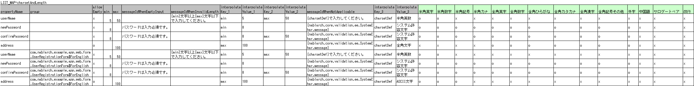
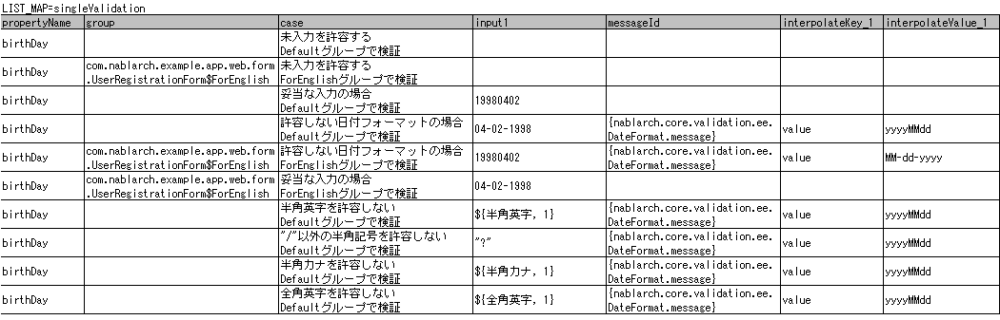
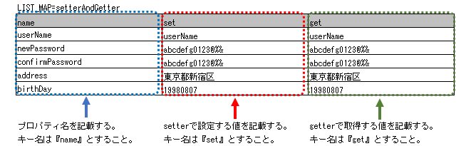

.. _entityUnitTestWithBeanValidation:

==========================================================
支持Bean Validation的Form/Entity类单元测试
==========================================================
本节说明针对使用 :ref:`bean_validation` 进行输入值校验的Form及Entity类单元测试（以下称为Form单元测试或Entity单元测试）。
由于两者可以进行几乎相同的单元测试，因此共同的内容以Form单元测试为基础进行说明，特有的处理则单独说明。

.. tip::
   关于Form、Entity的职责，请参阅各处理方式的职责配置。
   例如： :ref:`Web应用程序的职责配置<application_design>` 、 :ref:`Nablarch批处理应用程序的职责配置<nablarch_batch-application_design>` 

-----------------------------
Form/Entity单元测试的编写方法
-----------------------------
本节中作为示例使用的测试类和测试数据如下（右键点击->保存即可下载）。

* :download:`测试类(UserRegistrationFormTest.java)<../_download/UserRegistrationFormTest.java>`
* :download:`测试数据(UserRegistrationFormTest.xlsx)<../_download/UserRegistrationFormTest.xlsx>`
* :download:`测试目标类(UserRegistrationForm.java)<../_download/UserRegistrationForm.java>`  

测试数据的创建
==================
说明记载测试数据的Excel文件本身的创建方法。记载测试数据的Excel文件与测试源代码存放在同一目录下，使用相同的文件名（仅扩展名不同）。
此外，下述的\
\ :ref:`校验测试用例<entityUnitTest_ValidationCase_BeanValidation>` \、\
\ :ref:`setter、getter测试用例<entityUnitTest_SetterGetterCase_BeanValidation>`\
各自都需要使用1个工作表。

关于测试数据描述方法的详细说明，请参阅 :doc:`../../../06_TestFWGuide/01_Abstract` 、 :doc:`../../../06_TestFWGuide/02_DbAccessTest` 。

此外，消息数据或代码主数据等存储在数据库中的静态主数据，以项目中管理的数据已预先投入为前提
（不会将这些数据作为单独的测试数据创建）。

测试类的创建
==================
Form/Entity单元测试的测试类按以下条件创建。

* 测试类的包与测试目标的Form/Entity相同。
* 以<Form/Entity类名>Test作为类名创建测试类。
* 继承nablarch.test.core.db.EntityTestSupport。

.. code-block:: java

   package com.nablarch.example.app.web.form; // 【说明】包与UserRegistrationForm相同
   
   import nablarch.test.core.db.EntityTestSupport;
   import org.junit.Test;
   
   /**
    * 执行针对{@link UserRegistrationForm}的测试的类。
    * 测试内容请参阅Excel工作表。
    *
    * @author Takayuki Uchida
    * @since 1.0
    */
   public class UserRegistrationFormTest extends EntityTestSupport {
   // 【说明】类名为UserRegistrationFormTest，继承EntityTestSupport

   // 【说明】〜后略〜                

测试方法的描述方法请参阅本节后述的代码示例。

.. _entityUnitTest_ValidationCase_BeanValidation:

字符类型与字符串长度的单项目校验测试用例
========================================

关于单项目校验的测试用例，大多是关于输入字符类型和字符串长度的。\
例如，假设存在以下属性。

* 属性名"假名注音"
* 最大字符串长度为50个字符
* 必填项
* 仅允许全角片假名

此时，需要创建如下测试用例。

 =============================================== ==============================
 用例                                            观点			 
 =============================================== ==============================
 输入全角片假名50个字符，校验成功。              最大字符串长度、字符类型的确认	 
 输入全角片假名51个字符，校验失败。              最大字符串长度的确认		 
 输入全角片假名1个字符，校验成功。               最小字符串长度、字符类型的确认	 
 输入空字符串，校验失败。                        必填校验的确认		 
 输入半角片假名，校验失败。                      字符类型的确认\ [#]_\		 
 =============================================== ==============================

\ 
 
 .. [#] 同样，需要半角英文字母、全角平假名、汉字...等被输入后校验失败的用例。

如此，单项目校验的测试用例数量较多，数据创建需要花费精力。\
因此，提供了单项目校验测试专用的测试方法。通过使用该方法可获得以下效果。

* 单项目校验的测试用例创建变得容易。
* 可以创建维护性高的测试数据，便于校验和维护。

.. tip::
   本测试方法不能用于持有其他Form作为属性的Form。这种情况下，请自行实现校验处理的测试。
   持有其他Form作为属性的Form是指通过以下形式访问属性的父Form。
   
   .. code-block:: none
   
      <父Form>.<子Form>.<子Form的属性名>

.. _entityUnitTest_CharsetAndLengthInputData_BeanValidation:

测试用例表的创建方法
------------------------

准备以下列。

+-----------------------------------+----------------------------------------------------------+
| 列名                              | 记载内容                                                 |
+===================================+==========================================================+
|propertyName                       |测试目标的属性名                                          |
+-----------------------------------+----------------------------------------------------------+
|allowEmpty                         |该属性是否允许未输入                                      |
+-----------------------------------+----------------------------------------------------------+
|group                              |Bean Validation的分组（可省略） \ [#]_\                   |
+-----------------------------------+----------------------------------------------------------+
|min                                |该属性作为输入值允许的最小字符串长度（                    |
|                                   |可省略）                                                  |
+-----------------------------------+----------------------------------------------------------+
|max                                |该属性作为输入值允许的最大字符串长度（                    |
|                                   |可省略）                                                  |
+-----------------------------------+----------------------------------------------------------+
|messageIdWhenEmptyInput            |未输入时期待的消息（可省略）\ [#]_\                       |
+-----------------------------------+----------------------------------------------------------+
|messageIdWhenInvalidLength         |字符串长度不符时期待的消息（可省略）\ [#]_\               |
+-----------------------------------+----------------------------------------------------------+
|messageIdWhenNotApplicable         |字符类型不符时期待的消息                                  |
+-----------------------------------+----------------------------------------------------------+
|interpolateKey\_\ *n*              |嵌入字符的键名（\ *n*\ 是从1开始的序号、可省略            |
|                                   |） \ [#]_ \                                               |
+-----------------------------------+----------------------------------------------------------+
|interpolateValue\_\ *n*            |嵌入字符的值（\ *n*\ 是从1开始的序号、可省略）            |
+-----------------------------------+----------------------------------------------------------+
|半角英文字母                       |是否允许半角英文字母                                      |
+-----------------------------------+----------------------------------------------------------+
|半角数字                           |是否允许半角数字                                          |
+-----------------------------------+----------------------------------------------------------+
|半角符号                           |是否允许半角符号                                          |
+-----------------------------------+----------------------------------------------------------+
|半角假名                           |是否允许半角假名                                          |
+-----------------------------------+----------------------------------------------------------+
|全角英文字母                       |是否允许全角英文字母                                      |
+-----------------------------------+----------------------------------------------------------+
|全角数字                           |是否允许全角数字                                          |
+-----------------------------------+----------------------------------------------------------+
|全角平假名                         |是否允许全角平假名                                        |
+-----------------------------------+----------------------------------------------------------+
|全角片假名                         |是否允许全角片假名                                        |
+-----------------------------------+----------------------------------------------------------+
|全角汉字                           |是否允许全角汉字                                          |
+-----------------------------------+----------------------------------------------------------+
|全角符号其他                       |是否允许全角符号其他                                      |
+-----------------------------------+----------------------------------------------------------+
|外字                               |是否允许外字                                              |
+-----------------------------------+----------------------------------------------------------+

.. [#] Bean Validation的分组中，指定分组时请输入类的FQCN。
       指定内部类时，使用 ``$`` 分隔类名。

\

.. [#] 省略messageIdWhenEmptyInput时，将使用 :ref:`entityUnitTest_EntityTestConfiguration_BeanValidation` 中设置的emptyInputMessageId
       的值。

\

.. [#] 省略messageIdWhenInvalidLength时，将使用 :ref:`entityUnitTest_EntityTestConfiguration_BeanValidation` 中
       设置的默认值。省略时使用的默认值由max栏及min栏的记载决定，如下所示。

+--------------+--------------+----------------+---------------------------------------------------------------+
| max栏的记载  | min栏的记载  | max与min的比较 | 省略时使用的默认值                                            |
+==============+==============+================+===============================================================+
| 有           | 无           | （不适用）     | maxMessageId                                                  |
+--------------+--------------+----------------+---------------------------------------------------------------+
| 有           | 有           | max > min      | maxAndMinMessageId（超过时）、underLimitMessageId（不足时）   |
+--------------+--------------+----------------+---------------------------------------------------------------+
| 有           | 有           | max = min      | fixLengthMessageId                                            |
+--------------+--------------+----------------+---------------------------------------------------------------+
| 无           | 有           | （不适用）     | minMessageId                                                  |
+--------------+--------------+----------------+---------------------------------------------------------------+

\

.. [#] :ref:`嵌入字符<message-format-spec>` 存在时，添加interpolateKey_1 及 interpolateValue_1 的列，
       interpolateKey_1 中填写嵌入字符的键名，interpolateValue_1 中填写嵌入字符的值。
       存在多个嵌入字符时，增加interpolateKey_2, interpolateValue_2等列。

在填写是否允许的列中，设置以下值。

========== ======= ========================
设置内容    设置值    备注
========== ======= ========================
允许        o       半角小写字母o
不允许      x       半角小写字母x
========== ======= ========================

在指定消息的列中，填写校验错误时期待的消息。
消息中被 ``{}`` 包围的部分被视为 :ref:`message-format-spec` 的嵌入字符。
将整个消息用 ``{}`` 包围时，将被视为消息ID，由 :ref:`message` 解析。

以下记载消息指定方法的示例。

=================================================== =====================================================
记载示例                                            说明
=================================================== =====================================================
必须输入。                                          直接填写消息时（无嵌入字符）
请输入{min}字符以上{max}字符以下。                  直接填写消息时（有嵌入字符）
{nablarch.core.validation.ee.SystemChar.message}    作为消息ID填写消息时
=================================================== =====================================================
  

 
具体示例如下。

测试方法的创建方法
------------------------

 
启动超类的以下方法。

.. code-block:: java

   void testValidateCharsetAndLength(Class entityClass, String sheetName, String id)

\ 

.. code-block:: java

   // 【说明】〜前略〜                
   public class UserRegistrationFormTest extends EntityTestSupport {
   
       /**
        * 测试目标Form类。
        */
       private static final Class<?> TARGET_CLASS = UserRegistrationForm.class;
   
       /**
        * 字符类型以及字符串长度的单项目校验测试用例
        */
       @Test
       public void testCharsetAndLength() {
   
           // 【说明】记载测试数据的工作表名
           String sheetName = "testCharsetAndLength";
   
           // 【说明】测试数据的ID
           String id = "charsetAndLength";
   
           // 【说明】执行测试
           testValidateCharsetAndLength(TARGET_CLASS, sheetName, id);
       }
   
   // 【说明】〜后略〜                

执行此方法后，将针对测试数据的每一行执行以下观点的测试。

+---------------+-----------------------------+---------------------------------------------------+
| 观点          |输入值                       | 备注                                              |
+===============+=============================+===================================================+
| 字符类型      |半角英文字母                 | | 由max(最大字符串长度)栏中记载长度的字符串构成   |
+---------------+-----------------------------+ |                                                 |
| 字符类型      |半角数字                     | | max栏被省略时，由min（最小字符串长度）栏中记载  |
+---------------+-----------------------------+ | 长度的字符串构成。                              |
| 字符类型      |半角数字                     | | max栏、min栏都被省略时，                        |
+---------------+-----------------------------+ | 由长度1的字符串构成。                           |
| 字符类型      |半角符号                     |                                                   |
+---------------+-----------------------------+                                                   |
| 字符类型      |半角假名                     |                                                   |
+---------------+-----------------------------+                                                   |
| 字符类型      |全角英文字母                 |                                                   |
+---------------+-----------------------------+                                                   |
| 字符类型      |全角数字                     |                                                   |
+---------------+-----------------------------+                                                   |
| 字符类型      |全角平假名                   |                                                   |
+---------------+-----------------------------+                                                   |
| 字符类型      |全角片假名                   |                                                   |
+---------------+-----------------------------+                                                   |
| 字符类型      |全角汉字                     |                                                   |
+---------------+-----------------------------+                                                   |
| 字符类型      |全角符号其他                 |                                                   |
+---------------+-----------------------------+                                                   |
| 字符类型      |外字                         |                                                   |
+---------------+-----------------------------+---------------------------------------------------+
| 未输入        |空字符串                     | | 长度0的字符串                                   |
+---------------+-----------------------------+---------------------------------------------------+
| 最小字符串    |最小字符串长度的字符串       | | 输入值由标记为o的字符类型构成。                 |
+---------------+-----------------------------+ | max栏被省略时，                                 |
| 最长字符串    |最大字符串长度的字符串       | | 最长字符串、字符串长度超过的测试不会执行。      |
+---------------+-----------------------------+ | min栏被省略时，                                 |
| 字符串长度不足|最小字符串长度－1的字符串    | | 字符串长度不足的测试不会执行。                  |
+---------------+-----------------------------+                                                   |
| 字符串长度超过|最大字符串长度＋1的字符串    |                                                   |
+---------------+-----------------------------+---------------------------------------------------+

其他单项目校验的测试用例
================================

如果使用前述的字符类型与字符串长度的单项目校验测试用例，\
可以测试大部分的单项目校验，但也有部分校验无法覆盖。
例如，日期输入项的格式校验等。

关于此类单项目校验的测试，也准备了可以简单测试的机制。
通过为每个属性描述1个输入值和期待的消息ID的组合，
可以使用任意值进行单项目校验的测试。

.. tip::
   本测试方法不能用于持有其他Form作为属性的Form。这种情况下，请自行实现校验处理的测试。
   持有其他Form作为属性的Form是指通过以下形式访问属性的父Form。
   
   .. code-block:: none
   
      <父Form>.<子Form>.<子Form的属性名>

测试用例表的创建方法
------------------------

准备以下列。

+-------------------------------+-----------------------------------------------------+
| 列名                          | 记载内容                                            |
+===============================+=====================================================+
|propertyName                   | | 测试目标的属性名                                  |
+-------------------------------+-----------------------------------------------------+
|case                           | | 测试用例的简单说明                                |
+-------------------------------+-----------------------------------------------------+
|group \ [#]_                   | | Bean Validation的分组（可省略）                   |
+-------------------------------+-----------------------------------------------------+
|input1\ [#]_                   | | 输入值 [#]_                                       |
+-------------------------------+-----------------------------------------------------+
|messageId\ [#]_                | | 使用上述输入值进行单项目校验时期望发生的          |
|                               |  消息                                               |
|                               | | （期望不发生校验错误时留空）                      |
+-------------------------------+-----------------------------------------------------+
|interpolateKey\_\ *n*          | | 嵌入字符的键名（\ *n*\ 是从1开始的序号、可省略    |
|                               |  ）                                                 |
+-------------------------------+-----------------------------------------------------+
|interpolateValue\_\ *n*        | | 嵌入字符的值（\ *n*\ 是从1开始的序号、可省略）    |
+-------------------------------+-----------------------------------------------------+

.. [#]  分组的指定方法与 :ref:`字符类型与字符串长度的单项目校验测试用例的创建方法<entityUnitTest_CharsetAndLengthInputData_BeanValidation>` 中记载的方法相同。

\

.. [#] 为一个键指定多个参数时，增加input2, input3等列。

\

.. [#]  使用 :ref:`special_notation_in_cell` 的记法，可以高效地创建输入值。

\

.. [#]  消息的指定方法与 :ref:`字符类型与字符串长度的单项目校验测试用例的创建方法<entityUnitTest_CharsetAndLengthInputData_BeanValidation>` 中记载的方法相同。

       

具体示例如下。

测试方法的创建方法
------------------------

 
启动超类的以下方法。

.. code-block:: java

   void testSingleValidation(Class entityClass, String sheetName, String id)

.. code-block:: java

   // 【说明】〜前略〜
   public class UserRegistrationFormTest extends EntityTestSupport {
   
       /**
        * 测试目标Form类。
        */
       private static final Class<?> TARGET_CLASS = UserRegistrationForm.class;
   
       // 【说明】〜中略〜

       /**
        * 单项目校验的测试用例（上述以外）
        */
       @Test
       public void testSingleValidation() {
   
           // 【说明】记载测试数据的工作表名
           String sheetName = "testSingleValidation";
   
           // 【说明】测试数据的ID
           String id = "singleValidation";
   
           // 【说明】执行测试
           testSingleValidation(TARGET_CLASS, sheetName, id);
       }
   
       // 【说明】〜后略〜

项目间校验的测试用例
========================

对于上述单项目校验无法测试的，指定了 :java:extdoc:`@AssertTrue <jakarta.validation.constraints.AssertTrue>` 的项目间校验等，需要另行创建测试。

测试用例表的创建
--------------------

* ID固定为"testShots"。
* 准备以下列。

 +-----------------------------------+---------------------------------------------------+
 | 列名                              | 记载内容                                          |
 +===================================+===================================================+
 | title                             | | 测试用例的标题                                  |
 +-----------------------------------+---------------------------------------------------+
 | description                       | | 测试用例的简单说明                              |
 +-----------------------------------+---------------------------------------------------+
 | group \ [#]_                      | | Bean Validation的分组（可省略）                 |
 +-----------------------------------+---------------------------------------------------+
 | expectedMessageId\ *n* \ [#]_     | | 期待的消息（\ *n*\ 是从1开始的序号 ）           |
 +-----------------------------------+---------------------------------------------------+
 | propertyName\ *n*                 | | 期待的属性（\ *n*\ 是从1开始的序号 ）           |
 +-----------------------------------+---------------------------------------------------+
 | interpolateKey\ *n*\_\ *k* \ [#]_ | | 嵌入字符的键名（\ *n*\ 对应expectedMessageId    |
 |                                   | | 的 *n* ，\ *k*\ 是从1开始的序号。可省略）       |
 +-----------------------------------+---------------------------------------------------+
 | interpolateValue\ *n*\_\ *k*      | | 嵌入字符的值（\ *n*\ 对应expectedMessageId      |
 |                                   | | 的 *n* ，\ *k*\ 是从1开始的序号。可省略）       |
 +-----------------------------------+---------------------------------------------------+

.. [#]  分组的指定方法与 :ref:`字符类型与字符串长度的单项目校验测试用例的创建方法<entityUnitTest_CharsetAndLengthInputData_BeanValidation>`
        中记载的方法相同。

.. [#]  消息的指定方法与 :ref:`字符类型与字符串长度的单项目校验测试用例的创建方法<entityUnitTest_CharsetAndLengthInputData_BeanValidation>`
        中记载的方法相同。期望多个消息时，增加expectedMessageId2, propertyName2等数值并向右侧添加。

.. [#]  存在对应多个消息的嵌入字符时，同样增加interpolateKey2_1, interpolateValue2_1,
        interpolateKey2_2, interpolateValue2_2等数值并向右侧添加。

\

 记载发生校验错误的属性名及其属性的校验错误消息。不发生校验错误的属性不记载。

* 输入参数表的创建

  * ID固定为"params"。
  * 针对上述测试用例表，逐行记载输入参数\ [#]_ \。

\

    .. [#] :ref:`special_notation_in_cell` 的记法可以高效地创建输入值。

\

    在输入参数表中，填写想要通过项目间校验验证的属性值。
    除想要通过项目间校验验证的属性外，如果存在必须输入的属性，也需要记载。

    具体示例如下。
    下图中，创建的是针对"newPassword和confirmPassword是否相等"进行验证的属性（validPassword）的用例。

    .. image:: ../_image/entityUnitTest_validationTestData_BeanValidation.png
          :scale: 70

.. tip::

   创建Form单元测试的测试用例或测试数据时，\
   有时需要指定**属性中持有的其他Form的属性**。\
   此时，可以通过以下方式指定：
   
   * Form的代码示例
   
   .. code-block:: java
   
     public class SampleForm {

         /** 系统用户 */
         private SystemUserEntity systemUser;

         /** 电话号码数组 */
         private UserTelEntity[] userTelArray;
     
         // 【说明】属性以外的部分省略
     
     }

   * 指定持有Form的属性的方法(指定SystemUserEntity.userId时)
   
   .. code-block:: none
   
      sampleForm.systemUser.userId

   * 指定Form数组元素属性的方法(指定UserTelEntity数组的首个元素属性时)
   
   .. code-block:: none
   
      sampleForm.userTelArray[0].telNoArea

测试方法的创建方法
------------------------

启动超类的以下方法。

.. code-block:: java

   void testBeanValidation(Class entityClass, String sheetName)

.. code-block:: java

   // 【说明】〜前略〜   
   public class UserRegistrationFormTest extends EntityTestSupport {

       /**
        * 测试目标Form类。
        */
       private static final Class<?> TARGET_CLASS = UserRegistrationForm.class;
   
       // 【说明】〜中略〜   

       /**
        * 项目间校验的测试用例
        */
       @Test
       public void testWholeFormValidation() {
           // 【说明】记载测试数据的工作表名
           String sheetName = "testWholeFormValidation";
   
           // 【说明】执行测试
           testBeanValidation(TARGET_CLASS, sheetName);
       }

     // 【说明】〜后略〜   

.. _entityUnitTest_SetterGetterCase_BeanValidation:

setter、getter测试用例
==================================

针对setter、getter的测试中，创建确认通过setter设置的值和通过getter获取的值是否符合预期的用例。\
此时作为对象的属性，是Form中定义的所有属性。

为每个属性准备传递给setter的数据和期望值（与getter获取的值比较的数据）。
在测试方法中，以前述传递给setter的数据为参数调用setter，并立即确认getter获取的值与期望值\
相等。

在实际测试代码中，向setter设置值及确认值（与期望值比较）由
自动测试框架提供的方法执行。 详情请参阅 :ref:`测试代码<test-setterGetter-java-label>`  。

.. tip::
   
   Entity是自动生成的，因此可能会生成应用程序中不使用的setter/getter。\
   这种情况下在请求单元测试中无法测试，因此必须在Entity单元测试中对setter/getter进行测试。
   
   另一方面，一般的Form只创建应用程序中使用的setter/getter。\
   因此，可以在请求单元测试中测试setter/getter。\
   所以，一般的Form不需要在类单元测试中测试setter/getter。

Excel定义
-------------

.. _test-setterGetter-java-label:

使用此数据的测试方法如下所示。

.. code-block:: java

   // 【说明】～前略～

   public class UserRegistrationFormTest extends EntityTestSupport {
       /**
        * 测试目标Form类。
        */
       private static final Class<?> TARGET_CLASS = UserRegistrationForm.class;
   
       // 【说明】〜中略〜   

       /**
        * setter、getter的测试用例
        */
       @Test
       public void testSetterAndGetter() {
   
           String sheetName = "testSetterAndGetter";
   
           String id = "setterAndGetter";
   
           testSetterAndGetter(TARGET_CLASS, sheetName, id);
       }
   }

.. _testSetterAndGetter-note-label:

.. tip::

  testSetterAndGetter可测试的属性类型（类）有限制。
  如不属于以下类型（类），需要在各测试类中显式调用setter和getter进行测试。

  * String及String数组
  * BigDecimal及BigDecimal数组
  * java.util.Date及java.util.Date数组(在Excel中以yyyy-MM-dd格式或yyyy-MM-dd HH:mm:ss格式记载)
  * 拥有valueOf(String)方法的类及其数组类(例如Integer、Long、java.sql.Date、java.sql.Timestamp等)

  以下展示个别测试实施方法的示例。
  此示例中，假设Form拥有 ``List<String>`` 类型的属性 ``users`` 。

    * Excel数据记载示例

      .. image:: ../_image/entityUnitTest_SetterAndGetterOther.png
        :scale: 80

    * 测试代码示例

      .. code-block:: java

       /** setter/getter的测试 */
       @Test
       public void testSetterAndGetter() {
           // 【说明】
           // 可以共通测试的项目，使用testSetterAndGetter执行测试。
           Class<?> entityClass = UserRegistrationForm.class;
           String sheetName = "testSetterAndGetter";
           String id = "setterAndGetter";
           testSetterAndGetter(entityClass, sheetName, id);

           // 【说明】
           // 无法共通测试的项目，单独执行测试。

           // 【说明】
           // 调用getParamMap，获取个别测试属性的测试数据。
           // (测试目标的属性有多个时，使用getListParamMap。)
           Map<String, String[]> data = getParamMap(sheetName, "setterAndGetterOther");

           // 【说明】从String[]转换为Form的setter参数List<String>
           List<String> users = Arrays.asList(data.get("set"));

           // 【说明】生成默认构造函数，使用setter设置值。
           UserRegistrationForm form = new UserRegistrationForm();
           form.setUsers(users);

           // 【说明】调用getter，确认返回期望值。
           assertEquals(form.getUsers(), Arrays.asList(data.get("get")));

       }

.. tip::

  在setter或getter中描述逻辑时（例如，setter将邮政编码分为上3位和下4位，但getter合并获取7位等），
  请创建确认该逻辑的测试用例。

  在Excel中定义上述测试时，请按下图定义。::

    确认在邮政号码设置以下内容时，能正确获取7位邮政编码(0010001)的示例
      邮政编码上3位:001
      邮政编码下4位:0001

  .. image:: ../_image/entityUnitTest_SetterAndGetter_PostNo.png
    :scale: 80

.. _entityUnitTest_EntityTestConfiguration_BeanValidation:

自动测试框架设置值
==============================

说明执行 :ref:`校验测试用例<entityUnitTest_ValidationCase_BeanValidation>`\ 时所需的初始值设置。

设置项目一览
------------

使用 ``nablarch.test.core.entity.EntityTestConfiguration``\ 类，
在组件设置文件中设置以下值。

+-------------------------+-------------------------------------------------------------------+
|     设置项目名          |说明                                                               |
+=========================+===================================================================+
|maxMessageId             |最大字符串长度超过时的消息默认值                                   |
+-------------------------+-------------------------------------------------------------------+
|maxAndMinMessageId       |最长最小字符串长度范围外的消息默认值(可变长、超过时)               |
+-------------------------+-------------------------------------------------------------------+
|underLimitMessageId      |最长最小字符串长度范围外的消息默认值(可变长、不足时)               |
+-------------------------+-------------------------------------------------------------------+
|fixLengthMessageId       |最长最小字符串长度范围外的消息默认值(固定长)                       |
+-------------------------+-------------------------------------------------------------------+
|minMessageId             |字符串长度不足时的消息默认值 \ [#]_\                               |
+-------------------------+-------------------------------------------------------------------+
|emptyInputMessageId      |未输入时的消息默认值                                               |
+-------------------------+-------------------------------------------------------------------+
|characterGenerator       |字符串生成类 \ [#]_\                                               |
+-------------------------+-------------------------------------------------------------------+
|validationTestStrategy   |测试用验证策略 \ [#]_\                                             |
+-------------------------+-------------------------------------------------------------------+

\

.. [#]
 :ref:`entityUnitTest_ValidationCase_BeanValidation` 中，创建省略max的测试用例时必填。
   
.. [#]
 ``nablarch.test.core.util.generator.CharacterGenerator``\ 的实现类。
 此类生成测试用的输入值。
 通常使用\ ``nablarch.test.core.util.generator.BasicJapaneseCharacterGenerator``\ 即可。

.. [#]
 使用Bean Validation时，固定指定 ``nablarch.test.core.entity.BeanValidationTestStrategy``\ 。

组件设置文件的描述示例
------------------------------------

展示测试用组件设置文件描述示例。

.. code-block:: xml
 
  <!-- 实体测试设置 -->
  <component name="entityTestConfiguration" class="nablarch.test.core.entity.EntityTestConfiguration">
    <property name="maxMessageId"        value="{nablarch.core.validation.ee.Length.max.message}"/>
    <property name="maxAndMinMessageId"  value="{nablarch.core.validation.ee.Length.min.max.message}"/>
    <property name="fixLengthMessageId"  value="{nablarch.core.validation.ee.Length.fixed.message}"/>
    <property name="underLimitMessageId" value="{nablarch.core.validation.ee.Length.min.max.message}"/>
    <property name="minMessageId"        value="{nablarch.core.validation.ee.Length.min.message}"/>
    <property name="emptyInputMessageId" value="{nablarch.core.validation.ee.Required.message}"/>
    <property name="characterGenerator">
      <component name="characterGenerator"
                 class="nablarch.test.core.util.generator.BasicJapaneseCharacterGenerator"/>
    </property>
    <property name="validationTestStrategy">
      <component class="nablarch.test.core.entity.BeanValidationTestStrategy"/>
    </property>
  </component>
