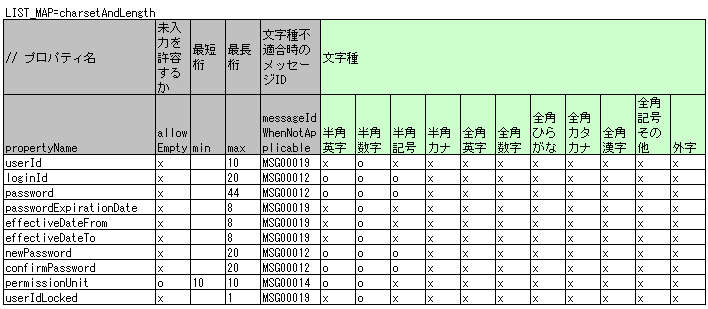
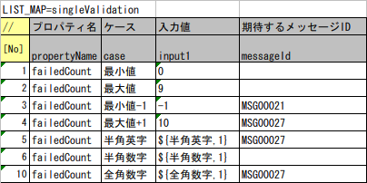
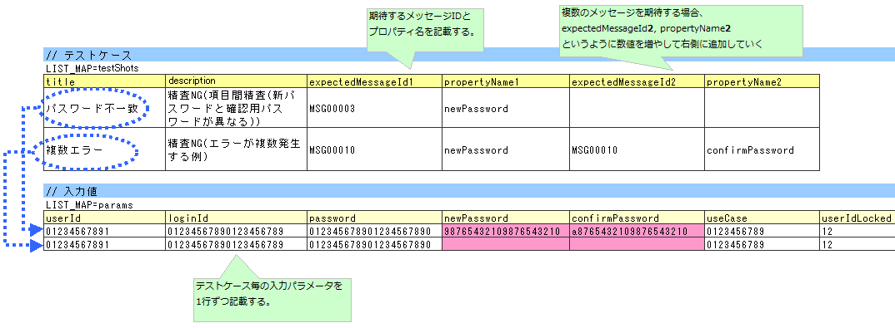
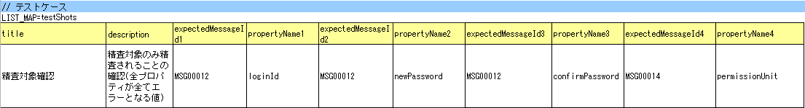
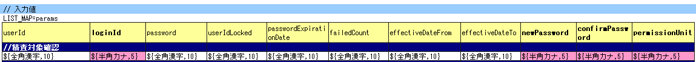
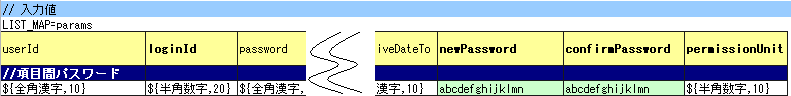
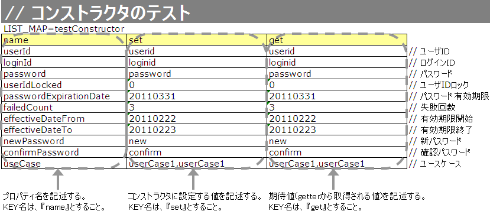

.. _entityUnitTest:

==========================================================
支持Nablarch Validation的Form/Entity类单元测试
==========================================================
本节介绍对使用 :ref:`nablarch_validation` 进行输入值校验的Form及Entity类进行单元测试（以下简称Form单元测试或Entity单元测试）的方法。
由于两者可以几乎相同的方式进行单元测试，因此共通内容以Entity单元测试为基础进行说明，特有处理则单独说明。

.. tip::
   关于Form、Entity的职责，请参考各处理方式的职责分配。
   例： :ref:`Web应用程序的职责分配<application_design>` 、 :ref:`Nablarch批处理应用程序的职责分配<nablarch_batch-application_design>` 

-----------------------------
Form/Entity单元测试的编写方法
-----------------------------
本节示例中使用的测试类和测试数据如下（右键->保存即可下载）。

* :download:`测试类(SystemAccountEntityTest.java)<../_download/SystemAccountEntityTest.java>`
* :download:`测试数据(SystemAccountEntityTest.xlsx)<../_download/SystemAccountEntityTest.xlsx>`
* :download:`测试目标类(SystemAccountEntity.java)<../_download/SystemAccountEntity.java>`  

测试数据的创建
==================
说明如何创建记载测试数据的Excel文件本身。记载测试数据的Excel文件与测试源代码存储在同一目录下，使用相同文件名（仅扩展名不同），与 :ref:`entityUnitTest` 相同。
此外，后述的 :ref:`校验测试用例<entityUnitTest_ValidationCase>` 、 :ref:`构造函数测试用例<entityUnitTest_ConstructorCase>` 、 :ref:`setter、getter测试用例<entityUnitTest_SetterGetterCase>` 分别使用1个工作表。

测试数据记述方法的详细信息，请参考 :doc:`../../../06_TestFWGuide/01_Abstract` 、 :doc:`../../../06_TestFWGuide/02_DbAccessTest` 。

此外，消息数据或代码主数据等存储在数据库中的静态主数据，是以项目中管理的数据已预先投入为前提（不将这些数据作为单独的测试数据创建）。

测试类的创建
==================
Form/Entity单元测试的测试类按以下条件创建。

* 测试类的包与测试目标Form/Entity相同。
* 以<Form/Entity类名>Test的类名创建测试类。
* 继承nablarch.test.core.db.EntityTestSupport。

.. code-block:: java

   package nablarch.sample.management.user; // 【说明】包与SystemAccountEntity相同

   import java.util.HashMap;
   import java.util.Map;

   import org.junit.Test;

   import nablarch.test.core.db.EntityTestSupport;

   import static org.junit.Assert.assertArrayEquals;
   import static org.junit.Assert.assertEquals;

   /**
    * 执行SystemAccountEntity类测试的类。 
    * 测试内容请参考Excel工作表。
    *
    * @author Miki Habu
    * @since 1.0
    */
   public class SystemAccountEntityTest extends EntityTestSupport {
   // 【说明】类名为SystemAccountEntityTest，继承EntityTestSupport
   

   // ～后略～
   
测试方法的记述方法请参考本项以后的代码示例。

.. _entityUnitTest_ValidationCase:

字符类型和字符串长度的单项目校验测试用例
========================================

单项目校验相关的测试用例，大多是关于输入字符类型和字符串长度的。
例如，假设有以下属性。

* 属性名"注音假名"
* 最大字符串长度为50个字符
* 必填项
* 仅允许全角片假名

在这种情况下，将创建如下测试用例。

 =============================================== =========================
 用例                                           验证点             
 =============================================== =========================
 输入全角片假名50个字符，校验成功。              最大字符串长度、字符类型的确认  
 输入全角片假名51个字符，校验失败。              最大字符串长度的确认     
 输入全角片假名1个字符，校验成功。               最小字符串长度、字符类型的确认  
 输入空字符串，校验失败。                        必填校验的确认      
 输入半角片假名，校验失败。                      字符类型的确认 [#]_     
 =============================================== =========================

.. [#] 同样，需要创建输入半角英文字母、全角平假名、汉字等导致校验失败的用例。

这样一来，单项目校验的测试用例数量会变得很多，数据创建的工作量也很大。
因此，我们提供了专门用于单项目校验测试的测试方法。通过使用该方法可获得以下效果。

* 单项目校验测试用例的创建变得容易。
* 可创建高可维护性的测试数据，便于评审和维护。

.. tip::
   本测试方法不适用于将其他Form作为属性保持的Form。在这种情况下，需自行实现校验处理的测试。
   将其他Form作为属性保持的Form是指通过以下形式访问属性的父Form。
   
   .. code-block:: none
   
      <父Form>.<子Form>.<子表单属性名>

测试用例表的创建方法
------------------------

准备以下列。

+--------------------------------+--------------------------------------------------------+
| 列名                       | 记载内容                                               |
+================================+========================================================+
|propertyName                    |测试目标的属性名                                |
+--------------------------------+--------------------------------------------------------+
|allowEmpty                      |该属性是否允许未输入                      |
+--------------------------------+--------------------------------------------------------+
|         min                    |该属性作为输入值允许的最小字符串长度（可选）      |
+--------------------------------+--------------------------------------------------------+
|         max                    |该属性作为输入值允许的最大字符串长度        |
+--------------------------------+--------------------------------------------------------+
|messageIdWhenEmptyInput         |未输入时期望的消息ID（可选） [#]_        |
+--------------------------------+--------------------------------------------------------+
|messageIdWhenInvalidLength      |字符串长度不适配时期望的消息ID（可选） [#]_ |
+--------------------------------+--------------------------------------------------------+
|messageIdWhenNotApplicable      |字符类型不适配时期望的消息ID                    |
+--------------------------------+--------------------------------------------------------+
|半角英文字母                    |是否允许半角英文字母                                    |
+--------------------------------+--------------------------------------------------------+
|半角数字                        |是否允许半角数字                                    |
+--------------------------------+--------------------------------------------------------+
|半角符号                        |是否允许半角符号                                    |
+--------------------------------+--------------------------------------------------------+
|半角片假名                      |是否允许半角片假名                                    |
+--------------------------------+--------------------------------------------------------+
|全角英文字母                    |是否允许全角英文字母                                    |
+--------------------------------+--------------------------------------------------------+
|全角数字                        |是否允许全角数字                                    |
+--------------------------------+--------------------------------------------------------+
|全角平假名                      |是否允许全角平假名                                |
+--------------------------------+--------------------------------------------------------+
|全角片假名                      |是否允许全角片假名                                |
+--------------------------------+--------------------------------------------------------+
|全角汉字                        |是否允许全角汉字                                    |
+--------------------------------+--------------------------------------------------------+
|全角符号其他                    |是否允许全角符号其他                              |
+--------------------------------+--------------------------------------------------------+
|外字                            |是否允许外字                                        |
+--------------------------------+--------------------------------------------------------+

.. [#] 省略messageIdWhenEmptyInput时，使用 :ref:`entityUnitTest_EntityTestConfiguration` 中设置的emptyInputMessageId的值。

.. [#] 省略messageIdWhenInvalidLength时，使用 :ref:`entityUnitTest_EntityTestConfiguration` 中设置的默认值。省略时使用的默认值由max栏及min栏的记载决定，如下所示。

+--------------+----------------+---------------------------------------------------------------+
| min栏的记载  | max和min的比较 | 省略时使用的默认值                                |
+==============+================+===============================================================+
| 无           | （不适用）     | maxMessageId                                                  |
+--------------+----------------+---------------------------------------------------------------+
| 有           | max > min      | maxAndMinMessageId（超过时）、underLimitMessageId（不足时）   |
+--------------+----------------+---------------------------------------------------------------+
| 有           | max = min      | fixLengthMessageId                                            |
+--------------+----------------+---------------------------------------------------------------+

允许与否的填写列中，设置以下值。

========== ======= ========================
设置内容    设置值    备注
========== ======= ========================
允许         o      半角小写英文字母o
不允许       x      半角小写英文字母x
========== ======= ========================

具体示例如下。

测试方法的创建方法
------------------------

调用父类的以下方法。

.. code-block:: java

   void testValidateCharsetAndLength(Class entityClass, String sheetName, String id)

.. code-block:: java

   // 【说明】～前略～

  public class SystemAccountEntityTest extends EntityTestSupport {
    
       /** 测试目标Entity类 */
       private static final Class<SystemAccountEntity> ENTITY_CLASS = SystemAccountEntity.class;

       /**
        * 字符类型及字符串长度的测试用例
        */
       @Test
       public void testCharsetAndLength() {
            // 【说明】记载测试数据的工作表名
            String sheetName = "testCharsetAndLength";        

            // 【说明】测试数据的ID
            String id = "charsetAndLength";

            // 【说明】测试执行
            testValidateCharsetAndLength(ENTITY_CLASS, sheetName, id);
       }

       // 【说明】～后略～

执行此方法时，测试数据每行将按以下验证点执行测试。

+---------------+-----------------------------+---------------------------------------------------+
| 验证点        |输入值                       | 备注                                              |
+===============+=============================+===================================================+
| 字符类型      |半角英文字母                 | max(最大字符串长度)栏中填写长度的字符串构成。     |
+---------------+-----------------------------+                                                   |
| 字符类型      |半角数字                     | max栏省略时，使用min（最小字符串长度）栏中        |
+---------------+-----------------------------+ 填写长度的字符串构成。                            |
| 字符类型      |半角数字                     | max栏、min栏均省略时，                            |
+---------------+-----------------------------+ 使用长度1的字符串构成。                           |
| 字符类型      |半角符号                     |                                                   |
+---------------+-----------------------------+                                                   |
| 字符类型      |半角片假名                   |                                                   |
+---------------+-----------------------------+                                                   |
| 字符类型      |全角英文字母                 |                                                   |
+---------------+-----------------------------+                                                   |
| 字符类型      |全角数字                     |                                                   |
+---------------+-----------------------------+                                                   |
| 字符类型      |全角平假名                   |                                                   |
+---------------+-----------------------------+                                                   |
| 字符类型      |全角片假名                   |                                                   |
+---------------+-----------------------------+                                                   |
| 字符类型      |全角汉字                     |                                                   |
+---------------+-----------------------------+                                                   |
| 字符类型      |全角符号其他                 |                                                   |
+---------------+-----------------------------+                                                   |
| 字符类型      |外字                         |                                                   |
+---------------+-----------------------------+---------------------------------------------------+
| 未输入        |空字符串                     | 长度0的字符串                                     |
+---------------+-----------------------------+---------------------------------------------------+
| 最小字符串    |最小字符串长度的字符串       | 输入值由标记o的字符类型构成。                     |
+---------------+-----------------------------+ min栏省略时，                                     |
| 最长字符串    |最长字符串长度的字符串       | 字符串长度不足的测试不执行。                      |
+---------------+-----------------------------+                                                   |
| 字符串长度不足|最小字符串长度-1的字符串     |                                                   |
+---------------+-----------------------------+                                                   |
| 字符串长度超过|最大字符串长度+1的字符串     |                                                   |
+---------------+-----------------------------+---------------------------------------------------+

其他单项目校验的测试用例
================================

使用前述字符类型和字符串长度的单项目校验测试用例虽然可以测试大部分单项目校验，但部分校验无法覆盖。
例如，数值输入项的范围校验。

为此类单项目校验的测试也准备了可简易测试的机制。
通过为各属性记述1个输入值和期望的消息ID的配对，可使用任意值进行单项目校验的测试。

.. tip::
   本测试方法不适用于将其他Form作为属性保持的Form。在这种情况下，需自行实现校验处理的测试。
   将其他Form作为属性保持的Form是指通过以下形式访问属性的父Form。
   
   .. code-block:: none
   
      <父Form>.<子Form>.<子表单属性名>

测试用例表的创建方法
------------------------

准备以下列。

+-----------------------------+--------------------------------------------------+
| 列名                        | 记载内容                                         |
+=============================+==================================================+
|propertyName                 |测试目标的属性名                                  |
+-----------------------------+--------------------------------------------------+
|case                         |测试用例的简单说明                                |
+-----------------------------+--------------------------------------------------+
|input1 [#]_                  |输入值 [#]_                                       |
+-----------------------------+--------------------------------------------------+
|messageId                    |使用上述输入值进行单项目校验时期望发生的消息ID    |
|                             |（期望不发生校验错误时留空）                      |
+-----------------------------+--------------------------------------------------+

.. [#] 要为1个键指定多个参数时，增加input2, input3等列。

.. [#] 使用 :ref:`special_notation_in_cell` 的记法可高效创建输入值。

具体示例如下。

测试方法的创建方法
------------------------

调用父类的以下方法。

.. code-block:: java

   void testSingleValidation(Class entityClass, String sheetName, String id)

.. code-block:: java

 // 【说明】～前略～

 public class SystemAccountEntityTest extends EntityTestSupport {
    
      /** 测试目标Entity类 */
      private static final Class<SystemAccountEntity> ENTITY_CLASS = SystemAccountEntity.class;

      /**
       * 字符类型及字符串长度的单项目校验测试用例
       */
      // 【说明】～中略～

      /**                              
       * 单项目校验的测试用例（上述以外）          
       */                              
      @Test                          
      public void testSingleValidation() {          
          String sheetName = "testSingleValidation";  
          String id = "singleValidation";              
          testSingleValidation(ENTITY_CLASS, sheetName, id);
      }                                                     

       // 【说明】～后略～

验证方法的测试用例
====================================

上述单项目校验测试中，测试了Entity的setter方法附加的注解是否正确，但Entity中实现的验证方法 [#]_ 未被执行。

因此，如Entity中实现了自定义验证方法，需另行创建测试。

.. [#] ``@ValidateFor`` 注解附加的static方法

测试用例表的创建
--------------------

* ID固定为"testShots"。
* 准备以下列。

 +---------------------------------+-----------------------------------------------+
 | 列名                            | 记载内容                                      |
 +=================================+===============================================+
 | title                           | 测试用例的标题                                |
 +---------------------------------+-----------------------------------------------+
 | description                     | 测试用例的简单说明                            |
 +---------------------------------+-----------------------------------------------+
 |expectedMessageId *n* [#]_       | 期望的消息（ *n* 是从1开始的序号 ）            |
 +---------------------------------+-----------------------------------------------+
 | propertyName *n*                | 期望的属性（ *n* 是从1开始的序号 ）            |
 +---------------------------------+-----------------------------------------------+

.. [#] 期望多个消息时，增加expectedMessageId2, propertyName2等列向右添加。

* 输入参数表的创建

  * ID固定为"params"。
  * 上述测试用例表对应的输入参数 [#]_ 逐行记载。

.. [#] 使用 :ref:`special_notation_in_cell` 的记法可高效创建输入值。

具体示例如下。

测试用例、测试数据的创建
--------------------------------

.. _entityUnitTest_ValidationMethodSpecifyNormal:

校验目标确认
~~~~~~~~~~~~

指定了校验目标的属性（ :ref:`nablarch_validation` 参照）时，需创建确认该指定是否正确的用例。

为所有属性准备各自在单项目校验中报错的数据。如校验目标属性的指定正确，则只有校验目标的属性会进行单项目校验。
因此，期望值为填写所有校验目标属性名和各属性单项目校验错误时的消息ID。

.. tip::
 如校验目标属性误从校验目标中遗漏，期望的消息不会输出，导致消息ID的断言失败。
 此外，如非校验目标的属性误成为校验目标，由于输入值不正确导致单项目校验失败，输出预期外的消息。
 由此可检测校验目标的错误。

测试用例表中，填写所有校验目标属性的属性名和该属性单项目校验错误消息ID。

输入参数表中，为所有属性填写各自在单项目校验中报错的值。

.. tip::

   创建Form单元测试的测试用例或测试数据时，有时需要指定 **属性保持的其他Form的属性** 。
   在这种情况下，可按以下方式指定。
   
   * Form的代码示例
   
   .. code-block:: java
   
     public class SampleForm {

         /** 系统用户 */
         private SystemUserEntity systemUser;

         /** 电话号码数组 */
         private UserTelEntity[] userTelArray;
     
         // 【说明】属性以外省略
     
     }

   * 指定保持的Form的属性的方法（指定SystemUserEntity.userId时）
   
   .. code-block:: none
   
      sampleForm.systemUser.userId

   * 指定Form数组元素属性的方法（指定UserTelEntity数组首元素属性时）
   
   .. code-block:: none
   
      sampleForm.userTelArray[0].telNoArea

项目间校验等
~~~~~~~~~~~~~~

项目间校验等，验证方法的 :ref:`entityUnitTest_ValidationMethodSpecifyNormal` 
中进行的校验目标指定以外的动作确认的用例。

下图中，创建了针对"newPassword与confirmPassword相等"的验证方法的正常系用例。

测试方法的创建方法
------------------------

显示使用至此创建的测试用例、数据的测试方法。通过修改以下代码的变量内容，可对应不同Entity的校验测试。

.. code-block:: java

    // ～前略～

    /** 测试目标Entity类 */
    private static final Class<SystemAccountEntity> ENTITY_CLASS = SystemAccountEntity.class;

    // ～中略～
    /**
     * SystemAccountEntity.validateForRegisterUser的测试。
     */
    @Test
    public void testValidateForRegisterUser() {
        // 校验执行
        String sheetName = "testValidateForRegisterUser";
        String validateFor = "registerUser";
        testValidateAndConvert(ENTITY_CLASS, sheetName, validateFor);
    }

   // ～后略～

.. _entityUnitTest_ConstructorCase:

构造函数的测试用例
==================================

使用Nablarch Validation进行输入值校验的Entity，如 :ref:`nablarch_validation-execute` 中所述
实现了以 ``Map<String, Object>`` 为参数的构造函数，需要创建对此构造函数的测试。

构造函数测试中，创建确认参数指定的值是否正确设置到属性的用例。此时作为目标的属性，是Entity中定义的所有属性。
测试数据中，准备属性名及要设置到该属性的数据和期望值（与getter获取的值进行比较的数据）。

下图中，各属性指定了如下值。测试中，确认将这些值的组合传给构造函数时，各属性是否设置了指定的值（调用getter，能否获取预期值）。

实际测试代码中，构造函数的值设置及值确认在自动测试框架提供的方法内执行。详情请参考 :ref:`测试代码<test-constructor-java-label>` 。

.. tip::
   
   Entity是自动生成的，因此可能生成应用程序中不使用的构造函数。这种情况下请求单元测试无法测试，因此必须在Entity单元测试中测试构造函数。
   
   另一方面，一般Form的情况下，只创建应用程序使用的构造函数。因此，可在请求单元测试中测试构造函数。
   所以，一般Form不需要在类单元测试中测试构造函数。

在Excel中定义
-------------

上述设置值的测试内容（摘录）

=============== =========================== ================================
属性            设置到构造函数的值          期望值（从getter获取的值）
=============== =========================== ================================
userId          userid                      userid
loginId         loginid                     loginid
password        password                    password
=============== =========================== ================================

.. _test-constructor-java-label:

使用此数据的测试方法如下所示。

.. code-block:: java

   // 【说明】～前略～

   public class SystemAccountEntityTest extends EntityTestSupport {

        /** 构造函数的测试 */
        @Test
        public void testConstructor() {
            Class<?> entityClass = SystemAccountEntity.class;
            String sheetName = "testAccessor";
            String id = "testConstructor";
            testConstructorAndGetter(entityClass, sheetName, id);
        }

   }

.. _testConstructorAndGetter-note-label:

.. tip::

  testConstructorAndGetter可测试的属性类型（类）有限制。
  如不属于以下类型（类），需在各测试类中显式调用构造函数和getter进行测试。

  * String及String数组
  * BigDecimal及BigDecimal数组
  * java.util.Date及java.util.Date数组（在Excel中以yyyy-MM-dd格式或yyyy-MM-dd HH:mm:ss格式记述）
  * 具有valueOf(String)方法的类及其数组类（例如Integer、Long、java.sql.Date、java.sql.Timestamp等）

  以下显示个别测试实施方法的示例。此示例中，假设Form具有 ``List<String>`` 类型的属性 ``users`` 。

    * 在Excel中记述数据的示例

      .. image:: ../_image/entityUnitTest_ConstructorOther.png
        :scale: 80

    

    * 测试代码示例

      .. code-block:: java

       /** 构造函数的测试 */
       @Test
       public void testConstructor() {
           // 【说明】
           // 可通用测试的项目，使用testConstructorAndGetter进行测试。
           Class<?> entityClass = SystemAccountEntity.class;
           String sheetName = "testAccessor";
           String id = "testConstructor";
           testConstructorAndGetter(entityClass, sheetName, id);

           // 【说明】
           // 不可通用测试的项目，单独进行测试。

           // 【说明】
           // 调用getParamMap，获取要单独测试的属性的测试数据。
           // （测试目标的属性有多个时，使用getListParamMap。）
           Map<String, String[]> data = getParamMap(sheetName, "testConstructorOther");

           // 【说明】从Map<String, String[]>转换为Entity构造函数参数Map<String, Object>
           Map<String, Object> params = new HashMap<String, Object>();
           params.put("users", Arrays.asList(data.get("set")));

           // 【说明】以上述生成的Map<String, Object>为参数生成Entity。
           SystemAccountEntity entity = new SystemAccountEntity(params);

           // 【说明】调用getter，确认返回期望的值。
           assertEquals(entity.getUsers(), Arrays.asList(data.get("get")));

       }

.. _entityUnitTest_SetterGetterCase:

setter、getter的测试用例
==================================

请参考 :ref:`entityUnitTest_SetterGetterCase_BeanValidation` 。

.. _entityUnitTest_EntityTestConfiguration:

自动测试框架设置值
==============================

说明执行 :ref:`entityUnitTest_ValidationCase` 时必需的初始值设置。

设置项目一览
------------

使用 ``nablarch.test.core.entity.EntityTestConfiguration`` 类，在组件设置文件中设置以下值（全部项目必填）。

+--------------------+----------------------------------------------+
|     设置项目名     |说明                                          |
+====================+==============================================+
|maxMessageId        |最大字符串长度超过时的消息ID                  |
+--------------------+----------------------------------------------+
|maxAndMinMessageId  |最长最小字符串长度范围外的消息ID(可变长)      |
+--------------------+----------------------------------------------+
|fixLengthMessageId  |最长最小字符串长度范围外的消息ID(固定长)      |
+--------------------+----------------------------------------------+
|underLimitMessageId |字符串长度不足时的消息ID                      |
+--------------------+----------------------------------------------+
|emptyInputMessageId |未输入时的消息ID                              |
+--------------------+----------------------------------------------+
|characterGenerator  |字符串生成类 [#]_                             |
+--------------------+----------------------------------------------+

.. [#] ``nablarch.test.core.util.generator.CharacterGenerator`` 的实现类。此类生成测试用输入值。
 通常，使用 ``nablarch.test.core.util.generator.BasicJapaneseCharacterGenerator`` 即可。

设置的消息ID需与验证器的设置值匹配。

（参考以下记述示例）

组件设置文件的记述示例
------------------------------------

显示使用以下设置值时的组件设置文件记述示例。

**【校验类的组件设置文件】**

.. code-block:: xml

    <property name="validators">
      <list>
        <component class="nablarch.core.validation.validator.RequiredValidator">
          <property name="messageId" value="MSG00010"/>
        </component>
        <component class="nablarch.core.validation.validator.LengthValidator">
          <property name="maxMessageId" value="MSG00011"/>
          <property name="maxAndMinMessageId" value="MSG00011"/>
          <property name="fixLengthMessageId" value="MSG00023"/>
        </component>
        <!-- 中略 -->
    </property>

**【测试的组件设置文件】**

.. code-block:: xml
 
  <!-- Entity测试设置 -->
  <component name="entityTestConfiguration" class="nablarch.test.core.entity.EntityTestConfiguration">
    <property name="maxMessageId"        value="MSG00011"/>
    <property name="maxAndMinMessageId"  value="MSG00011"/>
    <property name="fixLengthMessageId"  value="MSG00023"/>
    <property name="underLimitMessageId" value="MSG00011"/>
    <property name="emptyInputMessageId" value="MSG00010"/>
    <property name="characterGenerator">
      <component name="characterGenerator"
                 class="nablarch.test.core.util.generator.BasicJapaneseCharacterGenerator"/>
    </property>
  </component>
