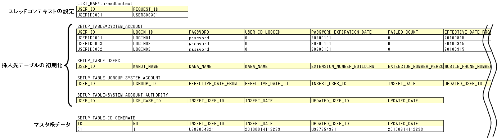
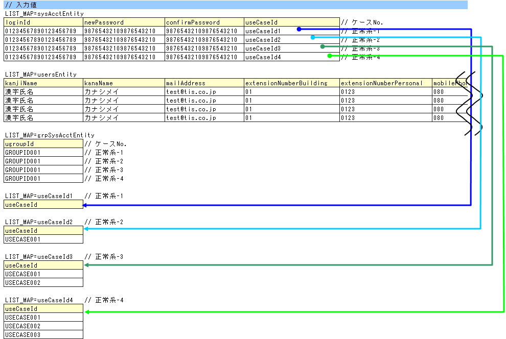
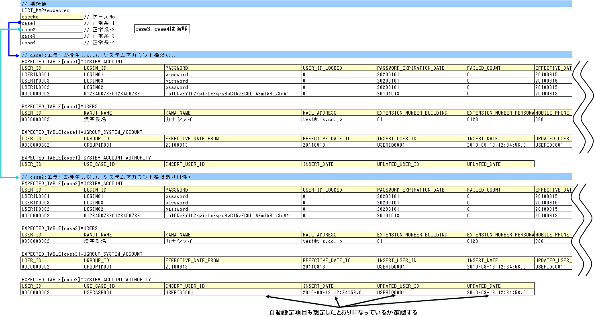
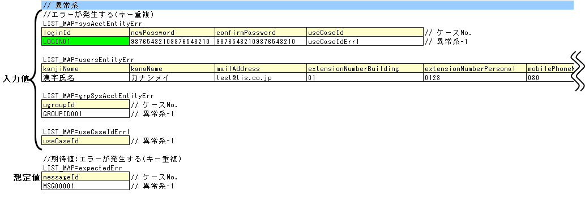

.. _componentUnitTest:

======================================
Action/Component的类单元测试
======================================
本项介绍Action/Component的类单元测试中的Component类单元测试（以下简称Component单元测试）。
另外，Action的类单元测试（以下简称Action单元测试）与之的区别仅在于测试类名部分。

--------------------------------------
Action/Component单元测试的编写方法
--------------------------------------
本节示例中使用的测试类和测试数据如下（右键->保存即可下载）。

* :download:`测试用例一览(用户注册_UserComponent_类单元测试用例.xlsx)<./_download/用户注册_UserComponent_类单元测试用例.xlsx>`
* :download:`测试类(UserComponentTest.java)<./_download/UserComponentTest.java>`
* :download:`测试数据(UserComponentTest.xlsx)<./_download/UserComponentTest.xlsx>`
* :download:`测试目标类(UserComponent.java)<./_download/UserComponent.java>`

本项以用户注册用方法(UserComponent#registerUser)为例进行说明。

测试用例执行的分类
==============================
根据测试用例一览和测试目标方法，测试用例分为以下4类。这是因为根据所属分类不同，测试类和数据的创建方法有所差异。

============================================================== ========================
分类                                                           适用的处理示例
============================================================== ========================
必须确认返回值（数据库查询结果）的处理                          查询处理
必须确认返回值（数据库查询结果以外）的处理                      计算、判定处理
必须确认处理结束后数据库状态的处理                              更新（含插入、删除）处理
必须确认消息ID的处理                                            错误处理
============================================================== ========================

本例为数据库插入处理、有重复注册时错误处理，因此测试用例分为"必须确认处理结束后数据库状态的处理"和"必须确认消息ID的处理"两类。

测试数据和测试类的创建
================================
关于 :ref:`componentUnitTest_Setup` 、 :ref:`componentUnitTest_DB` 、 :ref:`componentUnitTest_messageID` 的各自测试数据和测试类的创建方法说明如下。
首先说明测试数据（Excel文件）本身及测试类的创建方法（应继承的类等）。然后按分类说明数据和测试方法的创建方法。

测试数据的创建
------------------
记载测试数据的Excel文件，与 :ref:`entityUnitTest` 相同，存储在与测试源代码相同的目录下，使用相同文件名（仅扩展名不同）。
此外，所有测试数据记载在同一Excel工作表中的前提。

测试数据记述方法的详细信息，请参考 :doc:`../../06_TestFWGuide/01_Abstract` 、 :doc:`../../06_TestFWGuide/02_DbAccessTest` 。

此外，消息数据或代码主数据等存储在数据库中的静态主数据，是以项目中管理的数据已预先投入为前提（不将这些数据作为单独的测试数据创建）。

测试类的创建
------------------
Component单元测试的测试类按以下条件创建。详情请参考 :doc:`../../06_TestFWGuide/02_DbAccessTest` 。

* 测试类的包与测试目标Action/Component相同。
* 以<Action/Component类名>Test的类名创建测试类。
* 继承nablarch.test.core.db.DbAccessTestSupport。

.. code-block:: java

   package nablarch.sample.management.user; // 【说明】包与UserComponent相同

   import static org.junit.Assert.assertEquals;
   import static org.junit.Assert.assertTrue;
   import static org.junit.Assert.fail;

   import java.util.HashMap;
   import java.util.List;
   import java.util.Map;
   import java.util.Map.Entry;

   import nablarch.core.db.statement.SqlResultSet;
   import nablarch.core.message.ApplicationException;
   import nablarch.test.core.db.DbAccessTestSupport;

   import org.junit.Test;

   /**
    * {@link UserComponentTest}的测试类。
    * 
    * @author Tsuyoshi Kawasaki
    * @since 1.0
    */
   public class UserComponentTest extends DbAccessTestSupport {
   // 【说明】类名为UserComponentTest，继承DbAccessTestSupport
   
   // ～后略～

.. _componentUnitTest_Setup:

事前准备数据的创建处理
------------------------
创建事前数据和事前数据投入处理。本例中，创建如下数据。

* 线程上下文 [#]_ 的设置
  
  * USER_ID:用户ID。USERID0001。
  * REQUEST_ID:请求ID。USERS00301。

* 插入目标表的初始化

  * SYSTEM_ACCOUNT:系统账户表。初始数据3件。
  * USERS:用户表。初始数据0件。
  * UGROUP_SYSTEM_ACCOUNT:组系统账户表。初始数据0件。
  * SYSTEM_ACCOUNT_AUTHORITY:系统账户权限表。初始数据0件。

* 主系数据的投入

  * ID_GENERATE:编号表。注册时进行编号处理。如未初始化编号表，测试执行时的编号结果将无法预知，无法验证插入结果。

.. [#]

  线程上下文是指存储用户ID、请求ID、使用语言等，执行一系列处理时在调用栈的多个方法中共同需要的数据的对象。

读取这些数据的处理如下所示。

.. code-block:: java

   // ～前略～

   /**
    * {@link UserComponent#registerUser()}的测试1。 
    * 正常系。
    */
   @Test
   public void testRegisterUser1() {
       String sheetName = "registerUser";

       setThreadContextValues(sheetName, "threadContext"); // 【说明】线程上下文的设置

   // ～中略～

        for (int i = 0; i < sysAcctDatas.size(); i++) { 

   // ～中略～

           // 数据库准备
           setUpDb(sheetName); // 【说明】事前数据的投入。
                               // 【说明】因每个用例都需初始化，故在循环中执行。

   // ～后略～

.. _componentUnitTest_DB:

必须确认处理结束后数据库状态的处理
----------------------------------------------------------

.. _componentUnitTest_inputData_normal:

测试数据（输入值）的创建
~~~~~~~~~~~~~~~~~~~~~~~~~~
准备测试目标方法的参数。本例中，需要以下3个。另外，各数据同行组成1组测试数据（例如，sysAcctEntity的第1行、usersEntity的第1行、grpSysAcctEntity的第1行组成1个用例）。

* sysAcctEntity:系统账户实体的数据
* usersEntity:用户实体的数据
* grpSysAcctEntity:组系统账户实体的数据

sysAcctEntity的useCaseId不是useCaseId属性设置的值本身（SystemAccountEntity的useCaseId属性是数组），而是图中箭头所指的另一表数据。测试代码中，将获取的值作为键进一步获取数据、创建数组，设置到useCaseId属性。

.. code-block:: java

   // ～前略～

   public void testRegisterUser1() {
       String sheetName = "registerUser";
               
       setThreadContextValues(sheetName, "threadContext");
       
       List<Map<String, String>> sysAcctDatas = getListMap(sheetName, "sysAcctEntity");
       List<Map<String, String>> usersDatas = getListMap(sheetName, "usersEntity");
       List<Map<String, String>> grpSysAcctDatas = getListMap(sheetName, "grpSysAcctEntity");
       // 临时接收Excel数据的Map、List
       Map<String, Object> work = new HashMap<String, Object>();
       List<Map<String, String>> useCaseData = null;
       
       SystemAccountEntity sysAcct = null;
       UsersEntity users = null;
       UgroupSystemAccountEntity grpSysAcct = null;
       for (int i = 0; i < sysAcctDatas.size(); i++) {

   // ～中略～

           // 系统账户  // 【说明】SystemAccountEntity的准备
           work.clear();
           for (Entry<String, String> e : sysAcctDatas.get(i).entrySet()) {
               work.put(e.getKey(), e.getValue());
           }
           // 用例ID的参数创建
           String id = sysAcctDatas.get(i).get("useCaseId"); // 【说明】获取图中箭头根部的表ID
           useCaseData = getListMap(sheetName, id); // 【说明】使用获取的ID获取图中箭头先端的数组数据
           String[] useCaseId = new String[useCaseData.size()]; // 【说明】创建数组
           for (int j = 0; j < useCaseData.size(); j++) {
               useCaseId[j] = useCaseData.get(j).get("useCaseId");
           }
           work.put("useCase", useCaseId); // 【说明】将创建的数组设置到SystemAccountEntity构造函数的参数Map中
           sysAcct = new SystemAccountEntity(work);
           
           // 用户  // 【说明】UsersEntity的准备
           work.clear();
           for (Entry<String, String> e : usersDatas.get(i).entrySet()) {
               work.put(e.getKey(), e.getValue());
           }
           users = new UsersEntity(work);

           // 组系统账户  // 【说明】UgroupSystemAccountEntity的准备
           work.clear();
           for (Entry<String, String> e : grpSysAcctDatas.get(i).entrySet()) {
               work.put(e.getKey(), e.getValue());
           }
           grpSysAcct = new UgroupSystemAccountEntity(work);

           // 执行
           target.registerUser(sysAcct, users, grpSysAcct);
           commitTransactions();   // 【说明】提交所有事务

           // 验证
           String expectedGroupId = getListMap(sheetName, "expected").get(i).get("caseNo");
           assertTableEquals(expectedGroupId, sheetName, expectedGroupId);

   // ～后略～

.. tip::

 上述源代码中，使用getListMap方法从Excel工作表读取数据。
 getListMap方法的详情请参考 :doc:`../../06_TestFWGuide/03_Tips` 的
 :ref:`how_to_get_data_from_excel` 。 

类单元测试中，由于直接从测试类启动访问数据库的类，
框架不进行事务控制。
必须确认处理结束后数据库状态的情况下，测试类中需要提交事务。
  
调用父类的 ``commitTransactions()`` 方法提交。
如未提交事务，测试结果确认将无法正常进行。
（参照系测试无需提交）

测试数据（预期结果）的创建
~~~~~~~~~~~~~~~~~~~~~~~~~~~~
按测试用例准备预期结果。除应用程序设置的项外，自动设置项（ :ref:`database-common_bean` 参照）也需准备预期结果。验证使用"assertTableEquals"方法。

示例应用程序中，准备了定义组ID（ :ref:`tips_groupId` 参照）的数据(expected)，将其作为assertTableEquals的参数，以对应多个预期结果。

.. code-block:: java

   // ～前略～

   /**
    * {@link UserComponent#registerUser()}的测试1。 
    * 正常系。
    */
   @Test
   public void testRegisterUser1() {
       String sheetName = "registerUser";

   // ～中略～

        for (int i = 0; i < sysAcctDatas.size(); i++) {

   // ～中略～

            // 验证
            // 【说明】获取组ID
            String expectedGroupId = getListMap(sheetName, "expected").get(i).get("caseNo"); 
            // 【说明】将获取的组ID作为参数执行assertTableEquals
            assertTableEquals(expectedGroupId, sheetName, expectedGroupId); 

   // ～后略～

case1为例，预期结果如下。

======================== ===============================================================================================
表名                     预期
======================== ===============================================================================================
SYSTEM_ACCOUNT           :ref:`componentUnitTest_Setup` 所示记录+1条记录追加。总计4条记录。
USERS                    追加1条记录。（ :ref:`componentUnitTest_Setup` 中初始化为0件，测试目标处理追加1条记录）
UGROUP_SYSTEM_ACCOUNT    追加1条记录。（ :ref:`componentUnitTest_Setup` 中初始化为0件，测试目标处理追加1条记录）
SYSTEM_ACCOUNT_AUTHORITY 无变化（无新增）。
======================== ===============================================================================================

.. _componentUnitTest_messageID:

必须确认消息ID的处理
----------------------------------------

测试数据（输入值和预期值）的创建
~~~~~~~~~~~~~~~~~~~~~~~~~~~~~~~~~~

与 :ref:`前项测试数据（输入值）的创建<componentUnitTest_inputData_normal>` 相同创建测试数据（输入值）。此处，
通过在 :ref:`前项<componentUnitTest_inputData_normal>` 指定ID的末尾添加"Err"，在同一Excel工作表内混载正常系和异常系数据。另外，
预期值为消息ID。

此处应确认的内容是由唯一键约束违反导致的异常发生。测试代码中，捕获目标异常，比较消息ID进行验证。

.. important::

  捕获的异常应为预期发生的异常，不要使用RuntimeException等上层异常类。否则将无法检测消息ID正确但异常本身错误的缺陷。

.. code-block:: java

   // ～前略～

   /**
    * {@link UserComponent#registerUser()}的测试2。 
    * 异常系。
    */
   @Test
   public void testRegisterUser2() {
       String sheetName = "registerUser";

   // ～中略～

           // 执行
           try {
               target.registerUser(sysAcct, users, grpSysAcct); // 【说明】执行测试目标方法
               fail(); // 【说明】如未发生异常则测试失败
           } catch (ApplicationException ae) { // 【说明】捕获应发生的异常
               // 【说明】验证消息ID
               assertEquals(expected.get(i).get("messageId"), ae.getMessages().get(0).getMessageId()); 
           }
       }
   }

   // ～后略～

