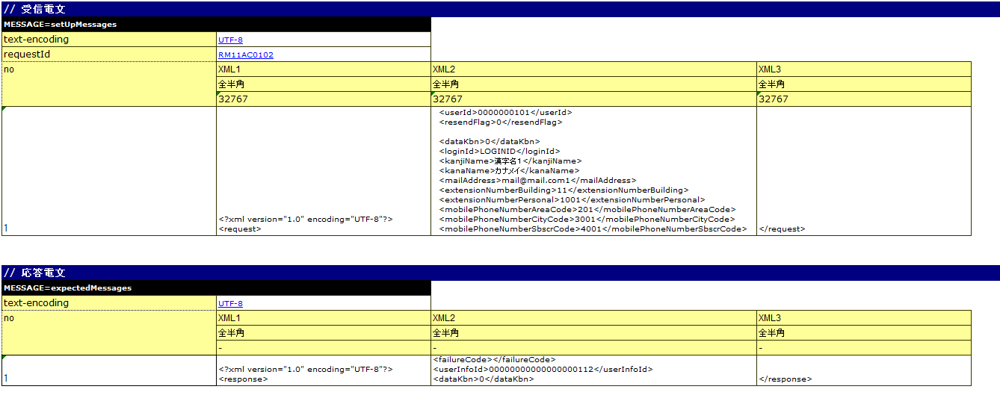

====================================================================
请求单元测试的实施方法（HTTP同步响应消息接收处理）
====================================================================

请求单元测试的实施方法，请参考 :ref:`real_request_test` 。

本节说明与 :ref:`real_request_test` 描述方法不同的部分。

--------------------
测试数据的写法
--------------------

测试镜头一览
==================

使用LIST_MAP的数据类型记载1个测试方法分的测试镜头表。ID为\ **testShots**\ 。

HTTP同步响应消息接收处理特有的内容如下所示。

================== ============================================================================================== =======
列名               说明                                                                                           必填   
================== ============================================================================================== =======
diConfig           记载HTTP同步响应消息接收请求单元测试用组件设置文件的路径                                           必填   
                   |br|
                   (例：http-messaging-test-component-configuration.xml)。                                               

expectedStatusCode 使用JSON及XML数据格式时留空。                                                                   必填   
                                                                                                                          
requestPath        执行Action的URL去掉主机名的部分。                                                               必填   
                   |br|
                   例如Action执行的URL为「http://127.0.0.1/msgaction/ss11AC/RM11AC0102」时，
                   |br|
                   则变为「/msgaction/ss11AC/RM11AC0102」。                                                              

userId             认证授权检查使用的用户ID                                                                       必填   
================== ============================================================================================== =======

.. tip::
 使用JSON及XML数据格式时，状态码的比较也通过Excel文件的消息体进行比较。这是因为框架控制头也包含在消息体中。
 

各种准备数据
==============

说明测试实施时所需的各种准备数据的描述方法。
批处理中需要准备数据库和请求消息。

请求消息
--------------------

记载作为测试输入数据的请求电文。示例如下。

-----

 MESSAGE=setUpMessages

 // 共通信息（指令、框架控制头）

 +------------------+--------------+------------+
 | text-encoding    | Windows-31J  |            |
 +------------------+--------------+------------+
 | requestId        | RM11AC0102   |            |
 +------------------+--------------+------------+

 // 消息体

【XML】

 +------------------+--------------------------------------------+---------------------------------+------------+
 | no               | XML1                                       | XML2                            | XML3       |
 +------------------+--------------------------------------------+---------------------------------+------------+
 |                  | 全半角                                     | 全半角                          | 全半角     |
 +------------------+--------------------------------------------+---------------------------------+------------+
 |                  | 32767                                      | 32767                           | 32767      |
 +==================+============================================+=================================+============+
 | 1                |<?xml version="1.0" encoding="UTF-8"?> |br| |<userId>0000000101</userId> |br| | </request> |
 |                  |<request>                                   |<resendFlag>0</resendFlag> |br|  |            |
 |                  |                                            |<dataKbn>0</dataKbn>             |            |
 +------------------+--------------------------------------------+---------------------------------+------------+

【JSON】

 +------------------+-----------------------------------------+
 | no               | JSON                                    |
 +------------------+-----------------------------------------+
 |                  | 全半角                                  |
 +------------------+-----------------------------------------+
 |                  | 32767                                   |
 +==================+=========================================+
 | 1                | {                                       |
 |                  |                                         |
 |                  |      "userId" : "0000000101", |br|      |
 |                  |      "resendFlag" : "0", |br|           |
 |                  |      "dataKbn" : "0", |br|              |
 |                  |                                         |
 |                  | }                                       |
 |                  |                                         |
 +------------------+-----------------------------------------+

------

1. 首行

 为测试目标请求准备请求电文。名称固定为\ ``MESSAGE=setUpMessages``\ 。

2. 共通信息

 名称的次行以后记载以下信息。这些值将成为请求消息的所有消息的共用值。

 * 指令
 * 框架控制头

 格式为key-value形式。

  +----+----+
  |键  |值  |
  +----+----+

.. important::

  当在项目中更改框架控制头的项目时，
  需要在properties文件中按以下方式以 ``reader.fwHeaderfields`` 为键指定框架控制头名。

  .. code-block:: properties

    # 以逗号分隔指定框架控制头名。
    reader.fwHeaderfields=requestId,addHeader

3. 消息体

记载框架控制头以后的消息。

 +------------+---------------+----------------------------------------+
 |行          |描述内容       |备注                                    |
 +============+===============+========================================+
 |第1行       |字段名称       |首单元格为"no"。                        |
 +------------+---------------+----------------------------------------+
 |第2行       |数据类型       |首单元格为空                            |
 +------------+---------------+----------------------------------------+
 |第3行       |字段长         |首单元格为空                            |
 +------------+---------------+----------------------------------------+
 |第4行以后   |XML数据 |br|   |首单元格为从1开始的序号 |br|            |
 |            |及 |br|        |也可以跨字段记载                        |
 |            |JSON数据       |                                        |
 +------------+---------------+----------------------------------------+

.. tip::
 使用JSON及XML数据格式时，请在1个Excel工作表中只记载1个测试用例。
 
 这是由于NTF的约束，期望消息体的Excel各行字符串长度相同。JSON及XML数据格式通常每个请求的请求电文长度都不同，因此实际上只能记载1个测试用例。

.. important::
 字段名称\ **不允许重复名称**\ 。
 例如，不能存在2个以上的「姓名」字段。
 （通常，这种情况下会赋予「正式会员姓名」和「家族会员姓名」等唯一的字段名称）
 
各种期待值
==========

响应消息
--------------------

与\ `请求消息`_\ 相同。

但是，名称变为\ ``MESSAGE=expectedMessages``\ 。

应答电文的字段长设置为"-"(连字符)。

.. |br| raw:: html

   
