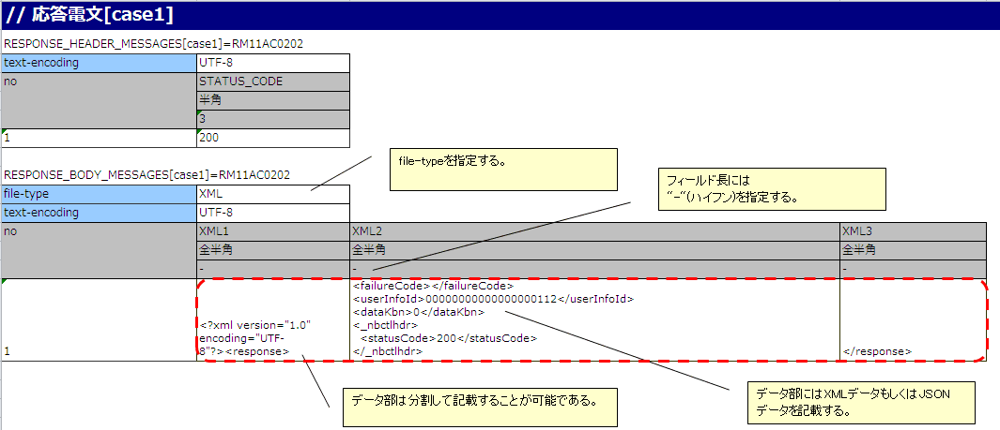
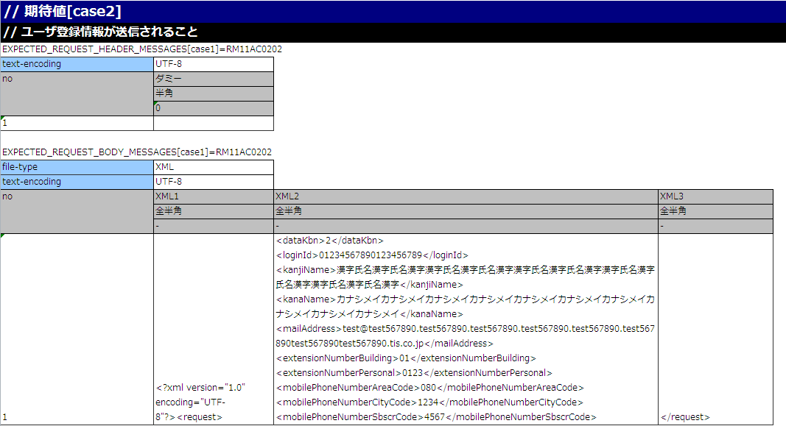
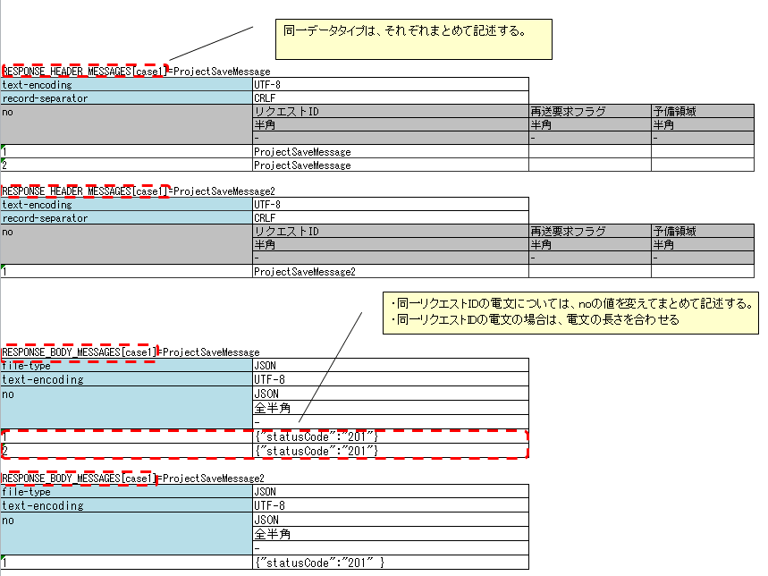
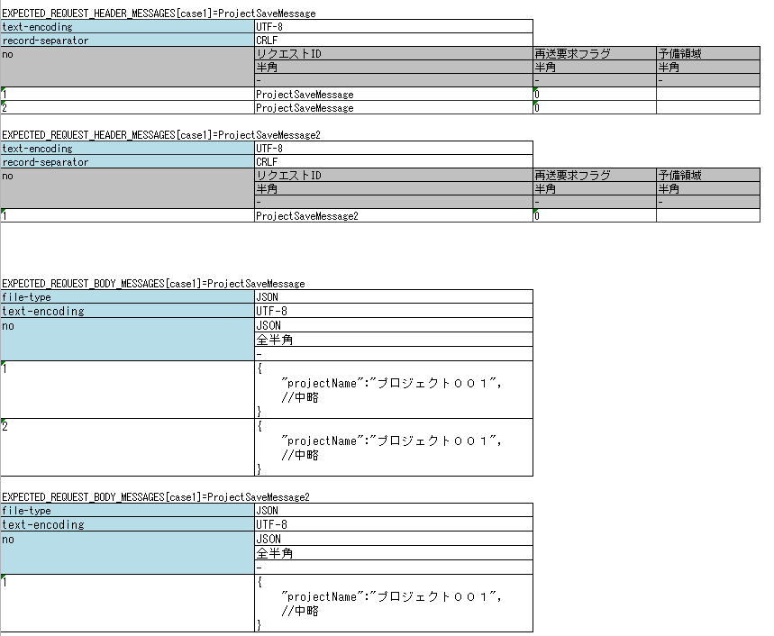
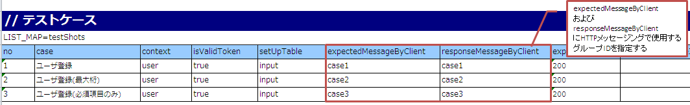
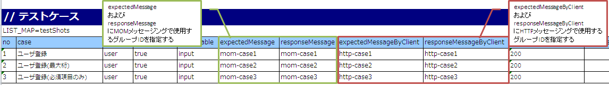

.. _`message_httpSendSyncMessage_test`:

=============================================================================
请求单元测试的实施方法(HTTP同步响应消息发送处理)
=============================================================================

请求单元测试实施方法请参考\ :ref:`message_sendSyncMessage_test`\ 。

但是，请将「发送队列」「接收队列」替换为「通信目标」进行阅读。

本项说明与\ :ref:`message_sendSyncMessage_test`\ 不同的地方。

.. _`http_send_sync_request_write_test_data`:

--------------------
测试数据的编写方法
--------------------

发送1次报文时的请求报文期望值以及返回的响应报文（响应消息）的示例
~~~~~~~~~~~~~~~~~~~~~~~~~~~~~~~~~~~~~~~~~~~~~~~~~~~~~~~~~~~~~~~~~~~~~~~~~~~~~~~~~~~~~~~~~~~

以下显示发送1次报文时返回的响应报文的描述示例。

.. tip::
 RESPONSE_BODY_MESSAGES(及后面示例中使用的EXPECTED_REQUEST_BODY_MESSAGES)可以分割到多个字段中记述。

 如果字符串很长，全部记在1个单元格中会降低可读性，此时可以分割记述。

 分割时，「字段名」指定任意字符串。上述示例中使用 ``XML1`` 、 ``XML2`` 、 ``XML3`` 。

以下显示发送1次报文时请求报文期望值的描述示例。

.. tip::
 使用JSON及XML数据格式时，1个Excel工作表中只记述1个测试用例。
 
 这是因为NTF有约束，期望消息主体的Excel各行字符串长度相同。JSON及XML数据格式通常每个请求的请求报文长度不同，因此实际上只能记述1个测试用例。

发送2次以上报文时的请求报文期望值以及返回的响应报文（响应消息）的示例
~~~~~~~~~~~~~~~~~~~~~~~~~~~~~~~~~~~~~~~~~~~~~~~~~~~~~~~~~~~~~~~~~~~~~~~~~~~~~~~~~~~~~~~~~~~~~~~

测试多次发送报文时，请注意测试框架的以下规格进行记述。

* 同一数据类型(以下示例中为 ``RESPONSE_HEADER_MESSAGES`` 和 ``RESPONSE_BODY_MESSAGES`` )，分别一起记述。详情请参考 \ :ref:`tips_groupId`\ 及 \ :ref:`auto-test-framework_multi-datatype`\ 。
* 同一请求ID的报文，改变no的值一起记述。
* 同一请求ID的报文时，统一报文长度（与发送1次报文时的约束相同。如果在测试用例表上无法统一为相同长度，请手动进行测试）

以下显示多次发送报文时返回的响应报文的描述示例。

以下显示多次发送报文时请求报文期望值的描述示例。

.. tip::
 如果存在多个发送目标的请求ID，则无法测试发送顺序。上述示例的情况下，即使 ``ProjectSaveMessage2`` 在 ``ProjectSaveMessage`` 之前发送，测试也会成功。

故障系测试
--------------

通过在响应报文表中设置以「errorMode:」开头的特定值，可以进行故障系测试\ [#http_send_sync_abnormal_test]_\ 。

以下显示设置值与故障系测试的对应关系。

 +------------------------------+-------------------------------------------------------------+------------------------------------------------------------------------------------------------+
 | 第一个字段中设置的值         | 故障内容                                                    | 自动测试框架的动作                                                                             |
 +==============================+=============================================================+================================================================================================+
 |  ``errorMode:timeout``       | 测试消息发送中发生超时错误的情况                            | 抛出 **HttpMessagingTimeoutException**                                                         |
 |                              |                                                             | (**MessagingException** 的子类)。 \ [#http_send_sync_abnormal_test_behavior]_\                 |
 +------------------------------+-------------------------------------------------------------+------------------------------------------------------------------------------------------------+
 |  ``errorMode:msgException``  | 测试消息收发错误发生的情况                                  | 抛出 **MessagingException** 。                                                                 |
 +------------------------------+-------------------------------------------------------------+------------------------------------------------------------------------------------------------+

此值记载在响应报文表的\ **头部和正文两者中，除「no」外的第一个字段**\ 中。

.. [#http_send_sync_abnormal_test]
 如果业务Action中没有显式控制 **MessagingException** ，
 则不需要在各个请求单元测试中进行故障系测试。

.. [#http_send_sync_abnormal_test_behavior]
 抛出与\ :ref:`message_sendSyncMessage_test`\ 不同的类。

用于使用模拟类的描述
~~~~~~~~~~~~~~~~~~~~~~~~~~~~~~~~

在testShots中设置 ``expectedMessageByClient`` 以及 ``responseMessageByClient`` 的组ID。关于模拟类本身，请参考\ :ref:`dealUnitTest_send_sync`\ 。

组ID的关联与\ :ref:`message_sendSyncMessage_test`\ 中的 ``expectedMessage`` 以及 ``responseMessage`` 的情况相同，此处省略。

| 如果在同一Action中同时进行MOM的同步响应消息发送处理和HTTP同步响应消息发送处理，
| 在"expectedMessage"、"responseMessage"中设置MOM的同步响应消息发送处理使用的组ID，
| 在"expectedMessageByClient"、"responseMessageByClient"中设置HTTP同步响应消息发送处理使用的组ID
| 分别单独指定。

.. tip::

  MOM的同步响应消息发送处理和HTTP同步响应消息发送处理的组ID必须分别设置为不同的值。
  如果指定相同的组ID，将无法正确进行结果验证，请注意。

请求报文的断言
~~~~~~~~~~~~~~~~~~

根据测试数据指令行中设置的file-type值，请求报文的断言方法会发生变化。

设置方法及断言内容的详情请参考 :ref:`real_request_test` 的响应消息项。

------------------------------------
框架使用的类的设置
------------------------------------

通常，这些设置由架构师进行，应用程序员不需要设置。

模拟类的设置
~~~~~~~~~~~~~~~~~~~~~~~~~~~~~~~~~~~~~~~~

在组件配置文件中，设置请求单元测试中使用的模拟类。

 .. code-block:: xml
  
      <!-- HTTP通信用客户端 -->
      <component name="defaultMessageSenderClient" 
                 class="nablarch.test.core.messaging.RequestTestingMessagingClient">
        <property name="charset" value="Shift-JIS"/>
      </component>

另外，通过在\ ``charset``\ 中指定字符编码名称，可以更改日志中输出的字符编码。
通常可以省略，省略时使用UTF-8。

