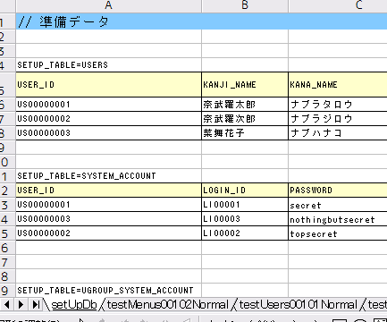
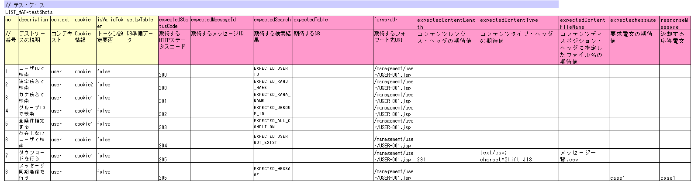
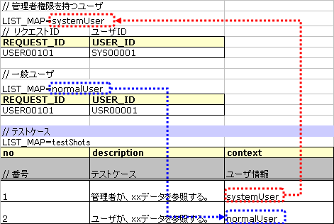
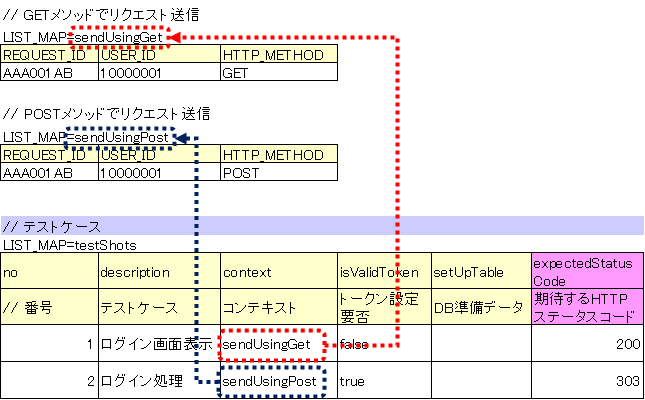
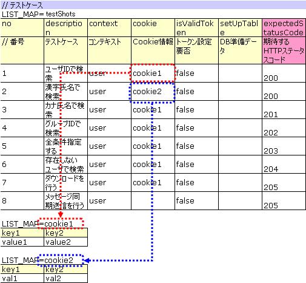
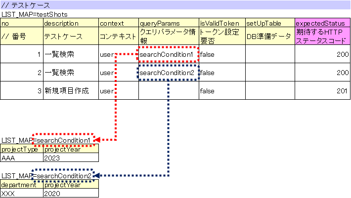
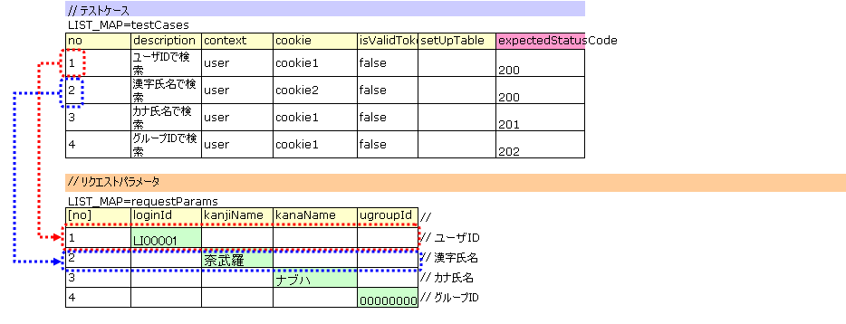
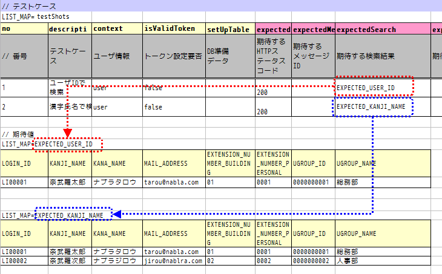
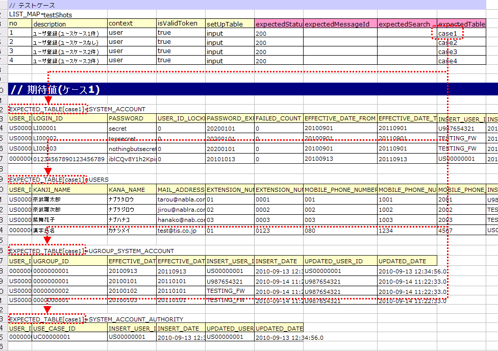
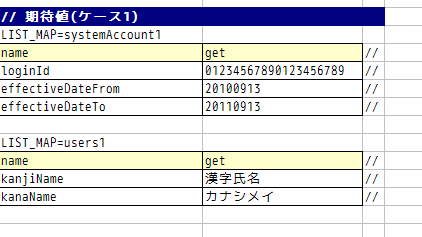

.. _requestUnitTest:

==============================
请求单元测试的实施方法
==============================

--------------------
测试类的编写方法
--------------------

测试类需要满足以下条件进行创建。

* 测试类的包名应与被测Action类相同。
* 以<Action类名>RequestTest作为测试类的类名进行创建。
* 继承nablarch.test.core.http.BasicHttpRequestTestTemplate。
  (如果项目中有扩展的Template实现，则不受此限制)

例如，被测Action类为nablarch.sample.management.user.UserSearchAction时，
测试类如下所示。

.. code-block:: java

  package nablarch.sample.management.user;
  
  // ～中略～

  public class UserSearchActionRequestTest extends BasicHttpRequestTestTemplate {

.. tip::
 父类BasicHttpRequestTestTemplate提供了请求单元测试所需的各种方法。\
 同时具备DbAccessTestSupport的功能，因此可以像类单元测试一样执行数据库设置等操作。\

------------------
测试方法分割
------------------

按照以下步骤确定要创建的测试方法。

* 按照请求ID（Action的每个方法），将测试用例分为正常系和异常系，分别创建测试方法。

  * 对于像菜单中简单的画面跳转这样没有异常系的情况，只创建正常系的测试方法。

* 检查画面显示验证项目，研究是否可以包含在正常系或异常系的任一方法中。

  * 如果在同一工作表中使用条件分支会使复杂度增加，则单独创建画面显示验证用的测试方法。
  * 否则，不创建画面验证专用方法，而是将其包含在正常系或异常系的测试方法中。

**方法分割示例（按正常系、异常系、画面显示验证分割的情况）**

+------------+---------------------+-----------------------------------------------------------------+
|请求ID      |Action方法名         |测试数据表名                                                     |
|            |                     +---------------------+-----------------------+-------------------+
|            |                     |正常系               |异常系                 |画面显示验证用     |
+============+=====================+=====================+=======================+===================+
|USERS00101  |doUsers00101         |testUsers00101Normal |testUsers00101Abnormal |testUsers00101View |
+------------+---------------------+---------------------+-----------------------+-------------------+

.. tip::
 这样分割方法是为了避免测试数据表变得复杂而降低可读性。\
 除了上述情况外，如果将各种测试用例塞进1个测试数据表中会导致可读性下降时，应分割测试数据表。

--------------------
测试数据的编写方法
--------------------

记载测试数据的Excel文件与类单元测试一样，
保存在与测试源代码相同的目录中，文件名相同（仅扩展名不同）。

关于测试数据的详细描述方法，请参考\ :ref:`how_to_write_excel`\ 。

.. _`request_test_setup_db`:

测试类中通用的数据库初始值
======================================

在记载测试数据的Excel文件中，准备名为\ **setUpDb**\ 的工作表，
在其中投入通用的数据库初始值。这里记载的数据，
将由自动测试框架在测试方法执行时自动投入。

.. _`request_test_testcases`:

测试用例一览
================

使用LIST_MAP数据类型记载1个测试方法分量的用例表。ID为\ **testShots**\ 。

每个用例包含以下要素。

+------------------------+----------------------------------------------------------------------------------------+-----+
|列名                    | 说明                                                                                   |必填 |
+========================+========================================================================================+=====+
|no                      |记载从1开始的连续编号的测试用例编号。                                                   |     |
|                        |                                                                                        |必填 |
+------------------------+----------------------------------------------------------------------------------------+-----+
|description             |记载该测试用例的说明。                                                                  |     |
|                        |用于Web应用程序请求单元测试输出的HTML转储文件的文件名。  |     |
|                        |\ [#]_\                                                                                 |必填 |
+------------------------+----------------------------------------------------------------------------------------+-----+
|context                 |记载该测试用例发送请求时的用户信息。                                                    |必填 |
|                        |详情请参考\ :ref:`request_test_user_info`\ 。                                           |     |
+------------------------+----------------------------------------------------------------------------------------+-----+
|cookie                  |记载该测试用例所需的Cookie信息。                                                        |     |
|                        |详情请参考\ :ref:`request_test_cookie_info`\ 。                                         |     |
+------------------------+----------------------------------------------------------------------------------------+-----+
|queryParams             |记载该测试用例所需的查询参数信息。                                                      |     |
|                        |详情请参考\ :ref:`request_test_queryparams_info`\ 。                                    |     |
+------------------------+----------------------------------------------------------------------------------------+-----+
|isValidToken            |设置令牌时设置为true。关于令牌的详细信息，                                              |     |
|                        |请参考\ :ref:`服务器端的双重提交防止 <tag-double_submission_server_side>`\ 。         |     |
|                        |                                                                                        |     |
+------------------------+----------------------------------------------------------------------------------------+-----+
|setUpTable              |如果在各测试用例执行前需要注册到数据库，则记载同一工作表内数据的\     |     |
|                        |:ref:`组ID<tips_groupId>`\ 。数据投入由自动测试框架     |     |
|                        |执行。                                                                                  |     |
+------------------------+----------------------------------------------------------------------------------------+-----+
|expectedStatusCode      |记载期望的HTTP状态码。                                                                  |必填 |
|                        |                                                                                        |     |
+------------------------+----------------------------------------------------------------------------------------+-----+
|expectedMessageId       |如果期望输出消息，则记载该\ **消息ID**\ 。                                              |     |
|                        |如果输出多个消息，则用逗号分隔列举。如果                  |     |
|                        |不期望消息则留空。如果留空但实际输出了消息                |     |
|                        |，则测试失败。                                                                          |     |
+------------------------+----------------------------------------------------------------------------------------+-----+
|expectedSearch          |如果期望将数据库搜索结果设置到请求作用域，                |     |
|                        |则记载\ **期望的搜索结果**\ 。搜索结果使用同一工作表内LIST_MAP数据          |     |
|                        |类型的ID指定。从请求作用域获取时的键为\                         |     |
|                        |**searchResult**\ 。                                                                    |     |
+------------------------+----------------------------------------------------------------------------------------+-----+
|expectedTable           |如果要比较数据库内容，则记载期望表的\ :ref:`组ID<tips_groupId>`\  |     |
|                        |。                                                                                      |     |
+------------------------+----------------------------------------------------------------------------------------+-----+
|forwardUri              |记载期望的转发目标URI。记载Action类中指定的转发目标JSP的\           |     |
|                        |URI。如果为空，则断言为不会转发到JSP。\     |     |
|                        |在预期跳转到系统错误画面或认证错误画面的测试用例中，\           |     |
|                        |记载到该画面的JSP的URI。例如，如果跳转到系统错误画面，\   |     |
|                        |\ `/jsp/systemError.jsp`\ 将成为期望的转发目标URI（默认值的情况）。       |     |
+------------------------+----------------------------------------------------------------------------------------+-----+
|expectedContentLength   |记载内容长度头部的期望值。                                                              |     |
|                        |在测试文件下载时指定此列。                                                              |     |
+------------------------+----------------------------------------------------------------------------------------+-----+
|expectedContentType     |记载内容类型头部的期望值。                                                              |     |
|                        |在测试文件下载时指定此列。                                                              |     |
+------------------------+----------------------------------------------------------------------------------------+-----+
|expectedContentFileName |记载内容处置头部中指定的文件名的期望值。                                                |     |
|                        |在测试文件下载时指定此列。                                                              |     |
+------------------------+----------------------------------------------------------------------------------------+-----+
|expectedMessage         |执行消息同步发送处理时，记载期望的请求报文的 :ref:`组ID<tips_groupId>`\   |     |
|                        |。消息的创建由自动测试框架执行。                                                        |     |
+------------------------+----------------------------------------------------------------------------------------+-----+
|responseMessage         |执行消息同步发送处理时，记载返回的响应报文的 :ref:`组ID<tips_groupId>`\   |     |
|                        |。消息的创建由自动测试框架执行。                                                        |     |
+------------------------+----------------------------------------------------------------------------------------+-----+
|expectedMessageByClient |执行HTTP消息同步发送处理时，记载期望的请求报文的\                               |     |
|                        |:ref:`组ID<tips_groupId>` 。                                                            |     |
|                        |消息的创建由自动测试框架执行。                                                          |     |
+------------------------+----------------------------------------------------------------------------------------+-----+
|responseMessageByClient |执行HTTP消息同步发送处理时，记载返回的响应报文的\                               |     |
|                        |:ref:`组ID<tips_groupId>` \ 。                                                          |     |
|                        |消息的创建由自动测试框架执行。                                                          |     |
+------------------------+----------------------------------------------------------------------------------------+-----+

该测试用例中发送的HTTP\ `请求参数`\_不记载在此表中（\ :ref:`后述<request_test_req_params>`\ ）。

.. [#] 
  description的内容用于文件名，因此如果使用了OS规定的文件名不允许的字符，或超过文件名长度上限，
  会发生IOException，所以请输入允许作为文件名的内容。
  例如，如果description中包含换行符，则作为文件名不合法，测试执行时会发生错误。

.. _`request_test_user_info`:

用户信息
==========

使用LIST_MAP数据类型记载该测试用例发送请求时的请求ID、用户、HTTP方法。
通过使用不同的用户信息，可以测试根据用户权限或使用的HTTP方法而处理不同的功能。

HTTP方法信息是可选的。省略时设置为POST。

例如，如果根据权限可查看的数据不同，则如下所示区分用户信息。

另一个示例，如果同一请求ID接受多个HTTP方法，则如下所示区分用户信息。

           
.. _`request_test_cookie_info`:

Cookie信息
==============================

使用LIST_MAP数据类型记载该测试用例所需的Cookie信息。
这样可以根据不同的用例发送不同的Cookie信息进行测试。

Cookie信息是可选的，不需要Cookie的用例可以不记载。

例如，如果需要根据用例更改Cookie值，则如下所示设置Cookie信息。
如果是不需要Cookie的用例，则如以下示例的第8个用例一样留空。

.. _`request_test_queryparams_info`:

查询参数信息
==============================

使用LIST_MAP数据类型记载该测试用例所需的查询参数信息。
这样可以根据不同的用例发送不同的查询参数信息进行测试。

查询参数信息是可选的，不需要查询参数的用例可以不记载。

例如，如果需要根据用例更改查询参数值，则如下所示设置查询参数信息。
如果是不需要查询参数的用例，则如以下示例的第3个用例一样留空。

.. _`request_test_req_params`:

请求参数
====================

使用LIST_MAP数据类型记载各测试用例中发送的HTTP参数。\

使用\ :ref:`http_dump_tool` \ 创建请求参数的数据。\
除初始画面显示的请求（例如从菜单画面跳转）外，使用此工具创建请求参数的数据。

使用LIST_MAP数据类型记载HTTP请求参数。ID为\ **requestParams**\ 。
此数据与\ :ref:`request_test_testcases` \ 按行关联。\
例如，测试用例一览中的第一个测试用例使用请求参数表中的第一行数据（以此类推）。

为了便于理解测试用例的关联，请作为 :ref:`marker_column` 记载测试用例编号。

.. tip::

  请求参数必须记载。

  例如，对于初始画面显示请求等不存在请求参数的情况，LIST_MAP=requestParams也必须定义列。

  如果不需要请求参数，请如下所示只记载测试用例编号的列。
  数据需要定义测试用例数量的行。（3个用例则3行，10个用例则10行）

  ※[no]列是为了直观表示测试用例编号( :ref:`marker_column` )，不包含在请求参数中。

    .. image:: ./_image/dummy_request_param.png
        :scale: 100

对单个键设置多个值的情况
------------------------------------------

HTTP请求参数可以对单个键设置多个值。
在请求单元测试中，\ **通过用逗号分隔值来描述，可以表示多个值**\ 。

以下示例中，对foo这个键设置了one和two两个值。

  ======== ===========  
  foo      bar  
  ======== ===========
  one,two  three      
  ======== ===========  

如果要在值中包含逗号本身，请用\ `\\`\ 标记转义。\
如果要在值中包含\标记本身，请对\标记本身进行转义，描述为\ `\\\\`\ 。

例如，要表示\ `\\1,000`\ 这个值，请如下描述。

  =========== ===========  
  foo         bar   
  =========== ===========   
  \\\\\\1\\,000 three     
  =========== ===========  

各种期望值
==========

搜索结果、与数据库比较期望值时，
分别通过ID将数据与测试用例一览关联。

期望的搜索结果
----------------

将期望的搜索结果与测试用例一览关联。

.. _`request_test_expected_tables`:

期望的数据库状态
--------------------------

在更新系的测试用例中，为了确认期望的数据库状态，
将期望的数据库状态与测试用例一览关联。

.. _`05_02_howToCodingTestMethod`:

----------------------
测试方法的编写方法
----------------------

关于父类
====================

继承BasicHttpRequestTestTemplate类。
该类根据准备的测试数据按以下步骤执行请求单元测试。

* 从数据表中获取测试用例列表(testShots LIST_MAP）
* 对获取的测试用例重复执行以下操作

  *  数据库初始化
  *  生成ExecutionContext、HTTP请求
  *  调用业务测试代码用扩展点(beforeExecute方法）
  *  如果需要令牌，设置令牌
  *  执行被测请求
  *  执行结果验证

    * HTTP状态码 以及 消息ID
    * HTTP响应值(请求作用域值)
    * 搜索结果
    * 表更新结果

  *  调用业务测试代码用扩展点(afterExecuteRequest方法）

以下方法在父类中定义为抽象方法，需要覆盖。

.. code-block:: java

 public class UserSearchActionRequestTest extends BasicHttpRequestTestTemplate {
    
    /**
     * {@inheritDoc}
     * 【说明】 返回URI的共同部分。
     */
    @Override
    protected String getBaseUri() {
        return "/action/management/user/UserSearchAction/";
    }

创建测试方法
==================

创建与准备的测试表对应的方法。

.. code-block:: java
    
    @Test
    public void testMenus00101() {
    }

调用父类的方法
==============================

在测试方法中，调用父类的以下任一方法。

* void execute()
* void execute(Advice advice)

通常情况下，使用execute()。

.. code-block:: java
    
    @Test
    public void testUsers00101Normal() {
        execute();
    }

需要添加特有处理的情况
------------------------

父类将任何测试用例都需要的处理标准化，
但根据测试用例可能需要特有处理。
(例如，如果请求作用域中存储了Entity，想要确认其内容等)。

如果需要表特有的准备处理、结果确认处理，\
可以使用execute(Advice advice)在请求发送前后插入处理。
BasicAdvice类中准备了以下方法，分别在请求发送前、发送后被回调。

* void beforeExecute(TestCaseInfo testCaseInfo, ExecutionContext context)
* void afterExecute(TestCaseInfo testCaseInfo, ExecutionContext context)

.. tip::
  不需要覆盖这些方法两者。只需要覆盖需要的即可。
  另外，不需要在这些方法中记载所有处理。如果描述变长，
  或者测试方法间有共同处理，请将其提取为私有方法。

.. code-block:: java
    
    @Test
    public void testMenus00102Normal() {
        execute(new BasicAdvice() {
            // 【说明】本方法在请求发送前被调用。
            @Override
            public void beforeExecute(TestCaseInfo testCaseInfo,
                    ExecutionContext context) {
                // 【说明】在这里记述准备处理。
            }

            // 【说明】本方法在请求发送后被调用。
            @Override
            public void afterExecute(TestCaseInfo testCaseInfo,
                    ExecutionContext context) {
                // 【说明】在这里记述结果确认处理。
            }
        });
    }

请求作用域中存储了多种搜索结果时的示例
~~~~~~~~~~~~~~~~~~~~~~~~~~~~~~~~~~~~~~~~~~~~~~~~~~~~~~~~~~~~~~

以下示例中，请求作用域中包含"用户组"和"用例"两种搜索结果，
分别验证搜索结果是否符合预期。

.. code-block:: java
    
    @Test
    public void testMenus00103() {
        execute(new BasicAdvice() {
            @Override
            public void afterExecute(TestCaseInfo testCaseInfo,
                    ExecutionContext context) {
                
                String messgae = testCaseInfo.getTestCaseName();   // 【说明】比较失败时的消息
                String sheetName = testCaseInfo.getSheetName();    // 【说明】表名
                String no = testCaseInfo.getTestCaseNo();          // 【说明】测试用例编号
                
                // 组搜索结果的验证
                SqlResultSet actualGroup =(SqlResultSet) context.getRequestScopedVar("allGroup");
                assertSqlResultSetEquals(message, sheetName, "expectedUgroup" + no, actualGroup);
                        
                // 用例搜索结果的验证
                SqlResultSet actualUseCase =(SqlResultSet) context.getRequestScopedVar("allUseCase");
                assertSqlResultSetEquals(message, sheetName, "expectedUseCase" + no, actualUseCase);
            }
        });
    }

请求作用域中存储的不是搜索结果(SqlResultSet)而是Form或Entity时的示例
~~~~~~~~~~~~~~~~~~~~~~~~~~~~~~~~~~~~~~~~~~~~~~~~~~~~~~~~~~~~~~~~~~~~~~~~~~~~~~~~~~~~~~~~~~~~~~~~

以下示例中，请求作用域中存储了Entity，
分别验证搜索结果是否符合预期。

.. code-block:: java
        
    @Test
    public void testUsers00302Normal() {
        execute(new BasicAdvice() {
            @Override
            public void afterExecute(TestCaseInfo testCaseInfo,
                    ExecutionContext context) {
                String sheetName = testCaseInfo.getSheetName();
                // 比较系统账户
                // 【说明】期望值的ID（前缀"systemAccount" + 用例编号）
                String expectedSystemAccountId = "systemAccount" + testCaseInfo.getTestCaseNo();
                // 【说明】从请求作用域取出实际值
                Object actualSystemAccount = context.getRequestScopedVar("systemAccount");
                // 【说明】调用比较Entity的方法。
                assertEntity(sheetName, expectedSystemAccountId, actualSystemAccount);

                // 比较用户
                String expectedUsersId = "users" + testCaseInfo.getTestCaseNo();
                Object actualUsers = context.getRequestScopedVar("users");
                assertEntity(sheetName, expectedUsersId, actualUsers);
            }
        });
    }

期望值与Entity的类单元测试（\ :ref:`entityUnitTest_SetterGetterCase`\ ）使用相同的格式记述。
但是，这种情况下不需要setter栏。

.. tip::
   如果请求作用域中存储的是Form，只要不是设置了其他Form的属性，就可以像Entity一样进行测试。
   
   如果是设置了其他Form的属性，则获取该Form像Entity一样进行测试即可。以下示例。
   
   
   .. code-block:: java
   
       @Test
       public void testSampleNormal() {
           execute(new BasicAdvice() {
               @Override
               public void afterExecute(TestCaseInfo testCaseInfo,
                       ExecutionContext context) {
                   String sheetName = testCaseInfo.getSheetName();
                   // 比较系统账户
                   // 【说明】期望值的ID（前缀"systemAccount" + 用例编号）
                   String expectedSystemAccountId = "systemAccount" + testCaseInfo.getTestCaseNo();
                   // 【说明】从请求作用域取出Form
                   Object actualForm = context.getRequestScopedVar("form");
                   // 【说明】获取Form属性中的其他Form
                   Object actualSystemAccount = actualForm.getSystemAccount();
                   // 【说明】调用比较Entity的方法。
                   assertEntity(sheetName, expectedSystemAccountId, actualSystemAccount);
               }
           });
       }

请求作用域中存储的不是SqlResultSet而是SqlRow时的示例
~~~~~~~~~~~~~~~~~~~~~~~~~~~~~~~~~~~~~~~~~~~~~~~~~~~~~~~~~~~~~~~~~~~~~~

以下示例中，请求作用域中存储的不是搜索结果列表(SqlResultSet)，
而是1条搜索结果(SqlRow)，
验证该搜索结果是否符合预期。

.. code-block:: java
        
    @Test
    public void testUsers00302Normal() {
        execute(new BasicAdvice() {
            @Override
            public void afterExecute(TestCaseInfo testCaseInfo, ExecutionContext context) {
                String message = testCaseInfo.getTestCaseName();   // 【说明】比较失败时的消息
                String sheetName = testCaseInfo.getSheetName();    // 【说明】表名
                String no = testCaseInfo.getTestCaseNo();          // 【说明】测试用例编号
                
                // 组搜索结果的验证
                SqlRow actual =(SqlRow) context.getRequestScopedVar("user");
                // 【说明】调用比较SqlRow的方法。
                assertSqlRowEquals(message, sheetName, "expectedUser" + no, actual);
            }
        });
    }

想要验证请求参数值的情况
~~~~~~~~~~~~~~~~~~~~~~~~~~~~~~~~~~~~~~~~

为了\ :ref:`重置窗口作用域<tag-window_scope>` \ 的值，
被测功能中可能会重写请求参数。

以下示例中，验证被测执行后的请求参数是否符合预期。

.. code-block:: java
        
    @Test
    public void testUsers00302Normal() {
        execute(new BasicAdvice() {
            @Override
            public void afterExecute(TestCaseInfo testCaseInfo, ExecutionContext context) {

                HttpRequest request = testCaseInfo.getHttpRequest();   // 【说明】测试执行后的HttpRequest
                // 请求参数已被重置
                assertEquals("", getParam(request, "resetparameter"));
            }
        });
    }

其他情况
~~~~~~~~~~~~

如前所述，对于SqlResultSet或SqlRow等常用对象，
提供了与Excel中记载的期望值直接比较的方法，
但对于其他情况，需要记述读取期望值的处理。

具体来说，按以下步骤进行验证。

* 从Excel文件获取测试数据
* 从请求作用域等获取实际值
* 使用自动测试框架或JUnit的API验证结果。

.. code-block:: java
        
    @Test
    public void testUsers00303Normal() {
        execute(new BasicAdvice() {
            @Override
            public void afterExecute(TestCaseInfo testCaseInfo, ExecutionContext context) {
                // 【说明】从Excel文件获取期望值
                List<Map<String, String>> expected = getListMap("doRW25AA0303NormalEnd", "result_1");
                // 【说明】从测试执行后的请求作用域获取实际值
                List<Map<String, String>> actual = context.getRequestScopedVar("pageData");
                // 【说明】结果验证
                assertListMapEquals(expected, actual);
            }
        });
    }

\    

.. tip::
 关于测试数据的获取方法，请参考以下链接。
  * 「\ :ref:`how_to_get_data_from_excel`\ 」

下载文件的测试
============================

测试下载文件时，\
使用\ :ref:`batch_request_test` \ 相同的方法在Excel文件中记载文件的期望值。\
以下显示CSV文件下载时的测试示例。

**期望文件定义示例**

 文件路径指定转储文件。\
 对于下载处理，下载的文件会被转储，
 按以下命名规则输出转储文件。\
 转储输出结果存放目录的详细信息请参考 :ref:`html_dump_dir` 。

  .. code-block:: bash

   转储文件命名规则：
     Excel文件的表名＋"_"＋测试用例名＋"_"＋下载的文件名

 .. image:: ./_image/expected_download_csv.png
    :scale: 60
   
**测试方法实现示例**

 使用FileSupport类的assertFile方法进行下载文件的断言。

 .. code-block:: java

    private FileSupport fileSupport = new FileSupport(getClass());
    
    @Test
    public void testRW11AC0104Download() {
        execute(new BasicAdvice() {
            @Override
            public void afterExecute(TestCaseInfo testCaseInfo, ExecutionContext context) {
                String msgOnFail = "下载的用户列表查询结果的CSV文件断言失败。";
                fileSupport.assertFile(msgOnFail, "testRW11AC0104Download");
            }
        });
    }

--------------
测试启动方法
--------------

与类单元测试相同。像普通的JUnit测试一样执行。

----------------------
测试结果确认（目视）
----------------------

每1个请求输出1个HTML转储文件。在浏览器中打开文件进行目视确认。

.. tip::
 请求单元测试生成的HTML文件由自动测试框架自动检查。\
 自动测试框架使用\ :doc:`../../08_TestTools/03_HtmlCheckTool/index`\ 检查生成的HTML文件。
 如果HTML文件内有语法错误等违规情况，会发生相应的异常，该测试用例将失败。\

.. _html_dump_dir:

HTML转储输出结果
==================

执行测试时，会在测试项目的根目录下创建tmp/html_dump目录，
在其下输出HTML转储文件。
HTML转储输出结果存放目录的详细信息请参考 :ref:`dump-dir-label` 项。

 .. image:: ./_image/htmlDumpDir.png

.. tip::
 HTML转储文件名使用\ `测试用例一览`\_的测试用例说明（testShots的description栏）
 的记述。

----------------------------------------
创建请求单元测试类时的注意点
----------------------------------------

请求单元测试与类单元测试的不同之处在于通过Web Framework的handler被调用。
由于这个差异，有一些需要注意的地方，以下记载。

不需要设置ThreadContext的值
=============================

在请求单元测试中，由于Web Framework的handler起作用，
ThreadContext的值设置由handler执行。
因此，\ **不需要从测试类设置ThreadContext的值。**

关于请求单元测试中的用户ID设置方法，请参考前述的\ :ref:`request_test_user_info`\ 。

不需要在测试类中进行事务控制
==========================================

在类单元测试中，由于Web Framework的handler不起作用，
需要在测试类内显式提交事务。\
在请求单元测试中，事务控制由handler执行，因此\
**不需要在测试类内显式提交事务。**
