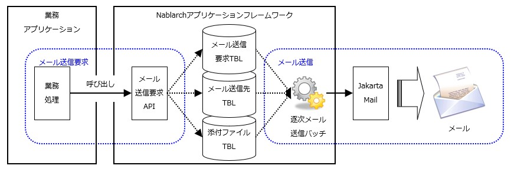

.. _`mail_request_test`:

==========================================
请求单元测试的实施方法(邮件发送)
==========================================

邮件发送处理的结构和测试范围
============================================

使用本框架进行\ :ref:`邮件发送 <mail>`\ 时，
业务应用程序只需调用本框架提供的邮件发送请求API。

因此请求单元测试的范围为\
确认邮件发送请求被正常受理并存储到数据库为止。

邮件发送处理的处理概要和业务应用程序的测试范围如下图所示。

测试的实施方法
================

如上所述，关于邮件发送，请求单元测试中需要确认的是
邮件发送请求是否正确存储到 :ref:`各表（邮件发送请求表、邮件发送目标表、邮件附件文件表）<mail>` 。

因此，与其他单元测试的实施方法相同，只需在Excel工作表中记述期望的上述3个表的状态即可。
