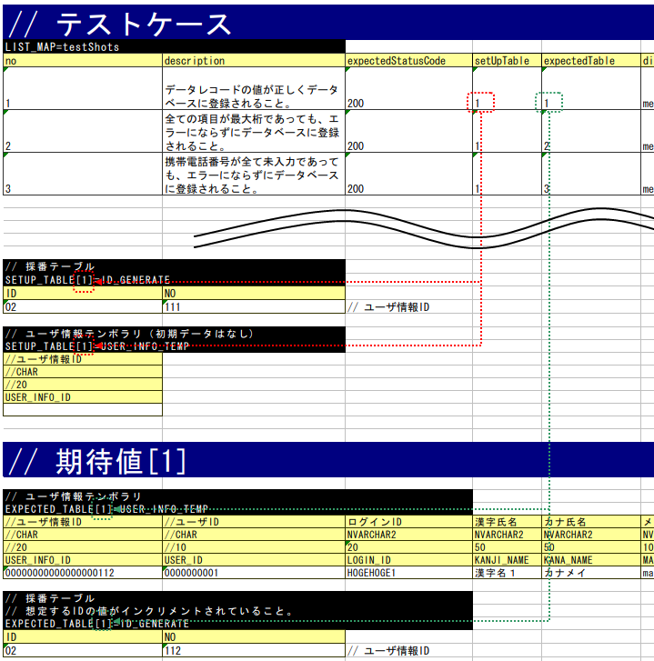
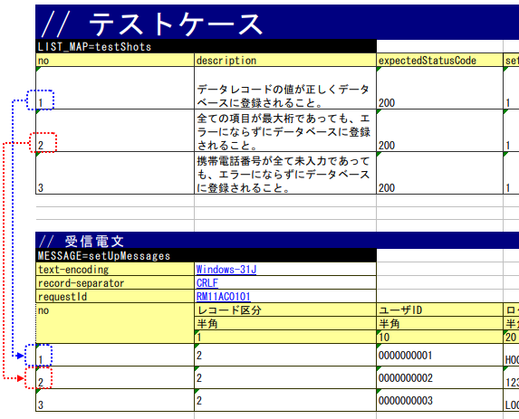

.. _`real_request_test`:

============================================================
请求单元测试的实施方法(同步响应消息接收处理)
============================================================

--------------------
测试类的编写方法
--------------------

测试类需要满足以下条件进行创建。

* 测试类的包名应与被测Action类相同。
* 以<Action类名>RequestTest作为测试类的类名进行创建。
* 继承\ ``nablarch.test.core.http.MessagingRequestTestSupport``\ 。

例如，被测Action类为\ ``nablarch.sample.ss21AA.RM21AA001Action``\ 时，\
测试类如下所示。

.. code-block:: java

  package nablarch.sample.ss21AA;
  
  // ～中略～

  public class RM21AA001ActionRequestTest extends MessagingRequestTestSupport {

------------------
测试方法分割
------------------

原则上1个测试类对应1个测试方法、1个测试表。

如果用例复杂或数据量大，可以分割方法或表。

--------------------
测试数据的编写方法
--------------------

记载测试数据的Excel文件与类单元测试一样，
保存在与测试源代码相同的目录中，文件名相同（仅扩展名不同）。

关于测试数据的详细描述方法，请参考「\ :ref:`how_to_write_excel`\ 」。

测试类中通用的数据库初始值
======================================

与Web应用程序的情况相同。请参考「\ :ref:`request_test_setup_db`\ 」。

测试用例一览
==================

使用LIST_MAP数据类型记载1个测试方法分量的测试用例表。ID为\ **testShots**\ 。

..    .. image:: ./_image/new_testCases.png
..    :scale: 80

每个用例包含以下要素。

================== ========================================================================================== =====
列名               说明                                                                                       必填 
================== ========================================================================================== =====
no                 记载从1开始的连续编号的测试用例编号。                                                      必填
description        记载该测试用例的说明。                                                                     必填       
expectedStatusCode 期望的状态码                                                                               必填 
setUpTable         如果在各测试用例执行前需要注册到数据库，则记载同一工作表内数据的\ 
                   :ref:`组ID<tips_groupId>`\ \ [1]_\ 。数据投入由自动测试框架                              
                   执行。                                                                          
expectedTable      如果要比较数据库内容，则记载期望表的\ :ref:`组ID<tips_groupId>`\ 
                   \ [1]_\ 。                                                                                 
expectedLog        记载期望日志消息的ID。自动测试框架会验证该日志消息是否实际输出。                                            
diConfig           记载执行常驻进程时的组件配置文件路径。                                                       必填 
                   (\ :ref:`命令行参数 <main-run_application>`\ 参考)\ [2]_\                       
requestPath        记载执行常驻进程时的请求路径。                                                               必填 
                   (\ :ref:`命令行参数 <main-run_application>`\ 参考)\ [2]_\                                       
userId             记载常驻进程执行用户ID。                                                                     必填 
                   (\ :ref:`命令行参数 <main-run_application>`\ 参考)\ [2]_\
================== ========================================================================================== =====                                                                                                                 

\

.. [1]
 如果想使用默认的组ID（不使用组ID），则记载\ `default`\ 。
 默认的组ID和单独的组可以并用。
 如果两者的数据混存，默认组ID的数据和组ID指定的数据都会生效。

.. [2]
 此处所说的「常驻进程」是指进行消息收发处理的进程。

各种准备数据
==============

说明测试实施所需的各种准备数据的描述方法。
批处理中，准备数据库、请求消息。

数据库的准备
------------------

与\ :ref:`在线<request_test_testcases>`\ 一样，通过组ID进行对应。

如果在\ `测试用例一览`\_中没有setUpTable栏，或者为空栏，则不进行数据库准备。

请求消息
--------------------

记载作为测试输入数据的请求报文。以下显示示例。

-----

 MESSAGE=setUpMessages

 // 共通信息（指令、框架控制头部）

 +------------------+--------------+------------+
 | text-encoding    | Windows-31J  |            |
 +------------------+--------------+------------+
 | record-separator | CRLF         |            |
 +------------------+--------------+------------+
 | requestId        | RM11AC0101   |            |
 +------------------+--------------+------------+

 // 消息主体

 +------------------+--------------+------------+
 | no               | 记录区分     |   用户ID   |
 +------------------+--------------+------------+
 |                  | 半角         |       半角 |
 +------------------+--------------+------------+
 |                  | 1            |         10 |
 +==================+==============+============+
 | 1                | 7            | 0000000001 |
 +------------------+--------------+------------+
 | 2                | 2            | 0000000001 |
 +------------------+--------------+------------+

------

1. 首行

 为被测请求准备请求报文。名称固定为\ ``MESSAGE=setUpMessages``\ 。

2. 共通信息

 从名称的下一行开始记载以下信息。这些值将成为请求消息中所有消息的共通值。

 * 指令
 * 框架控制头部

 格式为key-value形式。

  +----+----+
  |键  |值  |
  +----+----+

.. important::

  如果在项目中更改了框架控制头部的项目，
  需要如下在properties文件中用 ``reader.fwHeaderfields`` 键指定框架控制头部名称。

  .. code-block:: properties

    # 用逗号分隔指定框架控制头部名称。
    reader.fwHeaderfields=requestId,addHeader

3. 消息主体

记载框架控制头部之后的消息。
第1行～第3行与外部接口设计书的记载内容相同，
从设计书转置行列后复制可以高效创建。

 +------------+---------------+--------------------------+
 |行          |记载内容       |备注                      |
 +============+===============+==========================+
 |第1行       |字段名称       |第一个单元格为"no"。    |
 +------------+---------------+--------------------------+
 |第2行       |数据类型       |第一个单元格为空          |
 +------------+---------------+--------------------------+
 |第3行       |字段长度       |第一个单元格为空          |
 +------------+---------------+--------------------------+
 |第4行以后   |数据           |第一个单元格为1开始的序号 |
 +------------+---------------+--------------------------+

.. important::
 字段名称中\ **不允许重复的名称**\ 。
 例如，不允许存在2个以上名为「姓名」的字段。
 （通常，这种情况下会赋予「正式会员姓名」和「家属会员姓名」这样唯一的字段名称）

 

本表与\ `测试用例一览`\_的no存在对应关系。\
即，测试用例no1使用的请求报文，为本表第1行（no 1）的数据。

各种期望值
==========

搜索结果、与数据库比较期望值时，
分别通过ID将数据与测试用例一览关联。

响应消息
--------------------

与\ `请求消息`\_相同。

但是，名称变为\ ``MESSAGE=expectedMessages``\ 。

另外，根据测试数据指令中设置的file-type值，响应报文的断言方法会发生如下变化。

 +------------------------+---------------------------------------------------------------------+
 | file-type的值          | 断言方法                                                            |
 +========================+=====================================================================+
 | Fixed 或 未指定        | 按测试数据中记述的项目单位分割报文进行断言。                        |
 +------------------------+---------------------------------------------------------------------+
 | 其他值                 | 将报文整体作为字符串处理进行断言。                                  |
 +------------------------+---------------------------------------------------------------------+

需要在测试数据中而非格式定义文件中设置file-type，请注意。

另外，按项目单位进行断言的file-type值可以通过在环境配置文件中定义以下值来更改。

  .. code-block:: text
  
    messaging.assertAsMapFileType=<逗号分隔的file-type列表>

.. tip::
 | XML和JSON中每个报文的报文长度不同，因此会自动计算。
 | 由于会根据测试数据的报文长度读取实际报文，如果实际报文与测试数据的报文长度不同，可能无法正常读取。
 | 因此使用XML或JSON时必须设置file-type，将报文整体作为字符串进行断言。

期望的数据库状态
--------------------------

与\ `数据库的准备`\_ 一样，将期望的数据库状态与测试用例一览关联。

----------------------
测试方法的编写方法
----------------------

关于父类
====================

继承\ ``MessagingRequestTestSupport``\ 类。
该类根据准备的测试数据按以下步骤执行请求单元测试。

创建测试方法
==================

创建与准备的测试表对应的方法。

.. code-block:: java
    
    @Test
    public void testRegisterUser() {
    }

调用父类的方法
==============================

在测试方法中，调用父类的以下任一方法。

* void execute()
* void execute(String sheetName)

带参数的execute方法可以指定测试数据的表名。
使用无参的execute方法，与在带参数的execute方法中
指定测试数据的表名时的动作相同。

通常，由于测试表名和测试方法名相同，
使用无参的execute方法即可。

.. code-block:: java
    
    @Test
    public void testRegisterUser() {
        execute();   // 【说明】与 execute("testRegisterUser") 等价
    }

--------------
测试启动方法
--------------

与类单元测试相同。像普通的JUnit测试一样执行。

--------------
测试结果验证
--------------

自动测试框架端进行以下结果验证。

* 响应消息的结果验证（必需）
* 数据库的结果验证
* 日志的结果验证

如果\ `测试用例一览`\_中没有期望值的记载（如果为空栏），
则跳过数据库和日志的结果验证。
