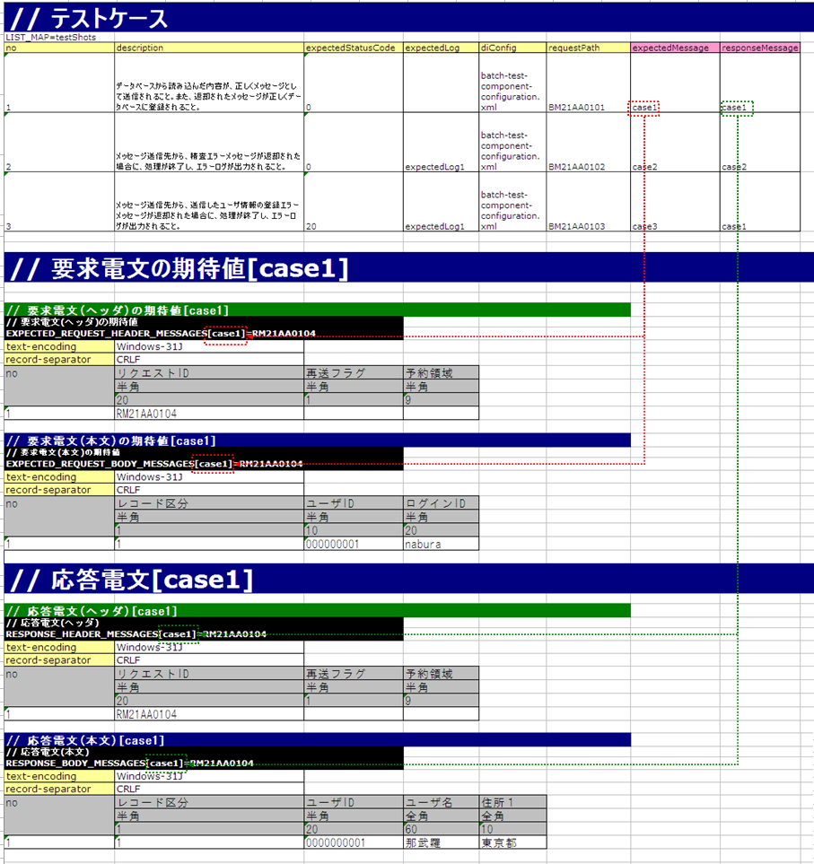
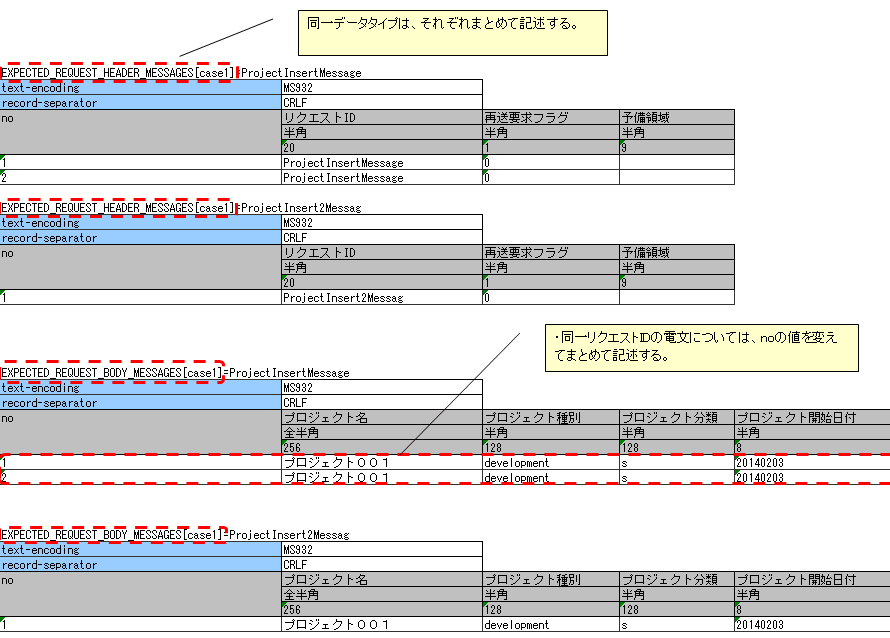

.. _`message_sendSyncMessage_test`:

=============================================================================
请求单元测试的实施方法(同步响应消息发送处理)
=============================================================================

输出库(同步响应消息发送处理)的结构与测试范围
------------------------------------------------------------------------

同步响应消息发送处理的请求单元测试，以分配给该处理的请求ID\ [#]_\ 为单位进行。

.. [#] 
 这里所说的请求ID，是指为了唯一识别消息发送目标系统的功能而定义的ID，
 需要注意它与Web应用或批处理中使用的请求ID含义不同。
 根据此请求ID，决定请求电文以及响应电文的格式、发送队列名、接收队列名。

※本节中，将Action发送到队列的消息称为"请求电文"，将Action从队列接收的消息称为"响应电文"。

请求单元测试实施时的示意图如下所示。

.. image:: ./_image/send_sync_base.png
.. image:: ./_image/hanrei.png

| ①自动化测试框架启动Nablarch Application Framework。
| ②Nablarch Application Framework读取作为Action输入的参数（如果是画面则为请求，如果是批处理则为文件或数据库），并启动Action。
| ③Action执行Nablarch Application Framework的消息同步发送处理。Nablarch Application Framework将Action接收到的参数转换为请求电文。
| ④自动化测试框架基于测试数据对请求电文进行断言。（请求电文不会PUT到队列）

| ⑤自动化测试框架基于测试数据生成响应电文，并返回给Action。（响应电文不会从队列GET）

.. tip::
 自动化测试框架不使用"发送队列""接收队列"，而是在队列前对请求电文进行断言以及生成响应电文。
 因此，不需要特别的中间件安装或环境设置。

使用本自动化测试框架实施的同步响应消息发送处理的请求单元测试的特色和优点如下。

1. 易于编写的测试数据
 
 电文布局大多是固定字段长度，与固定长度文件一样
 作为测试数据难以描述，但在本自动化测试框架中，
 通过使用Excel文件，可以依照外部接口设计书的格式定义
 来描述测试数据。

 此外，提供了同步响应消息发送处理专用的测试数据格式，遵循此格式可以
 轻松创建测试数据。
 这些特点使测试数据易于创建且易于维护。

2. 无需编写消息同步发送处理相关的测试代码

 测试数据（请求电文的期待值以及响应电文）可以记录在Excel中，自动化测试框架会根据该测试数据自动进行请求电文的断言以及响应电文的返回。

 提供了实现这种典型定型处理的超类，使用它可以完成测试准备、测试对象执行、测试结果确认。
 这样，仅通过测试数据即可几乎无需编码就能执行测试。    
 
 
测试的实施方法
------------------------------------------------------------------------

同步响应消息发送处理的测试，遵循Web应用或批处理等的测试方式进行。
关于测试类的编写方法以及各种准备数据的准备方法，请参考这些测试的实施方法。\

本节仅解释同步响应消息发送处理特有的实施方法。

.. _`send_sync_request_write_test_data`:

--------------------
测试数据的编写方法
--------------------

记录测试数据的Excel文件，与类单元测试一样，
以相同名称存储在与测试源代码相同的目录中（仅扩展名不同）。

关于测试数据的详细描述方法，请参考"\ :ref:`how_to_write_excel`\ "。

请求电文的期待值以及返回的响应电文（响应消息）的准备
====================================================================================

进行同步响应消息发送处理时，针对每个请求ID，定义请求电文以及响应电文的头部和主体部分的格式以及数据。

测试用例与请求电文的期待值以及响应电文，通过组ID进行关联。
具体来说，测试用例一览的expectedMessage以及responseMessage字段中记录的组ID，
与具有对应标识符的表相对应。\

另外，如果测试用例一览中没有expectedMessage以及responseMessage栏，则不会进行验证。
并且如果为空栏，且执行了消息同步发送处理，则测试会失败。
执行消息同步发送处理时，请务必记录expectedMessage以及responseMessage。

在一个测试用例中，如果发送了多件具有相同组ID且相同请求ID的电文，则需要记录相应件数的请求电文以及响应电文的数据行。no列的顺序（连续编号）与发送顺序一致。

关于测试用例的详细编写方法，请参考以下内容。
 * \ :ref:`Web应用的测试用例一览<request_test_testcases>`\
 * \ :ref:`批处理的测试用例一览<batch_test_testcases>`\

以下展示了实际用Excel编写的测试数据。（同时展示组ID的关联）

.. tip::

 Nablarch标准提供的同步响应消息发送功能中，请求电文和响应电文的头部使用共同的格式，
 因此测试数据同样要以请求为单位统一头部部分的格式定义。
 主体部分可以在请求电文和响应电文中定义不同的格式。

-----

请求电文的期待值以及返回的响应电文的表按以下格式记录。

+---------------------+--------------------------+------------------+--------------+
|标识符               |                                                            |
+---------------------+--------------------------+------------------+--------------+
|指令行               | 指令的设置值           |                                 |
+---------------------+--------------------------+------------------+--------------+
|    ...  [#]_\       |    ...                   |                  |              |
+---------------------+--------------------------+------------------+--------------+
|no                   |字段名称(1)                |字段名称(2)     |...  [#]_\    |
|                     +--------------------------+------------------+--------------+
|                     |数据类型(1)               |数据类型(2)       |...           |
|                     +--------------------------+------------------+--------------+
|                     |字段长度(1)                 |字段长度(2)     |...           |
|                     +--------------------------+------------------+--------------+
|                     |数据(1-1)                   |数据(2-1)       |...           |
|                     +--------------------------+------------------+--------------+
|                     |数据(1-2)                   |数据(2-2)       |...           |
|                     +--------------------------+------------------+--------------+
|                     |... \ [#]_\               |...               |...           |
+---------------------+--------------------------+------------------+--------------+

.. [#] 
 此部分下方，同样继续指令的数量。
 
.. [#] 
 此部分右侧，同样继续字段的数量。

.. [#]
 此部分下方，同样继续数据的数量。

\

========================== ===============================================================================================================================================================================================================================================================
名称                       说明
========================== ===============================================================================================================================================================================================================================================================
标识符                     指定表示电文种类的ID。本项目与测试用例一览的expectedMessage以及responseMessage中记录的组ID相关联。
                  
                           标识符的格式如下所示。
                  
                           * 请求电文的期待值头部 … EXPECTED_REQUEST_HEADER_MESSAGES[组ID]=请求ID
                           * 请求电文的本文期待值 … EXPECTED_REQUEST_BODY_MESSAGES[组ID]=请求ID
                           * 响应电文的头部 … RESPONSE_HEADER_MESSAGES[组ID]=请求ID
                           * 响应电文的本文 … RESPONSE_BODY_MESSAGES[组ID]=请求ID
指令行 \ [#]_\   记录指令。在指令名单元格右侧的单元格中记录设置值（可指定多行）。
no                         指令行的下一行必须记录"no"。
字段名称             记录字段名称。按字段数量记录。
数据类型                   记录该字段的数据类型。按字段数量记录。

                           数据类型用"半角字母"等日文名称描述。

                           格式定义文件上的数据类型与日文名称数据类型的映射，请参考 `BasicDataTypeMapping <https://github.com/nablarch/nablarch-testing/blob/main/src/main/java/nablarch/test/core/file/BasicDataTypeMapping.java>`_ 的成员变量DEFAULT_TABLE。
字段长度               记录该字段的字段长度。按字段数量记录。
数据                     记录存储在该字段中的数据。如果存在多条记录，则在下一行继续记录数据。
                           记录存储在该字段中的数据。如果在1个测试用例中以同一请求ID多次同步发送，则在下一行继续记录数据。
========================== ===============================================================================================================================================================================================================================================================

.. [#]
 记述指令时，格式定义文件的以下对应内容不需要记述。

 ============== ==============================================================
 项目           理由
 ============== ==============================================================
 file-type      由于测试框架仅支持固定长度。
 record-length  因为会按字段长度中记录的大小进行填充。
 ============== ==============================================================

.. important::
 字段名称中\ **不允许重复名称**\。例如，不得存在2个以上的"姓名"字段。
 （通常，这种情况下会赋予"正式会员姓名"和"家属会员姓名"等唯一的字段名称）

.. tip::
 字段名称、数据类型、字段长度的记述，可以从外部接口设计书中复制粘贴来高效创建。\
 （粘贴时，请勾选"\ **转置行列**\ "选项）

-----

以下展示具体的请求电文本文期待值的记录示例。

请求电文头部的期待值以及响应电文的本文・头部，除标识符部分外，记录方法与这里记录请求电文本文期待值的方法相同。

此示例中，期望发送满足以下规格的请求电文。

* 请求ID为\ ``RM21AA0104``\
* 字符编码为\ ``Windows-31J``\
* 记录分隔符为\ ``CRLF``\
* 记录区分为\ ``1``\、\ ``用户ID为0000000001``\、\ ``登录ID为nabura``\

 .. image:: ./_image/send_sync_example.png
    :scale: 80

 
.. important::

  请求电文中存在多条记录时，可能会想按以下方式在一个头部下记录多条业务数据。

    * 头部
    * 业务数据(第1条记录)
    * 业务数据(第2条记录)
    * 业务数据(第3条记录)

  但是，在自动化测试框架中，需要按以下方式交替记录头部和记录。
  如果不重复定义头部，业务数据和头部的数量不一致会导致断言错误。

    * 头部
    * 业务数据(第1条记录)
    * 头部
    * 业务数据(第2条记录)
    * 头部
    * 业务数据(第3条记录)

----

多次发送电文时的测试，需要注意测试框架的以下规格来记述。

* 相同数据类型(以下示例中的 ``RESPONSE_HEADER_MESSAGES`` 和 ``RESPONSE_BODY_MESSAGES`` )，分别集中记述。详情请参考 \ :ref:`tips_groupId`\ 以及 \ :ref:`auto-test-framework_multi-datatype`\ 。
* 相同请求ID的电文，通过改变no值集中记述。

以下展示多次发送消息时请求电文本文期待值的记录示例。

.. tip::
 发送目标的请求ID存在多个时，无法测试发送顺序。上述示例中，即使 ``ProjectInsert2Messag`` 比 ``ProjectInsertMessage`` 先发送，测试也会成功。

.. _`send_sync_failure_test`:

 
故障系的测试
==============

通过在响应电文的表中设置以"errorMode:"开头的特定值，可以进行故障系的测试\ [#]_\ 。

以下展示设置值与故障系测试的对应关系。

 +------------------------------+-------------------------------------------------------------+--------------------------------------------------+
 | 第一个字段中设置的值 | 故障内容                                                    | 自动化测试框架的动作                   |
 +==============================+=============================================================+==================================================+
 |  ``errorMode:timeout``       | 测试消息发送中发生超时错误的情况  | **MessageSendSyncTimeoutException**              |
 |                              |                                                             | (**MessagingException** 的子类)被抛出。| 
 +------------------------------+-------------------------------------------------------------+--------------------------------------------------+
 |  ``errorMode:msgException``  | 测试消息收发错误发生的情况                | 抛出 **MessagingException** 。            |
 +------------------------------+-------------------------------------------------------------+--------------------------------------------------+
 
此值记录在响应电文表的\ **头部和本文两者的"no"以外的第一个字段**\ 中。

用Excel设置时的示意图如下所示。

 .. image:: ./_image/send_sync_error.png
    :scale: 60

.. [#]
 如果在业务Action内没有显式控制 **MessagingException** ，
 则在单个请求单元测试中不需要进行故障系的测试。

--------------
测试结果验证
--------------

定义了请求电文的期待值时，自动化测试框架会进行以下验证。

* 请求电文内容的验证
* 请求电文发送件数的验证
