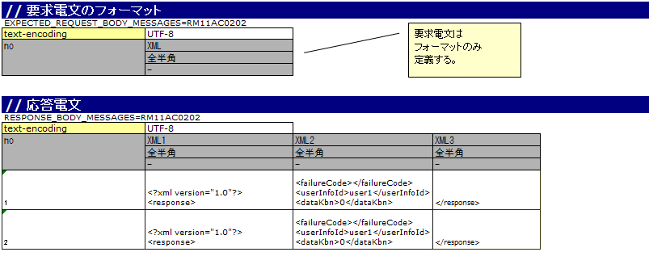

.. _dealUnitTest_http_send_sync:

=============================================================
带HTTP同步响应消息发送处理的取引单元测试实施方法
=============================================================

在带HTTP同步响应消息发送处理的Web应用程序中进行取引单元测试时，使用Nablarch提供的模拟类。

取引单元测试实施方法请参考\ :ref:`dealUnitTest_send_sync`\ 。

但是，请将「发送队列」「接收队列」替换为「通信目标」进行阅读。

本项说明与\ :ref:`dealUnitTest_send_sync`\ 不同的地方。

-------------------------------------------------------------------------------------
使用模拟类的取引单元测试实施方法
-------------------------------------------------------------------------------------

~~~~~~~~~~~~~~~~~~~~~~~~~~~~~~~~~~~~~~~~~~~~~~~~~~~~~~~~~~~~~~~~~~~~~~~~~~~~~~~~~~~~~~~~~~~~~~~~~~~~~~~~~~~~~~~~~~~~~~~~
Excel文件的编写方法
~~~~~~~~~~~~~~~~~~~~~~~~~~~~~~~~~~~~~~~~~~~~~~~~~~~~~~~~~~~~~~~~~~~~~~~~~~~~~~~~~~~~~~~~~~~~~~~~~~~~~~~~~~~~~~~~~~~~~~~~

进行取引单元测试时，按照规定的描述规则记载Excel文件。

Excel文件中定义的响应报文的格式及数据，用于生成模拟类返回的响应报文。
另外请求报文的格式，用于模拟类输出请求报文的日志。

编写示例
~~~~~~~~~~~~~~~~~~~~~~~~

以下显示Excel文件的记载示例。

报文的格式及数据的记载方法
~~~~~~~~~~~~~~~~~~~~~~~~~~~~~~~~~~~~~~~~~~~~~~~~~~~~~~~~
与同步响应消息发送处理的\ :ref:`send_sync_test_data_format`\ 相同。

但是，HTTP通信请求和响应报文都没有头部，因此只定义主体。

~~~~~~~~~~~~~~~~~~~~~~~~~~~~~~~~~~~~~~~~~~~~~~~~~~~~~~~~~~~~~~
框架使用的类的设置
~~~~~~~~~~~~~~~~~~~~~~~~~~~~~~~~~~~~~~~~~~~~~~~~~~~~~~~~~~~~~~

通常，这些设置由架构师进行，应用程序员不需要设置。

模拟类的设置
~~~~~~~~~~~~~~~~~~~~~~~~~~~~~~~~~~~~~~~~

在组件配置文件中，设置取引单元测试中使用的模拟类。

 .. code-block:: xml
  
      <!-- HTTP通信用客户端 -->
      <component name="defaultMessageSenderClient" 
                 class="nablarch.test.core.messaging.MockMessagingClient">
        <property name="charset" value="Shift-JIS"/>
      </component>

另外，通过在\ ``charset``\ 中指定字符编码名称，可以更改日志中输出的字符编码。
通常可以省略，省略时使用UTF-8。
