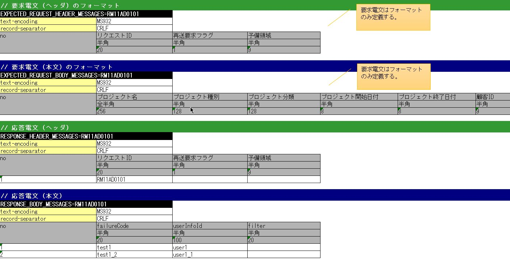
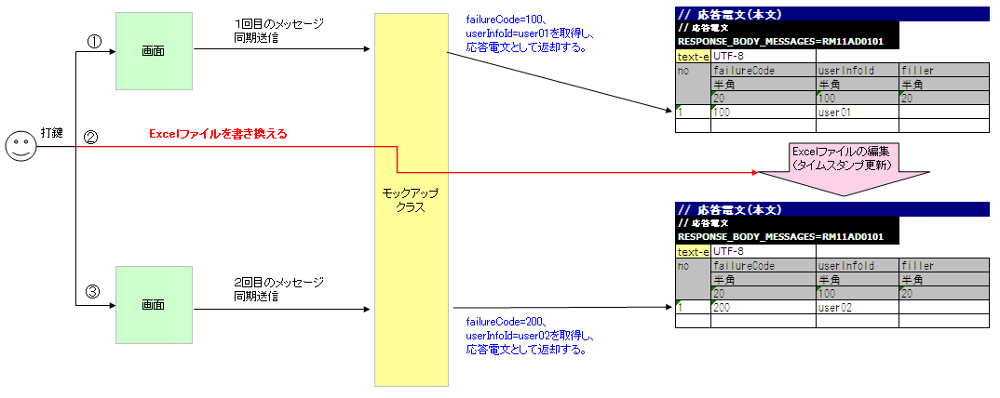

.. _dealUnitTest_send_sync:

=============================================================
同步响应消息发送处理的取引单元测试实施方法
=============================================================

在带有同步响应消息发送处理的Web应用程序中进行取引单元测试时，需要使用Nablarch提供的Mock类。

以下展示了Web应用程序中执行同步响应消息发送处理时的正常处理流程，以及使用Mock类进行取引单元测试时的处理流程。

* 带有同步响应消息发送处理的Web应用程序的正常处理流程

 .. image:: ./_images/send_sync_online_base.png
    :scale: 70

* 使用Mock类进行带有同步响应消息发送处理的Web应用程序的取引单元测试时的处理流程

 .. image:: ./_images/send_sync_online_mock.png
    :scale: 70

Mock类提供以下功能。

* 返回任意响应电文\ [#f1]_\ 的功能

  当从画面进行同步响应消息发送处理时，无需连接发送队列和接收队列，即可返回取引单元测试所需的响应电文。
  
* 将请求电文\ [#f1]_\ 输出到日志的功能

  可以将从画面同步发送的请求电文输出到日志。
  通过查看输出的日志，可以确认消息是否正常发送。
  此外，可以将输出的日志作为证据使用。

* 进行故障系测试的功能

  可以在执行同步响应消息发送处理时引发超时错误或消息收发错误。
  使用此功能可以进行故障系测试。

使用Mock类则无需准备队列，因此无需进行特殊中间件的安装或环境设置等准备工作，即可进行取引单元测试。

.. [#f1] 
 将向队列发送的消息称为"请求电文"，将从队列接收的消息称为"响应电文"。

-------------------------------------------------------------------------------------
使用Mock类的取引单元测试实施方法
-------------------------------------------------------------------------------------

使用Mock类时，需在Excel文件中定义响应电文的格式和数据。
此外，对于请求电文，仅需定义格式。

Excel文件需按请求ID\ [#f2]_\ 分别准备。文件名需与请求ID一致。
例如，请求ID为"RM21AA0101"时，文件名为"RM21AA0101.xlsx"。
文件的配置目录在配置文件中定义。详情参见\ :ref:`send_sync_test_data_path`\。
 
.. [#f2] 
 此处所述的请求ID是指为唯一标识接收消息的目标系统功能而定义的ID，
 请注意其与Web应用程序或批处理中使用的请求ID含义不同。
 基于此请求ID决定请求电文和响应电文的格式、发送队列名、接收队列名。

 
~~~~~~~~~~~~~~~~~~~~~~~~~~~~~~~~~~~~~~~~~~~~~~~~~~~~~~~~~~~~~~~~~~~~~~~~~~~~~~~~~~~~~~~~~~~~~~~~~~~~~~~~~~~~~~~~~~~~~~~~
Excel文件的编写方法
~~~~~~~~~~~~~~~~~~~~~~~~~~~~~~~~~~~~~~~~~~~~~~~~~~~~~~~~~~~~~~~~~~~~~~~~~~~~~~~~~~~~~~~~~~~~~~~~~~~~~~~~~~~~~~~~~~~~~~~~

进行取引单元测试时，需按照规定的描述规则编写Excel文件。

以下展示了编写Excel文件时应遵循的规则。

* 工作表名固定为"message"。
* 定义要返回的响应电文的框架控制报头和正文的格式。
* 定义要返回的响应电文的框架控制报头和正文的数据。
* 定义请求电文的框架控制报头和正文的格式。

在Excel文件中定义的响应电文格式和数据用于生成Mock类返回的响应电文。
此外，请求电文的格式用于Mock类输出请求电文的日志。

编写示例
~~~~~~~~~~~~~~~~~~~~~~~~

以下展示了Excel文件的填写示例。

.. _send_sync_test_data_format:

电文格式及数据的记载方法
~~~~~~~~~~~~~~~~~~~~~~~~~~~~~~~~~~~~~~~~~~~~~~~~~~~~~~~~

电文格式及数据按以下格式填写。

+---------------------+--------------------------+------------------+--------------+
|标识符               |                                                            |
+---------------------+--------------------------+------------------+--------------+
|指令行               | 指令的设置值             |                                 |
+---------------------+--------------------------+------------------+--------------+
|    ...  [#f3]_\     |    ...                   |                  |              |
+---------------------+--------------------------+------------------+--------------+
|no                   |字段名称(1)               |字段名称(2)       |...  [#f4]_\  |
|                     +--------------------------+------------------+--------------+
|                     |数据类型(1)               |数据类型(2)       |...           |
|                     +--------------------------+------------------+--------------+
|                     |字段长度(1)               |字段长度(2)       |...           |
|                     +--------------------------+------------------+--------------+
|                     |数据(1-1)                 |数据(2-1)         |...           |
|                     +--------------------------+------------------+--------------+
|                     |数据(1-2)                 |数据(2-2)         |...           |
|                     +--------------------------+------------------+--------------+
|                     |... \ [#f5]_\             |...               |...           |
+---------------------+--------------------------+------------------+--------------+

.. [#f3] 
 从此处往下，同样按照指令的数量继续。
 
.. [#f4] 
 从此处往右，同样按照字段的数量继续。

.. [#f5]
 从此处往下，同样按照数据的数量继续。

\

========================== ===============================================================================================================================================================================================================================================================
名称                       说明
========================== ===============================================================================================================================================================================================================================================================
标识符                     指定表示电文种类的ID。本项目与测试用例列表中记载的expectedMessage以及responseMessage的组ID关联。
                  
                           标识符的格式如下所示。
                  
                           * 请求电文的报头 … EXPECTED_REQUEST_HEADER_MESSAGES=请求ID
                           * 请求电文的正文 … EXPECTED_REQUEST_BODY_MESSAGES=请求ID
                           * 响应电文的报头 … RESPONSE_HEADER_MESSAGES=请求ID
                           * 响应电文的正文 … RESPONSE_BODY_MESSAGES=请求ID
指令行 \ [#f6]_\           记载指令。在指令名单元格右侧的单元格中记载设置值（可指定多行）。
no                         指令行的下一行必须记载"no"。
字段名称                   记载字段名称。按照字段数量记载。
数据类型                   记载该字段的数据类型。按照字段数量记载。

                           数据类型使用"半角英文字母"等日文名称描述。

                           格式定义文件上的数据类型和日文名称数据类型的映射关系，请参见 `BasicDataTypeMapping <https://github.com/nablarch/nablarch-testing/blob/main/src/main/java/nablarch/test/core/file/BasicDataTypeMapping.java>`_ 的成员变量DEFAULT_TABLE。
字段长度                   记载该字段的字段长度。填写"-"时，将根据"数据"栏的记载内容自动计算大小。
                  
                           按照字段数量记载。
数据                       数据仅在响应电文时填写。记载存储在该字段中的数据。需要返回多件响应电文时，请在下一行继续填写数据。
========================== ===============================================================================================================================================================================================================================================================

.. [#f6]
 记述指令时，无需记载格式定义文件中对应以下内容的项目。

 ============== ==============================================================
 项目           理由
 ============== ==============================================================
 file-type      测试框架仅支持固定长度。
 record-length  按照字段长度中记载的大小进行填充。
 ============== ==============================================================

.. tip::
 字段名称、数据类型、字段长度的记述，可以通过从外部接口设计书复制粘贴来高效创建。\
 （粘贴时，请勾选"\ **转置行列**\ "选项）

Excel文件的重新加载
~~~~~~~~~~~~~~~~~~~~~~~~~~~~~~~~~~~~~~~~~~~~~~~~~~~~~~~~~~~~~~~~~~~~~~~

Mock类考虑到手动编辑Excel文件后重新测试的情况，以及使用相同数据重复测试的情况，
提供了在Excel文件时间戳更新时重新加载文件的功能。

通常，每次返回以下响应电文时会进行no的递增，在应用程序服务器运行期间，no的值不会被初始化。

定义了以下响应电文数据时，第1次消息同步发送会返回no.1的响应电文，
并进行no的递增。然后第2次消息同步发送会返回no.2的响应电文。

但是，通过编辑或覆盖Excel文件更新时间戳，可以在应用程序服务器运行期间重新加载Excel文件。

以下展示了编辑Excel文件后重新测试的示例。

.. _`send_sync_response_count_change.png`:

故障系测试
~~~~~~~~~~~~~~~~~~~~~~~~~~~~~~~~~~~~~~~~~~~~~~~~~~~~~~~~~~~~~~

通过在响应电文正文表的第一个字段中设置以"errorMode:"开头的特定值，可以进行故障系测试。

以下展示了设置值与故障系测试的对应关系。

 +-----------------------------------+-------------------------------------------------------------+------------------------------------------------+
 | 在第一个字段中设置的值            | 故障内容                                                    |  自动测试框架的动作                            |
 +===================================+=============================================================+================================================+
 |  errorMode:timeout                | 测试消息发送中发生超时错误的情况                            |  将sendSync方法的返回值设为null。              |
 +-----------------------------------+-------------------------------------------------------------+------------------------------------------------+
 |  errorMode:msgException           | 测试消息收发错误发生的情况                                  |  抛出MessagingException。                      |
 +-----------------------------------+-------------------------------------------------------------+------------------------------------------------+
 
 
记载示例如下所示。

 .. image:: ./_images/send_sync_test_data_error.png

~~~~~~~~~~~~~~~~~~~~~~~~~~~~~~~~~~~~~~~~~~~~~~~~~~~~~~~~~~~~~~
请求电文的日志输出
~~~~~~~~~~~~~~~~~~~~~~~~~~~~~~~~~~~~~~~~~~~~~~~~~~~~~~~~~~~~~~

请求电文的日志以Map形式和CSV形式输出。

Map形式的日志用于调试，CSV形式的日志用于获取证据时使用。

在示例中，Map形式的日志输出到标准输出和应用程序日志文件，CSV形式的日志输出到专用日志文件，但通过修改日志设置可以切换输出目标。
    
日志输出示例如下所示。

* Map形式的情况

 .. code-block:: bash
  
  2011-10-26 13:16:10.958 MESSAGING_SEND_MAP request id=[RM11AD0101]. following message has been sent: 
    message fw header = {requestId=RM11AD0101, testCount=, resendFlag=0, reserved=}
    message body      = {authors=test3, title=test1, publisher=test2}

* CSV形式的情况

 .. code-block:: bash
  
  2011-10-26 13:16:10.958 MESSAGING_SEND_CSV request id=[RM11AD0102]. following message has been sent: 
  header: 
  "requestId","testCount","resendFlag","reserved"
  "RM11AD0102","","0",""
  body: 
  "authors","title","publisher"
  "test3","test1","test2"

日志输出设置在log.properties中进行。设置示例如下所示。

 .. code-block:: bash
  
  # CSV形式的消息日志写入器（输出到./messaging-evidence.log）
  writer.MESSAGING_CSV.className=nablarch.core.log.basic.FileLogWriter
  writer.MESSAGING_CSV.filePath=./messaging-evidence.log
  writer.MESSAGING_CSV.formatter.className=nablarch.core.log.basic.BasicLogFormatter
  writer.MESSAGING_CSV.formatter.format=$message$

  # CSV形式的消息日志记录器
  loggers.MESSAGING_CSV.nameRegex=MESSAGING_CSV
  loggers.MESSAGING_CSV.level=DEBUG
  loggers.MESSAGING_CSV.writerNames=MESSAGING_CSV

  # Map形式的消息日志记录器
  loggers.MESSAGING_MAP.nameRegex=MESSAGING_MAP
  loggers.MESSAGING_MAP.level=DEBUG
  loggers.MESSAGING_MAP.writerNames=stdout,appFile

~~~~~~~~~~~~~~~~~~~~~~~~~~~~~~~~~~~~~~~~~~~~~~~~~~~~~~~~~~~~~~
框架使用的类的设置
~~~~~~~~~~~~~~~~~~~~~~~~~~~~~~~~~~~~~~~~~~~~~~~~~~~~~~~~~~~~~~

这些设置是仅在取引单元测试中需要的设置。因此，将这些设置配置到测试用的profile中。
关于按环境切换组件的方法，请参见 :ref:`how_to_change_componet_define` 。

通常，这些设置由架构师进行，应用程序编程人员无需设置。

Mock类的设置
~~~~~~~~~~~~~~~~~~~~~~~~~~~~~~~~~~~~~~~~

在组件配置文件中，设置取引单元测试中使用的Mock类。

 .. code-block:: xml
  
      <!-- Mock的消息提供程序 -->
      <component name="messagingProvider"
                 class="nablarch.test.core.messaging.MockMessagingProvider">
      </component>

.. _send_sync_test_data_path:

Excel文件存放位置的设置
~~~~~~~~~~~~~~~~~~~~~~~~~~~~~~~~~~~~~~~~~~~~~~~~~~~~~~~~~~~~~~~~~~~~~~~~~~~~~~

在组件配置文件中，设置Excel文件存放位置的路径。

 .. code-block:: xml
  
    <component name="filePathSetting"
             class="nablarch.core.util.FilePathSetting" autowireType="None">
       <property name="basePathSettings">
         <map>
           <!-- 指定Excel文件存放位置的路径 -->
           <entry key="sendSyncTestData" value="file:///C:/nablarch/workspace/Nablarch_sample/test/message" />
           <entry key="format" value="classpath:web/format" /> 
         </map>
       </property>
       <property name="fileExtensions">
         <map>
           <!-- 定义Excel文件的扩展名（xlsx）-->
           <entry key="sendSyncTestData" value="xlsx" />
           <entry key="format" value="fmt" />
         </map>
       </property>
    </component>

以下展示了Excel文件的存放示意图。

 .. image:: ./_images/send_sync_test_data_structure.png

.. tip::

 建议存放目录的路径使用文件系统路径（file:）而非类路径（classpath:）。
 指定文件系统路径后，可以在服务器运行期间直接编辑Excel文件内容进行测试。

测试数据解析类的设置
~~~~~~~~~~~~~~~~~~~~~~~~~~~~
在组件配置文件中，设置取引单元测试中使用的测试数据解析类。

 .. code-block:: xml
 
   <!-- TestDataParser -->
  <component name="messagingTestDataParser" class="nablarch.test.core.reader.BasicTestDataParser">
    <property name="testDataReader">
      <component name="xlsReaderForPoi" class="nablarch.test.core.reader.PoiXlsReader"/>
    </property>
    <property name="interpreters" ref="messagingTestInterpreters" />
  </component>
   <!-- 进行测试数据记述法解释的类群  -->
  <list name="messagingTestInterpreters">
    <component class="nablarch.test.core.util.interpreter.NullInterpreter"/>
    <component class="nablarch.test.core.util.interpreter.QuotationTrimmer"/>
    <component class="nablarch.test.core.util.interpreter.CompositeInterpreter">
      <property name="interpreters">
        <list>
          <component class="nablarch.test.core.util.interpreter.BasicJapaneseCharacterInterpreter"/>
        </list>
      </property>
    </component>
  </list>

向pom.xml添加必要的单元测试库
~~~~~~~~~~~~~~~~~~~~~~~~~~~~~~~~~~~~~~~~~~~~
向pom.xml添加以下dependency

 .. code-block:: xml
 
        <dependency>
          <groupId>com.nablarch.framework</groupId>
          <artifactId>nablarch-testing</artifactId>
          <exclusions>
            <exclusion>
              <groupId>org.mortbay.jetty</groupId>
              <artifactId>*</artifactId>
            </exclusion>
            <exclusion>
              <groupId>com.google.code.findbugs</groupId>
              <artifactId>*</artifactId>
            </exclusion>
          </exclusions>
        </dependency>
