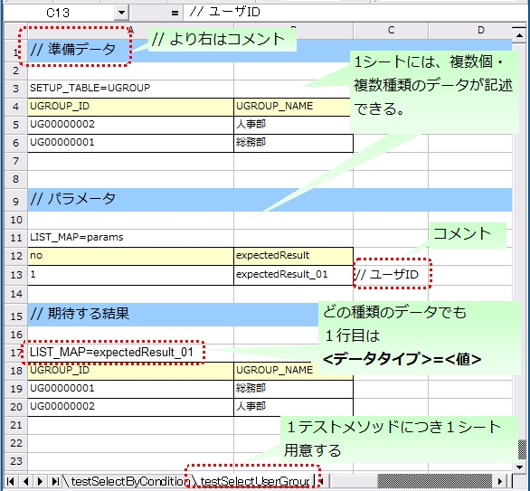

.. _auto-test-framework:

========================
自动化测试框架
========================

----
特点
----

基于JUnit4
============
自动化测试框架基于JUnit4。
使用JUnit4提供的各种注解、assert方法和Matcher类等功能。

.. tip::

  如果希望在JUnit 5上运行自动化测试框架，请参考 :ref:`run_ntf_on_junit5_with_vintage_engine`。

测试数据外部化
====================
可以将测试数据描述在Excel文件中。
通过自动化测试框架的API，可以使用包含数据库准备数据和预期测试结果等信息的Excel文件。

提供Nablarch专用的测试辅助功能
======================================
提供事务控制、系统日期设置等Nablarch应用程序特有的API。

.. ----
.. 要求
.. ----

.. 已实现
.. ========

.. * 数据设置

..   * 可以在EXCEL中描述数据库(表)数据的准备数据。
 

.. * 测试执行功能
   

.. * 判定（断言功能）

..   * 可以断言表的更新结果
..   * 可以断言SELECT语句的执行结果(获取结果)
..   * 可以断言方法的返回值

..     * List<Map<String, String>

..   * 对于单元格内的数据，可以明确描述空白和null。

.. 未实现
.. ======
.. * 数据设置

..   * 可以快速设置主数据。

..     * 主数据(消息、代码等、、)的投入。※对于每个测试用例都不变的数据，可以从转储等快速加载。

..   * 可以从数据表向各测试环境投入数据。
..   * 数据备份。
..   * 从备份恢复。
..   * 测试数据的描述形式可以清晰描述。
..   * 测试数据可以以任意单位描述。
..   * 测试数据可以不依赖字符编码描述。
..   * 可以轻松地修改・添加自动化测试用例。
..   * 重构目标模块时对数据表的影响最小。
..   * 可以描述以下数据

..     * 数据库数据
..     * 文件(XML, CSV, 固定长度)
..     * 作为方法返回值的值（Java 对象等）
..     * 结束代码、日志输出消息(JOBLOG也包含)
..     * HTTP请求/响应
..     * 其他消息（MQ 等）
..     * 二进制数据

..   * 可以从EXCEL创建的数据文件创建文件(固定长度、CSV、可变长度、XML等)并配置到各测试环境。

.. * 测试执行功能

..   * 可以将输入数据（批处理启动参数/用户输入等）描述在 EXCEL 中。
..   * 可以将准备数据作为输入来执行自动化测试。（当然，数据库/文件都可以执行。）
..   * 可以使用存根执行自动化测试(MQ、加密、外部连接、产品依赖等)。
..   * 项目审查的自动化测试可以在不准备每个测试数据的情况下执行。
..   * 可以重复执行相同的自动化测试。
..   * 可以指定执行自动化测试的范围。
..   * 自动化测试全部执行时执行顺序不会影响结果。
..   * 自动化测试全部执行可以高速执行。
..   * 可以从准备数据表执行自动化测试。
..   * 可以为异常系统测试，人为地引发环境导致的错误。
..   * 可以不依赖OS等环境执行测试。
..   * 可以对目标模块的所有逻辑（方法、过程等）执行测试。
..   * 可以透明地执行死锁和锁定请求超时的重试。

.. * 判定（断言功能）

..   * 可以断言XML文件。
..   * 可以断言画面布局。
..   * 可以断言报表数据。

.. 未讨论
.. ======

..   * 可以从Excel数据生成任意Java对象(例：Entity列表、JMS消息…)的逻辑，可以在不修改现有功能的情况下添加。

..   * 搭载链接功能。例如，如果某个单元格中写有"*LINK1"，则可以获取具有"*LINK1"ID的数据内容。
..   * Excel文件不仅可以作为外部文件，还可以作为测试规格书使用。可以基于测试规格书驱动测试。
    
..   * 即使不编写JUnit测试代码，只需准备Excel文件就可以执行测试。

.. 撤销
.. ========

.. 目前没有。

.. _`testing_fw_components`:

------------------------------
自动化测试框架的构成
------------------------------

.. image:: _images/abstract_structure.png
   :scale: 80

+----------------------------+--------------------------------------+--------------------------------------+
|构成物                      |说明                                  |创建者                                |
+============================+======================================+======================================+
|测试类                      |描述测试处理。                        |应用程序程序员                        |
+----------------------------+--------------------------------------+--------------------------------------+
|测试目标类                  |作为测试目标的类。                    |应用程序程序员                        |
+----------------------------+--------------------------------------+--------------------------------------+
|Excel文件                   |描述测试数据。使用自动化测试框架      |应用程序程序员                        |
|                            |可以读取数据。                        |                                      |
+----------------------------+--------------------------------------+--------------------------------------+
|组件设置文件・              |描述测试执行时的各种设置。            |应用程序程序员（需要                  |
|环境设置文件                |                                      |个别测试特有的设置时）                |
+----------------------------+--------------------------------------+--------------------------------------+
|自动化测试框架              |提供测试所需的功能。                  | －                                   |
|                            |                                      |                                      |
+----------------------------+--------------------------------------+--------------------------------------+
|Nablarch Application        |框架本体（本功能的对象外）            | －                                   |
|Framework                   |                                      |                                      |
+----------------------------+--------------------------------------+--------------------------------------+

----------------------
测试方法描述方法
----------------------

使用JUnit4的注解。
在测试方法上赋予 @Test 注解。

 .. code-block:: java 

    public class SampleTest {

        @Test
        public void testSomething() {
            // 测试处理
        }
    }

.. tip::
  也可以使用@Before和@After等注解。如果想使用这些注解
  在测试方法前后执行资源获取释放等共同处理，
  请参考下一项（ :ref:`using_junit_annotation` ）。

.. _`how_to_write_excel`:

---------------------------
使用Excel描述测试数据
---------------------------

要表示数据库准备数据和数据库搜索结果等数据，
与Java源代码相比，电子表格在可读性和编辑便利性方面更有优势。
通过使用Excel文件，可以以电子表格形式处理这些数据。

命名规范
========

Excel文件名和文件路径有推荐的规范。遵循此规范，就无需在测试类中显式指定目录名或文件名来读取文件，可以简洁地描述测试源代码。当然也可以通过显式指定路径来读取任意位置的Excel文件。

路径、文件名相关规范
----------------------------

关于文件名和路径的推荐规范如下。

- Excel文件名与测试源代码同名（仅扩展名不同）。

- 将Excel文件放在与测试源代码相同的目录中。

示例如下。

+--------------------+----------------------+-----------------------------+
|文件类型            |配置目录              |文件名                       |
+====================+======================+=============================+
|测试源文件          |<PROJECT_ROOT>/test   |ExampleDbAcessTest.java      |
+--------------------+/jp/co/tis/example/db/+-----------------------------+
|Excel文件           |                      |ExampleDbAcessTest.xlsx [#]_ |
+--------------------+----------------------+-----------------------------+

.. [#] Excel 文件支持 Excel2003以前的文件格式(扩展名 xls 的格式)以及 Excel2007 以后的文件格式(扩展名 xlsx 的格式)。   

Excel工作表名相关规范
-------------------------

关于Excel工作表，推荐以下规范。

- 每个测试方法准备1个工作表。

- 工作表名与测试方法名相同。

示例如下。

+--------------------+--------------------------------+
|测试方法            |@Test public void testInsert()  |
+--------------------+--------------------------------+
|Excel工作表名       |testInsert                      |
+--------------------+--------------------------------+

.. tip::
  关于工作表的规范不是"约束"事项。
  即使测试方法名和Excel工作表名不同也能正常工作。
  今后的功能添加将以上述规范为默认值进行开发，因此建议遵循命名规范。
  即使要更改命名规范，也要在项目内统一。

工作表内的结构
==============

说明关于工作表描述方法的规范。
以下显示工作表的描述示例。

 

工作表内可以描述存储到数据库的数据、数据库搜索结果等各种类型的数据。为了判断测试数据的类型，需要为测试数据赋予"数据类型"这种元信息。"数据类型"表示该测试数据代表什么。

目前，准备了以下数据类型。

================================= ==================================================================  ==========================
数据类型名                        说明                                                                设置的值                    
================================= ==================================================================  ==========================
SETUP_TABLE                       测试执行前注册到数据库的数据                                        注册目标的表名
EXPECTED_TABLE                    测试执行后预期的数据库数据                                          确认目标的表名
                                  省略的列将成为比较对象外。
EXPECTED_COMPLETE_TABLE           测试执行后预期的数据库数据                                          确认目标的表名
                                  省略的列将视为已设置\ :ref:`default_values_when_column_omitted`\                               
LIST_MAP                          List<Map<String,String>>形式的数据                                  工作表内唯一的ID
                                                                                                      期待值的ID(任意字符串)
SETUP_FIXED                       事前准备用的固定长度文件                                            准备文件的配置位置
EXPECTED_FIXED                    表示期待值的固定长度文件                                            比较目标文件的配置位置
SETUP_VARIABLE                    事前准备用的可变长度文件                                            准备文件的配置位置
EXPECTED_VARIABLE                 表示期待值的可变长度文件                                            比较目标文件的配置位置
MESSAGE                           消息处理测试中使用的数据                                            固定值 \ [#]_\ 
EXPECTED_REQUEST_HEADER_MESSAGES  表示请求消息（头）的期待值的固定长度文件                            请求ID
EXPECTED_REQUEST_BODY_MESSAGES    表示请求消息（正文）的期待值的固定长度文件                          请求ID
RESPONSE_HEADER_MESSAGES          表示响应消息（头）的固定长度文件                                    请求ID
RESPONSE_BODY_MESSAGES            表示响应消息（正文）的固定长度文件                                  请求ID
================================= ==================================================================  ==========================

\

.. [#] \ `setUpMessages`\ 或者\ `expectedMessages`\ 

此外，还可以描述多个数据。

不依赖数据种类的通用格式如下。

* 数据第1行以"数据类型=值"的格式，描述数据类型和值。
* 第2行以后的格式因数据类型而异。

数据类型是用于确定该数据代表什么的信息。
例如，如果该数据是应该投入数据库的数据，则使用数据类型"SETUP_TABLE"。

例如，按以下方式描述数据类型时，表示该数据是应该作为准备数据注册到COMPOSER表的数据。

SETUP_TABLE=COMPOSER

+--------+------------+-----------+
|     NO | FIRST_NAME | LAST_NAME |
+========+============+===========+
|  00001 | Steve      | Reich     |
+--------+------------+-----------+
|  00002 | Phillip    | Glass     |
+--------+------------+-----------+

注释
========

如果在单元格内描述以"//"开头的字符串，则该单元格及右侧的单元格都将被排除在读取对象之外。如果不想将信息包含在测试数据本身中，但为了可读性而想添加附加信息时，可以使用注释功能。

以下示例中，在第2行对表的逻辑名称进行注释，在第4行末尾对期待结果进行注释。

EXPECTED_TABLE=PLAYER

+----------+----------+----------+----------+----------------------------+
|NO        |FIRST_NAME|LAST_NAME |ADDRESS   |                            |
+==========+==========+==========+==========+============================+
|//编号    |名        |姓        |地址      |                            |
+----------+----------+----------+----------+----------------------------+
|0001      |Andres    |Segovia   |Spain     |                            |
+----------+----------+----------+----------+----------------------------+
|0002      |Julian    |Bream     |England   | // 将添加此记录            |
+----------+----------+----------+----------+----------------------------+

.. _`marker_column`:  

标记列
==============

描述测试数据时，有时希望数据实际上不包含在内，但想在Excel工作表上描述。\
使用前述的"注释"可以描述实际上不包含在数据中的信息，\
但"注释"具有从该单元格开始右侧单元格都变为读取对象外这种特性，因此\
不能在左端（或中央）单元格使用注释。

这种情况下，使用"标记列"，可以描述实际上不包含在数据中但
在Excel工作表外观上存在的数据。

在测试数据的标题行中，\
**如果列名被半角方括号包围，则该列被视为"标记列"**\
标记列对应的列在测试执行时不会被读取。

例如，有以下测试数据。

LIST_MAP=EXAMPLE_MARKER_COLUMN

+----+----------+----------+
|[no]|id        |name      |
+====+==========+==========+
|1   |U0001     |山田      |
+----+----------+----------+ 
|2   |U0002     |田中      |
+----+----------+----------+

上述测试数据中，由于列[no]被半角方括号包围而被忽略，
因此在测试执行时等同于以下测试数据。

LIST_MAP=EXAMPLE_MARKER_COLUMN

  +----------+----------+
  |id        |name      |
  +==========+==========+
  |U0001     |山田      |
  +----------+----------+
  |U0002     |田中      |
  +----------+----------+

这里举了LIST_MAP的例子，但其他数据类型也同样可以使用。

单元格格式
==========

单元格格式仅使用字符串。
创建测试数据前，请将所有单元格的格式设置为字符串。

关于边框和单元格着色可以任意设置。通过设置边框和单元格颜色可以使数据更易读，有望提高审查质量和可维护性。

.. important::
 | 如果在Excel文件中使用字符串以外的格式描述数据，将无法正确读取数据。

日期的描述方法
==============

日期可以用以下格式描述。

- yyyyMMddHHmmssSSS

- yyyy-MM-dd HH:mm:ss.SSS

可以像下面这样省略时间的毫秒或全部。

+---------------------------+-------------------------------------------------------+
|省略方法                   |省略时的动作                                           |
+===========================+=======================================================+
| | 省略毫秒                |毫秒视为指定了0。                                      |
| | ・yyyMMddHHmmss         |                                                       |
| | ・yyy-MM-dd HH:mm:ss    |                                                       |
+---------------------------+-------------------------------------------------------+
| | 省略全部时间            |时间视为指定了0时0分0秒000。                           |
| | ・yyyMMdd               |                                                       |
| | ・yyy-MM-dd             |                                                       |
+---------------------------+-------------------------------------------------------+

示例如下。

+--------------------------+------------------------------------------+
|描述示例                  |评估结果                                  |
+==========================+==========================================+
|20210123123456789         |2021年1月23日 12时34分56秒789             |
+--------------------------+------------------------------------------+
|20210123123456            |2021年1月23日 12时34分56秒000             |
+--------------------------+------------------------------------------+
|20210123                  |2021年1月23日 00时00分00秒000             |
+--------------------------+------------------------------------------+
|2021-01-23 12:34:56.789   |2021年1月23日 12时34分56秒789             |
+--------------------------+------------------------------------------+
|2021-01-23 12:34:56       |2021年1月23日 12时34分56秒000             |
+--------------------------+------------------------------------------+
|2021-01-23                |2021年1月23日 00时00分00秒000             |
+--------------------------+------------------------------------------+

.. _`special_notation_in_cell`:

单元格的特殊描述方法
======================
为了提高自动化测试的便利性，提供几种特殊记法。
下表是本框架提供的特殊描述方法。

+-----------------------+----------------------------+--------------------------------------------------------------------------+
|描述方法 (单元格中描述\| 自动化测试内的值 [#]_\     |说明                                                                      |
|的值)                  |                            |                                                                          |
+=======================+============================+==========================================================================+
|null                   | null                       |如果单元格内描述为「null」 **(半角、不区分大小写)** ，                    |
+-----------------------+                            |则视为「null」值。例如，想在数据库中注册null值，                          |
|Null                   |                            |或在期待值中设置null值时使用。                                            |
+-----------------------+----------------------------+--------------------------------------------------------------------------+
|"null"                 |字符串的null                |如果字符串前后被双引号(半角、全角均可)包围，                              |
+-----------------------+                            |则视为去除前后双引号的字符串。\ [#]_                                      |
|"NULL"                 |                            |                                                                          |
+-----------------------+----------------------------+例如，如果需要将「null」或「NULL」作为字符串处理，                        |
|"1⊔"                   | 1⊔                         | 则按描述方法所示描述为「"null"」或「"NULL"」。                           |
+-----------------------+----------------------------+                                                                          |
|"⊔"                    | ⊔                          |此外，为了清楚表明单元格值包含空格，                                      |
+-----------------------+----------------------------+也可以按描述方法所示描述为「"1?"」或「"?"」。                             |
| "１△"                 | １△                        |                                                                          |
|                       |                            |                                                                          |
+-----------------------+----------------------------+                                                                          |
| "△△"                  | △△                         |                                                                          |
+-----------------------+----------------------------+                                                                          |
| """                   | "                          |                                                                          |
+-----------------------+----------------------------+                                                                          +
| "" [#]_               | 空字符串                   |                                                                          |
+-----------------------+----------------------------+--------------------------------------------------------------------------+
|${systemTime}          |系统日期时间 [#]_           |想描述系统日期时间时使用                                                  |
+-----------------------+                            +--------------------------------------------------------------------------+
|${updateTime}          |                            |${systemTime}的别名。特别作为数据库时间戳更新时的期待值使用               |
|                       |                            |使用。                                                                    |
+-----------------------+----------------------------+--------------------------------------------------------------------------+
|${setUpTime}           |组件设置文件中              |想在数据库设置时的时间戳中使用固定值时使用。\                             |
|                       |描述的固定值                |                                                                          |
+-----------------------+----------------------------+--------------------------------------------------------------------------+
|${字符类型,字符数} [#]_|将指定字符类型的指定        |可使用的字符串如下。                                                      |
|                       |字符数放大后的值            |                                                                          |
|                       |                            |半角英文字母,半角数字,半角符号,半角假名,全角英文字母,全角数字,            |
|                       |                            |全角平假名,全角片假名,全角汉字,全角符号其他,外字                          |
|                       |                            |                                                                          |
+-----------------------+----------------------------+--------------------------------------------------------------------------+
|${binaryFile:文件路径} |存储到BLOB列的二进制数据    |想在BLOB列中存储文件数据时使用。                                          |
|                       |                            |文件路径使用相对于Excel文件的路径描述。                                   |
+-----------------------+----------------------------+--------------------------------------------------------------------------+
|\\r                    |\ *CR*\                     |想明确描述换行代码时使用。\ [#]_                                          |
+-----------------------+----------------------------+--------------------------------------------------------------------------+
|\\n                    |\ *LF*\                     |                                                                          |
+-----------------------+----------------------------+--------------------------------------------------------------------------+

.. tip::
  **图例**
  
  *  ⊔ 表示半角空格
  *  △表示全角空格
  * *CR* 表示换行代码CR(0x0D)
  * *LF* 表示换行代码LF(0x0A)

.. [#]
 从单元格读取后在自动化测试框架中进行转换。
                                                                                                 
\ 

.. [#]

  即使使用本描述方法，字符串中的双引号也不需要转义。
  示例如下。

 +-----------------+----------------------------------------------------------------------------+ 
 |     描述示例      | 说明                                                                     |
 +=================+============================================================================+ 
 |"ab"c"           | 视为ab"c。(去除前后的双引号。)                                             |
 +-----------------+----------------------------------------------------------------------------+
 |"abc""           | 视为abc"。(去除前后的双引号。)                                             |
 +-----------------+----------------------------------------------------------------------------+
 | ab"c            | 视为ab"c。(因为前后不是双引号，所以按原样处理。)                           |
 +-----------------+----------------------------------------------------------------------------+
 | abc"            | 视为abc"。(因为前后不是双引号，所以按原样处理。)                           |
 +-----------------+----------------------------------------------------------------------------+

\

.. [#] 
 使用此记法可以表示空行。
 请参考『\ :ref:`how_to_express_empty_line`\ 』项。

.. [#] 转换为由组件设置文件中设置的SystemTimeProvider实现类获取的Timestamp的字符串形式。\
 具体来说，会转换为\ `2011-04-11 01:23:45.0` 这样的值。

\

.. [#]
 本记法可以单独使用，也可以组合使用。
 示例如下。

 +--------------------------+----------------------+-----------------------------------+ 
 |          描述示例        | 转换后的值示例       | 说明                              |
 +==========================+======================+===================================+
 |${半角英文字母,5}         | geDSfe               |转换为半角英文字母5字符。          |
 +--------------------------+----------------------+-----------------------------------+
 |${全角平假名,4}           | 示例文本             |转换为全角平假名4字符。            |
 +--------------------------+----------------------+-----------------------------------+
 |${半角数字,2}-{半角数字4} | 37-3425              |除了-以外都转换。                  |
 +--------------------------+----------------------+-----------------------------------+
 |${全角汉字,4}123          | 山川海森123          |除了末尾123以外都转换。            |
 +--------------------------+----------------------+-----------------------------------+

.. [#]
 
 Excel单元格内的换行（Alt+Enter）被视为\ *LF*\ 。这是与本功能无关的Excel规格。
 如果想表示换行代码LF，只需在单元格内换行（Alt+Enter）即可。
 
 示例如下。

 +--------------------------+----------------------+-----------------------------------+ 
 |          描述示例        | 转换后的值示例       | 说明                              |
 +==========================+======================+===================================+
 |你好 |br|                 |你好\ *LF*\           |单元格内的换行（Alt+Enter）为      |
 |再见                      |再见                  |LF(0x0A)。                         |
 +--------------------------+----------------------+-----------------------------------+
 |你好\\n                   |你好\ *LF*\           |'\\n'由本功能转换为LF(0x0A)。      |
 |再见                      |再见                  |                                   |
 +--------------------------+----------------------+-----------------------------------+
 |你好\\r |br|              |你好\ *CRLF*\         |'\\r'由本功能转换为CR(0x0D)        |
 |再见                      |再见                  |。单元格内的换行                   |
 |                          |                      |（Alt+Enter）为LF(0x0A)。          |
 +--------------------------+----------------------+-----------------------------------+

--------
注意事项
--------

创建不依赖测试方法执行顺序的测试
====================================================

创建测试源代码、测试数据时，请注意使测试结果不随测试方法的执行顺序而改变。不仅要考虑顺序，单独测试类和一起测试时也必须得到相同的结果。

特别是，由于本框架在测试中会进行提交，因此前后的测试可能会改变数据库的内容。\
因此，自测试类所需的预条件必须全部在自测试类内准备。

这样可以获得以下效果。

* 防止因测试执行顺序而偶然失败或偶然成功的情况。
* 仅通过该测试的数据或源代码就能了解预条件。

对于像主数据这样基本上只读的表的准备，请准备通用的Excel文件并在其中描述。在测试执行前只执行一次，或在测试执行前以已准备好为前提执行测试。

这种方法有以下优点。

* 可以在整个项目中重复利用主数据。
* 测试数据的维护变得容易。
* 测试执行速度提高。

.. tip::
 主数据的投入使用\ :ref:`master_data_setup_tool`\ 。\
 此外，通过\ :doc:`04_MasterDataRestore`\ ，可以将测试内发生的主数据更改在测试结束时自动恢复到原始状态。这样，即使需要更改主数据的测试用例，也可以不影响其他测试用例执行。

所有测试数据都描述在Excel工作表中
=======================================

如果Excel和测试源代码中测试数据混杂，可读性和可维护性会降低。请不要在测试源代码中描述测试数据，所有测试数据都描述在Excel工作表中。

* 查看Excel工作表就能把握测试用例的变化。
* 测试数据在Excel工作表，测试逻辑在测试源代码，职责分工明确。
* 通过采用读取Excel工作表的结构，可以轻松地添加测试用例。
* 可以大幅减少测试源代码的重复(如果在测试源代码中简单地用字面量描述数据，数据变化增加时会产生重复代码)。

.. _auto-test-framework_multi-datatype:

使用多个数据类型时请按数据类型分组描述数据
============================================================================
使用多个数据类型时，请按使用的数据类型分组描述数据。
如果混用多个数据类型描述数据，数据读取会在中途结束，测试无法正确执行。

例如，如果像以下这样描述数据类型，只会评估到 ``TABLE2`` 的数据，
即使 ``TABLE3`` 以后的数据有错误，测试也会成功。

.. code-block:: text

  EXPECTED_TABLE=TABLE1
  :
  EXPECTED_COMPLETE_TABLE=TABLE2
  :
  EXPECTED_TABLE=TABLE3
  :
  EXPECTED_COMPLETE_TABLE=TABLE4
  :

要使所有数据都被正确评估，
请像下面这样按数据类型分组描述数据。

.. code-block:: text

  EXPECTED_TABLE=TABLE1
  :
  EXPECTED_TABLE=TABLE3
  :
  EXPECTED_COMPLETE_TABLE=TABLE2
  :
  EXPECTED_COMPLETE_TABLE=TABLE4
  :

.. |br| raw:: html

   

.. _run_ntf_on_junit5_with_vintage_engine:

------------------------------------------
在JUnit 5中运行自动化测试框架
------------------------------------------

JUnit Vintage
===============

JUnit 5有一个名为JUnit Vintage的项目。
这个项目提供了在JUnit 5上运行JUnit 4编写的测试的功能。
利用这个功能，可以在JUnit 5上运行自动化测试框架。

.. important::
  这个功能只是在JUnit 5上以JUnit 4的方式运行JUnit 4的测试。
  因此，即使使用此功能，也不能在JUnit 4的测试中使用JUnit 5的功能。

  这个功能可以作为从JUnit 4向JUnit 5逐步迁移的辅助手段使用。
  关于从JUnit 4迁移到JUnit 5的步骤，请参考 `官方指南(外部网站、英语) <https://junit.org/junit5/docs/5.11.0/user-guide/#migrating-from-junit4>`_ 。

.. tip::
  关于在JUnit 5的测试中使用自动化测试框架的方法，请参考 :ref:`ntf_junit5_extension` 。

以下说明如何使用JUnit Vintage在JUnit 5上运行自动化测试框架。

前提条件
============

使用JUnit 5需要满足以下条件。

* maven-surefire-plugin 为 2.22.0 以上

添加依赖关系
===============

JUnit Vintage可以通过在pom.xml中添加以下两个构件作为依赖关系来启用。

* ``org.junit.jupiter:junit-jupiter``
* ``org.junit.vintage:junit-vintage-engine``

以下显示pom.xml的描述示例。

.. code-block:: xml

  <dependencyManagement>
    <dependencies>
      ...

      <!-- 为了统一版本，读取JUnit提供的bom -->
      <dependency>
        <groupId>org.junit</groupId>
        <artifactId>junit-bom</artifactId>
        <version>5.8.2</version>
        <type>pom</type>
        <scope>import</scope>
      </dependency>
    </dependencies>
  </dependencyManagement>

  <dependencies>
    ...

    <!-- 添加以下依赖关系 -->
    <dependency>
      <groupId>org.junit.jupiter</groupId>
      <artifactId>junit-jupiter</artifactId>
      <scope>test</scope>
    </dependency>
    <dependency>
      <groupId>org.junit.vintage</groupId>
      <artifactId>junit-vintage-engine</artifactId>
      <scope>test</scope>
    </dependency>
  </dependencies>

通过以上设置，可以在JUnit 5上运行自动化测试框架。
