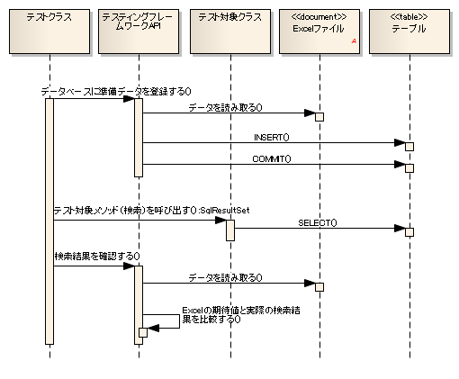
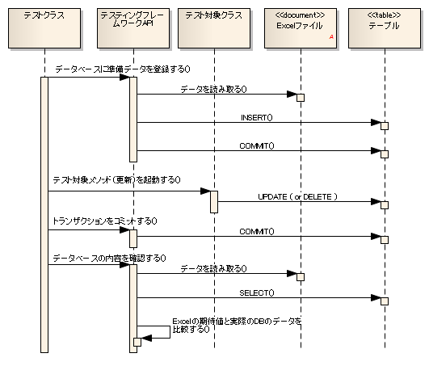

====================================
使用数据库的类的测试
====================================

----
概要
----

说明测试数据库访问类等使用数据库的类的方法。

测试使用数据库的类时，通过使用本框架提供的类，可以进行与数据库相关的操作（测试数据投入、数据确认）。

整体像
======

.. image:: _images/class_structure.png
   :scale: 100

主要类, 资源
--------------------

+---------------------------+-----------------------------------------------+--------------------------------+
|名称                       |作用                                           | 创建单位                       |
+===========================+===============================================+================================+
|测试类                     |实现测试逻辑。\                                |每个测试目标类创建1个           |
|                           |继承DbAccessTestSupport。                      |                                |
+---------------------------+-----------------------------------------------+--------------------------------+
|测试数据（Excel文件）      |描述存储到表的准备数据和预期结果\              |每个测试类创建1个               |
|                           |等测试数据。                                   |                                |
+---------------------------+-----------------------------------------------+--------------------------------+
|测试目标类                 |被测试的类。                                   | \－                            |
+---------------------------+-----------------------------------------------+--------------------------------+
|DbAccessTestSupport        |提供使用数据库的测试所需的\                    | \－                            |
|                           |准备数据投入等功能。此外，在测试执行前后执行\  |                                |
|                           |数据库事务的开始・结束处理\                    |                                |
|                           |（ :ref:`using_transactions` ）。              |                                |
+---------------------------+-----------------------------------------------+--------------------------------+

------------------
基本测试方法
------------------

根据目的，说明本框架API的使用方法。

查询类测试
==============

在查询类测试中，确认测试目标类是否按预期获取数据时，可以通过以下步骤确认从数据库的查询结果。

 #. 向数据库注册准备数据。
 #. 启动测试目标类的方法。
 #. 确认作为返回值接收的搜索结果是否为预期值。

序列
----------

测试源代码实现示例
------------------------

 .. code-block:: java 

    public class DbAccessTestSample extends DbAccessTestSupport {

        /**
         * 全件搜索测试。 
         * 确认可以获取
         * 员工表中注册的所有记录。
         */ 
        @Test
        public void testSelectAll() {

            // 向数据库注册准备数据。
            //参数中填写工作表名。
            setUpDb("testSelectAll");
                        
            // 启动测试目标方法。
            EmployeeDbAcess target = new EmployeeDbAccess(); 
            SqlResultSet actual = target.selectAll();
            
            // 结果确认
            // 确认Excel中描述的期待值与实际值相等
            // 参数中指定包含期待值的工作表名, 期待值的ID, 实际值
            assertSqlResultSetEquals("testSelectAll", "expected", actual);
        }
    }

测试数据描述示例
------------------

.. _how_to_write_setup_table:

预先注册到数据库的准备数据
~~~~~~~~~~~~~~~~~~~~~~~~~~~~~~~~~~~~

按以下方式描述数据。

* 第1行　：　SETUP_TABLE=<注册目标的表名>

* 第2行　：　该表的列名

* 第3行～　：　注册的记录（与第2行列名对应）

SETUP_TABLE=EMPLOYEE

=========== ============ ===========
ID          EMP_NAME     DEPT_CODE 
=========== ============ ===========
      00001  山田太郎          0001 
      00002  田中一郎          0002 
=========== ============ ===========

SETUP_TABLE=DEPT

============ =================
         ID  DEPT_NAME       
============ =================
       0001  人事部          
       0002  总务部          
============ =================

测试执行后预期的值
~~~~~~~~~~~~~~~~~~~~~~~~

按以下方式描述数据。

* 第1行　：　LIST_MAP=<工作表内唯一的期待值ID(任意字符串)>

* 第2行　：　SELECT语句中指定的列名或别名

* 第3行～　：　搜索结果（与第2行列名对应）

LIST_MAP=expected

=========== ============ ===========
ID          EMP_NAME     DEPT_NAME
=========== ============ ===========
      00001  山田太郎      人事部
      00002  田中一郎      总务部
=========== ============ ===========

.. _how_to_test_update_method:

更新类测试
==============

确认测试目标类是否按预期更新数据时，可以通过以下步骤确认数据库的更新结果。

 #. 向数据库注册准备数据。
 #. 启动测试目标类的方法。
 #. 提交事务。
 #. 确认数据库的值是否按预期更新。

.. important::
  Nablarch Application Framework以使用多种事务为前提。
  因此，在测试目标类执行后确认数据库内容时，
  必须提交事务。如果不提交事务，
  将无法正常进行测试结果确认。

.. tip::
  查询类测试的情况下不需要提交。

序列
----------

测试源代码实现示例
------------------------

 .. code-block:: java

    public class DbAccessTestSample extends DbAccsessTestSupport {
        @Test
        public void testDeleteExpired() {

            // 向数据库注册准备数据。
            // 参数中填写工作表名。
            setUpDb("testDeleteExpired");
                        
            // 启动测试目标方法。
            EmployeeDbAcess target = new EmployeeDbAccess(); 
            SqlResultSet actual = target.deleteExpired();  // 删除过期数据
            
            // 提交事务
            commitTransactions();

            // 结果确认
            // 确认Excel中描述的期待值与实际值相等
            // 参数中指定包含期待值的工作表名, 实际值
            assertTableEquals("testDeleteExpired", actual);
        }

测试数据描述示例
------------------

预先注册到数据库的准备数据
~~~~~~~~~~~~~~~~~~~~~~~~~~~~~~~~~~~~

按以下方式描述数据。

* 第1行　：　SETUP_TABLE=<注册目标的表名>

* 第2行　：　该表的列名

* 第3行～　：　注册的记录（与第2行列名对应）

SETUP_TABLE=EMPLOYEE

=========== ============ =============
ID          EMP_NAME      EXPIRED
=========== ============ =============
      00001  山田太郎      TRUE
      00002  田中一郎      FALSE
=========== ============ =============

测试执行后预期的值
~~~~~~~~~~~~~~~~~~~~~~~~

按以下方式描述数据。

* 第1行　：　EXPECTED_TABLE=<确认目标的表名>

* 第2行　：　确认目标表的列名

* 第3行～　：　预期值

EXPECTED_TABLE=EMPLOYEE

=========== ============ =============
ID          EMP_NAME      EXPIRED
=========== ============ =============
 // CHAR(5)  VARCHAR(64)   BOOLEAN  
      00002  田中一郎      FALSE
=========== ============ =============

--------------------------------------
数据库测试数据的省略描述方法
--------------------------------------

描述数据库的准备数据和预期值时，\
对于与测试无关的列可以省略描述。\
省略的列将由自动化测试框架设置\ :ref:`default_values_when_column_omitted`\ 。\
使用此功能可以提高测试数据的可读性。\
此外，即使表定义发生更改，只要无关的列就不需要修改测试数据，从而\
提高可维护性。

此功能对于更新类测试用例特别有效。当多列中只有1列被更新时，
无需描述不必要的列。

.. important::
 描述数据库\ **搜索结果**\ 的预期值时，\
 必须描述所有搜索目标列\
 （不可采用仅确认记录主键的确认方法）。
 
 此外，对于\ **注册类**\ 测试，由于需要确认新注册记录的所有列，
 因此不能省略列。

省略DB准备数据的列时
====================================

描述数据库准备数据时如果省略列，省略的列将视为已设置\
\ :ref:`default_values_when_column_omitted`\ 。

但是，\ **主键列不能省略**\ 。

省略DB预期值的列时
==============================

如果简单地从数据库预期值中省略无关列，省略的列将成为比较对象外。\
对于更新类测试，还需要"确认无关列未被更新"的观点。
这种情况下，数据类型不使用\ `EXPECTED_TABLE`\ 而使用\ `EXPECTED_COMPLETE_TABLE`\ 。\
使用\ `EXPECTED_TABLE`\ 时，省略的列将成为比较对象外，但\
使用`EXPECTED_COMPLETE_TABLE`\ 时，省略的列将视为已存储
:ref:`默认值<default_values_when_column_omitted>`\ 并进行
比较。

具体示例
========

显示描述所有列的情况和仅描述相关列的情况的描述示例。

测试用例示例
--------------

使用以下测试用例作为示例。

**过期记录将"删除标志"更新为1。**\ [#]_

.. [#] 本测试实施时的日期为2011/01/01。

使用的表（SAMPLE_TABLE）有以下列。

=========== ==================================================
 列名       说明                                         
=========== ==================================================
 PK1         主键                                      
 PK2         主键                                      
 COL_A       测试目标功能不使用的列        
 COL_B       测试目标功能不使用的列        
 COL_C       测试目标功能不使用的列        
 COL_D       测试目标功能不使用的列        
 有效期      过期的数据成为处理对象            
 删除标志    将过期记录的值更改为'1' 
=========== ==================================================

不省略而描述所有列的情况（不好的示例）
------------------------------------------

所有列都被描述，可读性较差\ [#]_\ 。
此外，如果表定义发生更改，即使是无关列也必须修改。

.. [#] 列COL_A, COL_B, COL_C, COL_D与本测试用例无关。

**准备数据**

SETUP_TABLE=SAMPLE_TABLE

+-----+-----+-----+-----+-----+-----+--------+----------+
|PK_1 |PK_2 |COL_A|COL_B|COL_C|COL_D|有效期  |删除标志  |
+=====+=====+=====+=====+=====+=====+========+==========+
| 01  |0001 |1a   |1b   |1c   |1d   |20101231|0         |
+-----+-----+-----+-----+-----+-----+--------+----------+
| 02  |0002 |2a   |2b   |2c   |2d   |20110101|0         |
+-----+-----+-----+-----+-----+-----+--------+----------+

**预期值**

EXPECTED_TABLE=SAMPLE_TABLE

+-----+-----+-----+-----+-----+-----+--------+----------+
|PK_1 |PK_2 |COL_A|COL_B|COL_C|COL_D|有效期  |删除标志  |
+=====+=====+=====+=====+=====+=====+========+==========+
| 01  |0001 |1a   |1b   |1c   |1d   |20101231|1         |
+-----+-----+-----+-----+-----+-----+--------+----------+
| 02  |0002 |2a   |2b   |2c   |2d   |20110101|0         |
+-----+-----+-----+-----+-----+-----+--------+----------+

仅描述相关列的情况（好的示例）
--------------------------------------------

通过仅描述相关列来提高可读性和可维护性。
与本测试用例相关的列如下。

* 用于唯一标识记录的主键列(PK_1,PK_2)
* 作为更新目标记录抽取条件的"有效期"列
* 作为更新目标的"删除标志"列

此外，即使表定义发生更改，无关列也不会受影响。

**准备数据**

仅描述与执行测试相关的列。

SETUP_TABLE=SAMPLE_TABLE

+-----+-----+--------+----------+
|PK_1 |PK_2 |有效期  |删除标志  |
+=====+=====+========+==========+
| 01  |0001 |20101231|0         |
+-----+-----+--------+----------+
| 02  |0002 |20110101|0         |
+-----+-----+--------+----------+

**预期值**

描述预期值时，不使用\ `EXPECTED_TABLE`\ 而使用\ `EXPECTED_COMPLETE_TABLE`\ 。

EXPECTED_COMPLETE_TABLE=SAMPLE_TABLE

+-----+-----+--------+----------+
|PK_1 |PK_2 |有效期  |删除标志  |
+=====+=====+========+==========+
| 01  |0001 |20101231|1         |
+-----+-----+--------+----------+
| 02  |0002 |20110101|0         |
+-----+-----+--------+----------+

.. _`default_values_when_column_omitted`:

默认值
============

如果在自动化测试框架的组件设置文件中没有显式指定，
将使用以下值作为默认值。

+-----------+----------------------+
|  列       |默认值                |
+===========+======================+
|  数值型   |0                     |
+-----------+----------------------+
| 字符串型  |半角空格              |
+-----------+----------------------+
|  日期型   |1970-01-01 00:00:00.0 |
+-----------+----------------------+

默认值的更改方法
======================

设置项目一览
------------

使用nablarch.test.core.db.BasicDefaultValues类，
可以在组件设置文件中设置以下值。

+-------------+--------------------------+----------------------------------------------------------------------+
| 设置项目名  |说明                      |设置值                                                                |
+=============+==========================+======================================================================+
| charValue   |字符串型的默认值          |1个字符的ASCII字符                                                    |
+-------------+--------------------------+----------------------------------------------------------------------+
| numberValue |数值型的默认值            |0或正整数                                                             |
+-------------+--------------------------+----------------------------------------------------------------------+
| dateValue   |日期型的默认值            |JDBC时间戳转义格式 (yyyy-mm-dd hh:mm:ss.fffffffff)                    |
+-------------+--------------------------+----------------------------------------------------------------------+

组件设置文件的描述示例
-------------------------------------------

显示使用以下设置值时的组件设置文件描述示例。

+-------------+------------------------------+
| 设置项目名  |设置值                        |
+=============+==============================+
| charValue   | a                            |
+-------------+------------------------------+
| numberValue | 1                            |
+-------------+------------------------------+
| dateValue   | 2000-01-01 12:34:56.123456789|
+-------------+------------------------------+

.. code-block:: xml

  <!-- TestDataParser -->
  <component name="testDataParser" class="nablarch.test.core.reader.BasicTestDataParser">
    <!-- 数据库默认值 -->
    <property name="defaultValues">
      <component class="nablarch.test.core.db.BasicDefaultValues">
        <property name="charValue" value="a"/>
        <property name="dateValue" value="2000-01-01 12:34:56.123456789"/>
        <property name="numberValue" value="1"/>
      </component>
    </property>
    <!-- 中略 -->
  </component>

------
注意点
------

关于setUpDb方法的注意点
=============================

  * Excel文件中不一定要描述所有列。
    省略的列将设置默认值。

  * 1个Excel文件工作表内可以描述多个表。
    setUpDb(String sheetName)执行时，指定工作表内的数据类型"SETUP_TABLE"全部成为注册目标。

 

关于assertTableEquals方法的注意点
=======================================

  * 预期值描述中省略的列将成为比较对象外。

  * 执行比较时，即使记录顺序不同也能通过主键匹配正确进行比较。
    不需要考虑记录顺序来创建预期数据。

  * 1个工作表内可以描述多个表。assertTableEquals(String sheetName)执行时，指定工作表内的数据类型"EXPECTED_TABLE"的数据全部会被比较。

  * java.sql.Timestamp型等更新日期的格式为"yyyy-mm-dd hh:mm:ss.fffffffff"(fffffffff是纳秒)。即使没有设置纳秒，格式上也会显示为0纳秒。例如，2010年1月1日12时34分56秒整，则为2010-01-01 12:34:56.0。在Excel工作表中描述预期值时，需要添加末尾的小数点+零。

关于assertSqlResultSetEquals方法的注意点
==============================================

  * SELECT语句中指定的所有列名（别名）都成为比较对象。不能将特定列设为比较对象外。

  * 如果记录顺序不同，则视为不等价（断言失败）。
    这是基于以下原因。

    * SELECT中指定的列不一定包含主键。
    * SELECT执行时大多数情况下会指定ORDER BY，因此也需要严格比较顺序。

类单体测试中注册・更新类测试的注意点
==================================================

 * 使用自动设置项目向数据库注册・更新时，ThreadContext中需要设置请求ID和用户ID。在测试目标类启动前将这些值设置到ThreadContext中。
   关于ThreadContext的设置方法，请参考下一项。（  :ref:`using_ThreadContext`  ）

 * 使用默认以外的事务时，需要让本框架控制事务。关于事务控制的设置方法，请参考下一项。（  :ref:`using_transactions`  ）

想向设置了外键的表设置数据时
=========================================================================
使用与 :ref:`master_data_backup` 相同的功能，判断表的父子关系并删除及注册数据。
详情请参考 :ref:`MasterDataRestore-fk_key` 。

关于Excel文件中可描述的列数据类型的注意点
=======================================================
Excel文件中只能描述 :java:extdoc:`SqlPStatement <nablarch.core.db.statement.SqlPStatement>` 支持的类型的列作为测试数据。

因此，请注意其他数据类型(例如，Oracle的ROWID或PostgreSQL的OID等)的列不能作为测试数据描述。
