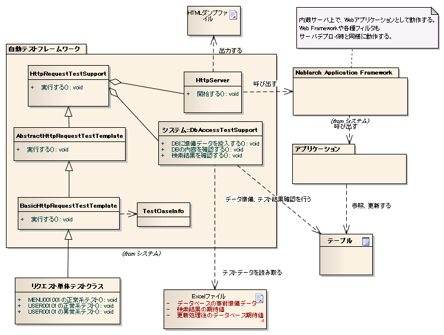
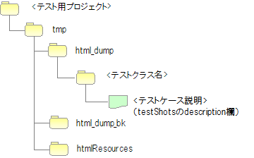
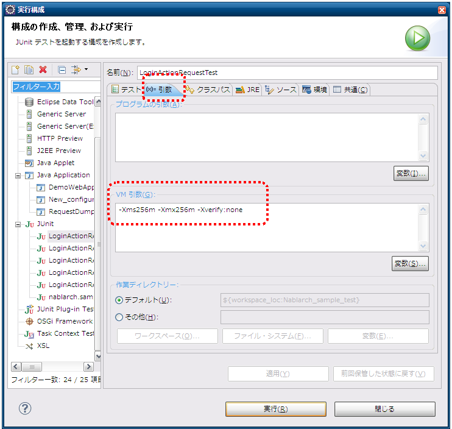
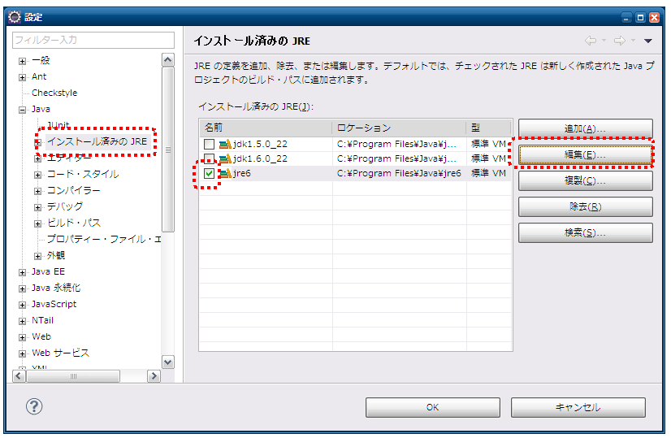
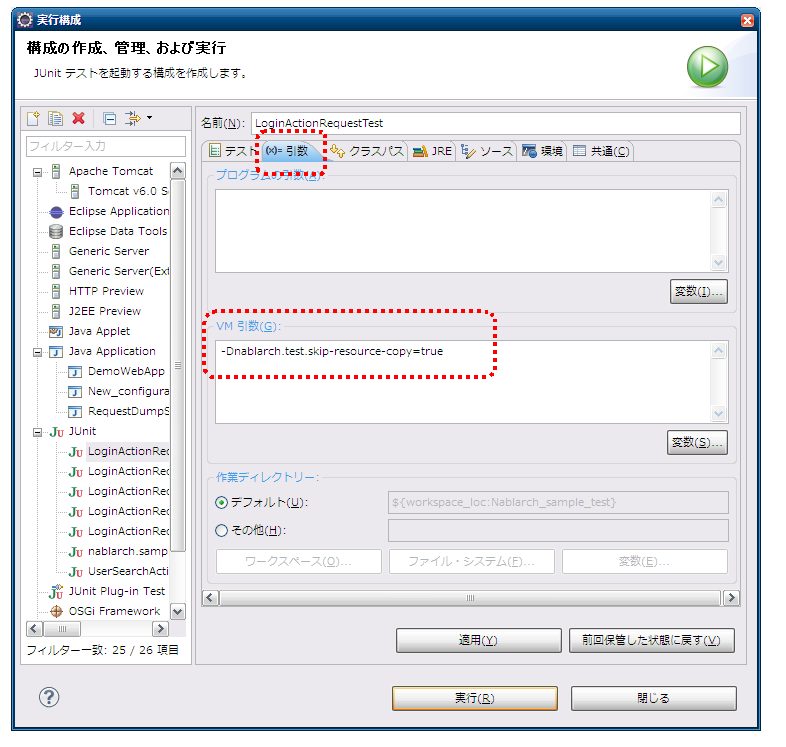

.. _request-util-test-online:

============================================================
请求单元测试（Web应用程序）
============================================================

----
概述
----

请求单元测试(Web应用程序)中，使用内置服务器进行测试。\
此处记载请求单元测试的测试辅助类和内置服务器的使用方法。

整体结构
======

 
主要类、资源
====================

+----------------------------------+------------------------------------------------------+--------------------------------------+
|名称                              |作用                                                  | 创建单位                             |
+==================================+======================================================+======================================+
|测试类                            |实现测试逻辑。                                        |每个测试目标类(Action)创建1个         |
+----------------------------------+------------------------------------------------------+--------------------------------------+
|测试数据（Excel文件）             |记载存储到表的准备数据和预期结果、                    |每个测试类创建1个                     |
|                                  |HTTP参数等测试数据。                                  |                                      |
|                                  |                                                      |                                      |
+----------------------------------+------------------------------------------------------+--------------------------------------+
|测试目标类(Action)                |测试目标类                                            | 每个交易创建1个类                    |
|                                  |(包含Action以后的业务逻辑实现各类)                    |                                      |
+----------------------------------+------------------------------------------------------+--------------------------------------+
|DbAccessTestSupport               |提供准备数据投入等使用数据库的测试                    | \\－                                  |
|                                  |所需功能。                                            |                                      |
|                                  |                                                      |                                      |
+----------------------------------+------------------------------------------------------+--------------------------------------+
|HttpServer                        |内置服务器。作为Servlet容器运行，                     | \\－                                  |
|                                  |具有将HTTP响应输出到文件的功能。                      |                                      |
+----------------------------------+------------------------------------------------------+--------------------------------------+
|HttpRequestTestSupport            |提供内置服务器启动和请求单元测试                      | \\－                                  |
|                                  |所需的各种断言。                                      |                                      |
+----------------------------------+------------------------------------------------------+--------------------------------------+
|AbstractHttpReqestTestSupport  |定型化请求单元测试的类。定型化                        | \\－                                  |
|BasicHttpReqestTestSupport        |请求单元测试的测试源代码、测试数据                    |                                      |
|                                  |                                                      |                                      |
+----------------------------------+------------------------------------------------------+--------------------------------------+
|TestCaseInfo                      |存储数据表中定义的测试用例信息                        |                                      |
|                                  |的类。                                                |                                      |
+----------------------------------+------------------------------------------------------+--------------------------------------+

上述类群包括内置服务器全部在同一JVM上运行。\
因此，可以加工请求和会话等服务器端对象。\

前提事项
========

使用内置服务器输出HTML转储的请求单元测试，
以1请求1画面迁移的瘦客户端型Web应用程序为对象。\
使用Ajax或富客户端的应用程序，
无法使用HTML转储进行布局确认。

.. tip::

 本书使用JSP作为View技术，但\
 如果是Servlet容器上渲染整个画面的方式，
 即使JSP以外的View技术也能输出HTML转储。

----
结构
----

BasicHttpRequestTestTemplate
=========================================

各测试类的父类。\
使用本类可以定型化请求单元测试的测试源代码、测试数据，
大幅减少测试源代码描述量。

具体使用方法请参考 :doc:`../05_UnitTestGuide/02_RequestUnitTest/index` 。

AbstractHttpRequestTestTemplate
======================================

应用程序程序员不直接使用。\
想更改测试数据写法等，扩展自动测试框架时使用。

TestCaseInfo
============

存储数据表中定义的测试用例信息的类。\
想更改测试数据写法时，继承本类及前述AbstractHttpRequestTestTemplate。

HttpRequestTestSupport
======================

请求单元测试用父类。提供请求单元测试用方法。

数据库相关功能
--------------------

数据库相关功能通过HttpRequestTestSupport类向DbAccessTestSupport类委托实现。
详细请参考 :doc:`02_DbAccessTest` 。

但是，DbAccessTestSupport中的以下方法在请求单元测试中不需要，
为避免给应用程序程序员造成误解，有意不进行委托。

* public void beginTransactions()
* public void commitTransactions()
* public void endTransactions()
* public void setThreadContextValues(String sheetName, String id)

事前准备辅助功能
----------------

向内置服务器发送请求需要HttpRequest和ExecutionContext实例。\
HttpRequestTestSupport类中，为便于创建这些对象而提供方法。\

HttpRequest
~~~~~~~~~~~

.. code-block:: java

  HttpRequest createHttpRequest(String requestUri, Map<String, String[]> params)

参数中传递以下值。

* 测试目标的请求URI
* 上述获取的请求参数

本方法根据接收的请求URI和请求参数生成HttpRequest实例，
设置HTTP方法为POST后返回。\
想在HttpRequest中设置请求参数和URI以外的数据时，
向本方法调用获取的实例设置数据即可。

ExecutionContext
~~~~~~~~~~~~~~~~

生成ExecutionContext实例。

.. code-block:: java

  ExecutionContext createExecutionContext(String userId)

参数中指定用户ID。指定的用户ID将存储到会话中。\
这样，即处于以该用户ID登录的状态。\

.. _how_to_set_token_in_request_unit_test:

令牌发行
~~~~~~~~~~~~

对实施了双重提交防止的URI进行测试时，\
需要在测试执行前发行令牌并设置到会话中。\
调用HttpRequestTestSupport中的以下方法，
将执行令牌发行及设置到会话。

.. code-block:: java

 void setValidToken(HttpRequest request, ExecutionContext context)

请求单元执行时，如果想在测试数据上控制是否设置令牌，
请使用以下方法。

.. code-block:: java

 void setToken(HttpRequest request, ExecutionContext context, boolean valid)

第3参数为boolean，为真时与上述setValidToken动作相同。
为假时，将从会话中删除令牌信息。通过如下使用，
无需在测试类中编写是否设置令牌的分支处理。

 
.. code-block:: java

     // 【说明】假设从测试数据获取。
     String isTokenValid; 

     // 【说明】"true"时设置令牌。
     setToken(req, ctx, Boolean.parseBoolean(isTokenValid)));

执行
====

调用HttpRequestTestSupport中的以下方法，
将启动内置服务器并发送请求。

.. code-block:: java

 HttpResponse execute(String caseName, HttpRequest req, ExecutionContext ctx) 

参数中传递以下值。

* 测试用例说明
* HttpRequest
* ExectionContext

测试用例说明用于HTML转储输出时的文件名。
详细请参考
:ref:`dump-dir-label`
。

系统存储库初始化
--------------------------

execute方法内部进行系统存储库的重新初始化。\
这样，无需分开设置即可连续执行类单元测试和请求单元测试。

* 备份当前系统存储库状态
* 使用测试目标Web应用程序的组件配置文件重新初始化系统存储库
* execute方法结束时，恢复备份的系统存储库。

关于测试目标Web应用程序的设置，
请参考 :ref:`howToConfigureRequestUnitTestEnv`\
。

结果确认
========

消息
----------

调用HttpRequestTestSupport中的以下方法，
确认ApplicationException中包含的消息是否符合预期。

.. code-block:: java

   
  void assertApplicationMessageId(String expectedCommaSeparated, ExecutionContext actual);

参数中传递以下值。

* 预期消息（多个时用逗号分隔指定。）
* 先前创建的ExectionContext

未发生异常或发生ApplicationException以外的异常时，
断言失败。

.. tip::
 消息ID比较时按ID排序后进行，因此记载测试数据时
 无需在意顺序。

HTML转储输出
==============

.. _dump-dir-label:

HTML转储输出目录
--------------------------

执行测试时，将在测试项目根目录创建tmp/html_dump目录。
其下将按测试类创建同名目录，
输出与测试类中执行的测试用例说明同名的HTML转储文件。

此外，HTML转储文件引用的HTML资源（样式表、图片等资源）也将
输出到此目录，保存此目录后即可在任何环境以相同方式查看HTML。

* 如果已存在html_dump目录，将以html_dump_bk名称备份。

.. _howToConfigureRequestUnitTestEnv:

----------
各种设置值
----------

环境设置相关设置值可在组件配置文件中更改。\
可设置项目如下。

组件配置文件设置项目一览
===============================================

+----------------------------+-------------------------------------------------------------------------+-------------------------------------------------------+
| 设置项目名                 | 说明                                                                    | 默认值                                                |
+============================+=========================================================================+=======================================================+
| htmlDumpDir                | 指定HTML转储文件输出目录。                                              | ./tmp/html_dump                                       |
+----------------------------+-------------------------------------------------------------------------+-------------------------------------------------------+
| webBaseDir                 | Web应用程序根目录 [#]_                                                  | ../main/web                                           |
+----------------------------+-------------------------------------------------------------------------+-------------------------------------------------------+
| xmlComponentFile           | 请求单元测试执行时使用的组件配置文件 [#]_                               | （无）                                                |
+----------------------------+-------------------------------------------------------------------------+-------------------------------------------------------+
| userIdSessionKey           | 存储登录中用户ID的会话键                                                | user.id                                               |
+----------------------------+-------------------------------------------------------------------------+-------------------------------------------------------+
| exceptionRequestVarKey     | ApplicationException存储的请求范围键                                    | nablarch_application_error                            |
+----------------------------+-------------------------------------------------------------------------+-------------------------------------------------------+
| dumpFileExtension          | 转储文件扩展名                                                          | html                                                  |
+----------------------------+-------------------------------------------------------------------------+-------------------------------------------------------+
| httpHeader                 | 作为HTTP请求头存储到HttpRequest的值                                     |Content-Type : application/x-www-form-urlencoded       |
|                            |                                                                         |                                                       |
|                            |                                                                         |Accept-Language : ja JP                                |
|                            |                                                                         |                                                       |
+----------------------------+-------------------------------------------------------------------------+-------------------------------------------------------+
| sessionInfo                | 存储到会话的值                                                          |（无）                                                 |
+----------------------------+-------------------------------------------------------------------------+-------------------------------------------------------+
| htmlResourcesExtensionList | 复制到转储目录的HTML资源扩展名                                          | css、jpg、js                                          |
+----------------------------+-------------------------------------------------------------------------+-------------------------------------------------------+
| jsTestResourceDir          | JavaScript自动测试执行时使用资源的复制目标目录名                        | ../test/web                                           |
+----------------------------+-------------------------------------------------------------------------+-------------------------------------------------------+
| backup                     | 转储目录备份On/Off                                                      | true                                                  |
+----------------------------+-------------------------------------------------------------------------+-------------------------------------------------------+
| htmlResourcesCharset       | CSS文件(样式表)的字符编码                                               | UTF-8                                                 |
+----------------------------+-------------------------------------------------------------------------+-------------------------------------------------------+
| checkHtml                  | HTML检查执行On/Off                                                      | true                                                  |
+----------------------------+-------------------------------------------------------------------------+-------------------------------------------------------+
| htmlChecker                | 指定执行HTML检查的对象。                                             | nablarch.test.tool.htmlcheck.Html4HtmlChecker         |
|                            | 对象需要实现 nablarch.test.tool.htmlcheck.HtmlChecker                   | 类实例。                                           |
|                            | 接口。                                                               | htmlCheckerConfig 设置的设置                          |
|                            | 详细请参考 :ref:`customize_html_check` 。                               | 文件将应用于该类。                                    |
|                            |                                                                         |                                                       |
+----------------------------+-------------------------------------------------------------------------+-------------------------------------------------------+
| htmlCheckerConfig          | HTML检查工具的设置文件路径。                                         | test/resources/httprequesttest/html-check-config.csv  |
|                            | 仅在未设置 htmlChecker 时有效。                                         |                                                       |
+----------------------------+-------------------------------------------------------------------------+-------------------------------------------------------+
| ignoreHtmlResourceDirectory| HTML资源中不作为复制对象的目录名LIST                                    | （无）                                                |
|                            |                                                                         |                                                       |
|                            | .. tip::                                                                |                                                       |
|                            |  将版本管理用目录(.svn或.git)设为对象外                                 |                                                       |
|                            |  可以提升HTML资源复制时的性能。                                         |                                                       |
+----------------------------+-------------------------------------------------------------------------+-------------------------------------------------------+
| tempDirectory              | JSP编译目标目录                                                         | 依赖jetty默认动作                                     |
|                            |                                                                         |                                                       |
|                            |                                                                         | .. tip ::                                             |
|                            |                                                                         |  jetty默认动作中，"."/work"                          |
|                            |                                                                         |  将成为编译目标目录。                                 |
|                            |                                                                         |  "./work"不存在时，                                   |
|                            |                                                                         |  Temp文件夹(Windows时为用户主目录                     |
|                            |                                                                         | /Local Settings/Temp)将成为                           |
|                            |                                                                         |  输出目标。                                           |
+----------------------------+-------------------------------------------------------------------------+-------------------------------------------------------+
| uploadTmpDirectory         | 临时存储上传文件的目录。                                                | ./tmp                                                 |
|                            |                                                                         |                                                       |
|                            | 测试时准备的、上传对象文件将先复制到本目录                              |                                                       |
|                            | 后再处理。                                                              |                                                       |
|                            | 这样，即使Action中移动了文件，                                          |                                                       |
|                            | 也只是本目录下的文件被移动，                                            |                                                       |
|                            | 可以防止实体被移动。                                                    |                                                       |
|                            |                                                                         |                                                       |
+----------------------------+-------------------------------------------------------------------------+-------------------------------------------------------+
|dumpVariableItem            | HTML转储文件输出时是否输出可变项目。                                    |false                                                  |
|                            | 此处可变项目指以下2种。                                                 |                                                       |
|                            |                                                                         |                                                       |
|                            | * JSESSIONID                                                            |                                                       |
|                            | * 双重提交防止用令牌                                                    |                                                       |
|                            |                                                                         |                                                       |
|                            | 这些项目每次测试执行时设置不同值。                                      |                                                       |
|                            |                                                                         |                                                       |
|                            | 希望每次HTML转储结果都相同时，请将本项目设为OFF                         |                                                       |
|                            | (false)。（希望确认与前次执行结果无差异等时）                           |                                                       |
|                            |                                                                         |                                                       |
|                            |                                                                         |                                                       |
|                            | 直接输出可变项目到HTML时，请将本项目设为ON                              |                                                       |
|                            | (true)。                                                                |                                                       |
+----------------------------+-------------------------------------------------------------------------+-------------------------------------------------------+
 

.. [#] 
  如果存在PJ共通的web模块，请以逗号分隔在此属性中设置目录。
  指定多个时，从头开始顺序读取资源。
  
  示例如下。

  .. code-block:: xml

    <component name="httpTestConfiguration" class="nablarch.test.core.http.HttpTestConfiguration">
      <property name="webBaseDir" value="/path/to/web-a/,/path/to/web-common"/>

  此时，按web-a、web-common顺序探索资源。
  
.. [#]
  设置本项目时，将在发送请求前使用指定组件配置文件进行初始化。\
  通常无需设置。\
  仅在类单元测试和请求单元测试之间需要更改设置时才设置本项目。\

       

组件配置文件的描述示例
===============================================

组件配置文件描述示例如下。
设置值中，除上述默认值外，还在会话(sessionInfo)中设置以下值。

+----------------------------+------------------------------+--------------------------------------------------------------------+
| 键                         | 值                           | 说明                                                               |
+============================+==============================+====================================================================+
| commonHeaderLoginUserName  | "请求单元测试用户"           | 共通头部区域显示的登录用户名                                       |
+----------------------------+------------------------------+--------------------------------------------------------------------+
| commonHeaderLoginDate      | "20100914"                   | 共通头部区域显示的登录日期时间                                     |
+----------------------------+------------------------------+--------------------------------------------------------------------+

.. code-block:: xml

    <component name="httpTestConfiguration" class="nablarch.test.core.http.HttpTestConfiguration">
        <property name="htmlDumpDir" value="./tmp/html_dump"/>
        <property name="webBaseDir" value="../main/web"/>
        <property name="xmlComponentFile" value="http-request-test.xml"/>
        <property name="userIdSessionKey" value="user.id"/>
        <property name="httpHeader">
            <map>
                <entry key="Content-Type" value="application/x-www-form-urlencoded"/>
                <entry key="Accept-Language" value="ja JP"/>
            </map>
        </property>
        <property name="sessionInfo">
            <map>
                <entry key="commonHeaderLoginUserName" value="请求单元测试用户"/>
                <entry key="commonHeaderLoginDate" value="20100914" />
            </map>
        </property>
        <property name="htmlResourcesExtensionList">
            <list>
                <value>css</value>
                <value>jpg</value>
                <value>js</value>
            </list>
        </property>
        <property name="backup" value="true" />
        <property name="htmlResourcesCharset" value="UTF-8" />    
        <property name="ignoreHtmlResourceDirectory">
            <list>
                <value>.svn</value>
            </list>
        </property>
        <property name="tempDirectory" value="webTemp" />
        <property name="htmlCheckerConfig"
          value="test/resources/httprequesttest/html-check-config.csv" />
    </component>

.. _`optional_settings`:  

其他设置
============

如果使用性能不高的PC开发，希望提升请求单元测试执行速度，
通过以下设置有望改善执行速度。

.. tip::
  对搭载Pentium4、Pentinum Dual-Core等处理性能低的CPU的PC有效。\
  反之，搭载这些以后CPU的机器效果不大，无需勉强设置。

JVM选项指定
-------------------

将最大堆大小和最小堆大小设为相同值，
可以避免堆大小扩展的开销。

 :strong:`-Xms256m -Xmx256m`

此外，省略类文件验证可以提升执行速度。

 :strong:`-Xverfiy:none`

Eclipse中的设置方法如下。

* 从菜单栏选择运行→运行配置。

* 显示运行配置窗口，点击参数选项卡，在VM参数栏中指定上述选项。

此外，不更改运行配置，也可以通过以下方法设置默认VM参数。

* 从菜单栏选择窗口→设置。 显示设置窗口，选择已安装JRE。

* 显示已安装JRE列表，选择要使用的JRE并点击编辑按钮。

* 在VM参数栏中指定上述选项。

.. image:: ./_images/edit_jre.png

抑制HTML资源复制
------------------------

请求单元执行时，指定以下系统属性，可以在 :ref:`HTML转储输出<dump-dir-label>` 时抑制HTML资源复制。

 :strong:`-Dnablarch.test.skip-resource-copy=true`

不经常编辑CSS、图片文件等静态HTML资源时，
无需每次测试执行都复制HTML资源，
因此可以设置本系统属性。

.. important::
   指定本系统属性时，由于不执行HTML资源复制，
   即使编辑CSS等HTML资源也不会反映到 :ref:`HTML转储输出<dump-dir-label>` 中。

.. tip::
   HTML资源目录不存在时，无论系统属性设置如何，
   都将执行HTML资源复制。

Eclipse中的设置方法如下。

* 从菜单栏选择运行→运行配置。

* 显示运行配置窗口，点击参数选项卡，在VM参数栏中指定上述选项。

.. |br| raw:: html

   
