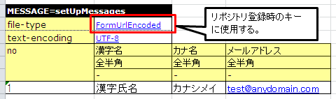
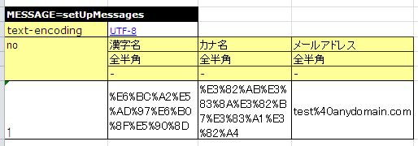

==========================
 按目的分类的API使用方法
==========================

说明按目的分类的API使用方法。

* :ref:`how_to_get_data_from_excel`
* :ref:`how_to_run_the_same_test`
* :ref:`tips_groupId`
* :ref:`how_to_fix_date`
* :ref:`how_to_numbering_sequence`
* :ref:`using_ThreadContext`
* :ref:`using_TestDataParser`
* :ref:`using_junit_annotation`
* :ref:`using_transactions`
* :ref:`using_ohter_class`
* :ref:`how_to_assert_property_from_excel`
* :ref:`tips_test_data`
* :ref:`how_to_express_empty_line`
* :ref:`how_to_change_master_data`
* :ref:`how_to_change_test_data_dir`
* :ref:`how_to_convert_test_data`

.. _how_to_get_data_from_excel:

-----------------------------------------------------------------------
想从Excel文件中获取输入参数和返回值的预期值等
-----------------------------------------------------------------------

可以将调用测试目标类方法时的参数和方法的返回值描述在Excel文件中。
描述的数据可以以List-Map形式（List<Map<String, String>>的格式）获取。

以这种格式获取数据时，使用数据类型LIST_MAP。
 LIST_MAP=<工作表内唯一的ID（任意字符串）>

数据的第2行被解释为Map的Key。
数据的第3行以后被解释为Map的Value。

通过以下方法，可以以Map格式或List-Map格式从Excel文件获取数据。
第1参数指定工作表名，第2参数指定ID。

 * ``TestSupport#getListMap(String sheetName, String id)``
 * ``DbAccessTestSupport#getListMap(String sheetName, String id)``

测试源代码实现示例
========================

 .. code-block:: java

    public class EmployeeComponentTest extends DbAccessTestSupport {
        
        @Test
        public void testGetName() {
           // 从Excel文件获取数据
           List<Map<String, String>> parameters = getListMap("testGetName", "parameters");
           Map<String, String>> param = parameters.get(0);

           // 获取参数和预期值
           String empNo = parameter.get("empNo");
           String expected = parameter.get("expected");

           // 启动测试目标方法
           EmployeeComponent target = new EmployeeComponent();
           String actual = target.getName(empNo);           
           
           // 结果确认          
           assertEquals(expected, actual);

           // ＜后略＞
        }

Excel文件描述示例
===================

LIST_MAP=parameters

=========== ==============
empNo        expected
=========== ==============
00001         山田太郎
00002         铃木一郎
=========== ==============

上述表中可获取的对象，与以下代码可获取的List等价。

 .. code-block:: java

  List<Map<String, String>> list = new ArrayList<Map<String, String>>();
  Map<String, String> first = new HashMap<String, String>();
  first.put("empNo","00001");
  first.put("expected", "山田太郎");
  list.add(first);
  Map<String, String> second = new HashMap<String, String>();
  second.put("empNo","00002");
  map.put("expected", "铃木一郎");
  list.add(second);

.. _how_to_run_the_same_test:

--------------------------------------------------
想用不同的测试数据执行相同的测试方法
--------------------------------------------------

想用不同的测试数据执行相同的测试方法时，使用前述的List-Map获取方法
让测试循环。这样，只需添加Excel数据，就可以增加数据变化。

以下示例中，使用前述的List-Map格式，用1个方法执行多个测试。

测试源代码实现示例
============================

 .. code-block:: java

    public class EmployeeComponentTest extends DbAccessTestSupport {
        
        @Test
        public void testSelectByPk() {
           // 准备数据投入
           setUpDb("testSelectByPk");

           // 从Excel文件获取数据
           List<Map<String, String>> parameters = getListMap("testGetName", "parameters");

           for (Map<String, String> param : parameters) {
               // 获取参数和预期值
               String empNo = parameter.get("empNo");
               String expectedDataId = parameter.get("expectedDataId");

               // 启动测试目标方法
               EmployeeComponent target = new EmployeeComponent();
               SqlResultSet actual = target.selectByPk(empNo);           
           
               // 结果确认
               assertSqlResultSetEquals("testSelectByPk", expectedDataId, actual);
            }
        }

Excel文件描述示例
===================

// 循环的数据

LIST_MAP=parameters

=========== ================= 
empNo         expectedDataId
=========== =================
00001         expected01
00002         expected02
=========== =================

// 数据库的准备数据

SETUP_TABLE=EMPLOYEE

=========== ==============
NO            NAME
=========== ==============
00001         山田太郎
00002         铃木一郎
=========== ==============

// 预期数据1

LIST_MAP=expected01

=========== ==============
NO            NAME
=========== ==============
00001         山田太郎
=========== ==============

// 预期数据2

LIST_MAP=expected02

=========== ==============
NO            NAME
=========== ==============
00001         山田太郎
=========== ==============

.. important::
  执行更新类测试时，请在循环内调用setUpDb方法。
  否则，测试的成败将依赖于数据的顺序。

.. _tips_groupId:

--------------------------------------------------
想在一个工作表中描述多个测试用例的数据
--------------------------------------------------

对于一个测试目标方法存在多个测试用例时，
如果采用1个工作表1个测试用例的写法，可能会担心工作表数量增加导致可维护性下降。

通过赋予用于对表数据进行分组的信息（组ID），可以将多个测试用例的数据混在在一个工作表中。

支持的数据类型如下。

* EXPECTED_TABLE
* SETUP_TABLE

格式如下。

 数据类型[组ID]=表名

例如，混在2种测试用例的数据(case_001,case_002)时，按以下方式描述。

在测试类侧，向与上述API同名的重载方法传递参数组ID。
这样，就可以仅处理指定组ID的数据。

测试源代码实现示例
============================

 .. code-block:: java

    // 向数据库注册数据（仅组ID为"case_001"的数据成为注册目标）
    setUpDb("testUpdate", "case_001");

    // 结果确认（仅组ID为"case_001"的数据成为assert目标）
    assertTableEquals("数据库更新结果确认", "testUpdate", "case_001");

Excel文件描述示例
============================

// 用例001:更改员工所属部门。

SETUP_TABLE[case_001]=EMPLOYEE_TABLE

=========== ============ ===========
ID          EMP_NAME     DEPT_CODE 
=========== ============ ===========
 // CHAR(5)  VARCHAR(64)   CHAR(4)  
      00001  山田太郎          0001 
      00002  田中一郎          0002 
=========== ============ ===========
                    
                    
EXPECTED_TABLE[case_001]=EMPLOYEE_TABLE

=========== ============ =========== =======
ID          EMP_NAME     DEPT_CODE 
=========== ============ =========== =======
 // CHAR(5)  VARCHAR(64)   CHAR(4)  
      00001  山田太郎          0001 
      00002  田中一郎          0010  //更新
=========== ============ =========== =======

// 用例002:更改员工姓名。
                    
SETUP_TABLE[case_002]=EMPLOYEE_TABLE

=========== ============ ===========
ID          EMP_NAME     DEPT_CODE 
=========== ============ ===========
 // CHAR(5)  VARCHAR(64)   CHAR(4)  
      00001  山田太郎          0001 
      00002  田中一郎          0002 
=========== ============ ===========

                    
EXPECTED_TABLE[case_002]=EMPLOYEE_TABLE 

=========== ============ =========== =======
ID          EMP_NAME     DEPT_CODE          
=========== ============ =========== =======
 // CHAR(5)  VARCHAR(64)   CHAR(4)          
      00001  佐藤太郎          0001  //更新        
      00002  田中一郎          0002  
=========== ============ =========== =======

注意事项
========

描述多个组ID的数据时，请像 :ref:`auto-test-framework_multi-datatype` 那样按组ID分组描述。
不按组ID分组描述，数据读取会在中途结束，测试无法正确执行。

.. _how_to_fix_date:

----------------------------------
想将系统日期时间固定为任意值
----------------------------------
对于设置注册日期时间和更新日期时间等系统日期的项目，如果正常执行测试，根据日期不同预期结果会改变，因此无法在自动化测试中确认设置值是否正确。
因此，本框架提供将系统日期设置为固定值的功能。使用此功能，可以确认设置系统日期的项目在自动化测试中的设置值是否正确。

在Nablarch Application Framework中，SystemTimeProvider接口的实现类提供系统日期时间。将此实现类替换为返回固定值的测试用类，可以返回任意的系统日期时间。

设置文件示例
==================

在组件设置文件中，将SystemTimeProvider接口的实现类指定为
FixedSystemTimeProvider，并在其属性中设置任意日期时间。
例如，将系统日期时间设置为2010年9月14日12时34分56秒时，按以下方式设置。

.. code-block:: xml

  <component name="systemTimeProvider"
      class="nablarch.test.FixedSystemTimeProvider">
    <property name="fixedDate" value="20100913123456" />
  </component>

    

+-----------------------+------------------------------------------------------------------------+
|property名             |设置内容                                                                |
+=======================+========================================================================+
|fixedDate              |用符合以下任一格式的字符串指定所需的日期时间。                          |
|                       | * yyyyMMddHHmmss (12位)                                                |
|                       | * yyyyMMddHHmmssSSS (15位)                                             |
+-----------------------+------------------------------------------------------------------------+
  
.. code-block:: java 
     
     // 获取系统日期时间
     SystemTimeProvider provider = (SystemTimeProvider) SystemRepository.getObject("systemTimeProvider");      
     Date now = provider.getDate();

.. _how_to_numbering_sequence:

--------------------------------------------------------
想测试使用序列对象的编号
--------------------------------------------------------
使用序列对象进行值编号处理时，由于无法预先预测下一个编号的值，因此无法设置预期值。
因此，本框架提供仅通过更改设置文件就可以将使用序列对象的编号处理替换为表编号的功能。
使用此功能，可以确认编号处理是否正确执行。

步骤如下。

 | ① 将准备数据设置到表中。
 | ② 基于在表中设置的值设置预期值。

以下显示设置示例及使用示例。

设置文件示例
===================
此示例中，假设生产用设置文件中按以下方式设置了使用序列对象的编号定义。

 .. code-block:: xml

    <!-- 使用序列对象的编号设置 -->
    <component name="idGenerator" class="nablarch.common.idgenerator.OracleSequenceIdGenerator">
        <property name="idTable">
            <map>
                <entry key="1101" value="SEQ_1"/> <!-- ID1编号用 -->
                <entry key="1102" value="SEQ_2"/> <!-- ID2编号用 -->
                <entry key="1103" value="SEQ_3"/> <!-- ID3编号用 -->
                <entry key="1104" value="SEQ_4"/> <!-- ID4编号用 -->
            </map>
        </property>
    </component>

这种情况下，在测试用设置文件中，用表编号用设置覆盖上述生产用设置。

 .. code-block:: xml

    <!-- 将使用序列对象的编号设置替换为使用表的编号设置 -->
    <component name="idGenerator" class="nablarch.common.idgenerator.FastTableIdGenerator">
        <property name="tableName" value="TEST_SBN_TBL"/>
        <property name="idColumnName" value="ID_COL"/>
        <property name="noColumnName" value="NO_COL"/>
        <property name="dbTransactionManager" ref="dbTransactionManager" / >
    </component>

 .. tip :: 表编号用设置值的详情请参考\ :java:extdoc:`IdGenerator <nablarch.common.idgenerator.IdGenerator>`\ 。

Excel文件描述示例
===================

以编号目标ID:1101的编号处理测试为例说明。

 | // 准备数据
 | // 编号用表
 | SETUP_TABLE=TEST_SBN_TBL

 =========== ============
 ID_COL      NO_COL     
 =========== ============
 1101        100
 =========== ============

 .. tip::
  在编号用表中设置准备数据。
  准备数据中，仅设置测试范围内使用的编号目标的记录。

 | // 预期值
 | // 编号用表
 | EXPECTED_TABLE=TEST_SBN_TBL

 =========== ============
 ID_COL      NO_COL     
 =========== ============
 1101        101
 =========== ============

 | // 预期值
 | // 编号值注册的表(USER_ID中注册编号后的值。)
 | EXPECTED_TABLE=USER_INFO

 =========== ============ ============
 USER_ID     KANJI_NAME   KANA_NAME   
 =========== ============ ============
 0000000101  汉字名       ｶﾅﾒｲ
 =========== ============ ============

 .. tip::
  本描述示例假设测试中仅执行1次编号处理。
  因此，预期值为「准备数据的值 + 1」。

.. _using_ThreadContext:

------------------------------------------------------
想在ThreadContext中设置用户ID、请求ID等
------------------------------------------------------

在Nablarch Application Framework中，通常用户ID和请求ID是预先设置在ThreadContext中的。执行数据库访问类的自动化测试时，由于不经过框架，直接从测试类启动测试目标类，因此ThreadContext中没有设置值。

在Excel文件中描述要设置的值并调用以下方法，可以在ThreadContext中设置值。

  * ``TestSupport#setThreadContextValues(String sheetName, String id)``
  * ``DbAccessTestSupport#setThreadContextValues(String sheetName, String id)``

.. tip::

  特别是使用自动设置项目注册・更新数据库时，ThreadContext中需要设置请求ID和用户ID。请在测试目标类启动前将这些值设置到ThreadContext中。

测试源代码实现示例
============================

 .. code-block:: java

    public class DbAccessTestSample extends DbAccessTestSupport {
        // ＜中略＞
        @Test
        public void testInsert() {
            // 向ThreadContext设置值（指定工作表名、ID）
            setThreadContextValues("testSelect", "threadContext");            

           // ＜后略＞

测试数据描述示例
=========================

在工作表[testInsert]中按以下方式描述数据。(ID任意）

LIST_MAP=threadContext

=========== ============ =============
USER_ID      REQUEST_ID   LANG
=========== ============ =============
U00001       RS000001     ja_JP
=========== ============ =============

.. _using_TestDataParser:

--------------------------------------------------------------------
想读取任意目录的Excel文件
--------------------------------------------------------------------
如果Excel文件存在于与测试源代码相同的目录中，
只需指定工作表名就可以读取，但想读取存在于其他目录的文件时，
可以直接使用TestDataParser实现类来获取。

显示从存在于"/foo/bar/"的"Buz.xlsx"文件中读取数据时的示例。

测试源代码实现示例
============================

 .. code-block:: java

    TestDataParser parser = (TestDataParser) SystemRepository.getObject("testDataParser");
    List<Map<String, String>> list = parser.getListMap("/foo/bar/Baz.xlsx", "sheet001", "params");

.. _using_junit_annotation:

------------------------------------
想在测试执行前后执行共同处理。
------------------------------------

通过使用JUnit4准备的注解(@Before, @After, @BeforeClass, @AfterClass)，
可以在测试执行前后执行共同处理。

注意事项
========

使用上述注解时，请注意以下几点。

使用@BeforeClass, @AfterClass时的注意点
---------------------------------------

 * 请勿在子类中创建与超类同名、带有相同注解的方法。
   如果给同名方法赋予同种注解，超类的方法将不会启动。

 .. code-block:: java

    public class TestSuper {
        @BeforeClass
        public static void setUpBeforeClass() {
            System.out.println("super");   // 不会显示。
        }
    }

    public class TestSub extends TestSuper {   
                            
        @BeforeClass               
        public static void setUpBeforeClass() {
            // 覆盖超类的方法
        }                      
                               
        @Test                  
        public void test() {           
            System.out.println("test");    
        }                      
    }                                          

执行上述TestSub时，会显示"test"。

.. _using_transactions:

--------------------------------------------
想使用默认以外的事务
--------------------------------------------

执行数据库访问类单体测试时，从测试类启动数据库访问类。
通常，数据库访问类不控制事务，因此需要在测试类侧控制事务。

事务控制是定型处理，因此测试框架提供了控制事务的机制。如果在属性文件中描述事务名，测试框架将在测试方法执行前开始事务，测试方法结束后结束事务。
利用此机制，个别测试中无需在测试执行前显式开始事务。此外，也不会遗漏事务结束处理。

利用此功能的步骤如下。
 * 在测试类中继承DbAccessTestSupport（这样，超类的@Before、@After方法将自动被调用）。

.. _using_ohter_class:

--------------------------------------------------------
想在不继承本框架类的情况下使用
--------------------------------------------------------

通常，创建测试类时继承本框架提供的超类即可，
但有时由于需要继承其他类等理由，无法继承本框架的超类。这种情况下，可以实例化本框架的超类，通过委托处理来替代。

使用委托时，需要在构造函数中传递测试类自身的Class实例。
此外，前处理(@Before)方法、后处理(@After)方法需要显式调用。

测试源代码实现示例
========================

 .. code-block:: java

    public class SampleTest extends AnotherSuperClass {

        /** DbAccess测试支持 */
        private DbAccessTestSupport dbSupport
              = new DbAccessTestSupport(getClass());
    
        /** 前处理 */
        @Before
        public void setUp() {
            // 启动DbSupport的前处理
            dbSupport.beginTransactions();
        }
    
        /** 后处理 */
        @After
        public void tearDown() {
            // 启动DbSupport的后处理
            dbSupport.endTransactions();
        }

        @Test
        public void test() {
            // 向数据库投入准备数据
            dbSupport.setUpDb("test");

            // ＜中略＞
            dbSupport.assertSqlResultSetEquals("test", "id", actual);
        }
    }

.. _how_to_assert_property_from_excel:

-----------------------------------------------------------------------
想验证类的属性
-----------------------------------------------------------------------
可以轻松地实现测试目标类属性的验证。

测试数据的描述方法与 :ref:`how_to_get_data_from_excel` 中描述的方法相同。

数据的含义是，第2行为属性名，第3行以后为验证时使用的属性值。

通过以下方法，可以验证属性的值与Excel文件中描述的数据一致。
第1参数指定错误时显示的消息，第2参数指定工作表名，第3参数指定ID，第4参数指定验证对象的类、类的数组或类的列表。

 * ``HttpRequestTestSupport#assertObjectPropertyEquals(String message, String sheetName, String id, Object actual)``
 * ``HttpRequestTestSupport#assertObjectArrayPropertyEquals(String message, String sheetName, String id, Object[] actual)``
 * ``HttpRequestTestSupport#assertObjectListPropertyEquals(String message, String sheetName, String id, List<?> actual)``

测试源代码实现示例
========================

 .. code-block:: java

    public class UserUpdateActionRequestTest extends HttpRequestTestSupport {
        
        @Test
        public void testRW11AC0301Normal() {
            execute("testRW11AC0301Normal", new BasicAdvice() {
                @Override
                public void afterExecute(TestCaseInfo testCaseInfo, 
                        ExecutionContext context) {
                    String message = testCaseInfo.getTestCaseName();
                    String sheetName = testCaseInfo.getSheetName();
    
                    UserForm form = (UserForm) context.getRequestScopedVar("user_form");
                    UsersEntity users = form.getUsers();
                    
                    // 验证 users 的属性 kanjiName,kanaName,mailAddress 。
                    assertObjectPropertyEquals(message, sheetName, "expectedUsers", users);
                }
            }
        }
        
Excel文件描述示例
========================

LIST_MAP=expectedUsers

===========    ===========   ===========================
kanjiName      kanaName      mailAddress
===========    ===========   ===========================
汉字姓名       假名姓名      test@anydomain.com
===========    ===========   ===========================

.. _tips_test_data:

--------------------------------------------------
想在测试数据中描述空白、空字符串、换行和null
--------------------------------------------------

 请参考 :ref:`special_notation_in_cell` 。

\

.. _how_to_express_empty_line:

------------------------------
想在测试数据中描述空行
------------------------------

处理可变长度文件等时，有时想在测试数据中包含空行。
完全的空行会被忽略，因此请参考:ref:`special_notation_in_cell` 的
使用双引号按\ ``""``\ 的方式描述空字符串，
可以表示空行。

以下示例中，第2条记录为空行。

**SETUP_VARIABLE=/path/to/file.csv**

 ＜中略＞

+------+-------+
|name  |address|
+======+=======+
|山田  |东京都 |
+------+-------+
|""    |       |
+------+-------+
|田中  |大阪府 |
+------+-------+

.. tip::
 表示空行时，不需要将所有单元格都填为\ ``""``\ 。
 行中任意1个单元格即可。考虑到可读性，
 建议在左端单元格描述\ ``""``\ 。
 

.. _how_to_change_master_data:

--------------------------------------
想更改主数据进行测试
--------------------------------------

 请参考 :doc:`04_MasterDataRestore`

.. _how_to_change_test_data_dir:

--------------------------------------------
想更改测试数据读取目录
--------------------------------------------

默认设置中，测试数据从\ ``test/java``\ 下读取。

根据项目的目录构成，需要更改测试数据目录时，
请在组件设置文件中添加以下设置\ [#]_\ 。

============================ =================================================
键                           值
============================ =================================================
nablarch.test.resource-root  从测试执行时当前目录的相对路径
                             可以用分号(;)分隔指定多个 \ [#]_\ 
============================ =================================================

\

显示设置示例。

.. code-block:: bash

 nablarch.test.resource-root=path/to/test-data-dir
 
\

想从多个目录读取测试数据时，
可以用分号分隔指定多个。
显示设置示例。

.. code-block:: text

 nablarch.test.resource-root=test/online;test/batch

\

.. [#]
 临时更改设置时，无需更改设置文件，
 添加测试执行时的VM参数指定即可替代。
 
 【例】 \ ``-Dnablarch.test.resource-root=path/to/test-data-dir``\

\

.. [#] 
 指定多个目录时，如果存在同名测试数据，
 将读取最先发现的测试数据。

 
.. _how_to_convert_test_data:

------------------------------------------------------------------
想在消息处理中对测试数据添加定型转换处理
------------------------------------------------------------------

测试数据用Excel中描述的数据默认仅使用指定的编码转换为字节序列。
例如，如果从其他系统联动URL编码的数据，需要在Excel中描述URL编码的数据，
但从可读性、可维护性、作业效率等方面来说这不现实。

通过实现以下接口并注册到系统仓库，可以添加URL编码等定型转换处理。

实现的接口
======================

 * ``nablarch.test.core.file.TestDataConverter`` 

系统仓库注册内容
===========================

============================== =================================================
键                             值
============================== =================================================
TestDataConverter_<数据类型>   实现上述接口的类的类名。
                               数据类型是测试数据中file-type指定的值。
============================== =================================================

系统仓库注册示例
=========================

.. code-block:: xml

  <!-- 测试数据转换器定义 -->
  <component name="TestDataConverter_FormUrlEncoded" 
             class="please.change.me.test.core.file.FormUrlEncodedTestDataConverter"/>

Excel文件描述示例
====================

如果上述指定的转换器实现对单元格内各数据进行URL编码，
在测试框架内部将视为描述了以下数据。

.. |br| raw:: html

   
