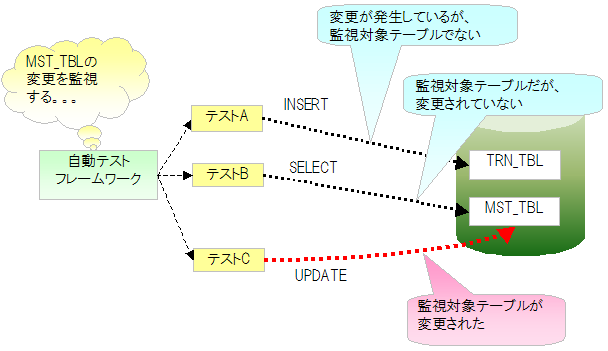
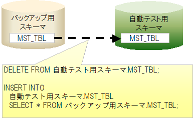

.. _`master_data_backup`:

======================
 主数据恢复功能
======================

.. contents:: 目录
  :depth: 2
  :local:

概要
====

通常情况下，执行测试时不会改写主数据。
但是，在主数据维护功能等测试中，存在不更改主数据就无法
实施的测试用例。例如，在存在的数据不存在时的异常系统测试用例中，需要从主数据中删除记录。

如果在测试中更改了主数据，在之后的测试类测试中，
主数据可能处于意外状态而导致测试失败。

为了防止这种主数据更改导致的意外测试失败，
如果自动化测试中更新了主数据，在该测试方法结束时，
提供将主数据恢复到原始状态的功能。

特点
====

* 可以不依赖测试的执行顺序，始终在正确状态的主数据下测试。
* 主数据恢复是自动进行的，因此各测试类无需准备恢复处理、恢复用数据。
* 从备份用模式按表批量恢复，因此比逐条INSERT的情况能更高速地恢复。

需要的模式
==================

使用本功能需要以下2个模式。

.. list-table::
  :header-rows: 1
  :class: white-space-normal
  :widths: 2,6

  * - 模式
    - 说明

  * - 自动化测试用模式
    - 用于自动化测试的模式。

  * - 备份用模式
    - 用于保存恢复用主数据的模式。

动作形象
============

自动化测试框架从组件设置文件中获取监视目标表名列表。
测试执行中，自动化测试框架通过监视SQL日志，\
检测是否发出了更改监视目标表的SQL语句。

如果发出了更改监视目标表的SQL语句，在测试方法结束后恢复有更改的表。
恢复表时，首先删除表内的所有记录。
然后，从备份用模式的表中插入所有记录。

.. _`master_data_backup_settings`:

环境构建
========

实施以下环境构建，启用自动化测试框架的主数据恢复功能。

备份用模式的创建、数据投入
----------------------------------------

创建主数据恢复用模式。
在主数据恢复用模式中创建与自动化测试用模式相同的表，并预先投入恢复用数据。

.. tip::
  主数据恢复用模式不需要创建所有表。
  只需存在作为主数据恢复目标的表即可（有恢复目标以外的表也没有问题）。

.. _`MasterDataRestore-fk_key`:

使用设置了外键的表时
-----------------------------------------------------------
对外键设置的表恢复数据时，需要意识到父子关系执行恢复处理。
因此，本功能默认使用JDBC功能获取・构建父子关系，
控制删除处理从子表开始、插入处理从父表开始按顺序执行。

但是，在表数量庞大的项目中，基于JDBC功能构建父子关系的处理可能导致slow test问题。
为避免此问题，提供不使用JDBC功能，而是基于描述顺序(请参考 :ref:`MasterDataRestore-configuration` )执行表的删除及插入处理的功能。

想基于描述顺序恢复主数据时，请在环境设置文件中添加以下内容。

.. code-block:: jproperties

  nablarch.suppress-table-sort=true

在组件设置文件中描述监视目标表
-----------------------------------------------------------

在自动化测试用的组件设置文件中，列举监视目标表。

设置项目一览
~~~~~~~~~~~~

.. list-table::
  :header-rows: 1
  :class: white-space-normal
  :widths: 3,7,2

  * - 设置项目名
    - 说明
    - 默认值

  * - backupSchema
    - 描述主数据恢复用模式名。
    - 无

  * - tablesTobeWatched
    - 以列表形式列举作为监视目标的表名。
    - 无

  * - testEventListeners
    - 测试事件监听器列表。
      在此注册主数据恢复类(nablarch.test.core.db.MasterDataRestorer)，
      可以在测试方法结束时执行主数据恢复。
    - 无

.. _MasterDataRestore-configuration:

设置示例
~~~~~~

.. code-block:: xml

  <!-- 主数据恢复类 -->
  <component name="masterDataRestorer"
             class="nablarch.test.core.db.MasterDataRestorer">
    <!-- 备份模式 -->
    <property name="backupSchema" value="nablarch_test_master"/>
    <!-- 监视目标表列表 -->
    <property name="tablesTobeWatched">
      <list>
        <value>MESSAGE</value>
        <value>ID_GENERATE</value>
        <value>BUSINESS_DATE</value>
        <value>PERMISSION_UNIT</value>
        <value>REQUEST</value>
        <value>PERMISSION_UNIT_REQUEST</value>
      </list>
    </property>
  </component>

日志输出设置
------------

本功能通过监视SQL日志来检测对主数据的更改。\
因此，需要为此输出日志。

app-log.properties
~~~~~~~~~~~~~~~~~~

在`sqlLogFormatter`\ 的类名中指定本功能提供的类。

.. code-block:: none

 sqlLogFormatter.className=nablarch.test.core.db.MasterDataRestorer$SqlLogWatchingFormatter

log.properties
~~~~~~~~~~~~~~

在log.properties中设置以调试级别以上输出SQL日志。
以下示例中，设置专用记录器（什么都不做的记录器）使SQL日志不显示在标准输出中。

.. code-block:: none

 # 记录器工厂实现类                                 
 loggerFactory.className=nablarch.core.log.basic.BasicLoggerFactory             
                                              
 # 日志写入器名                                     
 writerNames=stdout,nop                                     
                                              
 #调试用标准输出                                     
 writer.stdout.className=nablarch.core.log.basic.StandardOutputLogWriter             
 writer.nop.className=nablarch.test.core.log.NopLogWriter   # 【说明】什么都不做的记录器     
                                              
 # 可用记录器名顺序                                 
 availableLoggersNamesOrder=sql,root                             
                                              
 #以所有记录器获取为对象，在DEBUG级别以上输出到标准输出。             
 loggers.root.nameRegex=.*                                 
 loggers.root.level=DEBUG                                 
 loggers.root.writerNames=stdout                                 
                                              
 #以记录器名"SQL"指定的记录器获取为对象，在DEBUG级别以上输出。         
 loggers.sql.nameRegex=SQL                                 
 loggers.sql.level=DEBUG      # 【说明】设置为DEBUG级别以上             
 loggers.sql.writerNames=nop                                                              
