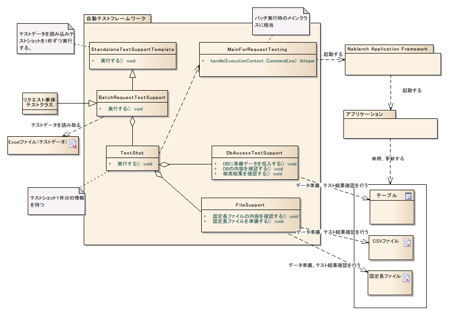

.. _request-util-test-batch:

========================================
 请求单元测试（批处理）
========================================

概述
====

请求单元测试（批处理)中，模拟实际从命令行启动批处理时的动作进行测试。

整体结构
--------

主要类、资源
====================

+----------------------+------------------------------------------------------+--------------------------------------+
|名称                  |作用                                                  | 创建单位                             |
+======================+======================================================+======================================+
|请求单元\\            |实现测试逻辑。                                        |每个测试目标类(Action)创建1个         |
|测试类                |                                                      |                                      |
+----------------------+------------------------------------------------------+--------------------------------------+
|Excel文件\\           |记载存储到表的准备数据和预期结果、                    |每个测试类创建1个                     |
|（测试数据）          |输入文件等测试数据。                                  |                                      |
+----------------------+------------------------------------------------------+--------------------------------------+
|StandaloneTest\\      |提供批处理和消息处理等容器外运行                      | \\－                                 |
|SupportTemplate       |处理的测试执行环境。                                  |                                      |
+----------------------+------------------------------------------------------+--------------------------------------+
|BatchRequest\\        |提供批处理请求单元测试所需的测试准备                  | \\－                                 |
|TestSupport           |功能、各种断言。                                      |                                      |
+----------------------+------------------------------------------------------+--------------------------------------+
|TestShot              |存储数据表中定义的测试用例1件信息                     | \\－                                 |
|                      |的类。                                                |                                      |
+----------------------+------------------------------------------------------+--------------------------------------+
|MainForRequestTesting |测试用主类。吸收测试执行时的差异。                    | \\－                                 |
+----------------------+------------------------------------------------------+--------------------------------------+
|DbAccessTestSupport   |提供DB准备数据投入等使用数据库的测试                  | \\－                                 |
|                      |所需功能。                                            |                                      |
+----------------------+------------------------------------------------------+--------------------------------------+
|FileSupport           |提供输入文件创建等使用文件的测试                      | \\－                                 |
|                      |所需功能。                                            |                                      |
+----------------------+------------------------------------------------------+--------------------------------------+

结构
====

StandaloneTestSupportTemplate
-----------------------------
提供批处理和消息处理等容器外运行处理的测试执行环境。
读取测试数据，执行全部测试shot( `TestShot`_ )。

TestShot
--------

保持1测试shot的信息并执行测试shot。\
测试shot由以下要素组成。

* 输入数据准备
* 主类启动
* 输出结果确认

批处理和消息处理等容器外运行处理的测试中
提供共同的准备处理、结果确认功能。

 +----------------------------+--------------------------+
 | 准备处理                   | 结果确认                 |
 +============================+==========================+
 | 数据库设置                 | 数据库更新内容确认       |
 |                            +--------------------------+
 |                            | 日志输出结果确认         |
 |                            +--------------------------+
 |                            | 状态码确认               |
 +----------------------------+--------------------------+

输入数据准备和结果确认逻辑因批处理和各种消息处理而异，
因此可按方式定制。

BatchRequestTestSupport
-----------------------

批处理测试用父类。\
应用程序程序员继承本类创建测试类。

本类向 `TestShot`_ 提供的准备处理、结果确认添加以下功能。

 +----------------------------+--------------------------+
 | 准备处理                   | 结果确认                 |
 +============================+==========================+
 |输入文件创建                |输出文件内容确认          |
 +----------------------------+--------------------------+

使用本类可以定型化请求单元测试的测试源代码、测试数据，
大幅减少测试源代码描述量。

具体使用方法请参考 :doc:`../05_UnitTestGuide/02_RequestUnitTest/batch` 。

MainForRequestTesting
---------------------

请求单元测试用主类。\
与生产用主类的主要差异如下。

* 从测试用组件配置文件初始化系统存储库。
* 禁用常驻化功能。

FileSupport
-----------

提供文件相关操作的类。
主要提供以下功能。

* 从测试数据创建输入文件
* 比较测试数据预期值与实际输出文件内容。

文件相关操作在批处理以外也需要（例如，文件下载等），
因此作为独立类提供。

测试数据
============

说明批处理固有的测试数据。

 .. _`about_fixed_length_file`:

定长文件
--------------

基本描述方法请参考
:ref:`batch_request_test` 。

填充
~~~~~~~~~~

对于指定字段长，数据字节长短时，
将根据该字段的数据类型进行相应填充。
填充算法与Nablarch Application Framework本体相同。

二进制数据描述方法
~~~~~~~~~~~~~~~~~~~~~~~~

表示二进制数据时，以16进制形式描述测试数据。
例如，描述 ``0x4AD`` 时，解释为 ``0000 0100 1010 1101``  ( ``0x04AD`` )的2字节字节数组。

.. tip::
 如果测试数据中未添加前缀0x，则将该数据视为字符串，
 以该字符串按指令字符编码编码为字节数组。
 
 例如，字符编码为Windows-31J的文件测试数据中，
 数据类型为二进制的字段记载 ``4AD`` 时，转换为 ``0011 0100 0100 0001 0100 0100``  ( ``0x344144`` )
 的3字节字节数组。
  

变长文件
--------------

基本描述方法请参考
:ref:`batch_request_test` 。

各种设置值
==========

常驻批处理测试用handler构成
-----------------------------------------------------
实施常驻批处理测试时，需要将生产用handler构成更改为测试用。
如果不进行此更改而实施测试，测试目标的常驻批处理应用程序处理不会结束，无法正常实施测试。

**【需要更改的handler】**

========================= ========================= ==================================================================
更改对象的handler         更改后的handler           更改理由
========================= ========================= ==================================================================
RequestThreadLoopHandler  OneShotLoopHandler        使用RequestThreadLoopHandler实施测试时，
                                                    批处理执行不会结束，控制不会返回测试代码。

                                                    通过替换handler为OneShotLoopHandler，
                                                    测试执行前设置的要求数据全部处理完成后
                                                    批处理执行结束，控制返回测试代码。
========================= ========================= ==================================================================

以下显示组件配置文件设置示例。

* 生产用设置

  .. code-block:: xml

    <!-- 请求线程循环 -->
    <component name="requestThreadLoopHandler" class="nablarch.fw.handler.RequestThreadLoopHandler">
      <!-- 属性值设置省略 -->
    </component>

* 测试用设置

  以与生产用设置相同名称设置组件，使用测试用handler覆盖。

  .. code-block:: xml

    <!-- 将请求线程循环handler替换为测试用handler的设置 -->
    <component name="requestThreadLoopHandler" class="nablarch.test.OneShotLoopHandler" />

指令默认值
----------------------------

如果文件指令在系统内一定程度上统一，
在各测试数据中记载相同指令是冗余的。

这种情况下，通过在组件配置文件中记载默认指令，
在各测试数据中可以省略指令描述。

以map形式记载在组件配置文件中。命名规则如下。

======================= ==============================
 对象文件类型            name属性
======================= ==============================
 共通                    defaultDirections            
 定长文件                fixedLengthDirections    
 变长文件                variableLengthDirections 
======================= ==============================

设置示例如下。

.. code-block:: xml

  <!-- 指令（共通） -->
  <map name="defaultDirectives">
    <entry key="text-encoding" value="Windows-31J" />
  </map>

  <!-- 指令（定长） -->
  <map name="variableLengthDirectives">
    <entry key="record-separator" value="NONE"/>
  </map>

  <!-- 指令（变长） -->
  <map name="variableLengthDirectives">
    <entry key="quoting-delimiter" value="" />
    <entry key="record-separator" value="CRLF"/>
  </map>
