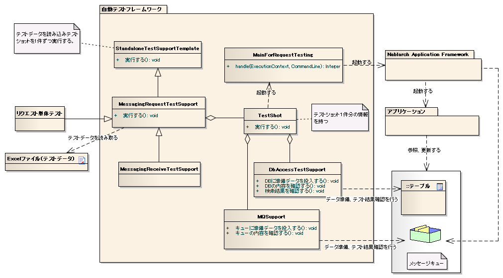

================================================
 请求单元测试（消息接收处理）
================================================

概述
====

请求单元测试（消息接收处理)中，
模拟接收1件请求消息时的动作进行测试。

整体结构
------

主要类、资源
====================

+----------------------+------------------------------------------------------+--------------------------------------+
|名称                  |作用                                                  | 创建单位                             |
+======================+======================================================+======================================+
|请求单元\\            |实现测试逻辑。                                        |每个测试目标类(Action)创建1个         |
|测试类                |                                                      |                                      |
+----------------------+------------------------------------------------------+--------------------------------------+
|Excel文件\\           |记载存储到表的准备数据和预期结果、                    |每个测试类创建1个                     |
|（测试数据）          |输入文件等测试数据。                                  |                                      |
+----------------------+------------------------------------------------------+--------------------------------------+
|StandaloneTest\\      |提供批处理和消息处理等容器外运行                      | \\－                                  |
|SupportTemplate       |处理的测试执行环境。                                  |                                      |
+----------------------+------------------------------------------------------+--------------------------------------+
|MessagingRequest\\    |提供同步响应消息接收处理请求单元                      | \\－                                  |
|TestSupport           |测试所需的测试准备功能、                              |                                      |
|                      |各种断言。                                            |                                      |
+----------------------+------------------------------------------------------+--------------------------------------+
|MessagingReceive\\    |提供无需响应消息接收处理请求单元测试                  | \\－                                  |
|TestSupport           |所需的测试准备功能、各种断言。                        |                                      |
|                      |                                                      |                                      |
+----------------------+------------------------------------------------------+--------------------------------------+
|TestShot              |存储数据表中定义的测试用例1件信息                     | \\－                                  +
|                      |的类。                                                |                                      |
+----------------------+------------------------------------------------------+--------------------------------------+
|MainForRequestTesting |测试用主类。吸收测试执行时的差异。                    | \\－                                  |
+----------------------+------------------------------------------------------+--------------------------------------+
|DbAccessTestSupport   |提供DB准备数据投入等使用数据库的测试                  | \\－                                  |
|                      |所需功能。                                            |                                      |
+----------------------+------------------------------------------------------+--------------------------------------+
|MQSupport             |提供消息创建等消息处理测试                            | \\－                                  |
|                      |所需功能。                                            |                                      |
+----------------------+------------------------------------------------------+--------------------------------------+
|TestDataConvertor     |编辑从Excel读取的测试数据的                           | \\－                                  |
|                      |接口。                                                |                                      |
|                      |根据需要按数据类型由架构师实现。                      |                                      |
+----------------------+------------------------------------------------------+--------------------------------------+

结构
====

StandaloneTestSupportTemplate
-----------------------------
提供批处理和消息处理等容器外运行处理的测试执行环境。
读取测试数据，执行全部测试shot( `TestShot`_ )。

TestShot
--------

保持1测试shot的信息并执行测试shot。\
测试shot由以下要素组成。

* 输入数据准备
* 主类启动
* 输出结果确认

批处理和消息处理等容器外运行处理的测试中
提供共同的准备处理、结果确认功能。

 +----------------------------+--------------------------+
 | 准备处理                   | 结果确认                 |
 +============================+==========================+
 | 数据库设置                 | 数据库更新内容确认       |
 |                            +--------------------------+
 |                            | 日志输出结果确认         |
 |                            +--------------------------+
 |                            | 状态码确认               |
 +----------------------------+--------------------------+

MessagingRequestTestSupport
---------------------------

同步响应消息接收处理测试用父类。\
应用程序程序员继承本类创建测试类。

本类向 `TestShot`_ 提供的准备处理、结果确认添加以下功能。

 +----------------------------+--------------------------+
 | 准备处理                   | 结果确认                 |
 +============================+==========================+
 |请求消息创建                |响应消息内容确认          |
 +----------------------------+--------------------------+

使用本类可以定型化请求单元测试的测试源代码、测试数据，
大幅减少测试源代码描述量。

具体使用方法请参考 :doc:`../05_UnitTestGuide/02_RequestUnitTest/real` 。

.. tip::
  本类以向队列PUT输入数据为目的，读取main侧的组件配置文件。
  此时， ``nablarch.fw.messaging.FwHeaderDefinition`` 实现类必须
  以 ``fwHeaderDefinition`` 名称注册。
  使用此以外的名称时，覆盖本类的getFwHeaderDefinitionName()可以
  更改本类使用的FwHeaderDefinition组件名。

MessagingReceiveTestSupport
---------------------------

无需响应消息处理测试用父类。\
应用程序程序员继承本类创建测试类。

本类向 `TestShot`_ 提供的准备处理、结果确认添加以下功能。

 +----------------------------+
 | 准备处理                   |
 +============================+
 |请求消息创建                |
 +----------------------------+

使用本类可以定型化请求单元测试的测试源代码、测试数据，
大幅减少测试源代码描述量。

具体使用方法请参考 :doc:`../05_UnitTestGuide/02_RequestUnitTest/delayed_receive` 。

MainForRequestTesting
---------------------

请求单元测试用主类。\
与生产用主类的主要差异如下。

* 从测试用组件配置文件初始化系统存储库。
* 禁用常驻化功能。

MQSupport
-----------

提供消息相关操作的类。
主要提供以下功能。

* 从测试数据创建请求消息，PUT到接收队列。
* 从发送队列GET响应消息，与测试数据预期值比较内容。

TestDataConvertor
-----------------

编辑从Excel读取的测试数据的接口。
根据需要按XML、JSON等数据类型由架构师实现。

实现类中实现以下功能。

* 对从Excel读取的数据进行任意编辑。
* 动态生成读取编辑后数据所需的布局定义数据。

实现本接口，例如可以添加将Excel中以日语描述的数据进行URL编码等处理。

实现类需要以 "TestDataConverter_<数据类型>" 键名注册到测试用组件配置文件。

测试数据
============

说明消息处理固有的测试数据。

消息
----------

基本描述方法请参考
:doc:`../05_UnitTestGuide/02_RequestUnitTest/real` 。

.. tip::
 填充及二进制数据处理与 :ref:`about_fixed_length_file` 相同。
