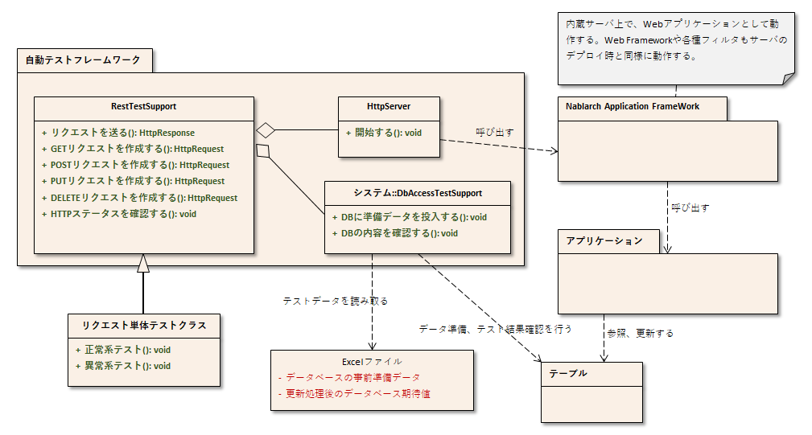

.. _rest_testing_fw:

============================================================
请求单体测试（RESTful Web服务）
============================================================

----
概要
----

请求单体测试(REST)与 :ref:`请求单体测试(Web应用程序) <request-util-test-online>` 相同，使用内置服务器进行测试。
RESTful Web服务用执行基础所需模块比其他执行基础多，因此需要将 :ref:`模块一览 <rest_test_modules>` 中记载的模块
添加到依赖关系中。

整体像
======

主要类, 资源
====================

+----------------------------------+------------------------------------------------------+--------------------------------------+
|名称                              |作用                                                  | 创建单位                             |
+==================================+======================================================+======================================+
|请求单体测试类                    |实现测试逻辑。                                        |每个测试目标类(Action)创建1个|
+----------------------------------+------------------------------------------------------+--------------------------------------+
|测试数据（Excel文件）             |描述存储到表的准备数据和预期结果、\         |根据需要每个测试类创建1个|
|                                  |HTTP参数等测试数据。          |                                      |
|                                  |                                                      |                                      |
+----------------------------------+------------------------------------------------------+--------------------------------------+
|测试目标类(Action)                |测试目标的类                                    | 每个交易创建1个类                |
|                                  |(包含实现Action以后业务逻辑的各类)    |                                      |
+----------------------------------+------------------------------------------------------+--------------------------------------+
|DbAccessTestSupport               |提供使用数据库的测试所需的\     | －                                  |
|                                  |准备数据投入等功能。                                |                                      |
|                                  |                                                      |                                      |
+----------------------------------+------------------------------------------------------+--------------------------------------+
|HttpServer                        |内置服务器。作为Servlet容器运行。      | －                                  |
+----------------------------------+------------------------------------------------------+--------------------------------------+
|RestTestSupport                   |提供内置服务器的启动和请求单体测试所需的\     | －                                  |
|                                  |状态码断言功能。              |                                      |
+----------------------------------+------------------------------------------------------+--------------------------------------+

.. _rest_test_modules:

模块一览
======================
.. code-block:: xml

    <!--  测试框架本体  -->
    <dependency>
      <groupId>com.nablarch.framework</groupId>
      <artifactId>nablarch-testing-rest</artifactId>
      <scope>test</scope>
    </dependency>
    <!--  测试框架使用的默认设置  -->
    <dependency>
      <groupId>com.nablarch.configuration</groupId>
      <artifactId>nablarch-testing-default-configuration</artifactId>
      <scope>test</scope>
    </dependency>
    <!--  测试框架使用的内置服务器实现  -->
    <dependency>
      <groupId>com.nablarch.framework</groupId>
      <artifactId>nablarch-testing-jetty12</artifactId>
      <scope>test</scope>
    </dependency>

.. important::
   ``nablarch-testing-rest`` 依赖于 ``nablarch-testing`` (:ref:`测试框架 <unitTestGuide>` )。
   添加上述模块到依赖中，可以同时使用 :ref:`测试框架 <unitTestGuide>` 的API。

设置
========

从Archetype创建空白项目时， ``src/test/resources/unit-test.xml`` 中
设置了测试框架的设置。为添加RESTful Web服务向测试框架的设置，
读取默认设置提供的以下设置文件。

.. code-block:: xml

    <import file="nablarch/test/rest-request-test.xml"/>

请求单体测试的设置请参考 :ref:`rest-test-configuration` 。

.. tip::
  从Nablarch5u18以后的Archetype创建 :doc:`RESTful Web服务 <../../../../../application_framework/application_framework/blank_project/setup_blankProject/setup_WebService>` 的
  空白项目时上述已设置。
  :doc:`Web项目 <../../../../../application_framework/application_framework/blank_project/setup_blankProject/setup_Web>` 和
  :doc:`批处理项目 <../../../../../application_framework/application_framework/blank_project/setup_blankProject/setup_NablarchBatch>` 中需要添加。

----
结构
----

.. _rest_test_superclasses:

SimpleRestTestSupport
=========================================

为请求单体测试准备的超类。准备了请求单体测试用的方法。
不需要数据库相关功能时使用后述的 ``RestTestSupport`` 而非此类。
关于 :ref:`事前准备辅助功能<rest_test_helper>` 、 :ref:`执行<rest_test_execute>` 、 :ref:`结果确认<rest_test_assert>` ，有以下 ``RestTestSupport`` 相同的功能。

.. tip::

  使用RestTestSupport时，需要准备 ``dbInfo`` 或 ``testDataParser`` 的组件。
  如果不需要数据库依赖，使用 ``SimpleRestTestSupport`` 可以简化组件定义。

RestTestSupport
=========================================

为请求单体测试准备的超类。准备了请求单体测试用的方法。
继承 ``SimpleRestTestSupport`` ，具有数据库相关功能。

数据库相关功能
======================

关于数据库的功能，通过 ``RestTestSupport`` 类将处理委托给 ``DbAccessTestSupport`` 类来实现。
``DbAccessTestSupport`` 类的详情请参考\ :doc:`02_DbAccessTest`\ 。

但是， ``DbAccessTestSupport`` 中的以下方法，\
在请求单体测试(REST)中不需要，为避免给应用程序程序员带来误解，\
有意不委托。

* ``public void beginTransactions()``
* ``public void commitTransactions()``
* ``public void endTransactions()``
* ``public void setThreadContextValues(String sheetName, String id)``
* ``public void assertSqlResultSetEquals(String message, String sheetName, String id, SqlResultSet actual)``
* ``public void assertSqlRowEquals(String message, String sheetName, String id, SqlRow actual)``

.. important::

  考虑到使用者的便利性，委托了数据库相关功能。\
  但是在RESTful Web服务单体测试中，比起使用委托的 ``assertTableEquals`` 等
  确认数据库表内容的测试，更推荐通过查询服务公开的API
  来确认系统持有的数据而不依赖数据库的测试。

.. _rest_test_helper:

事前准备辅助功能
===================

向内置服务器发送请求需要 ``HttpRequest`` 的实例。\
``RestTestSupport`` 类中，为轻松创建将 ``HttpRequest`` 扩展为请求单体测试用的\
``RestMockHttpRequest`` 对象，\
准备了5个方法。\

.. code-block:: java

  RestMockHttpRequest get(String uri)
  RestMockHttpRequest post(String uri)
  RestMockHttpRequest put(String uri)
  RestMockHttpRequest patch(String uri)
  RestMockHttpRequest delete(String uri)

参数中传递以下值。

* 作为测试目标的请求URI

这些方法根据接收到的请求URI生成 ``RestMockHttpRequest`` 实例，\
设置与方法名对应的HTTP方法后返回。\
想设置请求参数等URI以外的数据时，\
可以对通过本方法调用获取的实例设置数据。

此外，想用上述以外的HTTP方法创建 ``RestMockHttpRequest`` 对象时请使用以下方法。

.. code-block:: java

  RestMockHttpRequest newRequest(String httpMethod, String uri)

第1参数指定HTTP方法，第2参数指定作为测试目标的请求URI。

.. tip::

  ``RestMockHttpRequest`` 为流畅接口方式设置参数等
  覆盖了方法使其返回自身实例。
  可用方法的详情请参考 :java:extdoc:`Javadoc <nablarch.fw.web.RestMockHttpRequest>`

  构建请求的示例

  .. code-block:: java

    RestMockHttpRequest request = post("/projects")
                                      .setHeader("Authorization","Bearer token")
                                      .setCookie(cookie);

.. _rest_test_execute:

执行
====

调用 ``RestTestSupport``  中的以下方法，\
将启动内置服务器并发送请求。

.. code-block:: java

 HttpResponse sendRequest(HttpRequest request)

.. _rest_test_assert:

结果确认
========

状态码
-----------------

调用 ``RestTestSupport`` 中的以下方法，\
确认响应的HTTP状态码是否符合预期。

.. code-block:: java

   
  void assertStatusCode(String message, HttpResponse.Status expected, HttpResponse response);

参数中传递以下值。

* 断言失败时的消息
* 预期的状态( ``HttpResponse.Status`` 的Enum)
* 内置服务器返回的 ``HttpResponse`` 实例

预期状态码与响应状态码不一致时\
断言失败。

响应体
----------------

关于响应体的验证，框架不提供机制。
请根据各项目的需求使用 `JSONAssert(外部网站、英语) <https://jsonassert.skyscreamer.org/>`_ 或
`json-path-assert(外部网站、英语) <https://github.com/json-path/JsonPath/tree/master/json-path-assert>`_ 、
`XMLUnit(外部网站、英语) <https://github.com/xmlunit/user-guide/wiki>`_ 等库。

.. tip::

  创建\ :doc:`RESTful Web服务的空白项目 <../../../../../application_framework/application_framework/blank_project/setup_blankProject/setup_WebService>`\ 时
  上述 `JSONAssert(外部网站、英语) <https://jsonassert.skyscreamer.org/>`_ 、
  `json-path-assert(外部网站、英语) <https://github.com/json-path/JsonPath/tree/master/json-path-assert>`_ 、
  `XMLUnit(外部网站、英语) <https://github.com/xmlunit/user-guide/wiki>`_ 已记载在pom.xml中。
  请根据需要删除或替换库。

**响应体验证的辅助功能**

验证响应体时，有时想将预期的主体作为JSON文件或XML文件准备。
为应对JSONAssert等外部库期望值的参数仅接受 ``String`` 的情况，
``RestTestSupport`` 准备了读取文件并转换为 ``String`` 的方法。

.. code-block:: java

  String readTextResource(String fileName)

此方法按以下方式从与测试类同名目录的资源中
读取参数指定的文件名的文件并转换为 ``String`` 。

+----------------------------------+------------------------------------------------------+-------------------------------------+
| 文件类型                         | 配置目录                                             | 文件名                              |
+==================================+======================================================+=====================================+
| 测试类源文件                     | <PROJECT_ROOT>/test/java/com/example/                | SampleTest.java                     |
+----------------------------------+------------------------------------------------------+-------------------------------------+
| 响应体预期值文件 | <PROJECT_ROOT>/test/resources/com/example/SampleTest | response.json(在参数fileName中指定) |
+----------------------------------+------------------------------------------------------+-------------------------------------+

.. _rest-test-configuration:

----------
各种设置值
----------

依赖于环境设置的设置值可以在组件设置文件中更改。\
显示可设置项目如下。

组件设置文件设置项目一览
===============================================

+----------------------------+-------------------------------------------------------------------------+-------------------------------------------------------+
| 设置项目名                 | 说明                                                                    | 默认值                                                |
+============================+=========================================================================+=======================================================+
| webBaseDir                 | Web应用程序的根目录\ [#]_\                       | src/main/webapp                                       |
+----------------------------+-------------------------------------------------------------------------+-------------------------------------------------------+
| webFrontControllerKey      | Web前端控制器的仓库键\ [#]_\                        | webFrontController                                    |
+----------------------------+-------------------------------------------------------------------------+-------------------------------------------------------+ 

.. [#] 
  如果存在项目共用的web模块，在此属性中用逗号分隔设置目录。
  指定多个时，资源将按从头到尾的顺序读取。
  
  示例如下。

  .. code-block:: xml

    <component name="restTestConfiguration" class="nablarch.test.core.http.RestTestConfiguration">
      <property name="webBaseDir" value="/path/to/web-a/,/path/to/web-common"/>

  这种情况下，将按web-a、web-common的顺序搜索资源。
       
.. [#]
  在1个War中执行Web应用程序执行基础和Web服务执行基础等情况时
  可能以"webFrontController"以外的名称
  组件注册 :ref:`Web前端控制器 <web_front_controller>` 。
  这种情况下，通过在此属性中设置Web服务使用的Web前端控制器的仓库键，
  可以控制内置服务器中执行的处理器。

  示例如下。

  Web应用程序执行基础用的Web前端控制器( ``webFrontController`` )和
  Web服务执行基础用的Web前端控制器( ``jaxrsController`` )已注册的组件定义。

  .. code-block:: xml

    <!-- 处理器队列构成 -->
    <component name="webFrontController" class="nablarch.fw.web.servlet.WebFrontController">
      <property name="handlerQueue">
        <list>
          <component class="nablarch.fw.web.handler.HttpCharacterEncodingHandler"/>
          <component class="nablarch.fw.handler.GlobalErrorHandler"/>
          <component class="nablarch.common.handler.threadcontext.ThreadContextClearHandler"/>
          <component class="nablarch.fw.web.handler.HttpResponseHandler"/>
          ・
          ・
          ・
          (略)
        </list>
      </property>
    </component>

    <component name="jaxrsController" class="nablarch.fw.web.servlet.WebFrontController">
      <property name="handlerQueue">
        <list>
          <component class="nablarch.fw.web.handler.HttpCharacterEncodingHandler"/>
          <component class="nablarch.fw.handler.GlobalErrorHandler"/>
          <component class="nablarch.fw.jaxrs.JaxRsResponseHandler"/>
          ・
          ・
          ・
          (略)
        </list>
      </property>
    </component>

  使用默认设置进行RESTful Web服务执行基础向测试时
  将使用"webFrontController"，因此执行Web应用程序向的Web前端控制器。
  按以下方式覆盖设置可以使用Web服务向的Web前端控制器。

  .. code-block:: xml

    <import file="nablarch/test/rest-request-test.xml"/>
    <!--  在import默认组件定义后覆盖。-->
    <component name="restTestConfiguration" class="nablarch.test.core.http.RestTestConfiguration">
      <property name="webFrontControllerKey" value="jaxrsController"/>
