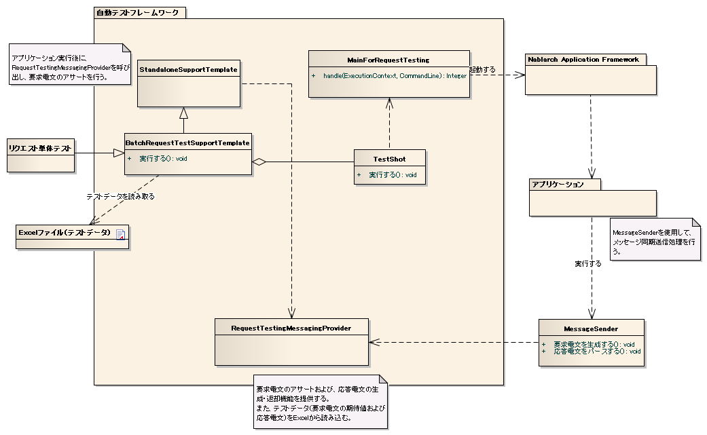

.. _dealUnitTest_send_sync:

=====================================================================
 请求单体测试（同步响应消息发送处理）
=====================================================================

概要
====

请求单体测试（同步响应消息发送处理)中，
将1件请求消息发送到队列，模拟同步接收结果时的动作进行测试。
    

.. tip:: 
 关于请求单体测试本身的概要，请参考
 :ref:`message_sendSyncMessage_test`
 。

整体像
------

关于批处理中执行同步响应消息发送处理的情况，显示整体像如下。

.. tip:: 
 执行同步响应消息发送处理的请求单体测试时，测试用例的父类需要继承以下2个类中的任意一个。

 * StandaloneTestSupportTemplate
 * AbstractHttpRequestTestTemplate

主要类, 资源
====================

+----------------------------------------------+------------------------------------------------------+--------------------------------------+
|名称                                          |作用                                                  | 创建单位                             |
+==============================================+======================================================+======================================+
|请求单体\                                     |实现测试逻辑。                                        |每个测试目标类(Action)创建1个|
|测试类                                        |                                                      |                                      |
+----------------------------------------------+------------------------------------------------------+--------------------------------------+
|Excel文件\                                    |描述请求消息的预期值以及响应消息等                  |每个测试类创建1个            |
|（测试数据）                                  |测试数据。\                                           |                                      |
+----------------------------------------------+------------------------------------------------------+--------------------------------------+
|StandaloneTest\                               |Action执行后，使用MockMessagingContext          | －                                  |
|SupportTemplate                               |执行请求消息的断言。                        |                                      |
+----------------------------------------------+------------------------------------------------------+--------------------------------------+
|AbstractHttpRequest\                          |Action执行后，使用MockMessagingContext          | －                                  |
|TestTemplate                                  |执行请求消息的断言。                        |                                      |
+----------------------------------------------+------------------------------------------------------+--------------------------------------+
|MessageSender                                 |执行同步响应消息发送处理时\                 | －                                  |
|                                              |使用的组件。                              |                                      |
+----------------------------------------------+------------------------------------------------------+--------------------------------------+
|RequestTestingMessagingProvider               |在请求单体测试中，\                       | －                                  |
|                                              |提供请求消息的断言功能以及\                         |                                      |
|                                              |响应消息的生成・返回功能。                  |                                      |
+----------------------------------------------+------------------------------------------------------+--------------------------------------+
|TestDataConvertor                             |用于编辑从Excel读取的测试数据的\      | －                                  |
|                                              |接口。                                      |                                      |
|                                              |根据需要由架构师按数据类型实现。  |                                      |
+----------------------------------------------+------------------------------------------------------+--------------------------------------+

结构
====

StandaloneTestSupportTemplate
----------------------------------------

Action执行后，使用MockMessagingContext执行请求消息断言的功能。

执行同步响应消息发送处理的请求单体测试时，需要根据处理形态
使用本类或AbstractHttpRequestTestTemplate实现的测试用例。

AbstractHttpRequestTestTemplate
---------------------------------------------------

Action执行后，使用MockMessagingContext执行请求消息断言的功能。

执行同步响应消息发送处理的请求单体测试时，需要根据处理形态
使用本类或StandaloneTestSupportTemplate实现的测试用例。

RequestTestingMessagingProvider
-------------------------------------------------

提供请求消息断言以及响应消息生成・返回功能的类。

此外，还执行Excel中描述的请求消息预期值和响应消息的读取。

本类提供以下准备处理、结果确认功能。

 +----------------------------+--------------------------+
 | 准备处理                   | 结果确认                 |
 +============================+==========================+
 |响应消息生成              |请求消息断言        |
 +----------------------------+--------------------------+

.. tip:: 
 请求消息的断言不是在每次发送请求消息时执行，而是在Action执行后批量执行。

MessageSender
---------------------------------

同步响应消息发送处理中使用的组件。

主要提供以下功能。

* 从Action等调用方传递的参数生成请求消息。
* 基于请求消息执行MockMessagingContext。
* 解析从MockMessagingContext返回的响应消息。
* 将解析结果对象返回给调用方。

TestDataConvertor
-----------------

用于编辑从Excel读取的测试数据的接口。
根据需要由架构师按XML、JSON等数据类型实现。

实现类中实现以下功能。

* 将Excel读取的数据编辑为任意值。
* 动态生成读取编辑后数据的布局定义数据。

通过实现本接口，例如可以将Excel中描述的日语数据添加URL编码等处理。

实现类需要以 "TestDataConverter_<数据类型>" 的键名注册到测试用组件设置文件中。

测试数据
============

说明同步响应消息发送处理固有的测试数据。

同步响应消息发送处理
-----------------------------

基本的描述方法请参考\
\ :ref:`send_sync_request_write_test_data`\
。

.. tip::
 填充以及二进制数据的处理与\ :ref:`about_fixed_length_file`\ 相同。
