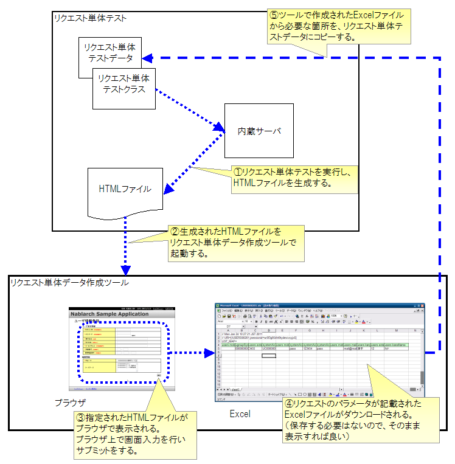

.. _`http_dump_tool`:

======================================
请求单元数据创建工具
======================================

概述
====

请求单元测试(Web应用程序)中，需要将HTML中请求参数含有的键和值作为测试数据创建 [*]_ 。
人工创建此请求参数时，可能会抄错请求参数名（form内的name属性）。特别是，注册画面等参数多的画面时，这种可能性更高。

为消除这种人为错误，提供可使用请求单元测试生成的HTML创建
向下一画面的请求参数的工具。

 .. [*]
  关于请求参数的测试数据描述方法，请参考 :doc:`../../05_UnitTestGuide/02_RequestUnitTest/index` （特别是「 :ref:`request_test_req_params` 」项 ）。

特点
====

本工具中，通过在浏览器中操作请求单元测试生成的HTML，
可以获取Excel形式的向下一画面的请求参数。
可以像操作Web应用程序一样直观感地创建测试数据。

使用方法
========

沿下图说明本工具的使用方法。

前提条件
--------------------

* 已按开发环境构建指南构建开发环境。
* 参考 :doc:`02_SetUpHttpDumpTool` 的 :ref:`http_dump_tool_prerequisite`

生成输入HTML
--------------------

执行请求单元测试，生成HTML文件。

仅初始画面显示的请求单元测试用数据需要手动准备。
初始画面显示请求（例如，从菜单的简单画面迁移）中
大多不包含请求参数，
通常只需创建空的请求参数即可。

工具启动
------------

在Eclipse上右键单击HTML文件，启动工具。\
（请参考 :ref:`howToExecuteFromEclipse` ）

.. tip::

 在Windows上启动本工具时会显示命令提示符，这是工具内部使用的内置服务器进程。使用本工具期间请保持此命令提示符运行。工具启动时，如果服务器已启动则会跳过服务器启动，因此第2次以后的工具启动会变快。即使误关闭此命令提示符，下次工具启动时也会自动启动，因此没有问题。

数据输入
------------
在浏览器中启动HTML文件，在画面上输入并执行提交。

Excel下载
-------------------

提交发生的HTTP请求以记载在Excel文件中的状态
可以下载。无需在本地保存Excel文件，
直接从浏览器用Excel或OpenOffice打开即可。

数据编辑
------------

下载的Excel文件中记载有HTTP请求参数数据。
将该数据复制到请求单元测试的测试数据中。

