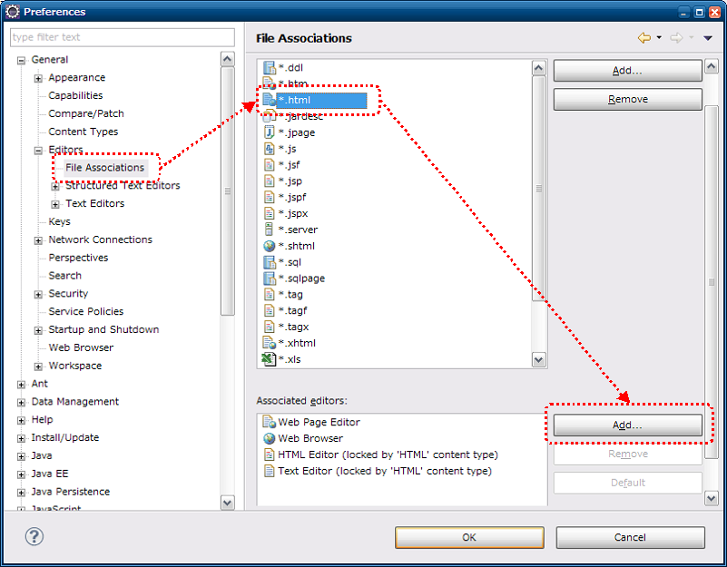
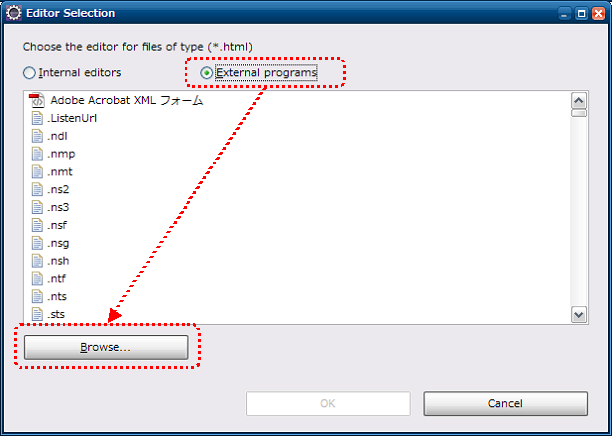
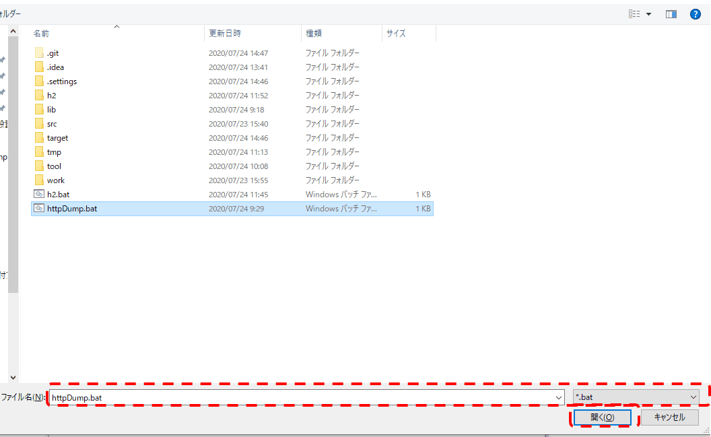
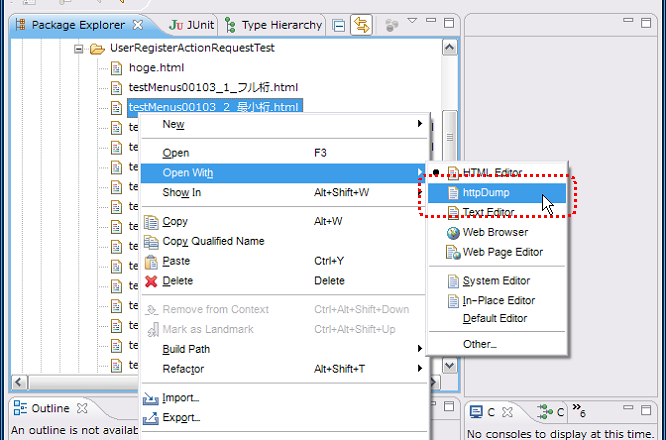

=================================================
请求单元数据创建工具 安装指南
=================================================

说明 :doc:`index` 的安装方法。

.. _http_dump_tool_prerequisite:

前提事项
========

使用本工具时，需要满足以下前提事项。

* 已安装以下工具

  * Java
  * Maven

* 项目由Maven管理
* html文件已关联浏览器
* 浏览器代理设置中已排除localhost

提供方式
==================

本工具通过以下jar提供。

* nablarch-testing-XXX.jar
* nablarch-testing-jetty12-XXX.jar

因此，请确认pom.xml的dependencies元素中有以下描述。

.. code-block:: xml

  <dependencies>
    <!-- 中略 -->
    <dependency>
      <groupId>com.nablarch.framework</groupId>
      <artifactId>nablarch-testing</artifactId>
      <scope>test</scope>
    </dependency>
    <dependency>
      <groupId>com.nablarch.framework</groupId>
      <artifactId>nablarch-testing-jetty12</artifactId>
      <scope>test</scope>
    </dependency>
    <!-- 中略 -->
  </dependencies>

在项目目录执行以下命令，下载jar文件。

.. code-block:: text

  mvn dependency:copy-dependencies -DoutputDirectory=lib

将以下文件放置在与项目pom.xml相同的目录中。

* :download:`httpDump.bat <download/httpDump.bat>`

与Eclipse联动
===============

通过以下设置可以从Eclipse启动本工具。

设置画面启动
------------

从工具栏选择窗口(Window)→设置(Prefernce)。
从左侧面板选择一般(General)→编辑器(Editors)→文件关联(File Associations)
，从右侧面板选择*.html，点击添加(Add)按钮。

 
外部程序选择
------------------

从单选按钮选择外部程序(External program)，点击浏览(Browse)按钮。

启动用批处理文件（shell脚本）选择
--------------------------------------------

Windows时选择批处理文件(httpDump.bat)，
Linux时选择shell脚本(httpDump.sh)。

.. _howToExecuteFromEclipse:

从HTML文件启动方法
--------------------------

在Eclipse的包资源管理器等中右键单击HTML文件，
以httpDump打开即可启动工具。

.. |br| raw:: html

   
