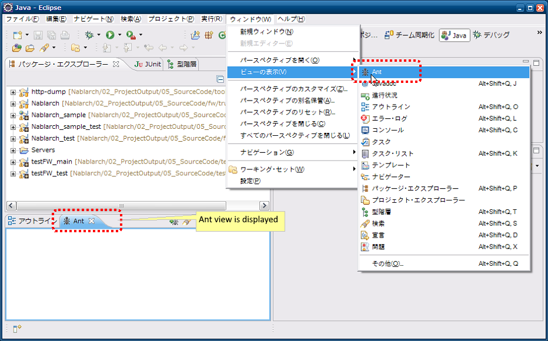
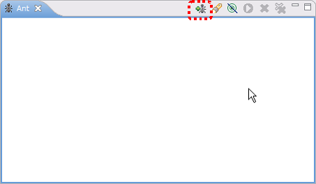
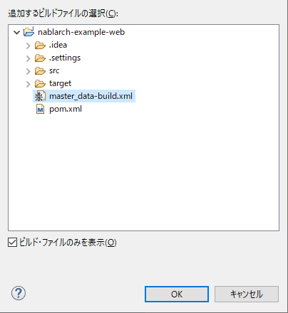

=========================================
主数据投入工具 安装指南
=========================================

说明 :doc:`index` 的安装方法。

.. _master_data_setup_prerequisite:

前提事项
========

* 已安装以下工具

  * Eclipse
  * Maven

* 是 :ref:`Nablarch的Archetype <blank_project>` 生成的项目
* 已创建表
* 备份用模式中已创建表 [#]_

.. [#] 
 关于备份用模式及其表的创建，
 请参考『 :doc:`../../06_TestFWGuide/04_MasterDataRestore` 』的 :ref:`master_data_backup_settings` 。

提供方式
========

本工具通过nablarch-testing-XXX.jar提供。

使用工具前，为使用与项目单元测试相同的DB设置，执行项目编译和工具执行所需jar文件下载。
执行以下命令。

.. code-block:: text

  mvn compile
  mvn dependency:copy-dependencies -DoutputDirectory=lib

下载以下文件，在项目目录(pom.xml存在的目录）中带目录展开。

* :download:`master-data-setup-tool.zip <download/master-data-setup-tool.zip>`

上述文件包含的设置文件如下。

+--------------------------------------------+----------------------------------------+
|文件名                                      |说明                                    |
+============================================+========================================+
|tool/db/data/master_data-build.properties   |环境设置用属性文件                      |
+--------------------------------------------+----------------------------------------+
|tool/db/data/master_data-build.xml          |Ant构建文件                             |
+--------------------------------------------+----------------------------------------+
|tool/db/data/master_data-log.properties     |日志输出属性文件                        |
+--------------------------------------------+----------------------------------------+
|tool/db/data/master_data-app-log.properties |日志输出属性文件                        |
+--------------------------------------------+----------------------------------------+
|tool/db/data/MASTER_DATA.xlsx               |主数据文件                              |
+--------------------------------------------+----------------------------------------+

执行本工具前执行以下命令。

.. code-block:: text

  mvn compile
  mvn dependency:copy-dependencies -DoutputDirectory=lib

属性文件改写
----------------------------

设置主数据自动恢复功能使用的备份用模式名。

.. code-block:: bash
 
 # 测试用主数据备份模式名
 masterdata.test.backup-schema=nablarch_test_master

其他设置值，只要目录结构不变就不需要修改。

.. _how_to_setup_ant_view_in_eclipse:

与Eclipse联动设置
===================

通过以下设置可以从Eclipse启动本工具。

启动Ant视图
-------------

从工具栏选择窗口(Window)→显示视图(Show View)，打开Ant视图。

 
注册构建文件
------------------

点击+号图标，选择构建脚本。

选择Ant构建文件(master_data-build.xml)。

确认Ant视图中已显示注册的构建文件。

.. image:: ./_image/build_file_in_view.png
   :scale: 100
