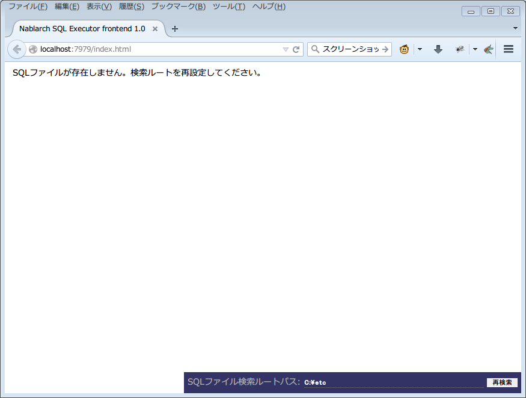
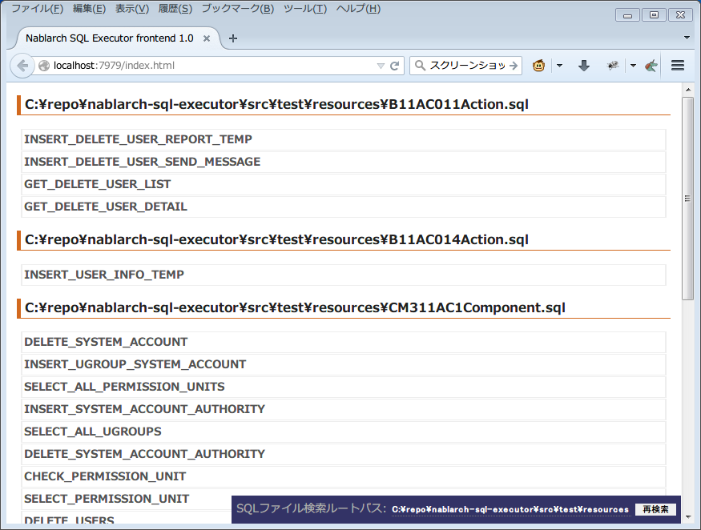
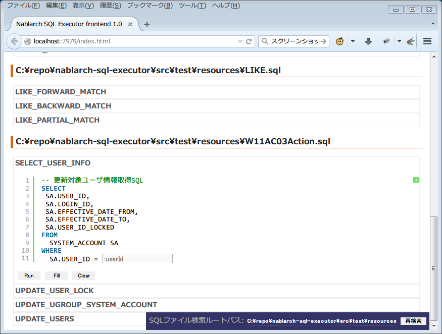
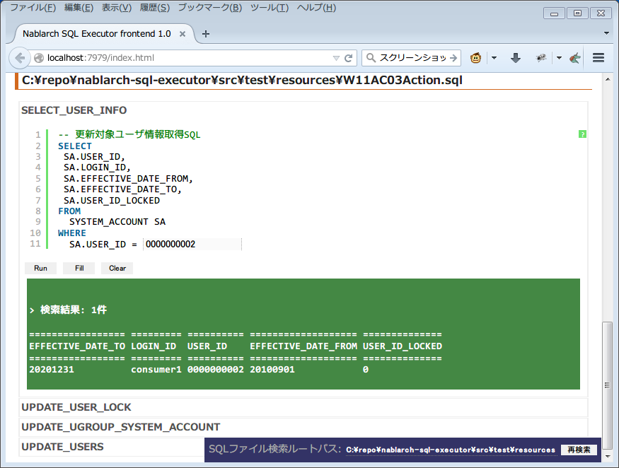
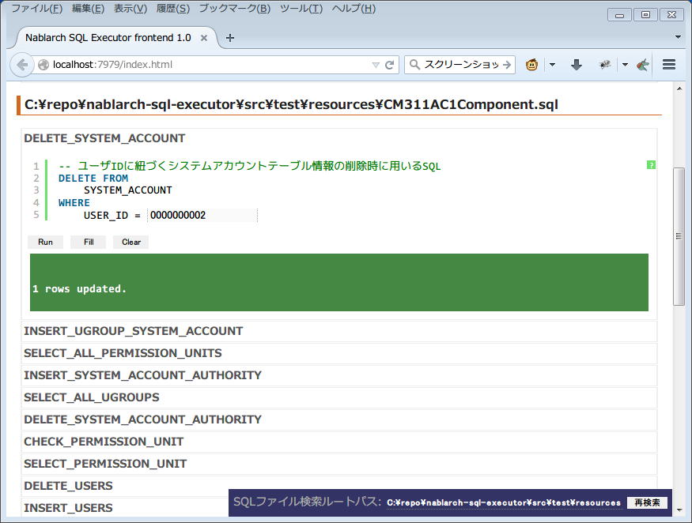
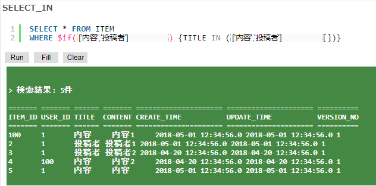
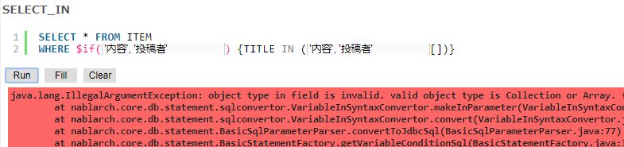

Nablarch SQL Executor
=====================

.. contents:: 目录
  :depth: 2
  :local:

概要
-------

Nablarch SQL Executor是以交互方式执行包含Nablarch特殊语法的SQL文件的工具。
在项目等中设计者设计SQL时使用。

本工具需要设置项目中使用的数据库并构建后使用。

设想使用方法
--------------

本工具的设想使用方法
^^^^^^^^^^^^^^^^^^^^^^^^^^^^^^^^^^^^^^^^
使用本工具需要设置数据库并用Maven构建。
由于构建完成的工具可以分发，因此这项工作只需项目内1人处理即可。

本工具设想以下使用方法。

* 项目的环境构建负责人构建SQL Executor并分发。
* 分发的文件由设计者使用。

构建完成的工具只要有Java和数据库连接环境即可使用。

   [1]_

数据库连接方法的选择
^^^^^^^^^^^^^^^^^^^^^^^^^^^^^^^^^^^^
本工具在数据库连接时可采用以下两种方法。

* 工具使用者全部连接到项目共用的数据库
* 工具使用者各自连接到本地数据库

使用本工具时，可以使用项目共用的数据库。

   [1]_

工具使用者也可以使用各自的本地数据库。

   [1]_

约束
^^^^

本工具存在以下约束。
因此，要执行这些SQL时，请使用本工具以外的数据库附带的SQL执行环境等。

* 无法执行以WITH句开头的SQL
* IN句的条件中不能包含 ``,``
* 不能使用DATETIME字面量作为条件进行搜索。

.. tip::

  Nablarch提供了用于 `Doma(外部网站，英语) <https://doma.readthedocs.io/en/stable/>`_ 的 :ref:`适配器 <doma_adaptor>` ，可以将SQL记述为2-way SQL。

  使用Doma时，无需进行本工具这样的复杂工具设置，就可以轻松测试执行为生产环境定义的SQL。
  (即使是构建动态条件的情况，也无需重写SQL即可执行)

  因此，建议考虑使用Doma。

分发方法
-------------------------

前提条件
^^^^^^^^

以下显示构建并分发本工具的前提条件。

* Firefox或Chrome已安装。
* Nablarch的开发环境已设置。
* 使用Maven Central Repository中不存在JDBC驱动程序的RDBMS时，已在Project Local Repository或Local Repository中注册JDBC驱动程序。
  注册方法请参阅 :ref:`customizeDBAddFileMavenRepo` 。

源代码获取
^^^^^^^^^^^^^^^^

clone以下网站公开的仓库。

https://github.com/nablarch/sql-executor (外部网站)

.. _db-settings:

数据库设置更改
^^^^^^^^^^^^^^^

根据使用的RDBMS进行设置更改。

~~~~~~~~~~~~~~
基本设置的更改
~~~~~~~~~~~~~~

src/main/resources/db.config的修正
~~~~~~~~~~~~~~~~~~~~~~~~~~~~~~~~~~

要更改连接URL、用户、密码时，修正src/main/resources/db.config。

以下显示设置示例。

**H2的设置示例(默认)**

.. code-block:: text

  db.url=jdbc:h2:./h2/db/SAMPLE
  db.user=SAMPLE
  db.password=SAMPLE

**Oracle的设置示例**

.. code-block:: text

  # jdbc:oracle:thin:@主机名:端口号:数据库SID
  db.url=jdbc:oracle:thin:@localhost:1521/xe
  db.user=sample
  db.password=sample

**PostgreSQL的设置示例**

.. code-block:: text

  # jdbc:postgresql://主机名:端口号/数据库名
  db.url=jdbc:postgresql://localhost:5432/postgres
  db.user=sample
  db.password=sample

**DB2的设置示例**

.. code-block:: text

  # jdbc:db2://主机名:端口号/数据库名
  db.url=jdbc:db2://localhost:50000/SAMPLE
  db.user=sample
  db.password=sample

**SQL Server的设置示例**

.. code-block:: text

  # jdbc:sqlserver://主机名:端口号;instanceName=实例名
  db.url=jdbc:sqlserver://localhost:1433;instanceName=SQLEXPRESS
  db.user=SAMPLE
  db.password=SAMPLE

~~~~~~~~~~~~~~~~~~
JDBC驱动程序的更改
~~~~~~~~~~~~~~~~~~

要更改JDBC驱动程序时，修正以下文件。

pom.xml
~~~~~~~~~~~~~~~~~~~~~~~~~

修正pom.xml中写有「请根据使用的RDBMS更新下述JDBC驱动程序的dependency。」注释的部分。

以下，记载各数据库的设置示例。

**H2的设置示例(默认)**

.. code-block:: xml

    <dependencies>
      <!-- 中略 -->

      <!-- 请根据使用的RDBMS更新下述JDBC驱动程序的dependency。 -->
      <dependency>
        <groupId>com.h2database</groupId>
        <artifactId>h2</artifactId>
        <version>2.2.220</version>
        <scope>runtime</scope>
      </dependency>
    </dependencies>

**Oracle的设置示例**

.. code-block:: xml

    <dependencies>
      <!-- 中略 -->

      <!-- 请根据使用的RDBMS更新下述JDBC驱动程序的dependency。 -->
      <dependency>
        <groupId>com.oracle.database.jdbc</groupId>
        <artifactId>ojdbc11</artifactId>
        <version>23.2.0.0</version>
        <scope>runtime</scope>
      </dependency>
    </dependencies>

**PostgreSQL的设置示例**

.. code-block:: xml

    <dependencies>
      <!-- 中略 -->

      <!-- 请根据使用的RDBMS更新下述JDBC驱动程序的dependency。 -->
      <dependency>
        <groupId>org.postgresql</groupId>
        <artifactId>postgresql</artifactId>
        <version>42.7.2</version>
        <scope>runtime</scope>
      </dependency>
    </dependencies>

**DB2的设置示例**

.. code-block:: xml

    <dependencies>
      <!-- 中略 -->

      <!-- 请根据使用的RDBMS更新下述JDBC驱动程序的dependency。 -->
      <dependency>
        <groupId>com.ibm.db2</groupId>
        <artifactId>jcc</artifactId>
        <version>11.5.9.0</version>
        <scope>runtime</scope>
      </dependency>
    </dependencies>

src/main/resources/db.xml
~~~~~~~~~~~~~~~~~~~~~~~~~
修正JDBC驱动程序的类名和方言(dialect)的类名。
在dataSource组件的driverClassName属性中设置驱动程序的类名。

显示相关部分。

.. code-block:: xml

  <!-- 数据源设置 -->
  <component name="dataSource" class="org.apache.commons.dbcp.BasicDataSource">
    <!-- JDBC驱动程序的类名设置 -->
    <!-- TODO: 要更改数据库连接信息时，请修正此处 -->
    <property name="driverClassName"
              value="org.h2.Driver" />
    <!-- 中略 -->
  </component>

  <!-- 数据库连接用设置 -->
  <component name="connectionFactory"
      class="nablarch.core.db.connection.BasicDbConnectionFactoryForDataSource">
    <!-- 中略 -->
    <property name="dialect">
      <!-- 方言的类名设置 -->
      <!-- TODO: 要更改数据库时，请修正此处。-->
      <component class="nablarch.core.db.dialect.H2Dialect"/>
    </property>
  </component>

显示设置值的示例。

.. list-table::
   :widths: 5 8 10
   :header-rows: 1

   * - 数据库
     - JDBC驱动程序的类名
     - 方言的类名
   * - H2
     - org.h2.Driver
     - nablarch.core.db.dialect.H2Dialect
   * - Oracle
     - oracle.jdbc.driver.OracleDriver
     - nablarch.core.db.dialect.OracleDialect
   * - PostgreSQL
     - org.postgresql.Driver
     - nablarch.core.db.dialect.PostgreSQLDialect
   * - DB2
     - com.ibm.db2.jcc.DB2Driver
     - nablarch.core.db.dialect.DB2Dialect
   * - SQL Server
     - com.microsoft.sqlserver.jdbc. |br| SQLServerDriver
     - nablarch.core.db.dialect.SqlServerDialect

启动确认
^^^^^^^^

执行以下命令。

.. code-block:: text

  mvn compile exec:java

然后，启动浏览器，显示 http://localhost:7979/index.html 。

.. tip::

  * 首次启动等启动需要时间时，浏览器可能会超时。
    此时，请在启动完成后重新加载浏览器。
  * 本工具在Internet Explorer中无法正常动作。如果Internet Explorer启动了，请复制URL并粘贴到Firefox或Chrome的地址栏中。

分发文件创建
^^^^^^^^^^^^^^^^
执行以下命令。

.. code-block:: text

  mvn package

target下创建的sql-executor-distribution.zip通过分发，可以在没有Git、Maven环境的情况下使用工具。

分发的工具的使用方法
---------------------------

前提条件
^^^^^^^^^

显示使用工具的前提条件。

- 项目中使用版本的Java已安装。
- 可以连接到 :ref:`db-settings` 中设置的数据库。
- Firefox或Chrome已安装。  

分发文件的启动
^^^^^^^^^^^^^^^^^^^^^^^^^^^^^^^^^^
解压缩分发的sql-executor-distribution.zip。

执行sql-executor-distribution/sql-executor下的sql-executor.bat。
双击文件或从命令提示符启动。

.. code-block:: bat

  sql-executor.bat

想要连接到分发时设置的数据库以外的数据库时
^^^^^^^^^^^^^^^^^^^^^^^^^^^^^^^^^^^^^^^^^^^^^^^^^^^^^^^^^^^^^^^^^^^^
编辑 ``sql-executor.bat`` 。设置项目如下。

.. csv-table:: 设置项目

  "db.url", "数据库URL"
  "db.user", "连接用户"
  "db.password", "密码"

示例显示 ``db.url=jdbc:h2:./h2/db/SAMPLE`` , ``db.user=SAMPLE``, ``db.password=SAMPLE`` 时的编辑方法。

.. code-block:: bat
  :emphasize-lines: 3

  cd /d %~dp0

  start java -Ddb.url=jdbc:h2:./h2/db/SAMPLE -Ddb.user=SAMPLE -Ddb.password=SAMPLE -jar sql-executor.jar （以下略）
  cmd /c start http://localhost:7979/index.html

执行后无任何输出就异常结束时，请参阅 :ref:`faq` 。

操作方法
--------

基本的操作方法
^^^^^^^^^^^^^^^^^^^^^^^^^^^^^^

首次启动时显示当前目录下的SQL文件列表，
如果不存在则显示以下画面。

   初始画面

在右下的输入栏中指定本地文件夹的路径，如下图所示点击 **[重新搜索]**
则显示
该路径下搜索到的SQL文件和各文件中记述的语句的
列表。

   搜索路径设置

点击各语句名则显示其内容和操作用按钮。

   SQL语句列表

语句内的嵌入变量为输入字段，可以编辑内容并点击
**[Run]**
来执行该语句。

另外点击 **[Fill]**
则会恢复上次执行时输入字段的内容。

   SQL执行结果(查询)

   SQL执行结果(DML)

SQLExecutor中的记法
^^^^^^^^^^^^^^^^^^^^^^^^^^^^^^
~~~~~~~~~~~~~~~~~~
字符串的记述
~~~~~~~~~~~~~~~~~~

在本工具中要将字符串作为条件输入时，需要用 ``'`` 包围字符串。

~~~~~~~~~~~~~~~~~~
字符串以外的记述
~~~~~~~~~~~~~~~~~~

字符串以外的内容不用 ``'`` 包围记述。

~~~~~~~~~~~~~~~~~~
IN句的记述
~~~~~~~~~~~~~~~~~~

在本工具中要执行IN句时，需要将条件用 ``[]`` 包围。另外，要输入多个项目时需要以 ``,`` 分隔。

另外， ``$if`` 特殊语法和IN句的条件中指定了相同变量名时，需要输入相同的值。

以下示例。

IN句的条件项目没有赋予 ``[]`` 时，会输出以下错误。
``java.lang.IllegalArgumentException: object type in field is invalid. valid object type is Collection or Array.``

.. warning::

    但是，在本工具中不能将 ``,`` 作为IN句的搜索条件处理。

~~~~~~~~~~~~~~~~~~
日期型的设置
~~~~~~~~~~~~~~~~~~

日期型(DATE)字段的值设置，使用与SQL92的DATE字面量相同格式记述。

以下示例。

::

  1970-12-11

另外，通过指定关键字 ``SYSDATE`` ，可以设置当前时刻。

.. warning::

    不能使用DATETIME字面量作为条件进行搜索。

.. _faq:

FAQ
---

**Q1** :想查看执行时的日志，如何确认日志？

**A1** :执行时会输出以下日志文件。

        * sql.log → SQL语句执行时日志
        * app.log → 全执行日志

^^^^^^^^^^^^^^

**Q2** :执行后无任何输出就异常结束时，应如何处理？

**A2** :启动时的数据库连接错误等部分错误
不会输出到标准错误输出，而是输出到执行日志文件。
执行日志以 ``app.log`` 的名称输出到当前目录下，
请确认其内容并处理。

^^^^^^^^^^^^^^

**Q3** :显示 ``参数指定方法不正确。`` 的消息，但不知道处理方法。

**A3** :
要输入字符串时请确认是否用 ``'`` 包围了字符串。
要输入布尔值、日期型时，请确认是否有拼写错误或格式错误并处理。

.. [1] Future Architect, Inc. Japan ( `创作共用许可（表示4.0 国际） <https://creativecommons.org/licenses/by/4.0/>`_ ）改作创建

.. |br| raw:: html

   
